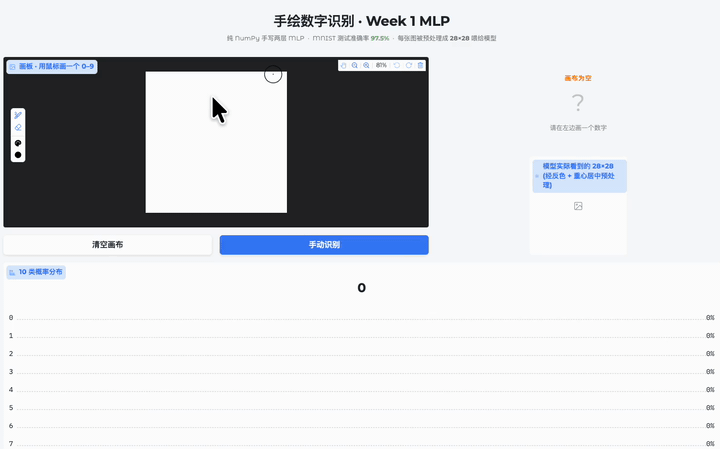
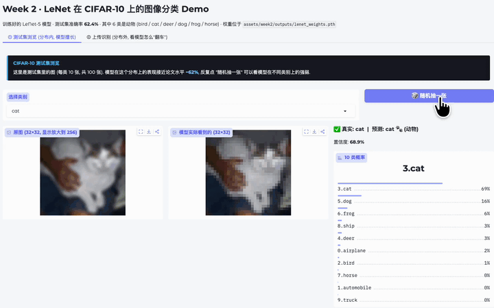
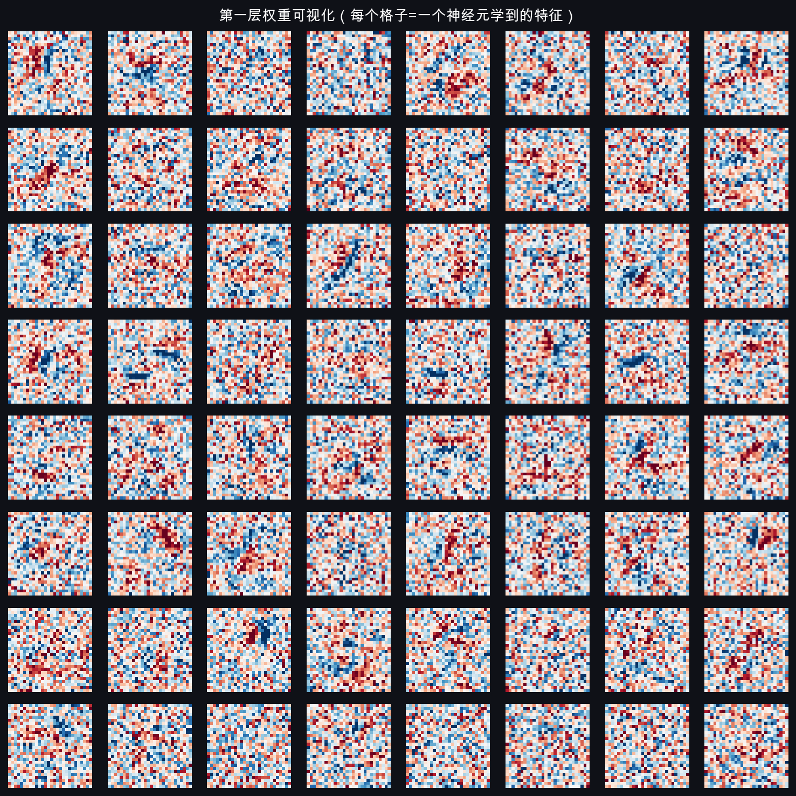
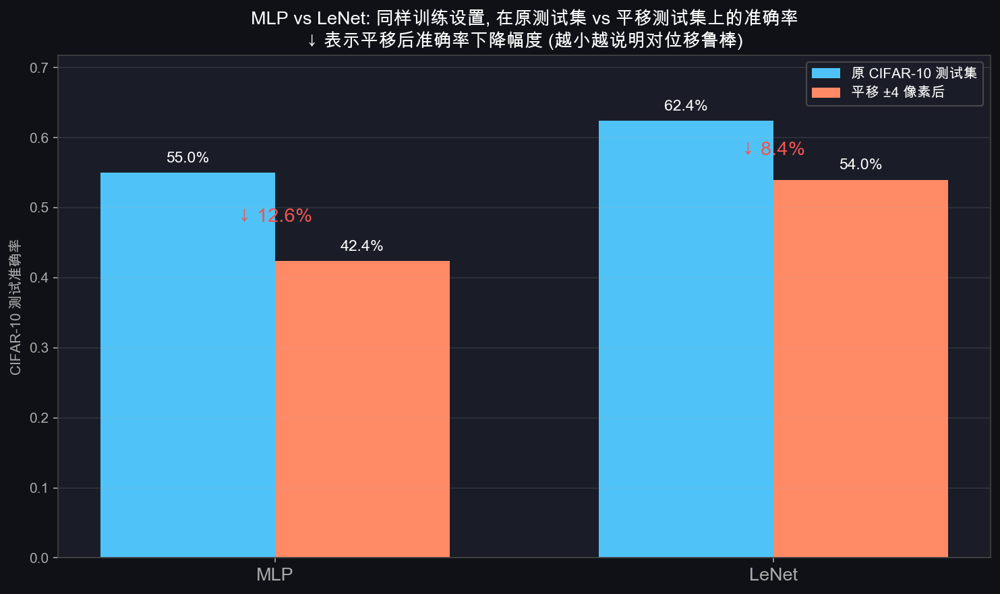
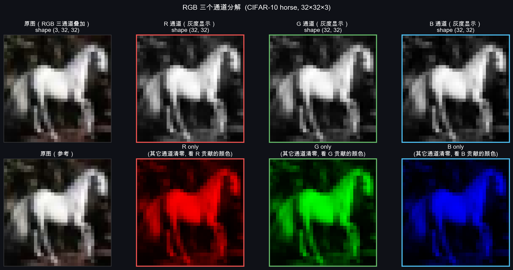
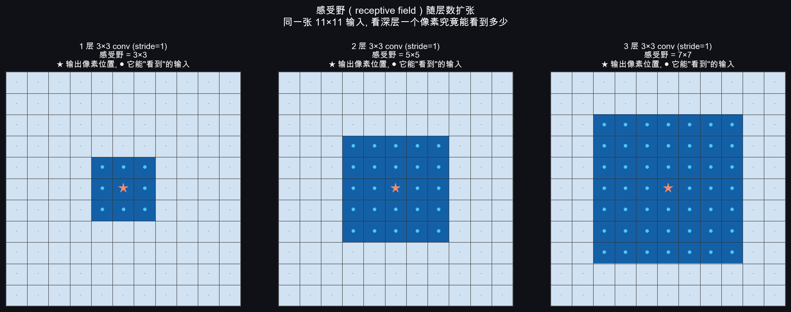
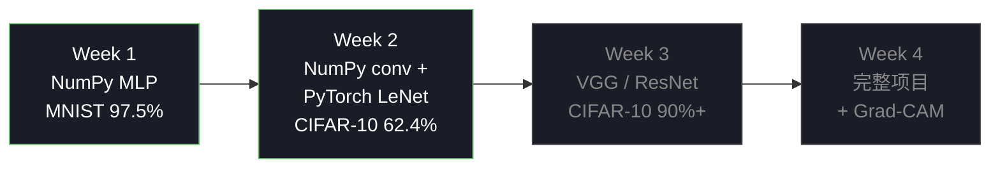

<div align="center">

# CNN-Learn

**从 MLP 数学推导到 CNN 工业级实现 — 每一层先手写、再工业化、最后做成可玩的 demo**

[](https://www.python.org)
[](https://pytorch.org)
[](https://numpy.org)
[](https://gradio.app)
[](https://opensource.org/licenses/MIT)

<br/>


<sub><i>用 NumPy 手写的 Sobel-x 卷积核作用于 CIFAR-10 第一张 horse — Week 2 §02 节插图</i></sub>

</div>

---

> **关于本项目**：这是一份**个人学习记录**，不是教学权威材料。我边学边写，内容可能存在错误或不严谨之处，**欢迎各位通过 [issue](https://github.com/xxf66666/CNN-Learn/issues) / PR / discussion 批评指正**——任何角度的反馈（数学推导、代码实现、文档措辞、设计决策）都非常欢迎。

---

## 项目目标

按"**问题驱动 → 数学推导 → 手写代码 → 工业级实现 → 可玩 demo**"的节奏，从感知机一路推到现代 CNN。每一层都先用 numpy 手写、用 gradient check 验证数学正确性，再切换到 PyTorch 做工业级训练。**所有理论文档、代码、训练曲线、可玩 demo 都同步入仓**——不只是代码仓库，是一份完整的学习记录。

## 进度概览

<table>
<tr>
<td width="50%" valign="top">

### Week 1 · MLP 基础

**任务**：纯 NumPy 手写 MLP，MNIST 上跑通完整训练循环

- 网络 `784 → 128 → 64 → 10`，**109K 参数**
- 测试集准确率 **97.5%**
- Gradient check 全过（相对误差 1e-9 ~ 1e-10）
- Gradio 手绘画板 demo（鼠标画数字实时识别）
- 文档 10 篇 / 5.2 万字符 / 710 行代码

[详见 `docs/week1/`](docs/week1/)

</td>
<td width="50%" valign="top">

### Week 2 · CNN 核心

**任务**：手写 conv2d/maxpool（含反向传播），PyTorch 复现 LeNet 在 CIFAR-10 上做动物分类

- 手写卷积 + 池化，**gradient check 39/39 全过**
- LeNet 在 CIFAR-10 测试 **62.4%**（动物类 56.3%）
- MLP-vs-LeNet 对比实验（**LeNet 用 1/27 参数赢 7.4 个百分点**）
- LeNet 双模式 demo（测试集浏览 + 上传识别）
- 文档 12 篇 / 11.2 万字符 / 8 个代码文件 / 113 张可视化资产

[详见 `docs/week2/`](docs/week2/)

</td>
</tr>
<tr>
<td colspan="2" valign="top">

### Week 3 · 经典网络复现 — 计划中

VGG / ResNet 在 CIFAR-10 上冲 90%+，加 BatchNorm / Dropout / 数据增强 / lr schedule。

### Week 4 · 完整项目 — 计划中

完整图像分类项目 + Grad-CAM 特征可视化 + 混淆矩阵 + 课程汇报材料。

</td>
</tr>
</table>

## Demo 演示

两个 Gradio demo，演示 ML demo 设计的两种范式：**Week 1 把用户输入塑造到训练分布**（手绘画板），**Week 2 诚实告知分布限制**（上传识别 + 警告说明）。

<table>
<tr>
<td width="50%" align="center">

**Week 1 · MNIST 手绘数字识别**



启动: `python code/week1/app.py` → http://127.0.0.1:7860 · <sub>[mp4 高清原片](assets/week1/outputs/week1_demo.mp4)</sub>

</td>
<td width="50%" align="center">

**Week 2 · LeNet on CIFAR-10 双模式 demo**



启动: `python code/week2/app.py` → http://127.0.0.1:7861 · <sub>[mp4 高清原片](assets/week2/outputs/week2_demo.mp4)</sub>

</td>
</tr>
</table>

## 快速开始

```bash
# 创建环境（已有 cnn 环境可跳过）
conda create -n cnn python=3.10
conda activate cnn
python -m pip install -r requirements.txt
```

下面按 Week 分组列出可以跑的命令。每条命令下方都标了**跑完会得到什么**——不用先读 docs，看输出描述就能决定要跑哪个。

### Week 1 — NumPy MLP on MNIST

**训练 (~1 分钟)**

```bash
MPLCONFIGDIR=/tmp/mplconfig MPLBACKEND=Agg python code/week1/mlp_numpy.py
```

控制台：grad check 5 项 ✓ + 20 epoch 训练日志 + 最终测试 **97.5%**。
文件：`assets/week1/outputs/` 下 4 个 — 训练曲线、预测可视化、W1 权重热图、权重 `.npz`。

**手绘 demo**

```bash
python code/week1/app.py
```

浏览器打开 http://127.0.0.1:7860 — 鼠标画板 + 84 px 大字预测 + 模型 28×28 视角 + 10 类概率柱（GIF 演示见上方）。

### Week 2 — NumPy 卷积 + PyTorch LeNet on CIFAR-10

**生成 10 张教学插图**（首次自动下载 CIFAR-10 ~163 MB）

```bash
MPLCONFIGDIR=/tmp/mplconfig MPLBACKEND=Agg python code/week2/figures.py
```

`assets/week2/figures/` 下 **10 张教学 PNG**：Sobel 边缘检测 horse、5 种经典 filter 对比、RGB 通道分解、padding 覆盖热图、感受野扩张、MaxPool vs AvgPool、4 张反向传播步骤图。

**NumPy 卷积 / 池化 grad check**

```bash
python code/week2/conv2d_numpy.py
python code/week2/maxpool_numpy.py
```

控制台：conv2d **24 / 24 ✓** + maxpool **15 / 15 ✓**（相对误差 1e-11 ~ 1e-13，数学正确性自动验证）。

**LeNet 训练 (~8 分钟 on Apple MPS)**

```bash
MPLCONFIGDIR=/tmp/mplconfig MPLBACKEND=Agg python code/week2/lenet_pytorch.py
```

控制台：10 epoch 日志 + 最终测试 **62.4%**（动物类 56.3%）。
文件：`assets/week2/outputs/` 下 4 个 — 权重 `.pth`、训练曲线、各类准确率柱图、历史 JSON。

**MLP-vs-LeNet 对比实验**

```bash
MPLCONFIGDIR=/tmp/mplconfig MPLBACKEND=Agg python code/week2/compare_mlp_vs_lenet.py
```

控制台：同时训 MLP (1.7 M 参数) 和 LeNet (62 K 参数) 各 10 epoch，输出 4 个准确率（原测试集 vs 平移 ±4 px）。**LeNet 准确率 +7.4 个百分点，平移鲁棒性是 MLP 的 1.5 倍**。
文件：`assets/week2/outputs/mlp_vs_lenet_comparison.png`。

**LeNet 双模式 demo**

```bash
python code/week2/export_cifar_samples.py    # 首次必做: 导出 100 张测试样本 PNG
python code/week2/app.py                      # 启动 Gradio UI
```

第一步把测试集每类 10 张导出到 `assets/week2/samples/`；第二步打开浏览器 http://127.0.0.1:7861，**双 tab**：① 测试集浏览（模型在分布内 ~62% 的真实表现） ② 上传识别（看模型在分布外怎么"翻车" + 醒目分布限制说明）。

---

> **代理坑提示**：如果遇到 Gradio `502 Couldn't start the app` 错误，是系统 HTTP 代理（Clash / V2Ray 等）拦截 localhost 健康检查导致的；两个 `app.py` 都已在本进程里清掉相关代理变量，不影响系统全局设置。

## 可视化产出

学习过程中跑出来的几张图，分两类：**训练产出**（实际跑训练得到的曲线 / 对比图 / 权重热图）+ **教学插图**（在文档里讲卷积/通道/感受野等概念时画的辅助图，全部由 `code/week2/figures.py` 一键生成）。

<table>
<tr>
<td width="50%" align="center">

**Week 1 训练产出 · MLP 第一层学到的"模板"**



<sub>把 784×128 的 W1 reshape 成 64 张 28×28，肉眼可见学到了模糊的笔画检测器</sub>

</td>
<td width="50%" align="center">

**Week 2 训练产出 · MLP vs LeNet 对比实验**



<sub>LeNet 用 MLP 1/27 的参数赢 7.4 pts，平移后下降只有 MLP 的 2/3</sub>

</td>
</tr>
<tr>
<td width="50%" align="center">

**Week 2 教学插图 · RGB 三通道分解**



<sub>把 "3 通道"从抽象变成 3 张灰度 + 3 张单色，T4 §1.1 配图</sub>

</td>
<td width="50%" align="center">

**Week 2 教学插图 · 感受野逐层扩张**



<sub>同一张 11×11 输入，1 / 2 / 3 层 3×3 conv 后中心像素能"看到"3→5→7，T5 §5.2 配图</sub>

</td>
</tr>
</table>

## 项目结构

```
CNN-Learn/
├── code/
│   ├── week1/
│   │   ├── mlp_numpy.py              纯 NumPy MLP, MNIST 97.5%
│   │   ├── inference.py              加载权重 + LeCun 五步预处理
│   │   └── app.py                    Gradio 手绘画板 demo (port 7860)
│   └── week2/
│       ├── figures.py                一键生成 10 张教学插图
│       ├── conv2d_numpy.py           手写卷积 + 反向 + grad check (24/24 ✓)
│       ├── maxpool_numpy.py          手写池化 + 反向 + grad check (15/15 ✓)
│       ├── lenet_pytorch.py          LeNet 训练, CIFAR-10 62.4%
│       ├── compare_mlp_vs_lenet.py   对比实验, 含平移鲁棒性测试
│       ├── export_cifar_samples.py   导出 100 张测试集 PNG
│       ├── inference.py              加载 + 预处理 + 预测
│       └── app.py                    LeNet 双模式 demo (port 7861)
├── docs/
│   ├── 00_learning_plan.md           4 周学习路线
│   ├── week1/  (10 篇)               理论 + 代码走读 + demo 说明 + 周总结
│   └── week2/  (12 篇)               理论 + 思考 + 代码走读 + PyTorch 入门 + LeNet + demo
├── data/
│   ├── mnist/                        4 个源 .gz 文件 (~11 MB, 入仓库)
│   └── cifar10/                      首次运行自动下载 (163 MB, 不入仓库)
└── assets/
    ├── week1/
    │   ├── outputs/                  训练曲线 + 预测 + 权重热图
    │   └── figures/<chapter>/        各章节插图
    └── week2/
        ├── outputs/                  LeNet 训练产出 (曲线/对比图/权重)
        ├── figures/                  10 张教学插图 (含 horse 演示)
        └── samples/                  100 张 CIFAR-10 测试集 PNG (每类 10 张)
```

## 文档导航

每周的理论推导、代码走读、思考记录、汇报总结都按**统一格式**：

```
00_tasks.md                 任务总规划
01–07_*.md                  理论推导（含教学可视化插图）
07/08_thinking_log.md       思考过程记录
08_code_walkthrough.md      代码逐行走读 + 与理论的对照表
09_*.md                     拓展（PyTorch 入门 / 对比实验 / demo）
10/11_*.md                  汇报性周总结（适合做 PPT / 知乎博客底稿）
12_*.md                     拓展 demo 文档（仅 Week 2）
```

## 设计原则

1. **问题驱动而非方法驱动** — 每节先问"上一节留下了什么问题"，再说"这一节要解决的是什么"，最后才推数学/写代码。
2. **数学先口语建立直觉，再写公式，最后用代码验证** — 三层渐进，每一层都不跳过。
3. **手写优先于框架** — Week 1/2 的反向传播全部手写，gradient check 通过才允许进入下一阶段。`gradient_check` 是项目的事实测试套件。
4. **代码↔理论一一对应** — 每个数学公式在代码里都有明确实现位置，每篇文档都标注代码行号，互相印证。
5. **demo 是必需而非装饰** — 让用户**亲眼看到**模型能做什么 / 不能做什么。

## 技术栈

- **理论实现**：NumPy（Week 1 MLP + Week 2 conv2d/maxpool）
- **工业级训练**：PyTorch 2.x（autograd / nn / DataLoader / optim） + torchvision（CIFAR-10）
- **可视化**：matplotlib（暗色主题 `#0f1117 / #1a1d27`，与 Week 1 输出一致）
- **Demo**：Gradio 6（Sketchpad 画板 + Tabs 双模式）
- **加速**：Apple Silicon MPS GPU（Week 2 LeNet 每 epoch ~43 秒）

## 学习路线

完整 4 周计划见 [`docs/00_learning_plan.md`](docs/00_learning_plan.md)。当前进度：



## License

MIT。代码、文档、可视化资产均可自由使用、修改、再分发，不需要署名（如愿意，可以提一句出处）。
