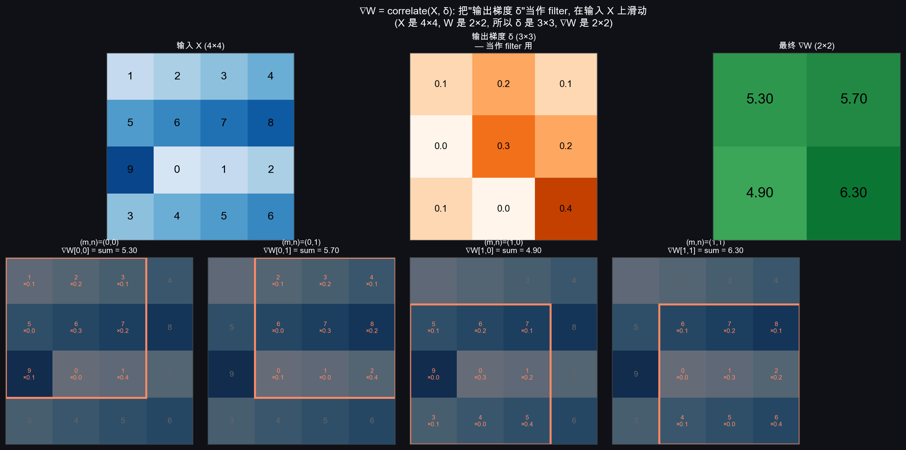

# CNN-Learn · Showcase

> 一份对外展示用的精炼版。比 `docs/week2/11_week2_summary.md` 短 3 倍，适合作为博客底稿、PPT 大纲、或在 GitHub README 之外做独立分享。
>
> **个人学习记录性质**——内容可能存在错误或不严谨之处，欢迎 [issue](https://github.com/xxf66666/CNN-Learn/issues) / PR / discussion 批评指正。

---

## 一、项目一句话

> **从 MLP 数学推导到 CNN 工业级实现 — 每一层先用 NumPy 手写跑通 gradient check，再切到 PyTorch 工业级训练，最后做成可玩的 Gradio demo。**

不只学 PyTorch API、不只读论文，而是**每个抽象都从零造一遍**——理解透了再用框架。

---

## 二、当前阶段（Week 1 + Week 2 完成）

<div align="center">

|  | Week 1 | Week 2 |
|---|---|---|
| 模型 | MLP 109K 参数 | LeNet 62K 参数 |
| 数据集 | MNIST (28×28 灰度) | CIFAR-10 (32×32 RGB, 6 类动物) |
| 测试准确率 | **97.5%** | **62.4%**（动物 56.3%）|
| 反向传播实现 | 手写 + grad check | 手写 conv/pool + PyTorch autograd |
| Grad check 项数 | 5 项全过 1e-9 | **39 项全过 1e-13** |
| Demo 形态 | Gradio 手绘画板 | Gradio 双 tab（测试集 + 上传）|
| 文档 | 10 篇 / 5.2 万字 | **12 篇 / 11.2 万字** |
| 代码 | 710 行 | **~2200 行** |
| 教学可视化 | 0 教学 + 3 训练 | **10 教学 + 3 训练 + 100 样本** |

</div>

---

## 三、四个最值得展示的瞬间

### 1. 真实图像上的边缘检测 — 让"filter 是特征检测器"成为肉眼可见的事实

<div align="center">

</div>

CIFAR-10 第一张 horse → 灰度 → Sobel-x → 梯度幅值。**马的轮廓被还原成线条画**——这就是教科书里 "filter 检测特征" 的具体含义。所有 10 张教学插图都用 horse 作为统一 demo 图，由 `code/week2/figures.py` 一键生成。

### 2. MLP-vs-LeNet 对比实验 — 把 "为什么需要 CNN" 从口号变成数据

<div align="center">

</div>

同样训练设置下：

```
         |  原测试集 |  平移 ±4 px |  下降幅度
   MLP   |   55.0%  |   42.4%    |  -12.6%
  LeNet  |   62.4%  |   54.0%    |   -8.4%
```

**LeNet 用 MLP 1/27 的参数赢了 7.4 个百分点，平移鲁棒性是 MLP 的 1.5 倍**。这条数据是 `01_why_conv.md` "MLP 没有平移不变性"那条预言的活体验证。

### 3. 卷积反向传播的可视化推导 — 把数学最难的一节做成图

<div align="center">

</div>

把 ∇W 的计算可视化为"输出梯度 δ 当作 filter 在输入 X 上滑动"——4 个滑动位置 + 最终结果。同章节还有"W 翻转的自然来源"图、MaxPool 稀疏路由图等。**让 Week 2 数学密度最高的一节读起来不痛苦**。

### 4. 双范式 ML demo — 既展示模型能做什么，也诚实展示限制

<table>
<tr>
<td width="50%" valign="top">

**Week 1 范式：把用户输入塑造到训练分布**

手绘画板 → 反色 + bbox + 重心居中 → 28×28 → MLP → 实时预测

> 用户友好，把"模型很厉害"演给你看

</td>
<td width="50%" valign="top">

**Week 2 范式：诚实告知分布限制**

上传图 → resize 32×32 → LeNet → 预测 + 醒目说明 "训练分布只覆盖 10 类 32×32 图，照片识别会差"

> 教学优先，把"模型有什么做不到"演给你看

</td>
</tr>
</table>

工业部署里两种范式都用，看任务和模型能力匹配度。**两个 demo 放一起看**，能体会到 ML demo 设计的两种哲学。

---

## 四、八条核心 Takeaway

1. **CNN = 把图像的结构先验写进网络架构 + 让具体特征通过反向传播自动学**。少任何一边都不行（只有先验 = SIFT/HOG，只有学习 = MLP 参数爆炸）。这两条是独立的轴，理解了就能解码 ViT 那种"去掉先验"的现代架构。
2. **filter / kernel / weight matrix 在 CNN 上下文里都指同一件事**——k×k 的可学习权重张量，三个词可互换。
3. **2D 卷积 = 多通道求和折叠 + 多 filter 输出叠加**：`(N, C_in, H, W) ⊛ (C_out, C_in, k, k) → (N, C_out, H', W')`。通道维在前向被求和折叠，filter 维变成新的输出通道。
4. **输出尺寸公式 `H' = ⌊(H + 2p − k) / s⌋ + 1` 的几何意义**：filter 起手能站到的位置数。
5. **CNN 反向传播 = MLP 反向传播 + "权重共享导致梯度要从所有空间位置加起来"**。`∇W = correlate(X, δ)`、`∇X` 用 scatter 实现（数学等价于"翻转 + 卷积"，但 bug 概率低得多）。
6. **MaxPool 反向是稀疏路由**，δ 只送到 argmax 位置；重叠窗口在"系绳"位置数学上不可导，所以生产代码都用 stride=k 非重叠，现代网络（ResNet 之后）干脆用 stride 卷积取代。
7. **PyTorch 不是黑魔法**：autograd 替你做"维护 cache + 调用 backward"，nn.Module 替你做"打包参数 + forward"，DataLoader / optim 替你做训练循环里的样板代码。**全部都是 Week 1/2 我们手写过的事的工业级化**。
8. **Grad check 必须升 float64**：Week 1 用 float32 grad check 也过了（MLP 计算量小），Week 2 conv 第一次跑全部失败，相对误差 1e-2 ~ 1e-3。根因是 finite differencing 的 catastrophic cancellation——float32 7 位精度不够。修完误差从 1e-2 掉到 1e-13。

---

## 五、教学方法论

每节文档都按四步走：

```
上一节留下的问题  →  这一节要解决什么  →  数学推导  →  代码验证
```

**绝不**直接说"接下来讲卷积"——总是从"上一节留下了 X 没解决"开始。这条线串到底，10 多篇文档读下来一个完整的因果链：

```
T1 MLP 死在哪 → T2 卷积怎么算 → T3 输出尺寸怎么定 → T4 多通道怎么合并
→ T5 怎么降采样 → T6 反向怎么传 → T7 手写实现 → T8 PyTorch 抽象
→ T9 LeNet 训练 + 对比验证 T1 的预言 → 拓展 demo 让用户亲眼看
```

**手写优先于框架**。Week 1/2 的反向传播全部手写，gradient_check 通过才允许进入下一阶段。`gradient_check` 是项目的事实测试套件——没有 pytest、没有 CI，但相对误差 < 1e-4 的硬要求保证数学没错。

---

## 六、技术栈

| 层 | 工具 |
|---|---|
| 理论实现 | NumPy 2.x（Week 1 MLP + Week 2 conv2d/maxpool）|
| 工业级训练 | PyTorch 2.11 + torchvision（CIFAR-10）|
| 加速 | Apple Silicon MPS GPU（Week 2 LeNet ~43s/epoch）|
| 可视化 | matplotlib 暗色主题 `#0f1117 / #1a1d27` |
| Demo | Gradio 6（Sketchpad 画板 + Tabs 双模式）|
| 文档 | Markdown + Mermaid 流程图 + 真实图片插图 |

---

## 七、与同类项目的差异

| | 大多数 ML 教学项目 | CNN-Learn |
|---|---|---|
| 起点 | "import torch" | **"为什么需要这一层 / 这条公式从哪来"** |
| 反向传播 | 直接用 autograd | **手写 + gradient_check 验证** |
| 文档 | README + 注释 | **理论推导 + 代码走读 + 思考记录 + 周总结**，每篇都按统一格式 |
| Demo | 演示模型能做什么 | **既演能做什么、也演分布限制**（双范式）|
| 错误处理 | 跑通就完了 | **踩到的工程坑都记进 thinking_log**（如 float32 grad check 失败、MaxPool 重叠不可导）|
| 可视化 | 训练曲线 | **每个抽象概念都配教学插图**（10+ 张），不只是结果图 |

---

## 八、Roadmap

- [x] **Week 1**：NumPy MLP + MNIST + 手绘 demo
- [x] **Week 2**：NumPy 卷积 + PyTorch LeNet + CIFAR-10 + 双模式 demo + 对比实验
- [ ] **Week 3**：VGG / ResNet + 数据增强 + lr schedule，CIFAR-10 冲 90%+
- [ ] **Week 4**：完整项目（dataset / model / train / eval / visualize 五件套）+ Grad-CAM 特征可视化 + 课程汇报材料

---

## 九、获取与运行

```bash
git clone https://github.com/xxf66666/CNN-Learn.git
cd CNN-Learn
conda create -n cnn python=3.10 && conda activate cnn
python -m pip install -r requirements.txt

# 进入 demo:
python code/week1/app.py     # 手绘数字识别, http://127.0.0.1:7860
python code/week2/app.py     # CIFAR-10 LeNet 双模式, http://127.0.0.1:7861
```

完整运行命令见 `README.md` 的"快速开始"部分。

---

## 十、License

MIT。代码、文档、可视化资产均可自由使用、修改、再分发。如愿意可以提一句出处。
