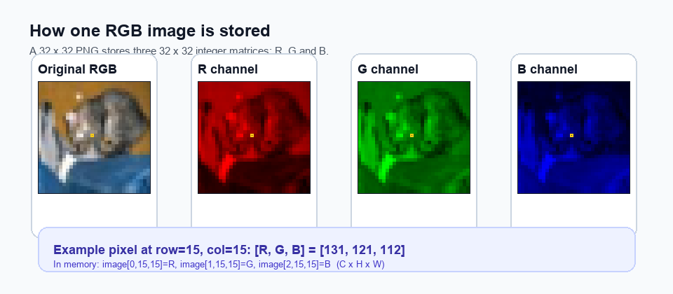
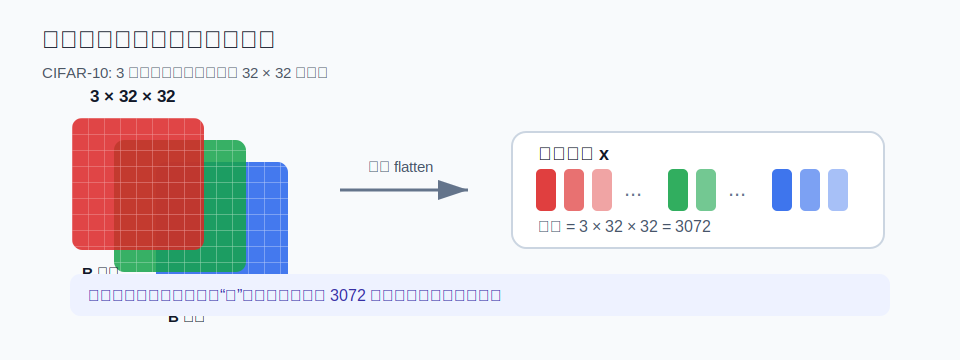
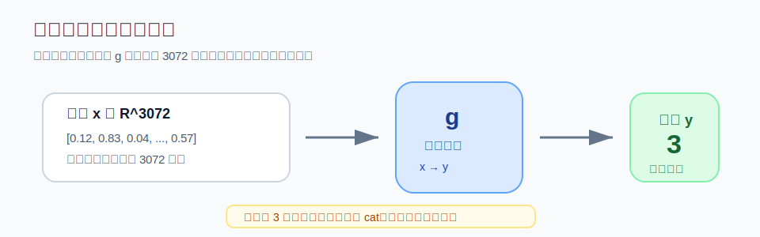
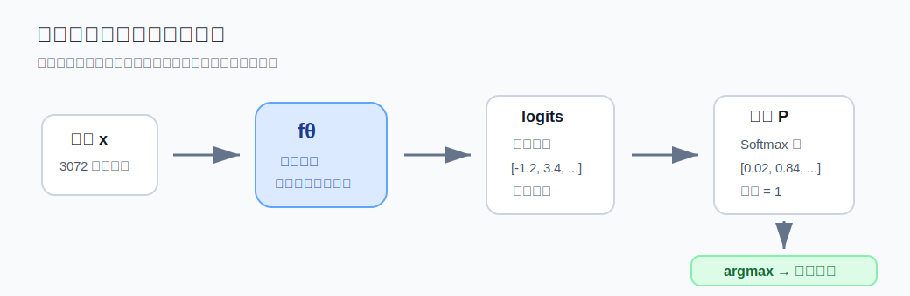
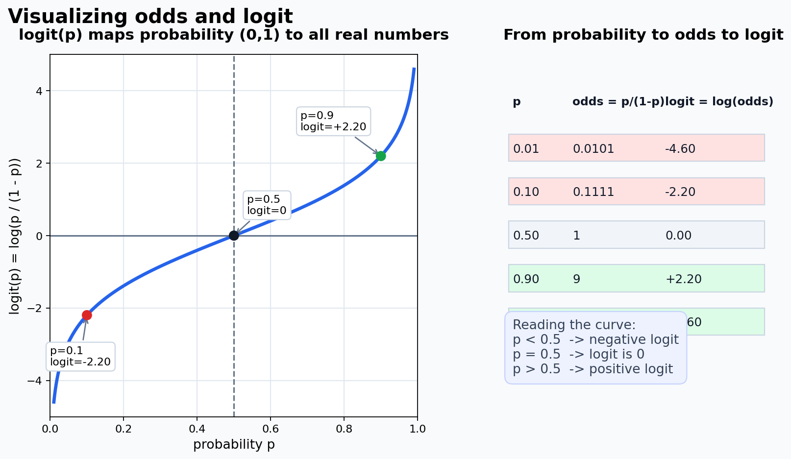
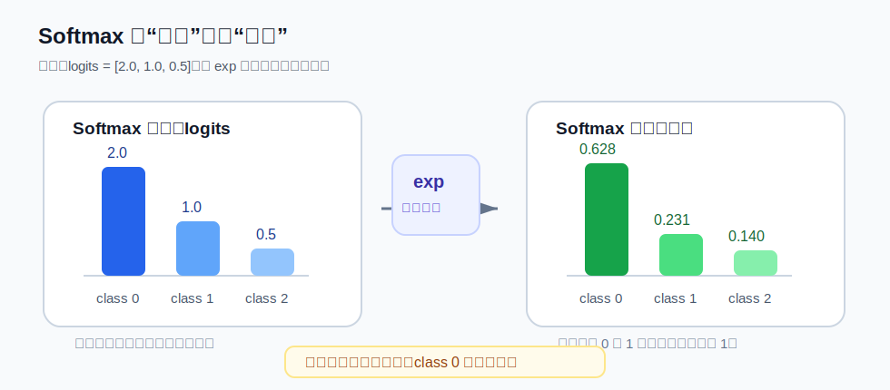

# T1：问题建模——图像分类

> 精读目标：这一节不是在讲某个具体网络怎么写，而是在建立“图像分类问题到底被数学化成什么”的框架。你只要抓住一条线：**图片是向量，模型是函数，输出是分数，Softmax 把分数变成概率，argmax 给出最终类别。**

## 0. 核心线索：f 是什么

整个深度学习，本质上只在回答三个问题：

$$\underbrace{f}_{\text{长什么样？}} \xrightarrow{\text{预测}} \underbrace{\mathcal{L}}_{\text{好不好？}} \xrightarrow{\text{优化}} \underbrace{\theta^*}_{\text{怎么变更好？}}$$

| 问题 | 对应概念 | 对应任务 |
|------|----------|----------|
| $f$ 长什么样？ | 模型结构 | T2 线性分类器 → T5 MLP → Week2 CNN |
| 怎么衡量 $f$ 好不好？ | 损失函数 $\mathcal{L}$ | T3 |
| 怎么让 $f$ 变更好？ | 梯度下降 + 反向传播 | T4、T7 |

**$f$ 里面有参数 $\theta$（权重矩阵、偏置等），训练的目标就是找到一组最优参数 $\theta^*$，使得 $f$ 对所有训练样本的预测尽可能正确。**

所有的网络结构、论文、tricks，本质上都是在改变 $f$ 的形式，或者改变寻找 $\theta^*$ 的方式。

**精读提示**：
- 先不要把 $f$ 想成很神秘的“AI”。在这门课里，$f$ 就是一个可计算的函数。
- 参数 $\theta$ 是模型内部可以被训练改变的数字；输入图片 $x$ 不是参数。
- 训练不是直接“让模型记住答案”，而是通过损失函数告诉模型“现在错得有多离谱”，再调整参数。

---

## 1. 计算机怎么"看"一张图

图片在内存里是一个三维数组：

$$\text{图片} \in \mathbb{R}^{C \times H \times W}$$

以 CIFAR-10 为例：

$$\text{图片} \in \mathbb{R}^{3 \times 32 \times 32}$$

- $C = 3$：RGB 三个通道
- $H = 32$：高 32 像素
- $W = 32$：宽 32 像素

每个像素值是 $0 \sim 255$ 的整数。展平后就是一个长度为 $3 \times 32 \times 32 = 3072$ 的向量。

可以用仓库里的真实样本 `assets/week2/samples/cat/00.png` 来看。它是一张 `32 × 32` 的 RGB 图片；被程序读入并解码后，每个像素会对应 3 个整数：

**严格说**：PNG 文件在硬盘上是压缩编码后的二进制文件；当我们用 PIL、OpenCV、PyTorch 这类工具把它读进内存后，它会被解码成像素数组。下面说的 `3 × 32 × 32`，指的是**解码到内存后的数组形状**。

$$
\text{一个像素} = [R,\ G,\ B]
$$

例如某个像素可能是：

$$
[131,\ 121,\ 112]
$$

意思是：

- 红色通道 $R = 131$
- 绿色通道 $G = 121$
- 蓝色通道 $B = 112$

整张图片可以理解成 3 张 $32 \times 32$ 的表叠在一起：

```text
R 通道：32 × 32 个整数
G 通道：32 × 32 个整数
B 通道：32 × 32 个整数

合起来：3 × 32 × 32
```





**直觉理解**：
- 人看图片时会看到“猫、车、飞机”的形状。
- 计算机最开始只看到一堆数字。
- 模型要学的，就是从这些数字中提取出对分类有用的模式。

**注意**：不同框架里图片维度顺序可能不同。这里写的是 $C \times H \times W$，PyTorch 常用这个格式；有些库会用 $H \times W \times C$。

---

## 2. 分类问题的数学抽象

图像分类的目标，可以从一句话开始：

> 找一个函数，让它看到一张图片 $x$，就能判断这张图片属于哪个类别 $y$。

如果只写最终预测，它像这样：

$$
g: \mathcal{X} \rightarrow \mathcal{Y}
$$

- $\mathcal{X}$：输入空间，也就是所有可能图片组成的集合
- $\mathcal{Y}$：标签空间，也就是所有可能类别组成的集合

以 CIFAR-10 为例，一张图片展平后有 3072 个像素值，所以可以把输入空间近似看成：

$$
\mathcal{X} \subseteq \mathbb{R}^{3072}
$$

如果像素值还没有归一化，那么每一维大约在 $[0,255]$；如果已经除以 255 归一化，那么每一维在 $[0,1]$。

标签空间是 10 个离散类别：

$$
\mathcal{Y} = \{0,1,2,\ldots,9\}
$$

所以，最直观的分类函数可以写成：

$$
g: \mathbb{R}^{3072} \rightarrow \{0,1,2,\ldots,9\}
$$

也就是：输入一个 3072 维向量，输出一个类别编号。



### 2.1 为什么实际模型不直接学 $g$

直接让模型输出一个离散类别编号不方便优化。原因是类别编号是离散的，不能像连续函数那样自然地求导、比较“错多少”、再用梯度下降调整参数。

所以神经网络通常不直接输出类别，而是先输出每个类别的**得分**：

$$f: \mathbb{R}^{3072} \rightarrow \mathbb{R}^{10}$$

- 输入：3072 维向量（图片像素）
- 输出：10 维向量（每类的得分）
- 预测结果：取输出中最大值的下标 $\hat{y} = \arg\max_i f(x)_i$

也可以把 $f$ 写成 10 个分量函数：

$$
f(x) = [f_0(x), f_1(x), \ldots, f_9(x)]
$$

其中 $f_i(x)$ 表示模型认为图片 $x$ 属于第 $i$ 类的原始得分。这个得分后面会被称为 **logit**。

最终的离散预测函数 $g$，其实是由 $f$ 加上 $\arg\max$ 得到的：

$$
g(x) = \arg\max_i f_i(x)
$$

也就是说：

- $f$：给每个类别打分，输出连续值，方便训练
- $g$：取最高分对应的类别，输出最终预测

这里的 $\mathbb{R}^{3072}$ 可以读作“3072 维实数向量空间”，不用被符号吓到，它表示输入是一串长度为 3072 的数字。

这里的 $\mathbb{R}^{10}$ 表示输出是一串长度为 10 的数字，每个数字对应一个类别的得分。



### 2.2 数据集怎么表示

训练时我们不是凭空知道 $g$，而是拿到一批带答案的样本：

$$
\mathcal{D} = \{(x^{(1)}, y^{(1)}), (x^{(2)}, y^{(2)}), \ldots, (x^{(N)}, y^{(N)})\}
$$

其中：

- $N$：训练样本数量
- $x^{(n)} \in \mathbb{R}^{3072}$：第 $n$ 张图片
- $y^{(n)} \in \{0,\ldots,9\}$：第 $n$ 张图片的真实类别

上标 $(n)$ 表示“第几个样本”，不是幂运算。比如 $x^{(3)}$ 表示第 3 张图片，不是 $x$ 的 3 次方。

模型训练的目标就是：找到一个带参数的函数 $f_\theta$，让它在这些样本上尽可能预测正确，并希望它对没见过的新图片也能预测正确。

$$
f_\theta: \mathbb{R}^{3072} \rightarrow \mathbb{R}^{10}
$$

这里的 $\theta$ 表示所有可训练参数。不同的 $\theta$ 对应不同的函数 $f_\theta$。

### 2.3 从几何角度看分类

如果输入空间是二维平面，分类器做的事情就是把平面分成几个区域：

$$
\mathcal{R}_i = \{x \mid f_i(x) \ge f_j(x), \forall j \ne i\}
$$

这句话的意思是：

> 第 $i$ 类的决策区域 $\mathcal{R}_i$，包含所有“第 $i$ 类得分不小于其他类别得分”的点。

虽然真实图片是 3072 维，不方便画出来，但数学上仍然可以这样理解：模型把高维空间切成 10 个区域，每个区域对应一个类别。

如果两个类别得分刚好相同，就会落在决策边界上；实际代码里通常会按固定规则选其中一个最大值下标。

后面的线性分类器、MLP、CNN，本质区别就在于它们能切出多复杂的决策区域。

### 2.4 一个具体数值例子

假设现在只有 3 个类别，模型对某张图片输出：

$$
f(x) = [2.0,\ -0.5,\ 4.1]
$$

这表示：

- 第 0 类得分：$2.0$
- 第 1 类得分：$-0.5$
- 第 2 类得分：$4.1$

最大值是 $4.1$，位置是 2，所以：

$$
\hat{y} = \arg\max_i f_i(x) = 2
$$

注意，这里还没有说 $4.1$ 是概率。它只是原始得分。要把这些分数变成概率，才需要后面的 Softmax。

---

## 3. 为什么输出是 10 个值，而不是一个 0~9 的数字

如果输出单个整数，会隐含**序数假设（Ordinal Assumption）**：

$$|2 - 3| < |2 - 0| \implies \text{"鸟"比"飞机"更接近"猫"}$$

这没有任何意义。类别之间没有顺序关系。

**解决方案**：输出 10 个独立的分数，每个类别各自独立打分：

$$\mathbf{s} = [s_0,\ s_1,\ s_2,\ \ldots,\ s_9] \in \mathbb{R}^{10}$$

每个 $s_i \in \mathbb{R}$，即可以是任意实数（正数、负数、零都行）。

---

### logit 是什么

**logit** 这个词来自统计学，是 **log-odds（对数几率）** 的缩写。

先看"几率（odds）"的定义。假设某件事发生的概率是 $p$，则它的几率定义为：

$$\text{odds} = \frac{p}{1 - p}$$

举例：抛硬币正面概率 $p = 0.5$，则几率 $= \frac{0.5}{0.5} = 1$，表示"发生和不发生一样可能"。

logit 就是对几率取对数：

$$\text{logit}(p) = \log\frac{p}{1-p}$$



| $p$（概率） | $\text{odds} = \frac{p}{1-p}$ | $\text{logit}(p) = \log\frac{p}{1-p}$ |
|---|---|---|
| 0.01 | 0.0101 | $-4.60$ |
| 0.1 | 0.111 | $-2.20$ |
| 0.5 | 1.000 | $0$ |
| 0.9 | 9.000 | $+2.20$ |
| 0.99 | 99.00 | $+4.60$ |

规律：
- 概率 $> 0.5$ → logit $> 0$（正数）
- 概率 $< 0.5$ → logit $< 0$（负数）
- 概率 $= 0.5$ → logit $= 0$
- 概率越接近 1，logit 越大；越接近 0，logit 越小，也就是越来越负

**本质**：logit 是概率的一种等价表示，把 $(0, 1)$ 区间的概率，映射到整个实数轴 $(-\infty, +\infty)$。

---

**在神经网络里，"logits"的含义稍宽松一些**：

神经网络直接输出的 $s_i$ 不是从概率反算来的，而是模型计算出的原始分数，值域是整个实数轴。之所以沿用 logit 这个名字，是因为它们扮演的角色类似：都是**变成概率之前的实数分数**。在二分类里，sigmoid 可以把一个 logit 变成概率；在多分类里，Softmax 可以把一组 logits 变成一组概率。

简单记忆：

$$\boxed{\text{logits} = \text{Softmax 之前的原始输出分数，值域} \in \mathbb{R}}$$

**易混点**：
- logits 不是概率，所以不要求在 $0 \sim 1$ 之间。
- logits 不要求加起来等于 1。
- logits 最大的那个类别，就是 Softmax 之后概率最大的类别。
- 训练时常用的交叉熵损失通常直接吃 logits，而不是先手动 Softmax 再算损失；深度学习框架内部会做数值稳定处理。

---

## 4. Softmax：把 logits 变成概率

### 4.0 exp 是什么

`exp` 不是什么新东西，它就是你高中学过的**指数函数** $e^x$，只是换了个写法：

$$\exp(x) = e^x$$

这两种写法**完全等价**，只是 $\exp(\cdot)$ 这种括号形式在公式里更方便写，比如：

$$\exp(s_i + s_j) \quad \text{比} \quad e^{s_i + s_j} \text{ 更清晰}$$

---

**$e$ 是什么？**

$e \approx 2.71828\ldots$，叫做**自然常数**（欧拉数），是数学里一个特殊的无理数。

你可以暂时把它就当成一个固定的底数，和 $2^x$、$10^x$ 一样，只是底数换成了 $2.718\ldots$。

它特殊在哪？**$e^x$ 的导数还是 $e^x$ 本身**，这个性质让它在微积分里极其好用（反向传播会用到）。

---

**$e^x$ 为什么永远是正数？**

任何正数的任意次幂都是正数：

$$2^{-3} = \frac{1}{8} > 0, \quad 2^{0} = 1 > 0, \quad 2^{5} = 32 > 0$$

$e$ 也是正数（$e \approx 2.718$），所以 $e^x$ 不管 $x$ 是正、负、零，结果永远 $> 0$。

---

### 4.1 为什么需要 exp

我们希望把 logits 变成概率，概率需要满足两个条件：

1. **每个值 $\geq 0$**
2. **所有值加起来 = 1**

logits 可能是负数，直接用不行。用 $\exp(x) = e^x$ 可以把任意实数变成正数：

$$\exp(x) > 0 \quad \text{对所有实数 } x \text{ 成立}$$

$\exp(x)$ 的图像与数值感受（左图）：


| $x$ | $e^x$ |
|-----|-------|
| $-2$ | $0.135$ |
| $-1$ | $0.368$ |
| $0$ | $1.000$ |
| $1$ | $2.718$ |
| $2$ | $7.389$ |

关键性质：
- 输入越大，输出越大（保留了大小关系）
- 输出永远是正数
- 大的值被"放大"得更多（增强了类间差异）

### 4.2 Softmax 公式

假设模型输出的 logits 是：

$$
\mathbf{s} = [s_0, s_1, \ldots, s_9]
$$

Softmax 会把它变成概率向量：

$$
\mathbf{p} = [p_0, p_1, \ldots, p_9]
$$

其中第 $i$ 类的概率定义为：

$$P(y = i \mid \mathbf{x}) = \frac{e^{s_i}}{\sum_{j=0}^{9} e^{s_j}}$$

用中文说就是：**第 $i$ 类的概率 = 第 $i$ 类的 exp 值 ÷ 所有类的 exp 值之和**

也常写成更短的形式：

$$
p_i = \text{Softmax}(\mathbf{s})_i = \frac{\exp(s_i)}{\sum_{j=0}^{K-1}\exp(s_j)}
$$

这里：

- $K$：类别数量。CIFAR-10 中 $K=10$
- $s_i$：第 $i$ 类的 logit，也就是原始分数
- $\exp(s_i)$：把第 $i$ 类原始分数变成正数
- $\sum_{j=0}^{K-1}\exp(s_j)$：所有类别 exp 值的总和
- $p_i$：第 $i$ 类最后得到的概率

公式里的 $j$ 只是一个“求和用的临时下标”。它表示：从第 0 类一直加到第 $K-1$ 类。

### 4.2.1 分母为什么要对所有类别求和

如果只做：

$$
\exp(s_i)
$$

它确实能保证每个值都是正数，但还不是概率，因为它们加起来不一定等于 1。

所以 Softmax 用所有类别的 exp 总和做分母：

$$
Z = \sum_{j=0}^{K-1}\exp(s_j)
$$

这个 $Z$ 可以理解成“总量”或“归一化常数”。每个类别都除以同一个总量：

$$
p_i = \frac{\exp(s_i)}{Z}
$$

这样得到的所有 $p_i$ 加起来一定等于 1：

$$
\sum_{i=0}^{K-1}p_i
= \sum_{i=0}^{K-1}\frac{\exp(s_i)}{Z}
= \frac{\sum_{i=0}^{K-1}\exp(s_i)}{Z}
= \frac{Z}{Z}
= 1
$$

这就是 Softmax 能把一组任意实数变成概率分布的原因。

### 4.2.2 $P(y=i \mid \mathbf{x})$ 怎么读

$$
P(y=i \mid \mathbf{x})
$$

可以读作：

> 在已经看到输入图片 $\mathbf{x}$ 的条件下，模型认为类别 $y$ 等于 $i$ 的概率。

这里的竖线 $\mid$ 表示“在……条件下”。所以 $P(y=i \mid \mathbf{x})$ 不是在问“第 $i$ 类总体出现概率是多少”，而是在问“对于当前这张图片，模型有多倾向认为它是第 $i$ 类”。

### 4.2.3 Softmax 是对哪一维做的

如果只有一张图片，logits 形状是：

```text
[10]
```

表示 10 个类别分数。

如果一个 batch 里有 64 张图片，logits 形状通常是：

```text
[64, 10]
```

表示 64 张图片，每张图片各有 10 个类别分数。

这时 Softmax 应该对“类别维度”做，也就是每一行内部做一次 Softmax：

```python
probs = softmax(logits, dim=1)
```

直觉上：**每一张图片自己的 10 个类别概率加起来等于 1**，而不是把 64 张图片混在一起归一化。

### 4.3 具体例子

假设模型对某张图输出了 3 个 logits（简化为 3 类）：

$$\mathbf{s} = [2.0, \; 1.0, \; 0.5]$$

第一步：对每个 logit 取 exp：

$$[e^{2.0},\; e^{1.0},\; e^{0.5}] = [7.389,\; 2.718,\; 1.649]$$

第二步：求和：

$$7.389 + 2.718 + 1.649 = 11.756$$

第三步：各自除以总和：

$$P = \left[\frac{7.389}{11.756},\; \frac{2.718}{11.756},\; \frac{1.649}{11.756}\right] = [0.628,\; 0.231,\; 0.140]$$

验证：$0.628 + 0.231 + 0.140 \approx 1.0$ ✓



### 4.4 Softmax 的两个效果

1. **所有值变成正数**：exp 保证
2. **所有值加起来 = 1**：除以总和保证（本质是归一化）

额外效果：**放大差距**。原来差 1.0 的两个 logit，经过 exp 后差距变成 $e^{1.0} \approx 2.7$ 倍，让模型的预测更加"尖锐"（置信的类概率更高）。

---

## 5. 本节小结

```
图片 (3×32×32 像素)
    ↓ 展平
输入向量 x ∈ R^3072
    ↓ 模型 f
logits s ∈ R^10     ← 原始分数，任意实数
    ↓ Softmax
概率 P ∈ R^10       ← 每个值 ∈ (0,1)，加起来 = 1
    ↓ argmax
预测类别 ŷ ∈ {0,...,9}
```

**下一步**：$f$ 这个函数最简单的形式是什么？→ T2 线性分类器

---

## 6. 常用名词速查

### 样本（sample）

一条训练数据。图像分类里，一个样本通常是一张图片加上它的标签：

$$
(x, y)
$$

- $x$：输入图片
- $y$：真实类别

例如：一张猫的图片，标签是“cat”。

### 特征（feature）

模型用来判断类别的信息。最开始，像素值本身就是最原始的特征；深度网络中间层会逐渐学出更抽象的特征，比如边缘、纹理、局部形状。

### 标签（label）

样本的正确答案。CIFAR-10 中每张图片都有一个标签，比如 airplane、automobile、bird、cat 等。

在代码里，标签常用整数表示：

```python
cat -> 3
dog -> 5
```

这个整数只是类别编号，不代表大小关系。

### 类别（class）

分类任务中所有可能答案之一。CIFAR-10 有 10 个类别，所以模型输出 10 个分数。

### 输入空间（input space）

所有可能输入组成的集合，通常记作 $\mathcal{X}$。在 CIFAR-10 中，一张图片展平后是 3072 维向量，所以可以近似写成：

$$
\mathcal{X} \subseteq \mathbb{R}^{3072}
$$

### 标签空间（label space）

所有可能标签组成的集合，通常记作 $\mathcal{Y}$。CIFAR-10 有 10 个类别，所以：

$$
\mathcal{Y} = \{0,1,2,\ldots,9\}
$$

### 模型族（model family）

一类带参数的函数集合。比如 $f_\theta$ 中的 $\theta$ 不同，函数的具体行为就不同。训练就是在这个函数集合里找一个表现好的 $f_{\theta^*}$。

### 决策区域（decision region）

模型会把输入空间分成多个区域，每个区域对应一个类别。第 $i$ 类的决策区域可以写成：

$$
\mathcal{R}_i = \{x \mid f_i(x) \ge f_j(x), \forall j \ne i\}
$$

落在这个区域里的样本，会被预测成第 $i$ 类。

### 决策边界（decision boundary）

不同决策区域之间的分界线或分界面。二维里可以画成线，高维里是更高维的“面”。模型越复杂，通常能表示越复杂的决策边界。

### 维度（dimension）

可以简单理解为“数字的个数”。

- 一张 CIFAR-10 图片展平后有 3072 个数字，所以是 3072 维向量。
- 模型输出 10 个类别分数，所以输出是 10 维向量。

### 向量（vector）

一串数字。例如：

$$
[2.0,\ 1.0,\ 0.5]
$$

图像展平后是向量，模型输出的 logits 也是向量。

### 张量（tensor）

多维数组。可以把它看成向量、矩阵的推广：

- 标量：一个数字
- 向量：一维数组
- 矩阵：二维数组
- 张量：更高维数组

图片 $\mathbb{R}^{3 \times 32 \times 32}$ 就是一个三维张量。

### 参数（parameter）

模型内部会被训练更新的数字，例如权重 $W$ 和偏置 $b$。训练模型，本质上就是不断调整这些参数。

### 权重（weight）

参数的一种，通常用来控制某个输入特征对输出的影响有多大。权重大，说明这个特征对某个输出影响更强。

### 偏置（bias）

参数的一种，可以理解为模型输出的“基础偏移量”。即使输入为 0，偏置也能让输出不是 0。

### 预测（prediction）

模型根据输入给出的结果。分类任务里，预测通常是 logits 最大的类别：

$$
\hat{y} = \arg\max_i f(x)_i
$$

### 真实值 / 真值（ground truth）

数据集提供的正确答案，也就是标签 $y$。训练时会比较预测值 $\hat{y}$ 和真实值 $y$。

### 概率（probability）

表示某件事发生的可能性，范围在 $0 \sim 1$ 之间。Softmax 输出可以被解释为每个类别的预测概率。

### 置信度（confidence）

模型对自己预测结果的“确信程度”。例如 Softmax 输出：

$$
[0.90,\ 0.07,\ 0.03]
$$

说明模型非常倾向第 0 类。但注意：模型置信度高，不代表一定正确。

### 归一化（normalization）

把一组数转换到某种标准范围或标准形式。Softmax 里的“除以总和”就是一种归一化：让所有类别概率加起来等于 1。

### argmax

返回最大值所在的位置，而不是最大值本身。

例如：

$$
[0.1,\ 0.7,\ 0.2]
$$

最大值是 $0.7$，它的位置是 1，所以：

$$
\arg\max [0.1,\ 0.7,\ 0.2] = 1
$$

### batch

一次送进模型的一组样本。实际训练时通常不会一次只训练一张图，而是一次训练多张图，例如 batch size = 64。

如果单张图片是：

$$
3 \times 32 \times 32
$$

那么 64 张图片组成的 batch 通常是：

$$
64 \times 3 \times 32 \times 32
$$

### batch size

一个 batch 里包含多少个样本。batch size = 64 表示每次训练喂给模型 64 张图片。

---

## 7. 本节最容易混淆的点

### 1. 类别编号不是数值大小

如果 cat 的编号是 3，dog 的编号是 5，不代表 dog 比 cat “大 2”。编号只是索引。

### 2. logits 和概率不是一回事

logits 可以是任意实数：

$$
[8.2,\ -1.5,\ 0.3]
$$

概率必须在 $0 \sim 1$ 之间，并且总和为 1：

$$
[0.99,\ 0.01,\ 0.00]
$$

### 3. Softmax 不改变最大值的位置

如果某个 logit 最大，它经过 Softmax 后对应的概率也最大。

所以做预测时：

```python
pred = logits.argmax()
```

和：

```python
pred = softmax(logits).argmax()
```

得到的类别一样。训练算损失时另说。

### 4. “模型输出 10 个值”不是输出 10 个答案

它输出的是 10 个类别各自的得分。最终答案只有一个，是得分最高的类别。

---

## 8. 自测题

1. CIFAR-10 的一张图片为什么可以看成 3072 维向量？
2. 为什么图像分类模型输出 10 个 logits，而不是直接输出一个 0 到 9 的整数？
3. $g: \mathcal{X} \rightarrow \mathcal{Y}$ 和 $f: \mathbb{R}^{3072} \rightarrow \mathbb{R}^{10}$ 有什么区别？
4. 为什么说不同的 $\theta$ 对应不同的函数 $f_\theta$？
5. logits 为什么可以是负数？
6. Softmax 做了哪两件事，才让输出可以被解释成概率？
7. `argmax([0.2, 0.1, 0.7])` 的结果是什么？

参考答案：

1. 因为图片有 3 个通道，每个通道是 $32 \times 32$ 个像素，总数是 $3 \times 32 \times 32 = 3072$。
2. 因为类别编号没有大小和距离意义，直接输出整数会误导模型以为类别之间有顺序关系。
3. $g$ 直接输出离散类别；$f$ 输出每个类别的连续得分，最后再通过 $\arg\max$ 得到 $g$ 的预测结果。
4. 因为 $\theta$ 是模型参数，参数值变了，同一个输入 $x$ 得到的输出也可能变，所以函数本身也变了。
5. 因为 logits 是模型的原始分数，不是概率，不需要限制在 $0 \sim 1$。
6. 先用 exp 把所有值变成正数，再除以总和让它们加起来等于 1。
7. 结果是 2，因为最大值 $0.7$ 在下标 2 的位置。
