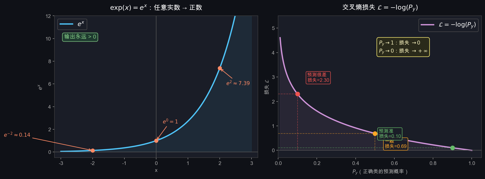

# T1：问题建模——图像分类

## 0. 核心线索：f 是什么

整个深度学习，本质上只在回答三个问题：

$$\underbrace{f}_{\text{长什么样？}} \xrightarrow{\text{预测}} \underbrace{\mathcal{L}}_{\text{好不好？}} \xrightarrow{\text{优化}} \underbrace{\theta^*}_{\text{怎么变更好？}}$$

| 问题 | 对应概念 | 对应任务 |
|------|----------|----------|
| $f$ 长什么样？ | 模型结构 | T2 线性分类器 → T5 MLP → Week2 CNN |
| 怎么衡量 $f$ 好不好？ | 损失函数 $\mathcal{L}$ | T3 |
| 怎么让 $f$ 变更好？ | 梯度下降 + 反向传播 | T4、T7 |

**$f$ 里面有参数 $\theta$（权重矩阵、偏置等），训练的目标就是找到一组最优参数 $\theta^*$，使得 $f$ 对所有训练样本的预测尽可能正确。**

所有的网络结构、论文、tricks，本质上都是在改变 $f$ 的形式，或者改变寻找 $\theta^*$ 的方式。

---

## 1. 计算机怎么"看"一张图

图片在内存里是一个三维数组：

$$\text{图片} \in \mathbb{R}^{C \times H \times W}$$

以 CIFAR-10 为例：

$$\text{图片} \in \mathbb{R}^{3 \times 32 \times 32}$$

- $C = 3$：RGB 三个通道
- $H = 32$：高 32 像素
- $W = 32$：宽 32 像素

每个像素值是 $0 \sim 255$ 的整数。展平后就是一个长度为 $3 \times 32 \times 32 = 3072$ 的向量。

---

## 2. 分类问题的数学抽象

图像分类 = 找一个函数 $f$，把图像向量映射到类别得分向量：

$$f: \mathbb{R}^{3072} \rightarrow \mathbb{R}^{10}$$

- 输入：3072 维向量（图片像素）
- 输出：10 维向量（每类的得分）
- 预测结果：取输出中最大值的下标 $\hat{y} = \arg\max_i f(x)_i$

---

## 3. 为什么输出是 10 个值，而不是一个 0~9 的数字

如果输出单个整数，会隐含**序数假设（Ordinal Assumption）**：

$$|2 - 3| < |2 - 0| \implies \text{"鸟"比"飞机"更接近"猫"}$$

这没有任何意义。类别之间没有顺序关系。

**解决方案**：输出 10 个独立的分数，每个类别各自独立打分：

$$\mathbf{s} = [s_0,\ s_1,\ s_2,\ \ldots,\ s_9] \in \mathbb{R}^{10}$$

每个 $s_i \in \mathbb{R}$，即可以是任意实数（正数、负数、零都行）。

---

### logit 是什么

**logit** 这个词来自统计学，是 **log-odds（对数几率）** 的缩写。

先看"几率（odds）"的定义。假设某件事发生的概率是 $p$，则它的几率定义为：

$$\text{odds} = \frac{p}{1 - p}$$

举例：抛硬币正面概率 $p = 0.5$，则几率 $= \frac{0.5}{0.5} = 1$，表示"发生和不发生一样可能"。

logit 就是对几率取对数：

$$\text{logit}(p) = \log\frac{p}{1-p}$$

| $p$（概率） | $\text{odds} = \frac{p}{1-p}$ | $\text{logit}(p) = \log\frac{p}{1-p}$ |
|---|---|---|
| 0.01 | 0.0101 | $-4.60$ |
| 0.1 | 0.111 | $-2.20$ |
| 0.5 | 1.000 | $0$ |
| 0.9 | 9.000 | $+2.20$ |
| 0.99 | 99.00 | $+4.60$ |

规律：
- 概率 $> 0.5$ → logit $> 0$（正数）
- 概率 $< 0.5$ → logit $< 0$（负数）
- 概率 $= 0.5$ → logit $= 0$
- 概率越接近 1，logit 越大；越接近 0，logit 越小（负数越大）

**本质**：logit 是概率的一种等价表示，把 $(0, 1)$ 区间的概率，映射到整个实数轴 $(-\infty, +\infty)$。

---

**在神经网络里，"logits"的含义稍宽松一些**：

神经网络直接输出的 $s_i$ 不是从概率反算来的，而是模型计算出的原始分数，值域是整个实数轴。之所以沿用 logit 这个名字，是因为它和 Softmax 的关系恰好是上面表格的逆过程——Softmax 把 logits 变回概率，和 $\text{logit}(p)$ 的逆运算是同一件事。

简单记忆：

$$\boxed{\text{logits} = \text{Softmax 之前的原始输出分数，值域} \in \mathbb{R}}$$

---

## 4. Softmax：把 logits 变成概率

### 4.0 exp 是什么

`exp` 不是什么新东西，它就是你高中学过的**指数函数** $e^x$，只是换了个写法：

$$\exp(x) = e^x$$

这两种写法**完全等价**，只是 $\exp(\cdot)$ 这种括号形式在公式里更方便写，比如：

$$\exp(s_i + s_j) \quad \text{比} \quad e^{s_i + s_j} \text{ 更清晰}$$

---

**$e$ 是什么？**

$e \approx 2.71828\ldots$，叫做**自然常数**（欧拉数），是数学里一个特殊的无理数。

你可以暂时把它就当成一个固定的底数，和 $2^x$、$10^x$ 一样，只是底数换成了 $2.718\ldots$。

它特殊在哪？**$e^x$ 的导数还是 $e^x$ 本身**，这个性质让它在微积分里极其好用（反向传播会用到）。

---

**$e^x$ 为什么永远是正数？**

任何正数的任意次幂都是正数：

$$2^{-3} = \frac{1}{8} > 0, \quad 2^{0} = 1 > 0, \quad 2^{5} = 32 > 0$$

$e$ 也是正数（$e \approx 2.718$），所以 $e^x$ 不管 $x$ 是正、负、零，结果永远 $> 0$。

---

### 4.1 为什么需要 exp

我们希望把 logits 变成概率，概率需要满足两个条件：

1. **每个值 $\geq 0$**
2. **所有值加起来 = 1**

logits 可能是负数，直接用不行。用 $\exp(x) = e^x$ 可以把任意实数变成正数：

$$\exp(x) > 0 \quad \text{对所有实数 } x \text{ 成立}$$

$\exp(x)$ 的图像与数值感受（左图）：



| $x$ | $e^x$ |
|-----|-------|
| $-2$ | $0.135$ |
| $-1$ | $0.368$ |
| $0$ | $1.000$ |
| $1$ | $2.718$ |
| $2$ | $7.389$ |

关键性质：
- 输入越大，输出越大（保留了大小关系）
- 输出永远是正数
- 大的值被"放大"得更多（增强了类间差异）

### 4.2 Softmax 公式

$$P(y = i \mid \mathbf{x}) = \frac{e^{s_i}}{\sum_{j=0}^{9} e^{s_j}}$$

用中文说就是：**第 $i$ 类的概率 = 第 $i$ 类的 exp 值 ÷ 所有类的 exp 值之和**

### 4.3 具体例子

假设模型对某张图输出了 3 个 logits（简化为 3 类）：

$$\mathbf{s} = [2.0, \; 1.0, \; 0.5]$$

第一步：对每个 logit 取 exp：

$$[e^{2.0},\; e^{1.0},\; e^{0.5}] = [7.389,\; 2.718,\; 1.649]$$

第二步：求和：

$$7.389 + 2.718 + 1.649 = 11.756$$

第三步：各自除以总和：

$$P = \left[\frac{7.389}{11.756},\; \frac{2.718}{11.756},\; \frac{1.649}{11.756}\right] = [0.628,\; 0.231,\; 0.140]$$

验证：$0.628 + 0.231 + 0.140 \approx 1.0$ ✓

### 4.4 Softmax 的两个效果

1. **所有值变成正数**：exp 保证
2. **所有值加起来 = 1**：除以总和保证（本质是归一化）

额外效果：**放大差距**。原来差 1.0 的两个 logit，经过 exp 后差距变成 $e^{1.0} \approx 2.7$ 倍，让模型的预测更加"尖锐"（置信的类概率更高）。

---

## 5. 本节小结

```
图片 (3×32×32 像素)
    ↓ 展平
输入向量 x ∈ R^3072
    ↓ 模型 f
logits s ∈ R^10     ← 原始分数，任意实数
    ↓ Softmax
概率 P ∈ R^10       ← 每个值 ∈ (0,1)，加起来 = 1
    ↓ argmax
预测类别 ŷ ∈ {0,...,9}
```

**下一步**：$f$ 这个函数最简单的形式是什么？→ T2 线性分类器
