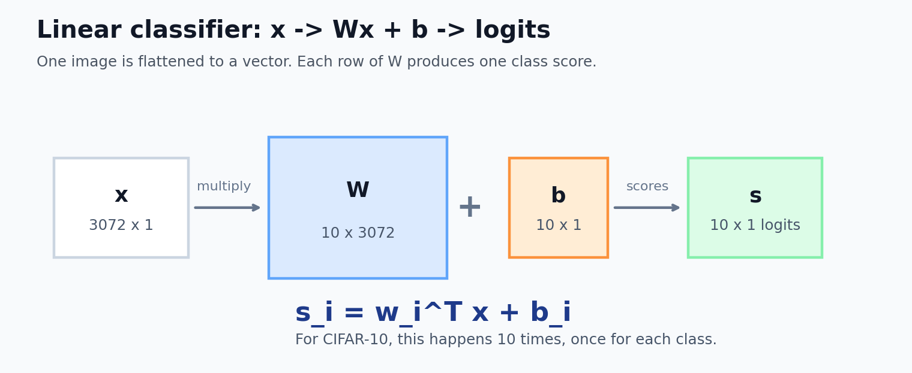
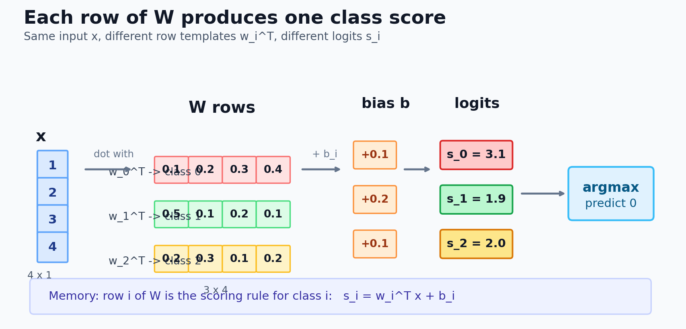
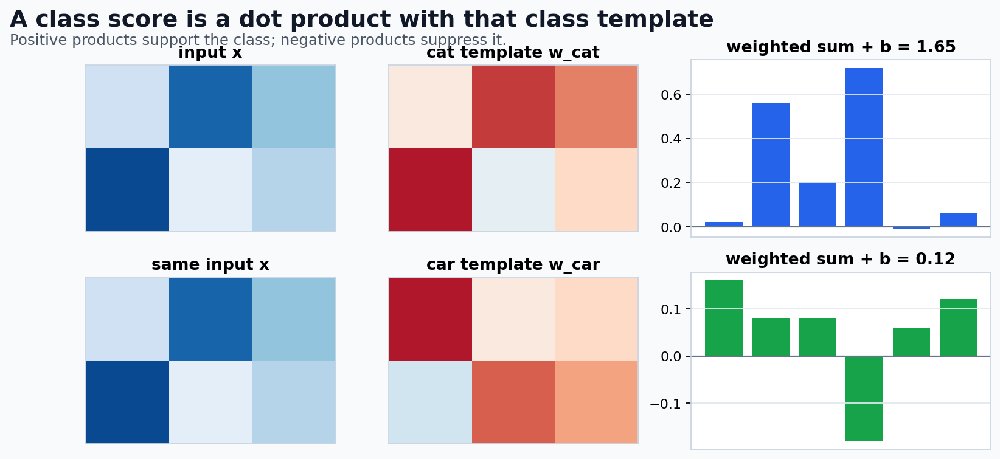
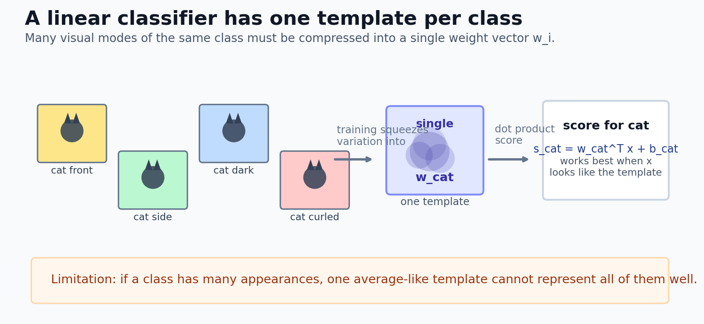
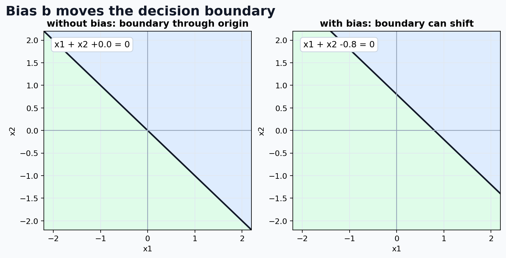
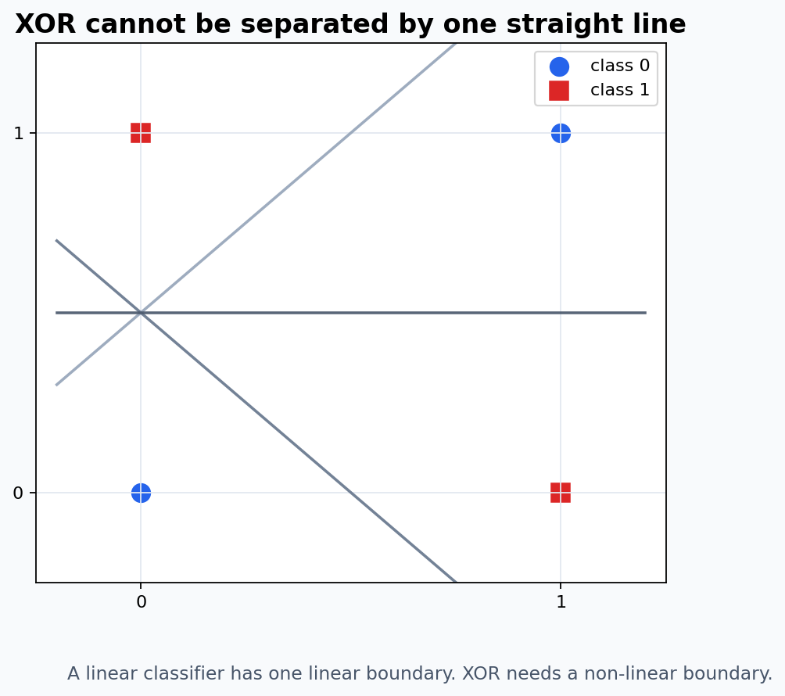

# T2：线性分类器

> 精读目标：T1 已经把图像分类抽象成 $f: \mathbb{R}^{3072} \rightarrow \mathbb{R}^{10}$。这一节要回答：**如果先把 $f$ 设计成最简单的形式，它长什么样？它为什么能分类？它又为什么不够强？**

---

## 0. 从 T1 接上：我们现在要具体化 $f$

T1 的主线是：

$$
\text{图片 }\mathbf{x}\in\mathbb{R}^{3072}
\xrightarrow{\text{模型 }f}
\text{logits }\mathbf{s}\in\mathbb{R}^{10}
\xrightarrow{\text{Softmax}}
\text{概率 }\mathbf{p}\in\mathbb{R}^{10}
\xrightarrow{\arg\max}
\hat{y}
$$

T2 只关注中间这一段：

$$\mathbf{x} \xrightarrow{f} \mathbf{s}$$

也就是：给定一张已经展平的图片 $\mathbf{x}$，模型如何算出 10 个类别的 logits。

最简单的选择是让 $f$ 成为一个**线性函数**：

$$f(\mathbf{x}) = W\mathbf{x} + \mathbf{b}$$

这就是线性分类器。

---

## 1. 线性分类器的公式和形状

我们需要一个函数，把 3072 维输入向量映射到 10 维 logits：

$$f: \mathbb{R}^{3072} \rightarrow \mathbb{R}^{10}$$

线性分类器定义为：

$$\mathbf{s} = f(\mathbf{x}) = W\mathbf{x} + \mathbf{b}$$

其中：

| 符号 | 名称 | 形状 | 含义 |
|------|------|------|------|
| $\mathbf{x}$ | 输入向量 | $(3072, 1)$ | 展平后的图片像素 |
| $W$ | 权重矩阵 | $(10, 3072)$ | 每个类别一行权重 |
| $\mathbf{b}$ | 偏置向量 | $(10, 1)$ | 每个类别一个基础分 |
| $\mathbf{s}$ | logits | $(10, 1)$ | 每个类别的原始得分 |

维度验证：

$$W_{10 \times 3072}\mathbf{x}_{3072 \times 1} + \mathbf{b}_{10 \times 1} = \mathbf{s}_{10 \times 1}$$

**精读提示**：这里的 $W$ 和 $\mathbf{b}$ 就是 T1 里说的参数 $\theta$。

$$\theta = \{W, \mathbf{b}\}$$

训练模型，本质上就是调整 $W$ 和 $\mathbf{b}$，让正确类别的 logit 尽可能高。

---

## 2. 一行权重对应一个类别

$W$ 是一个 $10 \times 3072$ 的矩阵，可以按行拆开：

$$W=\begin{bmatrix}\mathbf{w}_0^\top\\ \mathbf{w}_1^\top\\ \vdots\\ \mathbf{w}_9^\top\end{bmatrix}$$

其中 $\mathbf{w}_i$ 是第 $i$ 类的权重向量，长度是 3072。

这里的 $\top$ 读作 **transpose（转置）**。

如果 $\mathbf{w}_i$ 本来是一个列向量：

$$\mathbf{w}_i=\begin{bmatrix}w_{i1}\\w_{i2}\\ \vdots\\w_{i,3072}\end{bmatrix}$$

那么 $\mathbf{w}_i^\top$ 就是把它横过来，变成行向量：

$$\mathbf{w}_i^\top=\begin{bmatrix}w_{i1}&w_{i2}&\cdots&w_{i,3072}\end{bmatrix}$$

所以 $W$ 可以理解成：把 10 个类别的“行向量模板”上下叠起来。

矩阵乘法 $W\mathbf{x}$ 的第 $i$ 个输出就是：

$$s_i = \mathbf{w}_i^\top \mathbf{x} + b_i$$

展开成求和就是：

$$s_i = \sum_{j=1}^{3072} w_{ij}x_j + b_i$$

这句话非常关键：

> 第 $i$ 类的 logit，就是输入图片 $\mathbf{x}$ 和第 $i$ 类权重 $\mathbf{w}_i$ 的点积，再加上第 $i$ 类偏置 $b_i$。

也就是说，线性分类器不是一次直接“看懂整张图”，而是对每个类别都算一个分数：

$$\begin{aligned}s_0&=\mathbf{w}_0^\top\mathbf{x}+b_0 &&\text{airplane 分数}\\ s_1&=\mathbf{w}_1^\top\mathbf{x}+b_1 &&\text{automobile 分数}\\ s_2&=\mathbf{w}_2^\top\mathbf{x}+b_2 &&\text{bird 分数}\\ &\vdots\\ s_9&=\mathbf{w}_9^\top\mathbf{x}+b_9 &&\text{truck 分数}\end{aligned}$$

### 2.1 一个小矩阵手算例子

真实 CIFAR-10 是 $10 \times 3072$，数字太多。先用“3 类、4 维输入”的小例子理解。

假设输入是：

$$\mathbf{x}=\begin{bmatrix}1\\2\\3\\4\end{bmatrix}$$

权重矩阵有 3 行，每一行对应一个类别：

$$W=\begin{bmatrix}0.1&0.2&0.3&0.4\\0.5&0.1&0.2&0.1\\0.2&0.3&0.1&0.2\end{bmatrix},\quad \mathbf{b}=\begin{bmatrix}0.1\\0.2\\0.1\end{bmatrix}$$

第 0 类的权重行是：

$$\mathbf{w}_0^\top=\begin{bmatrix}0.1&0.2&0.3&0.4\end{bmatrix}$$

它和输入 $\mathbf{x}$ 做点积：

$$\mathbf{w}_0^\top\mathbf{x}=0.1\times1+0.2\times2+0.3\times3+0.4\times4=3.0$$

再加上偏置 $b_0=0.1$：

$$s_0=3.0+0.1=3.1$$

同理：

$$s_1=0.5\times1+0.1\times2+0.2\times3+0.1\times4+0.2=1.9$$

$$s_2=0.2\times1+0.3\times2+0.1\times3+0.2\times4+0.1=2.0$$

所以输出 logits 是：

$$\mathbf{s}=\begin{bmatrix}3.1\\1.9\\2.0\end{bmatrix}$$

第 0 类得分最高，所以预测类别是：

$$\hat{y}=0$$

记忆方式：

$$\boxed{\text{W 的第几行} \Rightarrow \text{第几类的打分规则}}$$

最后取最大的那个分数作为预测类别：

$$\hat{y} = \arg\max_i s_i$$

---

## 3. 点积的直觉：输入和模板的相似度

上一节已经看到，第 $i$ 类的得分来自：

$$s_i = \mathbf{w}_i^\top\mathbf{x}+b_i$$

先暂时不看偏置 $b_i$，只看最核心的部分：

$$\mathbf{w}_i^\top \mathbf{x} = \sum_j w_{ij}x_j$$

这就是**点积（dot product）**。

### 3.1 点积到底怎么算

如果输入只有 4 维：

$$\mathbf{x}=\begin{bmatrix}1\\2\\3\\4\end{bmatrix}$$

某个类别的权重是：

$$\mathbf{w}=\begin{bmatrix}0.1\\0.2\\0.3\\0.4\end{bmatrix}$$

那么：

$$\mathbf{w}^\top\mathbf{x}=0.1\times1+0.2\times2+0.3\times3+0.4\times4=3.0$$

点积做的事情很机械：

1. 对应位置相乘
2. 把所有乘积加起来

写成表格就是：

| 位置 | 输入 $x_j$ | 权重 $w_j$ | 乘积 $w_jx_j$ | 对得分的影响 |
|------|------------|------------|----------------|--------------|
| 1 | 1 | 0.1 | 0.1 | 小幅加分 |
| 2 | 2 | 0.2 | 0.4 | 加分 |
| 3 | 3 | 0.3 | 0.9 | 加分 |
| 4 | 4 | 0.4 | 1.6 | 强加分 |
| 合计 | - | - | 3.0 | 最终匹配分 |

所以点积不是神秘操作，它就是“逐项相乘再求和”。

### 3.2 权重的正负号是什么意思

在线性分类器里，$\mathbf{x}$ 是输入图片，$\mathbf{w}_i$ 是第 $i$ 类的权重模板。

每个位置的 $w_{ij}$ 都在表达模型对该位置的态度：

- $w_{ij} > 0$：这个位置的像素越大，越支持第 $i$ 类。
- $w_{ij} < 0$：这个位置的像素越大，越反对第 $i$ 类。
- $w_{ij} \approx 0$：这个位置对第 $i$ 类基本不重要。

举个更直观的小例子。假设一个模型用 4 个特征判断“是不是某类”：

$$\mathbf{x}=\begin{bmatrix}2\\5\\1\\4\end{bmatrix},\quad \mathbf{w}=\begin{bmatrix}1\\-0.5\\0\\2\end{bmatrix}$$

那么：

$$\mathbf{w}^\top\mathbf{x}=1\times2+(-0.5)\times5+0\times1+2\times4=7.5$$

拆开看：

| 位置 | 输入 $x_j$ | 权重 $w_j$ | 乘积 | 含义 |
|------|------------|------------|------|------|
| 1 | 2 | 1 | 2 | 支持这个类别 |
| 2 | 5 | -0.5 | -2.5 | 反对这个类别 |
| 3 | 1 | 0 | 0 | 不关心 |
| 4 | 4 | 2 | 8 | 强烈支持这个类别 |

这就是为什么前面说：

- 如果某些位置 $x_j$ 很大，而对应的 $w_{ij}$ 也很大，那么乘积 $w_{ij}x_j$ 会给第 $i$ 类加分。
- 如果某些位置 $x_j$ 很大，但对应的 $w_{ij}$ 是负数，那么乘积会给第 $i$ 类扣分。
- 如果 $w_{ij}$ 接近 0，说明模型觉得这个像素位置对第 $i$ 类不重要。

### 3.3 为什么说点积像“模板匹配”

现在把维度从 4 维想回 CIFAR-10 的 3072 维。

对于第 $i$ 类，权重向量是：

$$\mathbf{w}_i = [w_{i1}, w_{i2}, \ldots, w_{i,3072}]$$

输入图片展平后是：

$$\mathbf{x} = [x_1, x_2, \ldots, x_{3072}]$$

点积就是：

$$\mathbf{w}_i^\top\mathbf{x}=w_{i1}x_1+w_{i2}x_2+\cdots+w_{i,3072}x_{3072}$$

如果图片在很多“模型认为重要的位置”上都和第 $i$ 类权重同方向，那么很多乘积都是正的，最后总和就大。

如果图片在很多位置和第 $i$ 类权重反方向，那么很多乘积会变小甚至为负，最后总和就小。

所以我们把 $\mathbf{w}_i$ 叫作第 $i$ 类的**模板**：

$$\boxed{\text{点积大} \approx \text{输入和这个类别模板匹配得好}}$$

这里的“相似”不是人眼意义上的相似，而是数学上的：

> 输入向量 $\mathbf{x}$ 和权重向量 $\mathbf{w}_i$ 在很多维度上方向一致，所以点积大。

### 3.4 为什么还要加偏置

点积 $\mathbf{w}_i^\top\mathbf{x}$ 只表示“看输入之后的匹配分”。

最终 logit 是：

$$s_i=\mathbf{w}_i^\top\mathbf{x}+b_i$$

也就是说：

$$\text{最终得分}=\text{输入与模板的匹配分}+\text{这个类别的基础分}$$

所以点积负责“看图打分”，偏置负责“基础偏好”。这也和第 5 节会讲的偏置作用连起来。

### 3.5 这一节到底想表达什么

这一节的核心不是让你背点积公式，而是建立一个理解：

> 线性分类器给每个类别准备一个权重模板；预测时，把输入图片分别和每个模板做点积，哪个模板匹配分最高，就预测哪个类别。

这就是下一节“每个类只有一个模板”的前提。

---

## 4. W 是什么：每个类只有一个模板

前面已经知道：

$$s_i=\mathbf{w}_i^\top\mathbf{x}+b_i$$

也就是说，第 $i$ 类的得分由第 $i$ 行权重 $\mathbf{w}_i$ 决定。

这一节要回答：

> $\mathbf{w}_i$ 到底可以怎么理解？为什么说它像“模板”？

### 4.1 $\mathbf{w}_i$ 和图片有一样的长度

$W$ 的每一行 $\mathbf{w}_i$ 都和输入 $\mathbf{x}$ 一样长。

CIFAR-10 中：

$$\mathbf{x}\in\mathbb{R}^{3072}$$

所以：

$$\mathbf{w}_i\in\mathbb{R}^{3072}$$

而 3072 来自：

$$3 \times 32 \times 32$$

因此，虽然 $\mathbf{w}_i$ 本质上是一串数字，但它的长度刚好和一张展平后的图片一样。

所以我们可以把它 reshape 回：

$$3072 \rightarrow 3\times32\times32$$

这就能把 $\mathbf{w}_i$ 可视化成一张“图片”。

### 4.2 可视化出来的模板到底是什么

如果把第 $i$ 类权重 $\mathbf{w}_i$ reshape 成 $3\times32\times32$，它看起来像一张图。

但要注意：

> 这张图不是模型“想象出来的第 $i$ 类图片”，而是“哪些像素模式会让第 $i$ 类得分变高”的可视化。

换句话说：

- 某些位置权重大且为正：这些位置出现对应像素时，会支持第 $i$ 类。
- 某些位置权重大且为负：这些位置出现对应像素时，会反对第 $i$ 类。
- 某些位置权重接近 0：这些位置对第 $i$ 类得分影响小。

所以模板图表达的是：

$$\boxed{\text{哪些输入模式会让 } s_i=\mathbf{w}_i^\top\mathbf{x}+b_i \text{ 变大}}$$

例如在 CIFAR-10 上训练线性分类器后，模板可能呈现出一些粗糙结构：

| 类别模板 | 可能出现的粗糙模式 |
|----------|--------------------|
| airplane | 偏蓝，带一点天空背景和机翼轮廓 |
| automobile | 中间有车身色块 |
| horse | 有棕色区域和腿部位置 |

但要非常谨慎：这个模板不是“模型真的画出了一架飞机”。它只是 3072 个权重数值被强行还原成图片后的可视化。

### 4.3 为什么说“每个类只有一个模板”

因为 $W$ 只有 10 行：

$$W=\begin{bmatrix}\mathbf{w}_0^\top\\\mathbf{w}_1^\top\\\vdots\\\mathbf{w}_9^\top\end{bmatrix}$$

CIFAR-10 有 10 个类别，所以刚好：

| 类别 | 对应权重行 | 含义 |
|------|------------|------|
| airplane | $\mathbf{w}_0^\top$ | 飞机模板 |
| automobile | $\mathbf{w}_1^\top$ | 汽车模板 |
| bird | $\mathbf{w}_2^\top$ | 鸟模板 |
| $\cdots$ | $\cdots$ | $\cdots$ |
| truck | $\mathbf{w}_9^\top$ | 卡车模板 |

对任意一张输入图片 $\mathbf{x}$，模型只是做 10 次模板匹配：

$$s_0=\mathbf{w}_0^\top\mathbf{x}+b_0$$

$$s_1=\mathbf{w}_1^\top\mathbf{x}+b_1$$

$$\cdots$$

$$s_9=\mathbf{w}_9^\top\mathbf{x}+b_9$$

然后选得分最高的类别。

### 4.4 “一个模板”为什么会成为局限

现实里同一个类别并不只有一种长相。

以 cat 为例：

- 正脸猫
- 侧脸猫
- 黑猫
- 白猫
- 趴着的猫
- 跳起来的猫
- 近景猫
- 远景猫

这些都属于 cat，但它们的像素模式差别很大。

线性分类器却只有一个 $\mathbf{w}_{cat}$。这意味着它必须用一个模板同时代表所有猫的形态。

结果往往是：

> 很多不同形态被平均到一个模板里，模板变得模糊，谁都像一点，但谁都不像得很准。

这就是线性分类器在图像任务上能力有限的一个核心原因。

### 4.5 和 CNN 的关系

这个局限也为后面的 CNN 埋下伏笔。

线性分类器的问题是：

> 一整个类别只有一个全局模板。

CNN 的思路会变成：

> 不再为整个类别学一个模板，而是学习很多局部小模板，比如边缘、角点、纹理、局部形状，再逐层组合成更复杂的结构。

所以线性分类器是理解 CNN 的起点：它让你先看到“模板匹配”这个想法，然后再看到为什么只用一个大模板不够。

线性分类器的本质是：

> 每个类别只有一个模板，分类时比较输入和每个模板的点积。

这既是它容易理解的地方，也是它能力有限的根源。

---

## 5. 偏置 $\mathbf{b}$ 是什么

### 5.1 从一维函数看偏置

高中学过一次函数：

$$y = kx + b$$

- $k$ 决定斜率
- $b$ 决定截距

如果没有 $b$：

$$y = kx$$

这条直线必须经过原点。

如果有 $b$：

$$y = kx + b$$

这条直线可以上下平移。

### 5.2 在线性分类器中，偏置给每个类一个基础分

没有 $\mathbf{b}$ 时：

$$\mathbf{s} = W\mathbf{x}$$

如果输入全零：

$$\mathbf{x} = \mathbf{0}$$

那么输出也全零：

$$\mathbf{s} = W\mathbf{0} = \mathbf{0}$$

所有类别得分一样，模型没有任何基础偏好。

加上 $\mathbf{b}$ 后：

$$\mathbf{s} = W\mathbf{x} + \mathbf{b}$$

如果输入全零：

$$\mathbf{s} = W\mathbf{0} + \mathbf{b} = \mathbf{b}$$

也就是：

$$\mathbf{s} = [b_0, b_1, \ldots, b_9]$$

所以 $b_i$ 可以理解成第 $i$ 类的基础分。

### 5.3 几何角度：偏置移动决策边界

线性分类器用超平面切分输入空间。

先解释“超平面”这个词。它就是高维空间里的线性分界面：

| 空间 | 线性分界面 | 例子 |
|------|------------|------|
| 2D 平面 | 直线 | $x_1+x_2=3$ |
| 3D 空间 | 平面 | $x_1+x_2+x_3=3$ |
| 更高维空间 | 超平面 | $\mathbf{w}^\top\mathbf{x}+b=0$ |

所以超平面不是新概念，可以把它理解成“高维版的直线/平面”。

在二分类中，假设两个类别的得分分别是：

$$s_0 = \mathbf{w}_0^\top \mathbf{x} + b_0$$

$$s_1 = \mathbf{w}_1^\top \mathbf{x} + b_1$$

决策边界出现在两个类别得分相等的位置：

$$s_0 = s_1$$

代入得：

$$(\mathbf{w}_0 - \mathbf{w}_1)^\top \mathbf{x} + (b_0 - b_1) = 0$$

这就是一个超平面。

“表达能力更强”不是说偏置本身能识别更复杂的形状。偏置做的事情很具体：

> 它让同一方向的决策边界可以平移到更合适的位置。

看一个二维例子。假设输入是：

$$\mathbf{x}=[x_1,x_2]$$

没有偏置时，决策边界可能是：

$$x_1+x_2=0$$

这条直线必须经过原点 $(0,0)$。

有偏置时，决策边界可以变成：

$$x_1+x_2-3=0$$

也就是：

$$x_1+x_2=3$$

这条直线和前一条方向一样，但整体平移了，不再必须经过原点。

为什么这叫表达能力更强？因为模型能表示的边界集合变大了：

| 情况 | 能表示的边界 |
|------|--------------|
| 没有偏置 | 只能表示过原点的直线 / 超平面 |
| 有偏置 | 可以表示任意平移后的直线 / 超平面 |

所以偏置不是让线性分类器变成非线性分类器；它只是让线性边界的位置更自由。这个“位置自由度”在分类时非常重要。

---

## 6. 多分类的几何解释

对于 10 类分类，模型会得到 10 个得分：

$$s_0, s_1, \ldots, s_9$$

第 $i$ 类的决策区域是：

$$\mathcal{R}_i = \{\mathbf{x} \mid s_i \ge s_j,\ \forall j \ne i\}$$

意思是：

> 所有让第 $i$ 类得分不低于其他类别得分的输入，都属于第 $i$ 类的决策区域。

对于线性分类器，任意两个类别 $i$ 和 $j$ 的分界面由：

$$s_i = s_j$$

决定。

代入：

$$\mathbf{w}_i^\top \mathbf{x} + b_i = \mathbf{w}_j^\top \mathbf{x} + b_j$$

整理：

$$(\mathbf{w}_i - \mathbf{w}_j)^\top \mathbf{x} + (b_i - b_j) = 0$$

这仍然是一个线性超平面。

所以第 $i$ 类的区域不是只由一条边界决定，而是要同时赢过其他所有类别：

$$s_i \ge s_0,\quad s_i \ge s_1,\quad \ldots,\quad s_i \ge s_9$$

去掉自己那一项后，本质上是 9 个不等式共同决定第 $i$ 类区域。几何上可以理解为：

> 多分类线性分类器把空间切成很多块，每一块对应一个类别；每两类之间的分界面仍然是线性的。

如果某个点刚好让两个类别得分相同，它就在两个类别的边界上。实际代码里的 `argmax` 会按照固定规则选一个最大值下标。

所以线性分类器的名字不是随便来的：它的决策边界是线性的。

---

## 7. 参数量是多少

线性分类器的全部参数是：

$$\theta = \{W, \mathbf{b}\}$$

对 CIFAR-10：

$$|W| = 10 \times 3072 = 30720$$

$$|\mathbf{b}| = 10$$

所以总参数量是：

$$30720 + 10 = 30730$$

更一般地，如果输入维度是 $D$，类别数是 $K$，那么线性分类器：

$$f:\mathbb{R}^{D}\rightarrow\mathbb{R}^{K}$$

需要：

$$|W|=K\times D,\quad |\mathbf{b}|=K$$

总参数量就是：

$$K\times D+K=K(D+1)$$

对 CIFAR-10 来说，$D=3072$，$K=10$，所以：

$$K(D+1)=10\times(3072+1)=30730$$

这些参数一开始通常是随机初始化的。训练的目标是找到一组更好的参数：

$$\theta^* = \{W^*, \mathbf{b}^*\}$$

让模型在训练集上预测更准，并希望它在测试集上也能泛化。

---

## 8. Batch 版本：代码里通常不是一张一张算

这一节想表达的不是新模型，而是解释：

> 数学推导里常写 $W\mathbf{x}+\mathbf{b}$，但代码里常写 `X @ W.T + b`，这两个为什么是同一件事。

如果不理解这一点，后面看 PyTorch 的 `nn.Linear(3072, 10)` 时，很容易被维度方向绕晕。

前面为了数学清楚，把一张图片写成列向量：

$$\mathbf{x} \in \mathbb{R}^{3072}$$

单张图片的数学写法是：

$$\mathbf{s}=W\mathbf{x}+\mathbf{b}$$

形状是：

$$W_{10\times3072}\mathbf{x}_{3072\times1}+\mathbf{b}_{10\times1}=\mathbf{s}_{10\times1}$$

但真实训练时通常一次输入一个 batch。

如果 batch size 是 64，输入通常写成：

$$X \in \mathbb{R}^{64 \times 3072}$$

这里的 $X$ 不是一张图片，而是 64 张图片叠成的矩阵：

$$X=\begin{bmatrix}\mathbf{x}^{(1)\top}\\\mathbf{x}^{(2)\top}\\\vdots\\\mathbf{x}^{(64)\top}\end{bmatrix}$$

每一行是一张图片。

为了让矩阵乘法对上，代码里通常写：

$$S=XW^\top+\mathbf{b}$$

形状是：

$$X_{64\times3072}W^\top_{3072\times10}+\mathbf{b}_{10}=S_{64\times10}$$

这里的 $S$ 就是整个 batch 的 logits：

$$S=\begin{bmatrix}\mathbf{s}^{(1)\top}\\\mathbf{s}^{(2)\top}\\\vdots\\\mathbf{s}^{(64)\top}\end{bmatrix}$$

每一行是一张图片的 10 个类别分数。

这里和数学公式 $W\mathbf{x}+\mathbf{b}$ 看起来方向不一样，是因为代码里常把每个样本放在矩阵的一行，而数学推导里常把单个样本写成列向量。

两种写法本质一致：

| 场景 | 写法 | 输出 |
|------|------|------|
| 单样本列向量 | $W\mathbf{x} + \mathbf{b}$ | $(10,1)$ |
| batch 行向量 | $XW^\top + \mathbf{b}$ | $(64,10)$ |

---

## 9. 完整预测流程

线性分类器接在 T1 的完整分类流程里，就是：

$$\mathbf{x} \xrightarrow{W\mathbf{x}+\mathbf{b}} \mathbf{s} \xrightarrow{\text{Softmax}} \mathbf{p} \xrightarrow{\arg\max} \hat{y}$$

具体数值示例：假设只有 3 类，输入只有 4 维。

这个例子沿用第 2 节的小矩阵。第 2 节主要看“每一行权重如何算出一个 logit”，这里继续把 Softmax 和 argmax 也走完。

$$\mathbf{x}=\begin{bmatrix}1\\2\\3\\4\end{bmatrix}$$

$$W=\begin{bmatrix}0.1&0.2&0.3&0.4\\0.5&0.1&0.2&0.1\\0.2&0.3&0.1&0.2\end{bmatrix}$$

$$\mathbf{b}=\begin{bmatrix}0.1\\0.2\\0.1\end{bmatrix}$$

第一步，计算 logits：

$$s_0 = 0.1\times1 + 0.2\times2 + 0.3\times3 + 0.4\times4 + 0.1 = 3.1$$

$$s_1 = 0.5\times1 + 0.1\times2 + 0.2\times3 + 0.1\times4 + 0.2 = 1.9$$

$$s_2 = 0.2\times1 + 0.3\times2 + 0.1\times3 + 0.2\times4 + 0.1 = 2.0$$

所以：

$$\mathbf{s} = [3.1,\ 1.9,\ 2.0]$$

第二步，Softmax：

$$\mathbf{p} = \text{Softmax}(\mathbf{s})$$

粗略计算：

$$e^{3.1} \approx 22.2,\quad e^{1.9} \approx 6.7,\quad e^{2.0} \approx 7.4$$

$$\mathbf{p} \approx \left[\frac{22.2}{36.3},\frac{6.7}{36.3},\frac{7.4}{36.3}\right] = [0.612,\ 0.185,\ 0.204]$$

第三步，预测：

$$\hat{y} = \arg\max_i p_i = 0$$

因为第 0 类概率最高。

**注意**：由于 Softmax 不改变最大值位置，也可以直接对 logits 做 argmax：

$$\arg\max_i s_i = \arg\max_i p_i$$

---

## 10. 线性分类器的根本局限

线性分类器有两个核心局限。

第 4 节已经提前解释过“每个类别只有一个模板”。这里把它和“只能线性分割”放在一起，作为线性分类器能力上限的正式总结。

### 10.1 每个类别只有一个模板

现实中，同一个类别可以有很多外观：

- 马：朝左、朝右、白色、棕色、站着、跑着
- 汽车：正面、侧面、红色、蓝色、远处、近处
- 猫：黑猫、白猫、正脸、侧脸、蜷缩、跳跃

线性分类器每个类只有一个模板。如果把所有猫平均成一个模板，结果往往是一张模糊的“平均猫”，很难覆盖所有情况。

### 10.2 只能做线性分割

更根本的问题是：线性分类器的决策边界是线性的。

二维里，线性边界就是一条直线；三维里是一个平面；更高维里是超平面。

经典反例是 XOR：

$$ (0,0)\to 0,\quad (1,1)\to 0,\quad (0,1)\to 1,\quad (1,0)\to 1 $$

这四个点无法被一条直线正确分开。

这就是为什么后面需要：

$$\text{多层结构}+\text{非线性激活函数}\rightarrow \text{MLP}$$

再往后，图像任务还需要：

$$\text{局部连接}+\text{权重共享}\rightarrow \text{CNN}$$

---

## 11. 本节最容易混淆的点

### 1. 线性分类器输出的是 logits，不是概率

$$\mathbf{s} = W\mathbf{x} + \mathbf{b}$$

输出 $\mathbf{s}$ 可以有正数、负数，也不要求加起来等于 1。

要得到概率，需要再做 Softmax。

### 2. $W$ 的每一行对应一个类别，不是每一列对应一个类别

在单样本列向量写法里：

$$W \in \mathbb{R}^{10 \times 3072}$$

所以第 $i$ 行 $\mathbf{w}_i^\top$ 负责计算第 $i$ 类得分。

代码里的 `nn.Linear(3072, 10)` 内部权重形状通常也是 `[10, 3072]`。

### 3. “线性”不是说分类结果是连续的

分类结果 $\hat{y}$ 仍然是离散类别。

“线性”指的是 logits 是输入的线性函数：

$$\mathbf{s} = W\mathbf{x} + \mathbf{b}$$

### 4. Softmax 不会让线性分类器变成非线性分类器

Softmax 会把 logits 变成概率，但它不改变最大值的位置。

所以：

$$\arg\max_i s_i = \arg\max_i \text{Softmax}(\mathbf{s})_i$$

最终决策边界仍然由 $s_i=s_j$ 决定，仍然是线性的。

---

## 12. 常用名词速查

### 线性变换（linear transformation）

形如 $W\mathbf{x}$ 的变换。它满足线性结构，但不能做平移。

### 仿射变换（affine transformation）

形如 $W\mathbf{x}+\mathbf{b}$ 的变换。严格说，线性分类器里的这一层是仿射变换；深度学习里通常也宽松地叫 linear layer。

### 权重矩阵（weight matrix）

模型中可训练的矩阵 $W$。每一行负责一个类别的打分。

### 偏置（bias）

模型中可训练的向量 $\mathbf{b}$。它给每个类别一个基础分，并允许决策边界平移。

### 点积（dot product）

两个向量对应位置相乘再求和：

$$\mathbf{w}^\top\mathbf{x} = \sum_j w_jx_j$$

在线性分类器中，点积可以理解成输入和某个类别模板的匹配分数。

### 超平面（hyperplane）

高维空间里的线性分界面。二维中是直线，三维中是平面，更高维中叫超平面。

统一写法是：

$$\mathbf{w}^\top\mathbf{x}+b=0$$

它会把空间切成两边。图像展平后是 3072 维，所以线性分类器的决策边界没法画出来，但数学上仍然是一个超平面。

### 线性可分（linearly separable）

如果两类数据能被一条直线、一个平面或一个超平面完全分开，就叫线性可分。

### 模板（template）

这里指 $W$ 的某一行 $\mathbf{w}_i$。它和输入形状相同，可以理解成第 $i$ 类的匹配模式。

---

## 13. 自测题

1. 为什么线性分类器的 $W$ 形状是 $(10,3072)$？
2. $s_i = \mathbf{w}_i^\top\mathbf{x}+b_i$ 中，$\mathbf{w}_i$ 和 $b_i$ 分别起什么作用？
3. 为什么说 $W$ 的每一行可以看成一个类别模板？
4. 偏置 $\mathbf{b}$ 为什么能让决策边界平移？
5. 为什么 Softmax 不会改变线性分类器的预测类别？
6. 线性分类器为什么处理不好 XOR？
7. 代码里 batch 输入 $X$ 形状是 `[64, 3072]` 时，为什么输出 logits 是 `[64, 10]`？

参考答案：

1. 因为输入有 3072 维，输出要给 10 个类别各算一个分数，所以需要 10 行、每行 3072 个权重。
2. $\mathbf{w}_i$ 负责根据输入特征给第 $i$ 类打分，$b_i$ 是第 $i$ 类的基础分。
3. 因为 $\mathbf{w}_i$ 和输入一样长，可以和输入做点积；输入越匹配这个权重模式，第 $i$ 类得分越高。
4. 决策边界由 $(\mathbf{w}_i-\mathbf{w}_j)^\top\mathbf{x}+(b_i-b_j)=0$ 决定，改变偏置项会改变超平面的位置。
5. Softmax 对每个 logit 先取指数，指数函数单调递增；再除以同一个归一化分母，所以最大 logit 对应的概率仍然最大。
6. XOR 的两类点交错分布，无法用一条直线把两类完全分开。
7. 因为 64 表示样本数，每个样本都会输出 10 个类别分数，所以输出是 `[64, 10]`。

---

## 14. 本节小结

| 概念 | 含义 |
|------|------|
| $W\mathbf{x}+\mathbf{b}$ | 线性分类器，也是 $f$ 最简单的形式 |
| $W$ 的第 $i$ 行 $\mathbf{w}_i^\top$ | 第 $i$ 类的权重模板 |
| $\mathbf{w}_i^\top\mathbf{x}$ | 第 $i$ 类模板和输入的点积匹配分 |
| $s_i$ | 第 $i$ 类 logit，等于 $\mathbf{w}_i^\top\mathbf{x}+b_i$ |
| $XW^\top+\mathbf{b}$ | batch 版本写法，每一行输出一张图片的 logits |
| $\mathbf{b}$ | 每个类别的基础分，让决策边界可平移 |
| 参数 $\theta$ | $\{W,\mathbf{b}\}$ |
| 决策边界 | 类别得分相等的位置，线性分类器中是超平面 |
| 根本局限 | 每类一个模板，只能线性分割 |

**下一步**：模型有了，怎么知道它好不好？→ T3 损失函数
