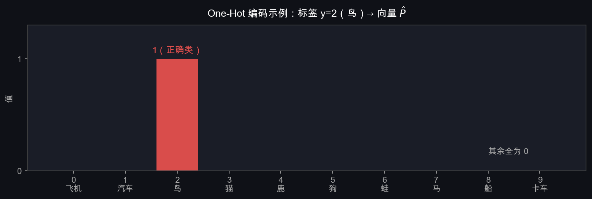
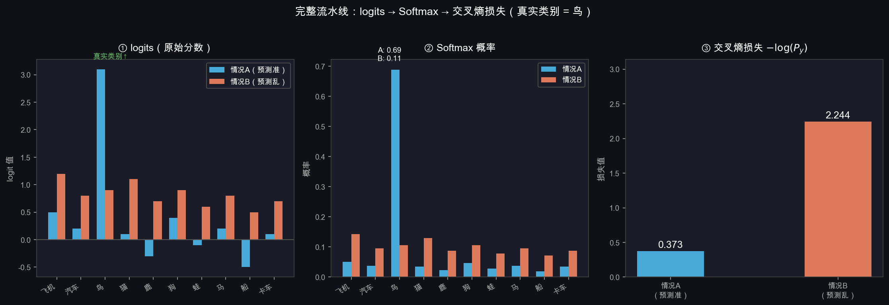
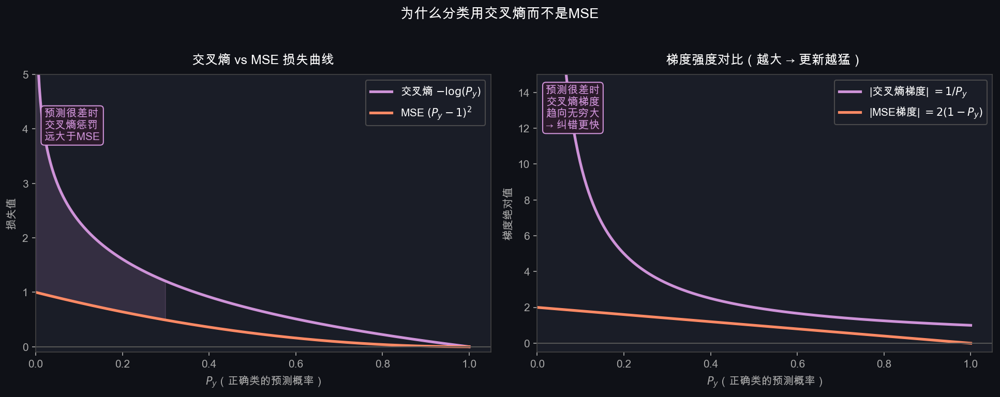

# T3：损失函数——怎么衡量"错了多少"

## 1. 为什么需要一个"错误数字"

我们现在有：
- 模型预测：$\mathbf{P} = [P_0, P_1, \ldots, P_9]$（Softmax 之后的概率）
- 真实答案：$y = 2$（比如这张图是鸟，标签是 2）

需要一个函数 $\mathcal{L}$，把预测和真实答案变成**一个数字**，越小越好：

$$\mathcal{L} = \mathcal{L}(\mathbf{P},\ y) \in [0, +\infty)$$

这个数字必须满足三个条件：

| 条件 | 原因 |
|------|------|
| 预测越准 → $\mathcal{L}$ 越小 | 目标是最小化损失 |
| 预测越差 → $\mathcal{L}$ 越大 | 要能感知到错误 |
| **必须可以求导** | T4 梯度下降要用导数来调整 $W$ |

---

## 2. 最直觉的想法为什么不行

最自然的衡量方式：**数错了几个**

$$\mathcal{L}_{\text{直觉}} = \mathbb{1}[\hat{y} \neq y] = \begin{cases} 0 & \text{预测对了} \\ 1 & \text{预测错了} \end{cases}$$

**问题：不可导。**

它是一个阶跃函数。绝大多数地方导数为 0，意味着对 $W$ 的任何微小改动，损失没有任何反应——梯度下降完全不知道该往哪走。

$$\frac{\partial \mathcal{L}_{\text{直觉}}}{\partial W} = 0 \quad \text{（几乎处处为零）}$$

此外还有另一个问题：它太粗糙了。  
模型输出 `[0.01, 0.01, 0.98, ...]` 和 `[0.09, 0.09, 0.10, ...]`，都预测对了，损失都是 0。  
但前者比后者自信得多——好的损失函数应该能区分这两种情况。

---

## 3. One-Hot 编码：把标签变成向量

真实标签 $y = 2$ 是一个整数，要和概率向量 $\mathbf{P}$（长度 10）做比较，需要先把它转成相同形状的向量。

**One-Hot 编码**：正确类对应位置为 1，其余全为 0。

$$y = 2 \quad \Rightarrow \quad \hat{\mathbf{P}} = [0,\ 0,\ \underbrace{1}_{位置2},\ 0,\ 0,\ 0,\ 0,\ 0,\ 0,\ 0]$$



这个向量 $\hat{\mathbf{P}}$ 代表"完美预测"：正确类概率为 1，其余为 0。  
我们的目标是让模型输出的 $\mathbf{P}$ 尽量接近 $\hat{\mathbf{P}}$。

---

## 4. 交叉熵损失（Cross-Entropy Loss）

### 4.1 公式

对于单个样本，真实标签 $y$，模型预测概率 $\mathbf{P}$：

$$\boxed{\mathcal{L} = -\log P_y}$$

就是：**只取正确类对应的那个预测概率，取自然对数，加负号。**

其他类的概率完全不管——因为 Softmax 保证了所有概率之和为 1，压低正确类的同时其他类自然会升高，反之亦然。

### 4.2 为什么用 $-\log$

$\log$ 函数在 $(0,1]$ 上是负数，加了负号之后：

| $P_y$（正确类概率） | $\log P_y$ | $\mathcal{L} = -\log P_y$ | 直觉 |
|---|---|---|---|
| $1.00$ | $0$ | $\mathbf{0}$ | 完全正确，无损失 |
| $0.90$ | $-0.105$ | $0.105$ | 很准，损失很小 |
| $0.50$ | $-0.693$ | $0.693$ | 一般 |
| $0.10$ | $-2.303$ | $2.303$ | 很差，损失大 |
| $0.01$ | $-4.605$ | $4.605$ | 极差，损失很大 |
| $\to 0$ | $\to -\infty$ | $\to +\infty$ | 灾难性预测，无限惩罚 |

关键性质：**越接近 0 惩罚越猛，曲线越陡**。这正是我们想要的——错得越离谱，学习信号越强。

### 4.3 完整流水线图解



- **情况 A**：模型对鸟（真实类）的 logit 最高（3.1），Softmax 后概率约 0.80，损失 ≈ 0.22
- **情况 B**：模型对所有类 logit 差不多（均匀混乱），鸟的概率只有约 0.11，损失 ≈ 2.2

损失相差 10 倍，准确反映了两种预测质量的差距。

### 4.4 具体数值推导

真实标签 $y = 2$（鸟），情况 A 的完整计算：

**第一步**：logits

$$\mathbf{s} = [0.5,\ 0.2,\ \mathbf{3.1},\ 0.1,\ -0.3,\ \ldots]$$

**第二步**：Softmax

$$P_2 = \frac{e^{3.1}}{\sum_j e^{s_j}} = \frac{22.20}{22.20 + 1.49 + 1.22 + \ldots} \approx 0.80$$

**第三步**：交叉熵

$$\mathcal{L} = -\log(0.80) = 0.223$$

---

## 5. 多个样本：平均损失

训练集有 $N$ 个样本，每张图算一个损失，取平均：

$$\mathcal{L}_{\text{total}} = -\frac{1}{N}\sum_{i=1}^{N} \log P_{y_i}$$

每个 $P_{y_i}$ 是第 $i$ 个样本中，**真实类别**对应的预测概率。

取平均的原因：让损失的量级不随数据集大小变化（100 个样本和 10000 个样本的损失可以比较）。

---

## 6. 展开：损失和 logits 的直接关系

把 Softmax 代入，可以完全用 logits $\mathbf{s}$ 表达损失（不需要显式算 Softmax）：

$$\mathcal{L} = -\log P_y = -\log \frac{e^{s_y}}{\displaystyle\sum_j e^{s_j}}$$

利用 $\log\frac{a}{b} = \log a - \log b$ 拆开：

$$\mathcal{L} = -s_y + \log\sum_j e^{s_j}$$

拆成两项来理解：

| 项 | 含义 | 训练时希望如何变化 |
|---|---|---|
| $-s_y$ | 正确类 logit 取负 | $s_y$ 越大越好（这项越小）|
| $\log\sum_j e^{s_j}$ | 所有类的"总能量" | 不希望其他类 logit 过大 |

**直觉**：这个损失同时在做两件事——**推高正确类的分数，压低其他类的分数**。  
这就是为什么用交叉熵训练，最终正确类的 logit 会远高于其他类。

---

## 7. 为什么交叉熵而不是 MSE

另一种直觉方案是用均方误差（MSE）衡量预测概率和 one-hot 目标的距离：

$$\mathcal{L}_{\text{MSE}} = \frac{1}{10}\sum_{i=0}^{9}(P_i - \hat{P}_i)^2$$



左图对比损失曲线，右图对比梯度强度：

| 对比维度 | 交叉熵 | MSE |
|------|--------|-----|
| 预测很差时的惩罚 | $\to +\infty$（无上限） | 最大为 1（有上限） |
| 预测很差时的梯度 | $= 1/P_y \to +\infty$（很大） | $= 2(1-P_y) \leq 2$（有上限） |
| 预测很差时的纠错速度 | 快（梯度大） | 慢（梯度被压制） |
| 理论依据 | 最大似然估计 / 信息论 | 假设输出是高斯分布（不符合分类） |

核心问题：MSE 的梯度被天花板压住了。当模型预测极差（$P_y \approx 0$）时，MSE 的梯度最大也就 2，模型纠错很慢。交叉熵没有这个上限，错得越离谱纠错越猛。

---

## 8. 数值稳定性：$\log(0)$ 的问题

理论上 $P_y > 0$ 永远成立（Softmax 用了 exp，输出永远正数）。  
但在代码里，当某个 logit 极小时，$P_y$ 可能被浮点数表示成精确的 0，导致 $\log(0) = -\infty$。

工程上的解决方案：**不先算 Softmax 再算 log，而是合并成一步 `log_softmax`**：

$$\log P_y = s_y - \log\sum_j e^{s_j}$$

直接用 logits 算，避免了 $P_y$ 先被截断成 0 的问题。PyTorch 里：

```python
# 不推荐（数值不稳定）
loss = -torch.log(torch.softmax(logits, dim=-1)[true_class])

# 推荐（数值稳定）
loss = F.cross_entropy(logits, target)  # 内部用 log_softmax 实现
```

---

## 9. 本节小结

$$\boxed{\mathcal{L} = -\log P_y = -s_y + \log\sum_j e^{s_j}}$$

| 概念 | 含义 |
|------|------|
| One-Hot $\hat{\mathbf{P}}$ | 真实标签的向量表示，正确类为 1 其余为 0 |
| $-\log P_y$ | 只看正确类概率，错得越离谱惩罚越大 |
| 为什么不数错误 | 不可导，无法给梯度下降提供方向 |
| 为什么不用 MSE | 梯度有天花板，预测极差时纠错太慢 |
| $-s_y + \log\sum e^{s_j}$ | 等价形式，推高正确类分数同时压低其他类 |
| `F.cross_entropy` | PyTorch 实现，内部已处理数值稳定性 |

**下一步**：有了损失，怎么用它调整 $W$？→ T4 梯度下降
