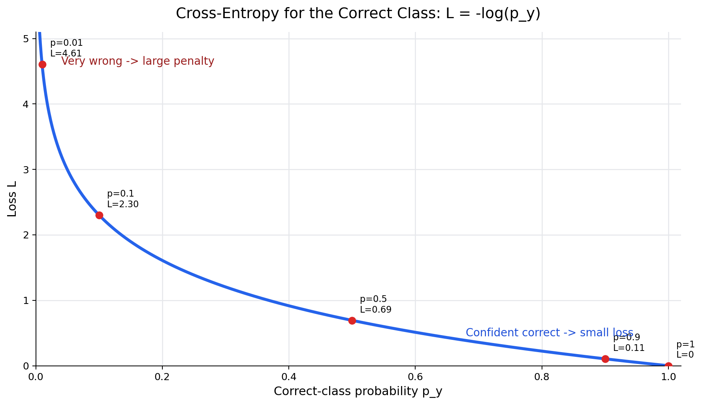
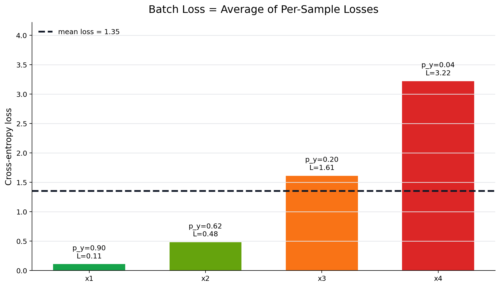

# T3：损失函数——怎么衡量“错了多少”

> 精读目标：T1 把图像分类抽象成 $f:\mathbb{R}^{3072}\rightarrow\mathbb{R}^{10}$，T2 把 $f$ 具体化成线性分类器 $\mathbf{s}=W\mathbf{x}+\mathbf{b}$。这一节要回答：**模型已经输出了 logits / 概率，训练时到底用什么数字告诉模型“你错了多少”？**

---

## 0. 从 T2 接上：模型会预测了，但还不会学习

T2 里，线性分类器对一张图片做：

$$\mathbf{x}\xrightarrow{W\mathbf{x}+\mathbf{b}}\mathbf{s}\xrightarrow{\text{Softmax}}\mathbf{p}\xrightarrow{\arg\max}\hat{y}$$

其中：

| 符号 | 含义 |
|------|------|
| $\mathbf{x}$ | 输入图片展平后的向量 |
| $\mathbf{s}$ | logits，模型输出的 10 个原始分数 |
| $\mathbf{p}$ | Softmax 后的 10 类概率 |
| $\hat{y}$ | 预测类别 |
| $y$ | 真实类别 |

现在的问题是：只会预测还不够，模型还要能**根据错误调整参数**。

参数是：

$$\theta=\{W,\mathbf{b}\}$$

训练的目标是找到一组更好的参数：

$$\theta^*=\arg\min_{\theta}\mathcal{L}(\theta)$$

这里的 $\mathcal{L}$ 就是 **loss function（损失函数）**。

一句话：

> 损失函数把“模型预测”和“真实答案”比较后，压缩成一个标量；这个标量越小，说明模型越好。

---

## 1. 为什么需要一个“错误数字”

假设一张 CIFAR-10 图片真实标签是：

$$y=2$$

也就是第 2 类，比如 bird。

模型经过 Softmax 后输出：

$$\mathbf{p}=[p_0,p_1,\ldots,p_9]$$

我们需要一个函数：

$$\mathcal{L}=\mathcal{L}(\mathbf{p},y)$$

它输出一个普通数字，比如：

$$0.05,\quad 0.7,\quad 2.3,\quad 10.8$$

这个数字要满足三个要求：

| 要求 | 原因 |
|------|------|
| 预测越好，loss 越小 | 训练目标是最小化 loss |
| 预测越差，loss 越大 | 错得离谱时要给更强惩罚 |
| loss 必须可导 | T4 梯度下降需要用导数更新参数 |

为什么一定要是一个标量？

因为优化问题一般写成：

$$\min_{\theta}\mathcal{L}(\theta)$$

也就是“让一个数尽量小”。如果输出还是一个向量，就很难直接说“哪个参数更好”。

---

## 2. 最直觉的想法：直接数预测错没错

最自然的 loss 是：

$$
\mathcal{L}_{\text{0-1}}=
\begin{cases}
0,& \hat{y}=y\\
1,& \hat{y}\ne y
\end{cases}
$$

这叫 **0-1 loss**。它和准确率最接近：

- 预测对了，loss 是 0。
- 预测错了，loss 是 1。

看起来很合理，但它不适合训练神经网络。

### 2.1 问题一：不可导，梯度下降不知道往哪走

0-1 loss 只关心 argmax 的结果。

如果模型输出 logits：

$$\mathbf{s}=[2.01,2.00,0.3,\ldots]$$

预测第 0 类。

把参数微调一点，变成：

$$\mathbf{s}=[2.02,1.99,0.3,\ldots]$$

预测还是第 0 类，0-1 loss 没变。

也就是说，在大多数微小变化下，0-1 loss 都是平的：

$$\frac{\partial \mathcal{L}_{\text{0-1}}}{\partial W}=0\quad\text{几乎处处成立}$$

梯度为 0 时，梯度下降就不知道该怎么改 $W$。

### 2.2 问题二：太粗糙，不看“有多自信”

假设真实类别是第 2 类。

下面两个预测都预测对了：

| 情况 | 正确类概率 $p_2$ | 预测结果 | 0-1 loss |
|------|------------------|----------|----------|
| A | $0.98$ | 对 | 0 |
| B | $0.31$ | 对 | 0 |

但 A 明显比 B 好很多。A 很确定，B 只是勉强赢了。

再看两个预测都错的情况：

| 情况 | 正确类概率 $p_2$ | 预测结果 | 0-1 loss |
|------|------------------|----------|----------|
| C | $0.49$ | 错 | 1 |
| D | $0.001$ | 错 | 1 |

C 只是差一点，D 是极度自信地错了。0-1 loss 却都给 1。

所以训练时不用 0-1 loss。准确率可以用来评估模型，但通常不用来直接训练模型。

---

## 3. One-Hot 编码：把真实标签变成目标分布

真实标签 $y=2$ 是一个整数。

但模型输出的是概率向量：

$$\mathbf{p}=[p_0,p_1,\ldots,p_9]$$

为了比较它们，我们把整数标签转成 one-hot 向量。

记目标向量为 $\mathbf{q}$：

$$\mathbf{q}=[0,0,1,0,0,0,0,0,0,0]$$

也就是：

$$q_i=
\begin{cases}
1,& i=y\\
0,& i\ne y
\end{cases}
$$


这个 $\mathbf{q}$ 可以理解成“理想概率分布”：

| 类别 | 理想概率 |
|------|----------|
| 真实类 | 1 |
| 其他类 | 0 |

所以训练目标就是让模型输出的 $\mathbf{p}$ 尽量接近 $\mathbf{q}$。

注意：这里用 $\mathbf{q}$ 表示真实分布，避免和模型预测 $\mathbf{p}$ 混淆。

---

## 4. 交叉熵损失：只惩罚正确类概率不够高

分类任务最常用的损失是 **Cross-Entropy Loss（交叉熵损失）**。

对于单个样本：

$$\boxed{\mathcal{L}=-\log p_y}$$

这里 $p_y$ 是模型分给真实类别 $y$ 的概率。

如果真实类别是第 2 类：

$$\mathcal{L}=-\log p_2$$

也就是说：

> 交叉熵只看“真实类别拿到了多少概率”。

如果真实类别概率高，loss 小。

如果真实类别概率低，loss 大。

---

## 5. 为什么是 $-\log p_y$

先看几个数。

| 正确类概率 $p_y$ | $\log p_y$ | $-\log p_y$ | 含义 |
|------------------|------------|-------------|------|
| $1.00$ | $0$ | $0$ | 完全正确 |
| $0.90$ | $-0.105$ | $0.105$ | 很自信地正确 |
| $0.50$ | $-0.693$ | $0.693$ | 不太确定 |
| $0.10$ | $-2.303$ | $2.303$ | 对 10 类问题来说接近瞎猜 |
| $0.01$ | $-4.605$ | $4.605$ | 非常差 |
| $0.001$ | $-6.908$ | $6.908$ | 极度自信地错 |



### 5.1 $-\log$ 的三个关键性质

第一，$p_y=1$ 时损失为 0：

$$-\log 1=0$$

这符合“完美预测没有损失”。

第二，$p_y$ 越小，损失越大：

$$p_y\downarrow 0\quad\Rightarrow\quad -\log p_y\uparrow +\infty$$

这符合“越不相信正确答案，惩罚越大”。

第三，越接近 0，惩罚增长越快。

例如：

$$-\log(0.1)=2.303$$

$$-\log(0.01)=4.605$$

正确类概率从 $0.1$ 下降到 $0.01$，loss 增加很多。这会给模型强烈信号：不要把正确类概率压得太低。

### 5.2 为什么 $p_y=0.1$ 的 loss 约等于 2.3 很重要

CIFAR-10 有 10 个类别。

如果模型完全瞎猜，每类概率差不多：

$$p_i\approx\frac{1}{10}=0.1$$

那么单个样本的交叉熵大约是：

$$-\log 0.1=\log 10\approx 2.3026$$

所以以后看训练日志时，如果一个 10 分类模型刚开始 loss 接近 2.3，不奇怪。

它表示：

> 模型现在大概和均匀随机猜差不多。

如果训练后 loss 从 $2.3$ 降到 $0.5$，说明模型已经比随机猜强很多。

---

## 6. 交叉熵的完整公式：从 one-hot 到 $-\log p_y$

更一般地，交叉熵写成：

$$\mathcal{L}=-\sum_{i=0}^{K-1}q_i\log p_i$$

其中：

| 符号 | 含义 |
|------|------|
| $K$ | 类别数，CIFAR-10 中 $K=10$ |
| $\mathbf{q}$ | 真实分布，也就是 one-hot 目标 |
| $\mathbf{p}$ | 模型预测分布 |

因为 one-hot 里只有真实类别位置是 1，其余都是 0：

$$q_y=1,\quad q_i=0\ (i\ne y)$$

所以求和会变成：

$$\mathcal{L}=-(0\cdot\log p_0+\cdots+1\cdot\log p_y+\cdots+0\cdot\log p_{K-1})$$

最后只剩：

$$\mathcal{L}=-\log p_y$$

这就是为什么实际分类里经常直接写 $-\log p_y$。

---

## 7. 一个完整数值例子

假设真实类别是：

$$y=2$$

模型输出 logits：

$$\mathbf{s}=[0.5,\ 0.2,\ 3.1,\ 0.1]$$

这里只用 4 类做小例子。

### 7.1 第一步：Softmax 得到概率

Softmax 是：

$$p_i=\frac{e^{s_i}}{\sum_j e^{s_j}}$$

先算指数：

$$e^{0.5}\approx1.65,\quad e^{0.2}\approx1.22,\quad e^{3.1}\approx22.20,\quad e^{0.1}\approx1.11$$

分母是：

$$1.65+1.22+22.20+1.11=26.18$$

所以正确类第 2 类的概率是：

$$p_2=\frac{22.20}{26.18}\approx0.848$$

### 7.2 第二步：交叉熵损失

$$\mathcal{L}=-\log p_2=-\log(0.848)\approx0.165$$

这个 loss 很小，说明模型对正确类别比较自信。

### 7.3 对比几个情况

还是假设真实类别是第 2 类。

| 情况 | 概率向量里的 $p_2$ | loss $-\log p_2$ | 直觉 |
|------|--------------------|------------------|------|
| 很确定地对 | $0.95$ | $0.051$ | 很好 |
| 勉强对 | $0.35$ | $1.050$ | 对了但不稳 |
| 接近瞎猜 | $0.10$ | $2.303$ | 10 分类随机水平 |
| 自信地错 | $0.01$ | $4.605$ | 惩罚很大 |

这就是交叉熵比 0-1 loss 更细腻的地方：它不只看对错，还看正确类概率有多高。


---

## 8. 多个样本：batch loss 是平均值

真实训练不会只看一张图，而是一次看一个 batch。

假设一个 batch 有 $N$ 个样本：

$$\{(\mathbf{x}^{(1)},y^{(1)}),(\mathbf{x}^{(2)},y^{(2)}),\ldots,(\mathbf{x}^{(N)},y^{(N)})\}$$

第 $n$ 个样本的正确类概率是：

$$p_{y^{(n)}}^{(n)}$$

它的单样本 loss 是：

$$\mathcal{L}^{(n)}=-\log p_{y^{(n)}}^{(n)}$$

整个 batch 的 loss 通常取平均：

$$\boxed{\mathcal{L}_{\text{batch}}=-\frac{1}{N}\sum_{n=1}^{N}\log p_{y^{(n)}}^{(n)}}$$



为什么取平均，而不是直接求和？

因为平均值不随 batch size 线性变大。

如果 batch size 从 32 改成 256，平均 loss 的量级仍然可比较；如果用求和，loss 会因为样本数变多而直接变大。

---

## 9. 从 logits 直接写交叉熵

前面写的是：

$$\mathcal{L}=-\log p_y$$

但模型真正先输出的是 logits：

$$\mathbf{s}=[s_0,s_1,\ldots,s_{K-1}]$$

Softmax 给出：

$$p_y=\frac{e^{s_y}}{\sum_{j=0}^{K-1}e^{s_j}}$$

把它代入交叉熵：

$$\mathcal{L}=-\log\frac{e^{s_y}}{\sum_j e^{s_j}}$$

利用：

$$\log\frac{a}{b}=\log a-\log b$$

得到：

$$\mathcal{L}=-(\log e^{s_y}-\log\sum_j e^{s_j})$$

因为：

$$\log e^{s_y}=s_y$$

所以：

$$\boxed{\mathcal{L}=-s_y+\log\sum_j e^{s_j}}$$

这个式子非常重要。

它说明交叉熵可以不先显式算概率，而是直接由 logits 算出来。

### 9.1 这个式子怎么理解

$$\mathcal{L}=-s_y+\log\sum_j e^{s_j}$$

分成两项：

| 项 | 含义 | 模型希望怎么变 |
|----|------|----------------|
| $-s_y$ | 正确类 logit 的负数 | 正确类 logit 越大越好 |
| $\log\sum_j e^{s_j}$ | 所有类别 logits 的总体竞争项 | 错误类 logits 不要太大 |

所以交叉熵会同时做两件事：

1. 推高正确类 logit。
2. 相对压低其他类 logits。

这正好接上 T2：线性分类器输出的是 logits，T3 的损失函数告诉模型哪些 logits 应该变大，哪些应该变小。

### 9.2 交叉熵真正关心的是“相对分数”

Softmax 和交叉熵不关心 logits 的绝对大小，而关心正确类比其他类高多少。

例如真实类别是第 2 类。

| logits | 正确类是否明显更高 | loss 直觉 |
|--------|--------------------|-----------|
| $[0,0,1]$ | 高一点 | 中等 |
| $[0,0,5]$ | 高很多 | 很小 |
| $[5,0,1]$ | 错误类更高 | 很大 |

所以训练不是单纯让所有 logits 变大，而是让正确类 logit 相对其他类更大。

---

## 10. 数值稳定性：为什么代码里不要先 Softmax 再 log

理论上，Softmax 输出永远大于 0：

$$p_i>0$$

所以 $\log p_y$ 应该总是有定义。

但计算机用浮点数表示数字。如果某个 logit 特别小，Softmax 后的概率可能被舍入成 0。

这会导致：

$$\log(0)=-\infty$$

训练就会出现 `inf` 或 `nan`。

### 10.1 稳定写法：log-sum-exp 技巧

从 logits 形式开始：

$$\mathcal{L}=-s_y+\log\sum_j e^{s_j}$$

如果 logits 很大，$e^{s_j}$ 可能溢出。

常用技巧是先减去最大 logit：

$$m=\max_j s_j$$

因为：

$$\frac{e^{s_i}}{\sum_j e^{s_j}}
=
\frac{e^{s_i-m}}{\sum_j e^{s_j-m}}$$

所有 logits 同时减去同一个数，Softmax 结果不变。

稳定版写法是：

$$\mathcal{L}=-(s_y-m)+\log\sum_j e^{s_j-m}$$

这样最大的 $s_j-m$ 等于 0，指数不会爆炸。

### 10.2 PyTorch 里的 CrossEntropyLoss

PyTorch 的 `CrossEntropyLoss` 期望输入是 logits，不是 Softmax 后的概率。

| 项 | PyTorch 期望 |
|----|--------------|
| `logits` | 形状 `[batch, num_classes]`，未经过 Softmax |
| `target` | 形状 `[batch]`，整数类别编号 |
| 内部操作 | `log_softmax + negative log likelihood` |

所以训练时通常写：

```python
loss = F.cross_entropy(logits, target)
```

不要写成：

```python
probs = F.softmax(logits, dim=1)
loss = F.cross_entropy(probs, target)
```

原因是：`F.cross_entropy` 自己会做稳定版 `log_softmax`，你提前 Softmax 反而会让数值和梯度都变差。

---

## 11. 为什么交叉熵而不是 MSE

另一种直觉方案是：让预测概率 $\mathbf{p}$ 接近 one-hot 目标 $\mathbf{q}$。

这可以用 MSE：

$$\mathcal{L}_{\text{MSE}}=\frac{1}{K}\sum_{i=0}^{K-1}(p_i-q_i)^2$$

它不是完全不能用，但分类任务里通常不如交叉熵。


### 11.1 从正确类概率看

如果只看正确类概率 $p_y$，MSE 的一部分像：

$$\mathcal{L}_{\text{MSE}}\approx(1-p_y)^2$$

交叉熵是：

$$\mathcal{L}_{\text{CE}}=-\log p_y$$

对比：

| 正确类概率 $p_y$ | CE $-\log p_y$ | MSE 近似 $(1-p_y)^2$ |
|------------------|----------------|----------------------|
| $0.9$ | $0.105$ | $0.01$ |
| $0.5$ | $0.693$ | $0.25$ |
| $0.1$ | $2.303$ | $0.81$ |
| $0.01$ | $4.605$ | $0.9801$ |

当模型极度错时，MSE 接近 1 后就不再明显变大；交叉熵会继续变大。

这意味着交叉熵对“自信地错”惩罚更强。

### 11.2 从梯度看

交叉熵对概率的导数是：

$$\frac{\partial}{\partial p_y}(-\log p_y)=-\frac{1}{p_y}$$

当 $p_y$ 很小时：

$$\left|-\frac{1}{p_y}\right| \text{ 很大}$$

这是对“概率本身”的导数。它说明：模型越不相信正确答案，交叉熵对这个概率越敏感。

而 MSE 对正确类概率的导数近似是：

$$\frac{\partial}{\partial p_y}(1-p_y)^2=-2(1-p_y)$$

它的大小最多接近 2。

更重要的是，Softmax 和交叉熵合在一起后，对 logits 的梯度会变得特别干净：

$$\frac{\partial \mathcal{L}}{\partial s_i}=p_i-q_i$$

对正确类 $y$ 来说：

$$\frac{\partial \mathcal{L}}{\partial s_y}=p_y-1$$

如果模型把正确类概率压得很低，比如 $p_y\approx 0$，那么：

$$p_y-1\approx -1$$

这表示梯度信号仍然很明确：应该把正确类 logit 往上推。

MSE 配合 Softmax 时，梯度里还会额外乘上 Softmax 的导数项。当概率已经接近 0 或 1 时，这个导数项容易变小，训练信号可能被削弱。

这个结论会在 T6/T7 反向传播里再推导。

现在先记住直觉：

> 交叉熵更适合分类，因为它把“正确类概率太低”变成强烈、清晰的训练信号。

---

## 12. 交叉熵和最大似然：它不是拍脑袋选的

交叉熵还有一个统计学解释：**最大似然估计**。

模型输出：

$$p_y=P(y\mid\mathbf{x};\theta)$$

意思是：在参数 $\theta$ 下，模型认为真实类别 $y$ 的概率是多少。

如果训练集有 $N$ 个样本，模型给所有真实标签的联合概率是：

$$\prod_{n=1}^{N}P(y^{(n)}\mid\mathbf{x}^{(n)};\theta)$$

训练当然希望这个概率越大越好。

但是连乘很难优化，所以取 log：

$$\sum_{n=1}^{N}\log P(y^{(n)}\mid\mathbf{x}^{(n)};\theta)$$

最大化这个量，等价于最小化它的负数：

$$-\sum_{n=1}^{N}\log P(y^{(n)}\mid\mathbf{x}^{(n)};\theta)$$

这就是交叉熵损失的总和形式。

所以：

> 最小化交叉熵 = 最大化模型给真实标签的概率。

---

## 13. Loss 和 Accuracy 的关系

准确率只看：

$$\hat{y}=y\ ?$$

交叉熵看：

$$p_y\text{ 有多大}$$

所以两者不完全同步。

### 13.1 准确率不变，loss 还能下降

假设真实类别都是第 2 类。

| 情况 | $p_2$ | 是否预测对 | loss |
|------|------|------------|------|
| A | $0.55$ | 对 | $0.598$ |
| B | $0.90$ | 对 | $0.105$ |

准确率都算对，但 B 的 loss 更低。

所以训练后期经常看到：

> accuracy 不怎么涨了，但 loss 还在慢慢降。

这表示模型在把已经预测对的样本变得更自信。

### 13.2 准确率可能被少数极端错误拖不动，但 loss 会明显反应

如果一个 batch 里大多数样本都对，但有一个样本模型极度自信地错了：

$$p_y=0.0001$$

它的 loss 是：

$$-\log(0.0001)\approx9.21$$

这个样本会显著拉高平均 loss。

所以 loss 比 accuracy 更能反映“错误有多严重”。

---

## 14. 本节最容易混淆的点

### 1. 交叉熵输入的是概率，PyTorch `CrossEntropyLoss` 输入的是 logits

数学上：

$$\mathcal{L}=-\log p_y$$

这里的 $p_y$ 是概率。

但 PyTorch 工程上：

```python
loss = F.cross_entropy(logits, target)
```

这里传入的是 logits。

不矛盾，因为 PyTorch 内部会稳定地完成：

$$\text{logits}\rightarrow\log\text{Softmax}\rightarrow-\log p_y$$

### 2. One-hot 是理解用的，代码里 target 通常还是整数

数学推导里常写：

$$\mathbf{q}=[0,0,1,0,\ldots,0]$$

但 PyTorch 中通常直接传：

$$y=2$$

因为框架内部知道要取第 2 类对应的 log probability。

### 3. 交叉熵不是只关心正确类，完全不管错误类

公式看起来是：

$$-\log p_y$$

好像只看正确类。

但 $p_y$ 来自 Softmax：

$$p_y=\frac{e^{s_y}}{\sum_j e^{s_j}}$$

分母包含所有类别。所以错误类 logit 越大，分母越大，$p_y$ 越小，loss 越大。

因此交叉熵间接惩罚了错误类分数过高。

### 4. Loss 小不等于一定预测对

一般来说，loss 小意味着模型对真实类概率高，通常预测也对。

但“单个样本 loss”和“整个数据集 accuracy”不是同一个指标。

训练时优化 loss，评估时通常同时看 loss 和 accuracy。

### 5. 交叉熵中的 log 默认是自然对数

深度学习里如果没特别说明：

$$\log x=\ln x$$

也就是以 $e$ 为底的自然对数。

---

## 15. 常用名词速查

### 损失函数（loss function）

把模型预测和真实答案比较后输出一个标量。训练目标是让损失尽量小。

### 0-1 loss

预测对为 0，预测错为 1。适合描述准确率，但不适合梯度下降训练。

### One-Hot

把整数标签变成向量。真实类别位置是 1，其余位置是 0。

### 目标分布（target distribution）

真实标签对应的理想概率分布。普通单标签分类里就是 one-hot 向量。

### 交叉熵（cross entropy）

分类任务中最常用的损失。对 one-hot 标签来说：

$$\mathcal{L}=-\log p_y$$

### 负对数似然（negative log likelihood, NLL）

把模型给真实标签的概率取 log 后加负号。单标签分类里的交叉熵可以理解成 NLL。

### log-sum-exp

数值稳定计算：

$$\log\sum_j e^{s_j}$$

的一种技巧，通常会先减去最大值再计算指数。

### reduction

把多个样本的 loss 合成一个标量的方式。常见有 `mean`、`sum`、`none`。

---

## 16. 自测题

1. 为什么 0-1 loss 不适合直接训练神经网络？
2. 对 10 分类问题，随机猜测时交叉熵大约是多少？为什么？
3. 为什么 one-hot 交叉熵公式 $-\sum_i q_i\log p_i$ 最后会变成 $-\log p_y$？
4. 如果正确类概率从 $0.9$ 变成 $0.1$，loss 怎么变化？
5. 为什么 PyTorch 的 `CrossEntropyLoss` 不需要你先手动 Softmax？
6. 为什么交叉熵会间接压低错误类别的 logits？
7. batch loss 为什么通常取平均？
8. 为什么 accuracy 不变时，loss 仍然可能继续下降？

参考答案：

1. 因为它只看预测类别是否相等，几乎处处不可导，不能给梯度下降提供有效方向；同时它不区分“差一点错”和“自信地错”。
2. 大约是 $\log 10\approx2.3026$。随机猜时每类概率约为 $0.1$，所以 loss 是 $-\log 0.1$。
3. 因为 one-hot 向量只有真实类别位置 $q_y=1$，其他位置都是 0，求和后只剩 $-\log p_y$。
4. 从 $-\log 0.9\approx0.105$ 变成 $-\log 0.1\approx2.303$，损失大幅增大。
5. 因为它内部已经做了数值稳定的 `log_softmax`，再取真实类别的负 log probability。
6. 因为 $p_y=e^{s_y}/\sum_j e^{s_j}$，错误类 logits 变大会增大分母，降低 $p_y$，从而增大 loss。
7. 平均后 loss 的量级不随 batch size 线性变化，不同 batch size 下更容易比较和设置学习率。
8. accuracy 只看 argmax 是否正确；loss 还会继续奖励更高的正确类概率，所以模型更自信时 loss 会继续下降。

---

## 17. 本节小结

核心公式：

$$\boxed{\mathcal{L}=-\log p_y}$$

等价的 logits 形式：

$$\boxed{\mathcal{L}=-s_y+\log\sum_j e^{s_j}}$$

batch 平均形式：

$$\boxed{\mathcal{L}_{\text{batch}}=-\frac{1}{N}\sum_{n=1}^{N}\log p_{y^{(n)}}^{(n)}}$$

| 概念 | 含义 |
|------|------|
| loss | 衡量模型“错了多少”的标量 |
| 0-1 loss | 预测错就是 1，对就是 0，不适合训练 |
| one-hot $\mathbf{q}$ | 真实标签的理想概率分布 |
| $p_y$ | 模型分给真实类别的概率 |
| 交叉熵 | $-\log p_y$，正确类概率越低惩罚越大 |
| logits 形式 | $-s_y+\log\sum_j e^{s_j}$，数值稳定实现的基础 |
| batch loss | 多个样本 loss 的平均 |
| `CrossEntropyLoss` | 输入 logits 和整数标签，内部做稳定版 log-softmax |

**下一步**：有了损失，怎么让参数沿着“损失下降”的方向更新？→ T4 梯度下降
