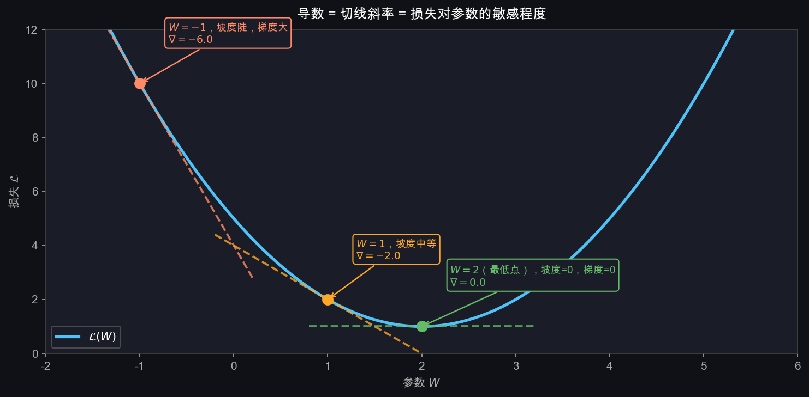
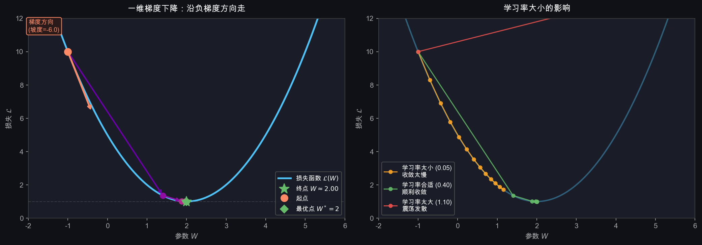
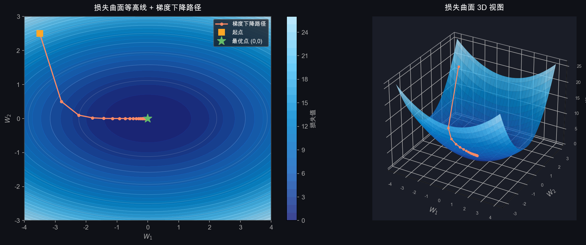
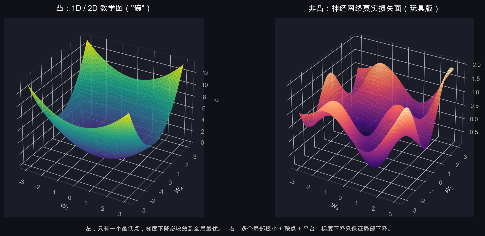

# T4：梯度下降——怎么让模型自动变好

> 精读目标：T2 把模型具体化成 $\mathbf{s} = W\mathbf{x} + \mathbf{b}$，T3 把"错了多少"压成一个标量 $\mathcal{L}$。这一节要回答：**有了损失之后，朝哪个方向改 $W$，才能让 $\mathcal{L}$ 变小？**

---

## 0. 从 T3 接上：会算损失了，但还不会学习

T3 末尾给了我们一个数字 $\mathcal{L}$，衡量当前 $\theta = \{W, \mathbf{b}\}$ 有多差，并且 T3 第 9 节把它写成了 logits 形式：

$$\mathcal{L} = -s_y + \log\sum_j e^{s_j}$$

但 T3 没回答两个关键问题：

1. **方向问题**：$W$ 和 $\mathbf{b}$ 应该往哪边改，才能让 $\mathcal{L}$ 下降？
2. **步长问题**：每次改多少？

这两个问题就是**梯度下降（gradient descent）**要解决的。

它的答案可以一句话说完：

> 沿着梯度的反方向走一小步。

下面把这句话拆开。

---

## 1. 从一维开始：导数的几何意义

先把问题简化到最极端：假设模型只有**一个参数** $W$（一个数，不是矩阵），损失函数是：

$$\mathcal{L}(W) = (W - 2)^2 + 1$$

这是一条抛物线，最低点在 $W = 2$，损失 $= 1$。

现在站在某个位置 $W = -1$，怎么知道应该往左走还是往右走？

**答案：看这个点的切线斜率，也就是导数。**

$$\frac{d\mathcal{L}}{dW} = 2(W - 2)$$

在 $W = -1$ 处：

$$\frac{d\mathcal{L}}{dW}\bigg|_{W=-1} = 2(-1-2) = -6$$

导数 $= -6$，是负数，说明这里曲线向左上方倾斜——**往右走损失会下降**。



三个关键点：

| 位置 | 导数值 | 含义 |
|------|--------|------|
| $W = -1$ | $-6$ | 坡很陡，向右走损失下降快 |
| $W = 1$ | $-2$ | 坡变缓，快到底了 |
| $W = 2$ | $0$ | **最低点**，坡度为零，停止 |

规律：**导数的符号告诉你方向，导数的大小告诉你坡有多陡。**

---

## 2. 更新规则

知道了导数，更新 $W$ 的方式非常简单：

$$\boxed{W \leftarrow W - \eta \cdot \frac{d\mathcal{L}}{dW}}$$

- $\eta$（eta）叫做**学习率（learning rate）**，控制每步走多大
- 减号：**沿负梯度方向走**（梯度指向上坡，取负就是下坡）

为什么是减法？

- 如果导数 $> 0$（当前在右坡，往右损失增加）→ $W$ 减小，向左走 ✓
- 如果导数 $< 0$（当前在左坡，往左损失增加）→ $W$ 增大，向右走 ✓
- 如果导数 $= 0$（已在最低点）→ $W$ 不变 ✓

---

## 3. 一维梯度下降的完整过程



**左图**：从 $W = -1$ 出发，学习率 $\eta = 0.4$，7 步走到接近最优点 $W^* = 2$。

**右图**：三种学习率的效果：

| 学习率 | 现象 | 原因 |
|--------|------|------|
| 太小（0.05） | 收敛极慢，走了很多步还没到 | 每步太小，进展缓慢 |
| 合适（0.40） | 顺利收敛 | 步子合适 |
| 太大（1.10） | 左右震荡，甚至发散 | 每步越过最低点，跳到对面更高处 |

### 3.1 为什么 $\eta = 1.10$ 就发散：能算出来的临界点

很多人会觉得"学习率太大就发散"是经验之谈。其实在二次损失上能写出精确条件。

把更新公式代入抛物线的导数：

$$W_{t+1} = W_t - \eta \cdot 2(W_t - 2)$$

设 $u_t = W_t - 2$（到最优点的距离），整理得：

$$u_{t+1} = (1 - 2\eta)\, u_t$$

每走一步，距离最优点的偏离都被乘以 $(1 - 2\eta)$。所以：

| $\lvert 1 - 2\eta \rvert$ | 行为 |
|---|---|
| $< 1$（即 $0 < \eta < 1$） | 偏离逐步缩小，**收敛** |
| $= 1$（$\eta = 0$ 或 $\eta = 1$） | 不动 / 来回震荡，临界 |
| $> 1$（$\eta > 1$） | 偏离越来越大，**发散** |

所以右图里 $\eta = 1.10$ 刚好越过临界值 $1$，必然发散。这不是"经验"，是公式。

### 3.2 这个结论的一般形式

对一般的二次损失 $\mathcal{L} = \tfrac{1}{2} a W^2$（$a > 0$），临界学习率是：

$$\eta_{\text{crit}} = \frac{2}{a}$$

其中 $a$ 是**曲率**（二阶导数）。曲率越大，能容忍的学习率越小。

这给了选学习率一个直觉：**损失曲面越尖锐（曲率大），学习率必须越小**；这也是为什么神经网络刚初始化时常用很小的学习率（如 $0.001$），因为某些方向上的曲率可能非常大。

学习率没有理论最优值，靠经验和实验。常见起点：$\eta = 0.01$ 或 $\eta = 0.001$。

---

## 4. 从一维到多维：梯度

真实情况下 $W$ 是一个矩阵（线性分类器里 $10 \times 3072 = 30720$ 个参数；加上 bias 一共 30730，见 T2 第 7 节），不再是一个数。

对于多个参数，导数推广为**梯度（gradient）**：

$$\nabla_W \mathcal{L} = \frac{\partial \mathcal{L}}{\partial W}$$

梯度是一个**和 $W$ 形状完全相同的矩阵**，每个位置 $(i,j)$ 的值是：

$$\left(\nabla_W \mathcal{L}\right)_{ij} = \frac{\partial \mathcal{L}}{\partial W_{ij}}$$

含义：**如果把 $W_{ij}$ 增大一点点，损失会变化多少。**

更新规则完全一样，只是从标量变成矩阵：

$$W \leftarrow W - \eta \cdot \nabla_W \mathcal{L}$$

这是一个**逐元素操作**：$W$ 的每个参数都沿自己的负梯度方向更新。

> 关于"$\partial$ 是什么"和"为什么矩阵导数算出来是矩阵"，T7（`06_backpropagation.md`）第 3、4 节有详细补课。这里先把它当作"对每个参数分别求导，再装回原来形状"。

---

## 5. 二维损失曲面的直觉

为了让"梯度"具体起来，看一个二维例子：

$$\mathcal{L}(W_1, W_2) = W_1^2 + 2W_2^2$$

它的梯度是：

$$\nabla \mathcal{L} = \begin{bmatrix} \partial \mathcal{L}/\partial W_1 \\ \partial \mathcal{L}/\partial W_2 \end{bmatrix} = \begin{bmatrix} 2W_1 \\ 4W_2 \end{bmatrix}$$

从 $(W_1, W_2) = (3, 2)$ 出发，学习率 $\eta = 0.1$，手算一步：

$$\nabla \mathcal{L} \big|_{(3,2)} = \begin{bmatrix} 6 \\ 8 \end{bmatrix}$$

$$\begin{bmatrix} W_1 \\ W_2 \end{bmatrix} \leftarrow \begin{bmatrix} 3 \\ 2 \end{bmatrix} - 0.1 \cdot \begin{bmatrix} 6 \\ 8 \end{bmatrix} = \begin{bmatrix} 2.4 \\ 1.2 \end{bmatrix}$$

损失从 $3^2 + 2 \cdot 2^2 = 17$ 降到 $2.4^2 + 2 \cdot 1.2^2 = 8.64$。

注意 $W_2$ 比 $W_1$ 收缩快（从 $2 \to 1.2$，相对变化 $40\%$；$W_1$ 从 $3 \to 2.4$，相对变化 $20\%$）。**为什么？因为 $W_2$ 方向曲率更大（系数是 2），同样的位置梯度更大。**



- **左图**：等高线图。颜色越深损失越小，中心是最优点。梯度下降的路径沿着等高线的法线方向（最陡的方向）一步步走向中心
- **右图**：三维曲面图。我们在一个"碗"里，目标是滚到碗底

注意路径不是直线——因为两个方向的曲率不同（$W_1$ 方向是 $W_1^2$，$W_2$ 方向是 $2W_2^2$），梯度在两个方向上大小不等，所以路径会弯曲。这种"各方向曲率不一样"的情况叫**病态条件（ill-conditioning）**，是后面动量、Adam 要解决的问题之一。

---

## 6. 警告：真实神经网络的损失面不是碗

前面所有图都是漂亮的"碗"。但**神经网络的损失面不是碗**。



**左**：教学用的"碗"——只有一个最低点，梯度下降必然收敛到全局最优。**右**：神经网络真实损失面的玩具版——多个局部极小、若干鞍点、还有平台区，梯度下降只保证每一步局部下降，**不保证找到全局最优**。

| 形态 | 1D 抛物线 / 2D 椭圆碗 | 神经网络损失面 |
|---|---|---|
| 维度 | 1～2 | 几万到上亿 |
| 凸性 | 凸（convex） | 非凸（non-convex） |
| 局部极小 | 只有一个，就是全局最优 | 很多 |
| 鞍点 | 没有 | 高维下极其常见 |
| 平台（plateau） | 没有 | 有，梯度很小但远未收敛 |

所以**梯度下降在神经网络里不保证收敛到全局最优**。它只保证：每一步都让损失局部下降。

实践中也不需要全局最优——找到一个"足够好"的局部极小或鞍点附近的低点，就能让模型工作得很好。这是深度学习的一个反直觉事实。

后面会出现的工具（mini-batch 噪声、动量、Adam）很大一部分动机就是：**让梯度下降在这种皱皱巴巴的损失面上更稳、更快**。

---

## 7. 训练的完整流程

梯度下降不是对所有数据算一次就完了，而是反复迭代。下面用伪代码（**单样本列向量版**，对应 T2 §1 的数学写法）：

```
初始化 W, b（随机小值）

for epoch in range(N_epochs):              # 整个数据集过一遍 = 1 epoch
    for x, y in dataloader:                # 每次取一个 batch
        # 前向（T2）
        s = W @ x + b                      # logits
        # 损失（T3 §9 稳定形式）
        L = -s[y] + logsumexp(s)
        # 梯度（T7）
        dL/dW, dL/db = backward(L)
        # 更新（本节）
        W = W - lr * dL/dW
        b = b - lr * dL/db
```

代码里通常用 batch 行向量写法（T2 §8）：`S = X @ W.T + b`，输入 `X` 形状 `[batch, 3072]`，输出 `S` 形状 `[batch, 10]`。两种写法本质相同，只是把样本放在列还是行。

### 7.1 epoch / iteration / step：必须分清

训练日志里这三个词经常混用，但含义不同：

| 词 | 含义 | 在 CIFAR-10 上的例子 |
|---|---|---|
| **iteration / step** | 走一次 mini-batch 的更新 | 1 步 = 处理 128 张图 |
| **epoch** | 训练集所有样本各看过一次 | 50000 / 128 ≈ 391 步 = 1 epoch |
| **总训练步数** | epoch × 每 epoch 步数 | 训练 10 epoch ≈ 3910 步 |

后面看 PyTorch 训练日志（如 `loss: 0.234, step 1500/3910`）时就是这套词汇。

---

## 8. 三种梯度下降变体

| 变体 | 每次用多少数据 | 特点 |
|------|----------------|------|
| 批量梯度下降（BGD） | 全部训练集 | 梯度最准，但慢，内存大 |
| 随机梯度下降（SGD） | 1 个样本 | 快，但梯度噪声大，震荡 |
| **小批量梯度下降（mini-batch SGD）** | 32~256 个样本 | **实际使用的方案**，两者折中 |

但"折中"是表面理由。mini-batch SGD 在实践中流行，有三个更深的原因：

**1. GPU 并行：batch=128 几乎不比 batch=1 慢。**
GPU 一次能并行算几千个浮点乘加。batch=1 时 GPU 大部分单元闲着，纯属浪费。所以"用更多样本算一次梯度"不是成本翻倍，而是几乎免费。

**2. 噪声反而是好事——能跳出局部极小和鞍点。**
BGD 算的是整个训练集的精确梯度，到鞍点就卡住（梯度真的为零）。mini-batch 算的是估计梯度，每个 batch 都会有随机噪声，**这个噪声能把模型从鞍点和浅局部极小里晃出来**。这是 §6 那个非凸警告的直接对应：噪声不是 bug，是 feature。

**3. 内存约束。**
CIFAR-10（5 万张）小到能全装进显存，但 ImageNet（128 万张）不行。BGD 在大型数据集上根本算不了一次完整梯度。

现代深度学习几乎都用 mini-batch SGD 或其变体。

---

## 9. SGD 之外：动量与 Adam（铺垫）

纯 SGD 在病态条件（§5 末尾）和非凸损失面上经常表现得不好——它会在窄峡谷里来回震荡，在平台上爬得极慢。两个常见改进：

**动量（Momentum）**：保留前几步的平均方向，像球滚下山有惯性。

$$\mathbf{v}_t = \beta \mathbf{v}_{t-1} + \nabla \mathcal{L},\quad \theta_t = \theta_{t-1} - \eta \mathbf{v}_t$$

效果：在一致方向上加速，在震荡方向上抵消。$\beta = 0.9$ 是常见默认值。

**Adam**：除了动量，还**给每个参数自适应调学习率**——梯度历史大的参数用小步子，历史小的参数用大步子。这相当于自动应对 §5 末尾的病态条件。

这两个会在 Week 2 PyTorch 实战里具体配置（`optim.SGD(momentum=0.9)`、`optim.Adam(lr=1e-3)`）。Week 1 的 `mlp_numpy.py` 故意只用最朴素的 SGD，这样你能看到原始版本的痛点。

---

## 10. 把 T3 的钩子收回来：线性分类器的梯度其实有闭式

T3 第 11.2 节抛了一个公式没解释：

$$\frac{\partial \mathcal{L}}{\partial s_i} = p_i - q_i$$

并说"在 T6/T7 推导"。但这个公式对**线性分类器**来说，配合本节的更新规则，已经能直接算出 $\nabla_W \mathcal{L}$。完整推导留到 T7，这里只用结论。

### 10.1 logits 上的梯度

对单样本 $\mathcal{L} = -\log p_y$，向量形式：

$$\frac{\partial \mathcal{L}}{\partial \mathbf{s}} = \mathbf{p} - \mathbf{q}$$

$\mathbf{p}$ 是 Softmax 输出的概率，$\mathbf{q}$ 是 one-hot 标签。这个差**就是误差信号**：

- 正确类位置：$p_y - 1 < 0$（梯度负 → 更新会推高 $s_y$）
- 错误类位置：$p_i - 0 > 0$（梯度正 → 更新会压低 $s_i$）

### 10.2 链式法则一步：从 $\mathbf{s}$ 到 $W, \mathbf{b}$

因为 $\mathbf{s} = W\mathbf{x} + \mathbf{b}$，对 $W$ 和 $\mathbf{b}$ 的梯度是：

$$\frac{\partial \mathcal{L}}{\partial W} = (\mathbf{p} - \mathbf{q})\, \mathbf{x}^\top \quad \text{（外积，形状 } K \times D \text{，和 } W \text{ 一致）}$$

$$\frac{\partial \mathcal{L}}{\partial \mathbf{b}} = \mathbf{p} - \mathbf{q}$$

### 10.3 一个能跑的更新例子

接着 T3 §7 的小例子：4 维输入、3 类、$y = 2$、Softmax 后 $\mathbf{p} \approx [0.063, 0.047, 0.848,\ldots]$（其实是 4 类的算法，这里简化成 3 类示例）。

为了清楚，直接给一组干净数字。设：

$$\mathbf{x} = \begin{bmatrix} 1\\2\\3 \end{bmatrix},\quad \mathbf{p} = \begin{bmatrix} 0.7\\0.2\\0.1 \end{bmatrix},\quad y = 2 \Rightarrow \mathbf{q} = \begin{bmatrix} 0\\0\\1 \end{bmatrix}$$

误差信号：

$$\mathbf{p} - \mathbf{q} = \begin{bmatrix} 0.7\\0.2\\-0.9 \end{bmatrix}$$

对 $W$ 的梯度（$3 \times 3$ 外积）：

$$\frac{\partial \mathcal{L}}{\partial W} = \begin{bmatrix} 0.7\\0.2\\-0.9 \end{bmatrix} \begin{bmatrix} 1 & 2 & 3 \end{bmatrix} = \begin{bmatrix} 0.7 & 1.4 & 2.1\\ 0.2 & 0.4 & 0.6\\ -0.9 & -1.8 & -2.7 \end{bmatrix}$$

第 0、1 行（错误类）梯度为正 → 更新后 $W$ 这两行的值会下降，让错误类得分变低；
第 2 行（正确类）梯度为负 → 更新后 $W$ 这一行的值会上升，让正确类得分变高。

这就是梯度下降在分类任务里**到底在做什么**：通过 $\mathbf{p} - \mathbf{q}$ 把"误差"反向涂回每个参数。

> 多层 MLP 的梯度需要把这个误差信号继续往前一层传，那才是 T7 反向传播的内容。但**最后一层的 $\mathbf{p} - \mathbf{q}$ 在 MLP 里也照样成立**——是反向传播的起点。

---

## 11. 本节最容易混淆的点

### 1. 梯度指向上坡，不是下坡

$\nabla_W \mathcal{L}$ 指向损失**增加最快**的方向。所以更新公式里有个减号：沿负梯度 = 下坡。

### 2. 学习率不是越小越好

太小不是只是"慢"，而是可能**陷在浅平台上爬不出来**——平台上梯度本来就小，再乘个小学习率，每步几乎不动。

### 3. mini-batch 的梯度是"真梯度的估计"，不是真梯度

BGD 算的 $\nabla \mathcal{L}$ 是整个训练集上的精确梯度。mini-batch 算的是用一小批样本估计出的梯度，**有噪声但无偏**。所以 mini-batch SGD 的损失曲线会上下抖动，这是正常的。

### 4. epoch 数和总步数不是同一回事

学习率调度通常按"步数"算（例如"每 1000 步降一半"）。epoch 数会随 batch size 变化——batch=64 跑 10 epoch 的步数是 batch=128 跑 10 epoch 的两倍。

### 5. 梯度为 0 不一定是最优点

在神经网络里，梯度为 0 的点可能是：
- 全局最小（罕见）
- 局部极小
- 鞍点（高维下最常见）
- 平台

只有 1D 凸函数才能"梯度为 0 ⇒ 全局最优"。

### 6. 学习率和 batch size 大致同步缩放

经验法则：batch size 翻倍，学习率也大致翻倍（叫 linear scaling rule）。原因是 batch 越大，梯度估计越准、噪声越小，可以放心走更大步。

### 7. SGD 里的 "stochastic" 指随机抽样，不是参数更新随机

参数更新本身是确定的：拿到梯度，按公式更新。"随机"指的是每个 batch 由数据集随机抽样组成。

---

## 12. 常用名词速查

### 学习率（learning rate, $\eta$）

每步参数更新的步长系数。最重要的超参数之一。

### 梯度（gradient）

损失对参数的偏导数构成的向量/矩阵。形状和参数完全一样。**指向上坡方向**，所以更新时取负。

### 导数 vs 梯度

导数：标量对标量的（$dy/dx$）。梯度：标量对向量/矩阵的（$\nabla_W \mathcal{L}$）。本质都是"敏感度"。

### epoch / iteration / step

epoch = 训练集走过一遍；iteration = step = 一次 mini-batch 更新。

### batch / mini-batch / batch size

batch 是一次喂给模型的样本组。batch size 通常 32～256。

### 收敛（convergence）/ 发散（divergence）

收敛：损失稳定下降到某个值附近。发散：损失越来越大或出现 NaN。

### 局部极小（local minimum）

梯度为 0 且周围都更高的点，但不一定是全局最优。

### 鞍点（saddle point）

梯度为 0，但某些方向上是最小、另一些方向上是最大的点。在高维里比局部极小更常见。

### 凸 / 非凸（convex / non-convex）

凸函数只有一个最低点（如抛物线）；非凸函数有很多。神经网络损失是高维非凸的。

### 病态条件（ill-conditioning）

不同方向上曲率差别很大的情况。会导致梯度下降走 Z 字形。动量和 Adam 缓解这个问题。

### 动量（momentum）

更新时保留前几步方向的加权平均，让参数像有惯性一样移动。

### Adam

自适应学习率优化器：每个参数有自己的学习率，由梯度历史自动调整。

### SGD

stochastic gradient descent。"stochastic" 指 batch 由数据随机抽样组成，不是说更新过程随机。

### 学习率调度（learning rate schedule）

训练过程中按规则降低 $\eta$，例如每 N 步乘 0.1，或余弦退火。让训练后期能稳定收敛。

---

## 13. 自测题

1. 更新公式 $W \leftarrow W - \eta \nabla \mathcal{L}$ 为什么是减号？把它换成加号会怎样？
2. 在二次损失 $\mathcal{L} = (W-2)^2$ 上，学习率 $\eta$ 大到什么程度就会发散？为什么？
3. CIFAR-10 训练集 50000 张，batch size = 128，1 epoch 大约是几个 iteration？
4. mini-batch SGD 比 BGD 实际更好的三个理由各是什么？
5. 1D 抛物线最低点处梯度为 0；高维神经网络梯度为 0 的点一定是最优吗？
6. 给定 $\mathcal{L}(W) = (W - 3)^2$，$W_0 = 0$，$\eta = 0.1$，写出 $W_1, W_2$。
7. 对线性分类器，$\partial \mathcal{L}/\partial \mathbf{s}$ 等于什么？这个量在更新时把"误差"涂到了哪？
8. batch size 翻倍时，学习率应该怎么调整？为什么？
9. 训练日志里看到 `loss=2.30`（10 分类，刚开始）和后来变成 `loss=0.5`，分别说明什么？

参考答案：

1. 因为 $\nabla \mathcal{L}$ 指向上坡（损失增加最快的方向），减号让我们沿下坡走。换成加号会沿上坡走，损失越来越大，发散。
2. 由 $W_{t+1} - 2 = (1 - 2\eta)(W_t - 2)$，发散条件是 $|1 - 2\eta| > 1$，即 $\eta > 1$。一般二次 $\mathcal{L} = \tfrac{1}{2} a W^2$ 的临界是 $\eta_{\text{crit}} = 2/a$，曲率越大临界越小。
3. $50000 / 128 \approx 391$ 个 iteration。
4. (a) GPU 并行使大 batch 几乎免费；(b) batch 噪声能跳出鞍点和浅局部极小；(c) 大数据集上 BGD 内存装不下。
5. 不一定。可能是局部极小、鞍点或平台。高维下鞍点比局部极小更常见。
6. $\nabla \mathcal{L} = 2(W - 3)$。$W_1 = 0 - 0.1 \cdot 2(0 - 3) = 0.6$；$W_2 = 0.6 - 0.1 \cdot 2(0.6 - 3) = 0.6 + 0.48 = 1.08$。
7. $\partial \mathcal{L}/\partial \mathbf{s} = \mathbf{p} - \mathbf{q}$。它在正确类位置为负（推高得分），错误类位置为正（压低得分），从而把"误差"分别涂到 $W$ 的对应行（外积 $(\mathbf{p}-\mathbf{q})\mathbf{x}^\top$）。
8. 大致也翻倍（linear scaling rule）。原因：batch 越大梯度估计越准、噪声越小，可以走更大步。
9. `2.30` ≈ $\log 10$，说明模型还在均匀瞎猜（10 分类先验）；`0.5` 说明正确类平均概率约 $e^{-0.5} \approx 0.6$，模型已经学到东西。

---

## 14. 本节小结

核心公式：

$$\boxed{\theta \leftarrow \theta - \eta \cdot \nabla_\theta \mathcal{L}}$$

线性分类器的具体形式：

$$\frac{\partial \mathcal{L}}{\partial W} = (\mathbf{p} - \mathbf{q})\mathbf{x}^\top,\quad \frac{\partial \mathcal{L}}{\partial \mathbf{b}} = \mathbf{p} - \mathbf{q}$$

| 概念 | 含义 |
|------|------|
| 梯度 / 导数 | 损失对参数的敏感度，指向上坡 |
| 负梯度方向 | 下坡方向，损失下降最快的方向 |
| 学习率 $\eta$ | 步长。在二次损失上，临界值是 $2/$曲率 |
| epoch / iteration | 数据集走一遍 / 一次 mini-batch 更新 |
| BGD / SGD / mini-batch | 全集 / 单样本 / 小批，实际用 mini-batch |
| 凸 vs 非凸 | 抛物线/碗 vs 神经网络真实损失面 |
| 局部极小 / 鞍点 | 梯度为 0 但不一定是最优 |
| 动量 / Adam | 缓解病态条件和震荡的 SGD 改进 |
| $\mathbf{p} - \mathbf{q}$ | 误差信号；分类任务梯度下降的核心量 |

**下一步**：线性分类器只有一个模板，能力不够 → 需要多层 + 非线性 → T5/T6 MLP 与激活函数（`05_mlp.md`），然后 T7 把多层网络的梯度真正推出来（`06_backpropagation.md`）。
