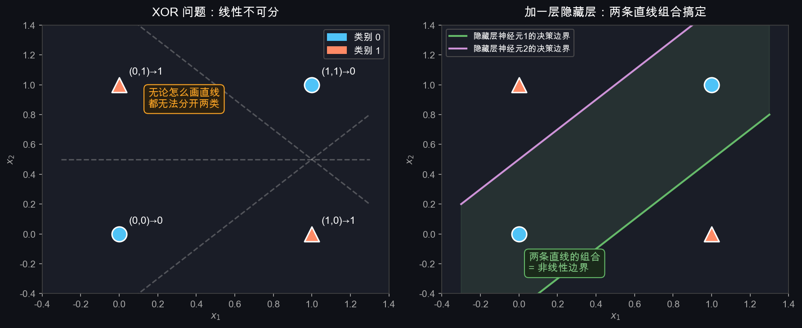
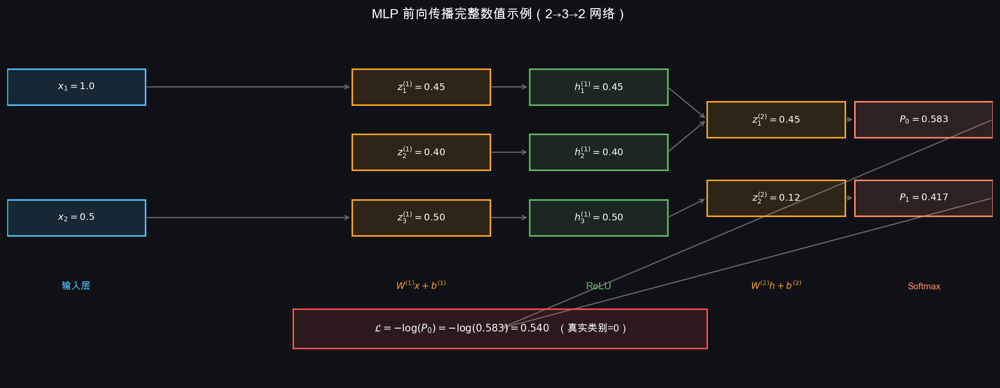
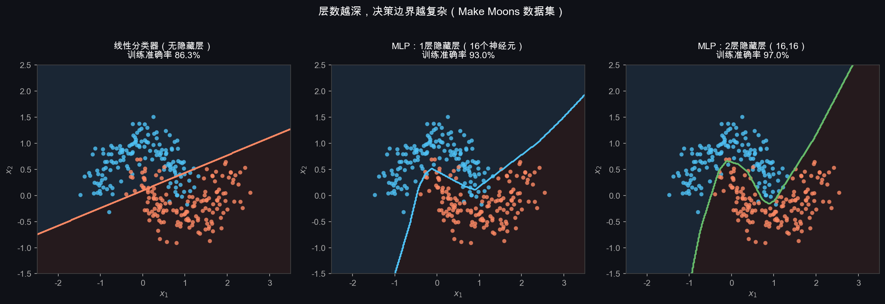
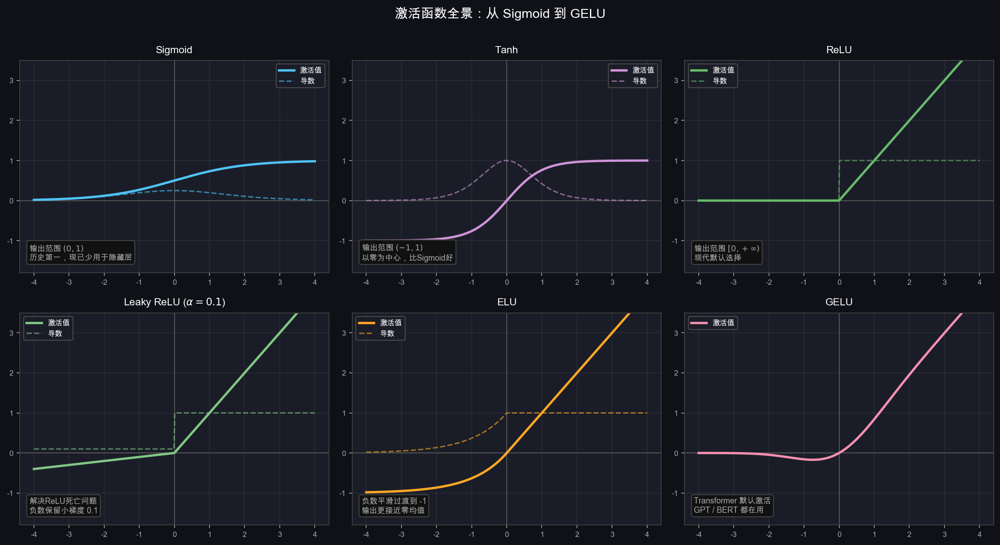

# T5 + T6：MLP 与激活函数

## 1. 线性分类器的死穴

T2 里我们有了 $f(\mathbf{x}) = W\mathbf{x} + \mathbf{b}$。

看起来只要多堆几层，表达能力就会增强。但数学告诉我们事情没这么简单。

假设堆两层线性变换：

$$\mathbf{h} = W^{(1)}\mathbf{x} + \mathbf{b}^{(1)}$$
$$\mathbf{s} = W^{(2)}\mathbf{h} + \mathbf{b}^{(2)}$$

把第一个式子代入第二个：

$$\mathbf{s} = W^{(2)}\!\left(W^{(1)}\mathbf{x} + \mathbf{b}^{(1)}\right) + \mathbf{b}^{(2)}
            = \underbrace{W^{(2)}W^{(1)}}_{W'}\mathbf{x} + \underbrace{W^{(2)}\mathbf{b}^{(1)} + \mathbf{b}^{(2)}}_{\mathbf{b}'}$$

结果还是 $W'\mathbf{x} + \mathbf{b}'$——**等价于一层线性变换**，不管叠多少层都一样。

**根本原因**：线性变换的复合还是线性变换。要打破这个限制，必须引入非线性。

---

## 2. XOR：最小反例

**XOR（异或）问题** 是证明线性不够用的最简洁例子：

| $x_1$ | $x_2$ | 输出 $y$ | 含义 |
|--------|--------|----------|------|
| 0 | 0 | 0 | 相同→0 |
| 1 | 1 | 0 | 相同→0 |
| 0 | 1 | 1 | 不同→1 |
| 1 | 0 | 1 | 不同→1 |



**左图**：4 个点，无论怎么画一条直线，都无法把两类分开——这叫**线性不可分**。

**右图**：加一个隐藏层，等于有了两条直线。两条直线的组合可以划出任意凸区域，轻松分开 XOR。

---

## 3. MLP 是什么

**MLP（Multi-Layer Perceptron，多层感知机）**= 多层线性变换，**每层之间插入非线性激活函数** $\sigma$。

结构：

$$\mathbf{h}^{(1)} = \sigma\!\left(W^{(1)}\mathbf{x} + \mathbf{b}^{(1)}\right) \quad \text{第1隐藏层}$$
$$\mathbf{h}^{(2)} = \sigma\!\left(W^{(2)}\mathbf{h}^{(1)} + \mathbf{b}^{(2)}\right) \quad \text{第2隐藏层}$$
$$\mathbf{s} = W^{(3)}\mathbf{h}^{(2)} + \mathbf{b}^{(3)} \quad \text{输出层（不加激活）}$$

$\mathbf{h}^{(k)}$ 叫做**隐藏层（hidden layer）**，因为它既不是输入也不是最终输出，藏在中间。

激活函数 $\sigma$ 是整个结构的灵魂——没有它，多层等于一层。

---

## 4. 单个神经元在做什么

每一个圆圈叫一个**神经元（neuron）**，它做的事情极其简单：

$$\text{输出} = \sigma\!\left(\sum_{j} w_j \cdot \text{输入}_j + b\right)$$

1. 把上一层所有输入**加权求和**（每条连接线有一个权重 $w_j$）
2. 加偏置 $b$
3. 过激活函数 $\sigma$，输出给下一层

多个神经元并列构成一层，多层串联构成 MLP。

---

## 5. 各层维度与参数量

以 CIFAR-10 分类为例（一个典型两层 MLP）：

| 层 | 操作 | 输入维度 | 输出维度 | 参数量 |
|----|------|----------|----------|--------|
| 展平 | reshape | $3\times32\times32$ | $3072$ | 0 |
| 隐藏层1 | $W^{(1)}\mathbf{x}+\mathbf{b}^{(1)}$ → ReLU | $3072$ | $512$ | $3072\times512+512=1{,}573{,}376$ |
| 隐藏层2 | $W^{(2)}\mathbf{h}^{(1)}+\mathbf{b}^{(2)}$ → ReLU | $512$ | $256$ | $512\times256+256=131{,}328$ |
| 输出层 | $W^{(3)}\mathbf{h}^{(2)}+\mathbf{b}^{(3)}$ | $256$ | $10$ | $256\times10+10=2{,}570$ |

**总参数约 170 万**，比单层线性分类器的 3 万大了几十倍。

---

## 6. 前向传播：完整数值例子

用一个 $2\to3\to2$ 的小网络走一遍完整的前向传播。



**输入**：$\mathbf{x} = [1.0,\ 0.5]^\top$

**第一步**：线性变换 $\mathbf{z}^{(1)} = W^{(1)}\mathbf{x} + \mathbf{b}^{(1)}$

$$W^{(1)} = \begin{bmatrix}0.5 & -0.3 \\ 0.2 & 0.8 \\ -0.1 & 0.6\end{bmatrix},\quad \mathbf{b}^{(1)} = \begin{bmatrix}0.1 \\ -0.2 \\ 0.3\end{bmatrix}$$

$$z^{(1)}_1 = 0.5\times1.0 + (-0.3)\times0.5 + 0.1 = 0.45$$
$$z^{(1)}_2 = 0.2\times1.0 + 0.8\times0.5 + (-0.2) = 0.40$$
$$z^{(1)}_3 = (-0.1)\times1.0 + 0.6\times0.5 + 0.3 = 0.50$$

**第二步**：ReLU 激活 $\mathbf{h}^{(1)} = \text{ReLU}(\mathbf{z}^{(1)})$

$$\mathbf{h}^{(1)} = [0.45,\ 0.40,\ 0.50]^\top \quad \text{（全为正数，原样通过）}$$

若某个 $z < 0$，ReLU 将其截为 0，该神经元对本次输入"沉默"。

**第三步**：输出层 $\mathbf{z}^{(2)} = W^{(2)}\mathbf{h}^{(1)} + \mathbf{b}^{(2)}$，再过 Softmax，算交叉熵损失。

---

## 7. 层数越深，能力越强



用"月牙形"数据集直观展示：

- **线性分类器**：只能画一条直线，准确率约 85%，边界区域大量误分
- **1层隐藏层（16节点）**：能画弯曲边界，准确率约 95%
- **2层隐藏层（16,16）**：边界更精细，准确率接近 100%

**万能近似定理（Universal Approximation Theorem）**：

> 一个有足够多神经元的单隐藏层 MLP，可以以任意精度近似任何连续函数。

定理告诉我们 MLP **理论上能做到**，但没说**需要多少神经元**，也没说**怎么找到那些参数**。实践中，深而窄的网络往往比浅而宽的网络更高效——这也是"深度"学习的价值所在。

---

## 8. 激活函数全景



### Sigmoid

$$\sigma(z) = \frac{1}{1 + e^{-z}}, \quad \sigma'(z) = \sigma(z)(1 - \sigma(z))$$

- 输出范围 $(0,1)$，历史上最早使用
- **问题：梯度消失**。两端（$z \ll 0$ 或 $z \gg 0$）导数趋近 0，信号传不回去
- 现在只用在**二分类输出层**，隐藏层基本不用

### Tanh

$$\tanh(z) = \frac{e^z - e^{-z}}{e^z + e^{-z}}, \quad \tanh'(z) = 1 - \tanh^2(z)$$

- 输出范围 $(-1,1)$，以零为中心（梯度更新更稳定）
- 仍有梯度消失，常见于 RNN，图像分类中已较少用

### ReLU（当前隐藏层默认）

$$\text{ReLU}(z) = \max(0,\ z), \quad \text{ReLU}'(z) = \mathbb{1}[z > 0]$$

- 正数原样通过，负数变 0
- **正数区梯度恒为 1**，不会消失，训练深层网络非常稳定
- **Dead ReLU 问题**：若某个神经元的输入永远为负，梯度永远为 0，该神经元"死亡"。解决方案见 Leaky ReLU

### Leaky ReLU

$$\text{LeakyReLU}(z) = \begin{cases} z & z > 0 \\ \alpha z & z \leq 0 \end{cases}, \quad \alpha \text{ 通常取 } 0.01 \sim 0.1$$

- 负数区保留一个小梯度 $\alpha$，避免神经元死亡

### ELU

$$\text{ELU}(z) = \begin{cases} z & z > 0 \\ \alpha(e^z - 1) & z \leq 0 \end{cases}$$

- 负数区平滑过渡到 $-\alpha$，输出均值更接近 0，训练更稳定

### GELU（现代大模型默认）

$$\text{GELU}(z) = z \cdot \Phi(z), \quad \Phi(z) = \frac{1}{2}\left[1 + \text{erf}\!\left(\frac{z}{\sqrt{2}}\right)\right]$$

- $\Phi(z)$ 是标准正态分布的累积分布函数
- 可以理解为：对输入 $z$ 进行"软性门控"——越大的输入越大概率原样通过
- GPT、BERT、Vision Transformer 等现代模型的默认激活函数

---

## 9. 激活函数选择指南

| 场景 | 推荐 |
|------|------|
| 图像分类隐藏层 | **ReLU**（简单、快、效果好） |
| 遇到 Dead ReLU 问题 | Leaky ReLU 或 ELU |
| Transformer / 大语言模型 | **GELU** |
| 二分类输出层 | Sigmoid |
| 多分类输出层 | **Softmax** |
| RNN / LSTM | Tanh |

---

## 10. PyTorch 实现

```python
import torch
import torch.nn as nn

class MLP(nn.Module):
    def __init__(self):
        super().__init__()
        self.net = nn.Sequential(
            nn.Flatten(),              # 3×32×32 → 3072
            nn.Linear(3072, 512),
            nn.ReLU(),
            nn.Linear(512, 256),
            nn.ReLU(),
            nn.Linear(256, 10),        # 输出 logits，不加 Softmax
        )

    def forward(self, x):
        return self.net(x)             # 返回 logits

# 损失函数内部已包含 Softmax
criterion = nn.CrossEntropyLoss()

model = MLP()
logits = model(images)                # images: (batch, 3, 32, 32)
loss   = criterion(logits, labels)    # labels: (batch,) 整数标签
```

注意：`nn.CrossEntropyLoss` 内部已经合并了 `log_softmax`，**输出层不需要再加 Softmax**。

---

## 11. MLP 的本质：层层提取特征

每一层的隐藏向量 $\mathbf{h}^{(k)}$ 是对原始输入的一种**重新表示（representation）**：

```
原始像素（3072维）—— 每个值是某位置的颜色强度，几乎没有语义
    ↓ 隐藏层1（512维）—— 开始捕捉简单模式（边缘、颜色块）
    ↓ 隐藏层2（256维）—— 组合简单模式，形成更抽象的特征
    ↓ 输出层（10维）—— 根据抽象特征判断类别
```

层越深，特征越抽象，这就是"深度"学习中"深度"的价值。

但 MLP 有一个根本缺陷：**不管像素在图片哪个位置，都用同一套参数处理**。猫的耳朵在左上角和在右下角，对 MLP 来说是完全不同的输入。这个问题，CNN 用卷积操作来解决——Week 2 的核心内容。

---

## 12. 本节小结

| 概念 | 含义 |
|------|------|
| 线性不可分 | 单条直线无法分开的数据，如 XOR |
| MLP | 多层线性变换 + 激活函数，可拟合任意非线性函数 |
| 隐藏层 $\mathbf{h}^{(k)}$ | 中间层，提取越来越抽象的特征 |
| 激活函数 | 打破线性，赋予网络非线性表达能力 |
| ReLU | 隐藏层默认选择，正数通过、负数归零 |
| GELU | 现代大模型默认激活，软性门控 |
| Dead ReLU | 神经元输入恒负、梯度永久为0，用 Leaky ReLU 解决 |
| MLP 的缺陷 | 不理解空间位置关系 → CNN 来解决 |

**下一步**：网络结构完整了，梯度怎么从损失反向传回每一层的 $W$？→ T7 反向传播
