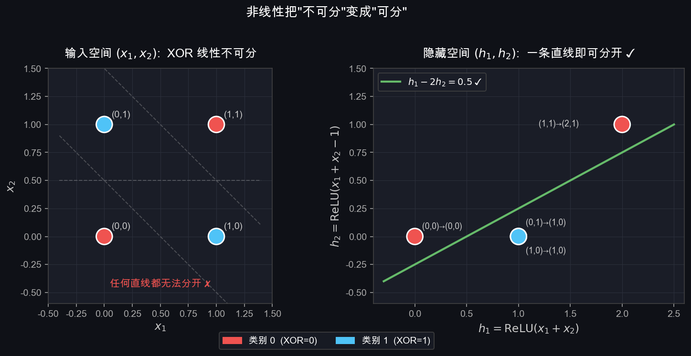
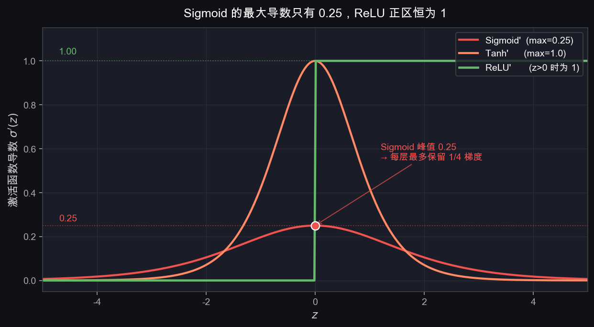
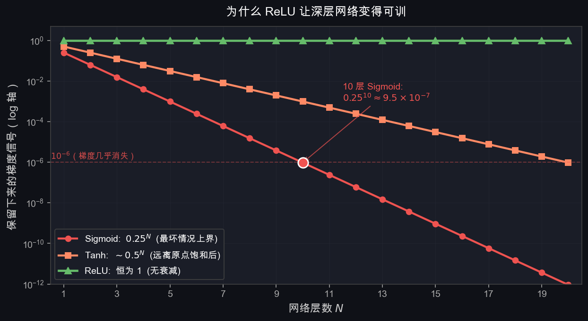
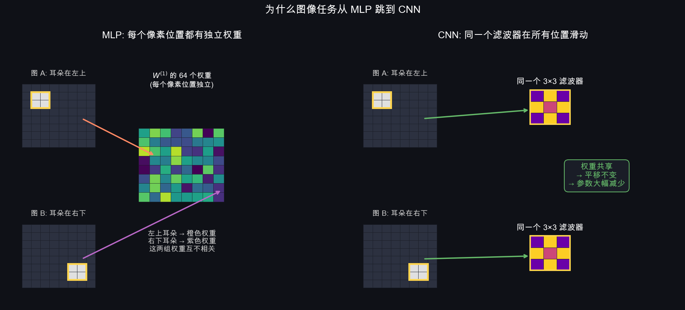

# T5 + T6：MLP 与激活函数

> 精读目标：T2 把 $f$ 具体化成线性分类器，T3 给了它一个损失，T4 让参数能沿梯度更新。但 T2 末尾留了一个根本问题——**线性分类器只能画直线，连 XOR 都解不了**。这一节回答：怎么把模型从"线性"升级成"可以拟合任意复杂函数"？

---

## 0. 从 T4 接上：会更新了，但模型本身还是太弱

T4 走完后，整套训练机器其实已经能跑：

$$\mathbf{x} \xrightarrow{W\mathbf{x}+\mathbf{b}} \mathbf{s} \xrightarrow{\text{Softmax}} \mathbf{p} \xrightarrow{-\log p_y} \mathcal{L} \xrightarrow{\nabla} W \leftarrow W - \eta \nabla \mathcal{L}$$

但这只能让 $W$ 在**线性分类器的解空间内**找到最优。T2 §10 列出过两个根本局限：

1. 每个类别只有一个模板
2. 决策边界只能是直线 / 超平面（XOR 解不了）

T4 没碰这两个问题——它只决定"怎么改 $W$"，不决定"$W$ 能表达什么"。

要让模型表达更复杂的函数，必须从**模型结构**下手。这一节做两件事：

- T5：把单层线性堆成多层（MLP）
- T6：在层之间插入**非线性激活函数**，否则堆多少层都没用

---

## 1. 线性分类器的死穴：堆几层也没用

最直觉的想法：既然单层不够，那就堆两层。

$$\mathbf{h} = W^{(1)}\mathbf{x} + \mathbf{b}^{(1)}$$
$$\mathbf{s} = W^{(2)}\mathbf{h} + \mathbf{b}^{(2)}$$

把第一个式子代入第二个：

$$\mathbf{s} = W^{(2)}\!\left(W^{(1)}\mathbf{x} + \mathbf{b}^{(1)}\right) + \mathbf{b}^{(2)} = \underbrace{W^{(2)}W^{(1)}}_{W'}\mathbf{x} + \underbrace{W^{(2)}\mathbf{b}^{(1)} + \mathbf{b}^{(2)}}_{\mathbf{b}'}$$

结果还是 $W'\mathbf{x} + \mathbf{b}'$——**等价于一层线性变换**。

意思是：**不管堆多少层 `nn.Linear`，只要中间不插非线性，整个网络的表达能力就等于一个线性分类器**。T2 §10 的两个死穴一个都没解决。

**根本原因**：线性变换的复合还是线性变换。要打破这个限制，**必须引入非线性**。

---

## 2. XOR：最小反例

**XOR（异或）问题**是证明线性不够用的最简洁例子：

| $x_1$ | $x_2$ | 输出 $y$ | 含义 |
|--------|--------|----------|------|
| 0 | 0 | 0 | 相同→0 |
| 1 | 1 | 0 | 相同→0 |
| 0 | 1 | 1 | 不同→1 |
| 1 | 0 | 1 | 不同→1 |


**左图**：4 个点，无论怎么画一条直线，都无法把两类分开——这叫**线性不可分**。

**右图**：加一个隐藏层 + ReLU 之后，能划出弯折的边界，轻松分开 XOR。

### 2.1 用 ReLU 真的解一次 XOR

光看图不够，下面给出一组**真实可用的权重**，手算一次。

构造一个 $2 \to 2 \to 1$ 的小 MLP，第一层带 ReLU：

$$h_1 = \text{ReLU}(x_1 + x_2),\quad h_2 = \text{ReLU}(x_1 + x_2 - 1)$$
$$y = h_1 - 2 h_2$$

代入 4 个输入：

| $(x_1, x_2)$ | $x_1 + x_2$ | $h_1$ | $h_2$ | $y = h_1 - 2 h_2$ |
|---|---|---|---|---|
| $(0,0)$ | $0$ | $0$ | $0$ | $0$ ✓ |
| $(1,0)$ | $1$ | $1$ | $0$ | $1$ ✓ |
| $(0,1)$ | $1$ | $1$ | $0$ | $1$ ✓ |
| $(1,1)$ | $2$ | $2$ | $1$ | $0$ ✓ |

四个全对。注意关键步骤是 $(1,1)$ 这行：如果没有 ReLU，$h_2$ 会变成 $1 - 1 = 0$ 而不是被截下来——**正是 ReLU 把"和等于 1"和"和等于 2"区分开了**，从而让最后一层减法能正确给出 0。

这是"非线性怎么解锁新函数"的最具体演示。把上面任何一个 ReLU 换成恒等函数 $\sigma(z) = z$，整网络坍缩成线性，4 个点立刻无法同时满足。



**左**：输入空间 $(x_1, x_2)$ 上 4 个点红蓝交错，无论怎么画直线都分不开。**右**：经过 ReLU 隐藏层后，4 个点被映射到 $(h_1, h_2)$ 空间——蓝色两点重合到 $(1, 0)$、红色两点分散到 $(0, 0)$ 和 $(2, 1)$，一条直线 $h_1 - 2h_2 = 0.5$ 就能干净分开。**非线性的全部作用就是这次"重新摆位"。**

---

## 3. MLP 是什么

**MLP（Multi-Layer Perceptron，多层感知机）**= 多层线性变换，**每两层之间插入非线性激活函数** $\sigma$。

结构：

$$\mathbf{h}^{(1)} = \sigma\!\left(W^{(1)}\mathbf{x} + \mathbf{b}^{(1)}\right) \quad \text{第 1 隐藏层}$$
$$\mathbf{h}^{(2)} = \sigma\!\left(W^{(2)}\mathbf{h}^{(1)} + \mathbf{b}^{(2)}\right) \quad \text{第 2 隐藏层}$$
$$\mathbf{s} = W^{(3)}\mathbf{h}^{(2)} + \mathbf{b}^{(3)} \quad \text{输出层（不加激活）}$$

$\mathbf{h}^{(k)}$ 叫做**隐藏层（hidden layer）**，因为它既不是输入也不是最终输出，藏在中间。

激活函数 $\sigma$ 是整个结构的灵魂——没有它，多层等于一层（§1）。

### 3.1 输出层为什么不加激活

这是初学者高频疑惑。原因要分任务看：

| 任务 | 输出层 | 原因 |
|---|---|---|
| 多分类（CIFAR-10、ImageNet） | **不加激活，直接输出 logits** | 后续 Softmax + 交叉熵在损失函数里完成（T3 §10.2，PyTorch 的 `CrossEntropyLoss` 内部做 `log_softmax`） |
| 二分类 | Sigmoid | 把 logit 映射到 $(0,1)$ 当概率 |
| 回归（预测连续值） | **不加激活** | 希望输出无上下界 |

所以"输出层不加激活"在分类任务里是常态——不是漏写了 Softmax，而是 Softmax 被损失函数吸收掉了（详见 T3 §10）。

---

## 4. 单个神经元在做什么

每一个圆圈叫一个**神经元（neuron）**，它做的事情极其简单：

$$\text{输出} = \sigma\!\left(\sum_{j} w_j \cdot \text{输入}_j + b\right)$$

1. 把上一层所有输入**加权求和**（每条连接线有一个权重 $w_j$）
2. 加偏置 $b$
3. 过激活函数 $\sigma$，输出给下一层

多个神经元并列构成一层，多层串联构成 MLP。

### 4.1 一个神经元 = 一个带非线性的"小线性分类器"

把 T2 的视角搬过来：单个神经元做的事就是**点积 + 偏置 + 非线性**。

回忆 T2 §3："点积 = 输入和模板的相似度"。所以每个隐藏单元相当于：

> **检测一种局部模板**，匹配则激活（输出 > 0），不匹配则沉默（ReLU 输出 0 或 Sigmoid 输出接近 0）。

第 1 层的 512 个隐藏单元 = 512 个不同的模板检测器；第 2 层在这 512 个检测结果之上再做组合检测；以此类推。这正是 §11 要展开的"层层提取特征"的微观机制。

---

## 5. 各层维度与参数量

### 5.1 CIFAR-10 教学版（一个典型两层 MLP）

| 层 | 操作 | 输入维度 | 输出维度 | 参数量 |
|----|------|----------|----------|--------|
| 展平 | reshape | $3\times32\times32$ | $3072$ | 0 |
| 隐藏层 1 | $W^{(1)}\mathbf{x}+\mathbf{b}^{(1)}$ → ReLU | $3072$ | $512$ | $3072\times512+512=1{,}573{,}376$ |
| 隐藏层 2 | $W^{(2)}\mathbf{h}^{(1)}+\mathbf{b}^{(2)}$ → ReLU | $512$ | $256$ | $512\times256+256=131{,}328$ |
| 输出层 | $W^{(3)}\mathbf{h}^{(2)}+\mathbf{b}^{(3)}$ | $256$ | $10$ | $256\times10+10=2{,}570$ |

**总参数约 170 万**，比单层线性分类器的 3 万（T2 §7）大了几十倍。

### 5.2 Week 1 实现版（MNIST，对应 `code/week1/mlp_numpy.py`）

| 层 | 输入 | 输出 | 参数量 |
|---|---|---|---|
| 展平 | $28\times28$ | $784$ | 0 |
| 隐藏层 1 → ReLU | $784$ | $128$ | $784 \times 128 + 128 = 100{,}480$ |
| 隐藏层 2 → ReLU | $128$ | $64$ | $128 \times 64 + 64 = 8{,}256$ |
| 输出层 | $64$ | $10$ | $64 \times 10 + 10 = 650$ |

**总参数约 11 万**。MNIST 比 CIFAR 简单（28×28 灰度 vs 32×32 RGB、数字 vs 自然图像），所以网络更小也能学得动。

两个版本结构完全一致，只是宽度不同。原理上没有任何区别。

### 5.3 参数量的一般公式

对一个层 `Linear(in, out)`：

$$|\text{params}| = \text{in} \times \text{out} + \text{out}$$

第一项是 $W$，第二项是 bias。整个 MLP 的参数量就是把每层加起来。

---

## 6. 前向传播：完整数值例子

用一个 $2\to3\to2$ 的小网络走一遍**完整**前向传播——一直到交叉熵损失。


**输入**：$\mathbf{x} = [1.0,\ 0.5]^\top$，**真实标签** $y = 0$。

### 6.1 第一层：线性变换 + ReLU

$$W^{(1)} = \begin{bmatrix}0.5 & -0.3 \\ 0.2 & 0.8 \\ -0.1 & 0.6\end{bmatrix},\quad \mathbf{b}^{(1)} = \begin{bmatrix}0.1 \\ -0.2 \\ 0.3\end{bmatrix}$$

$$z^{(1)}_1 = 0.5\times1.0 + (-0.3)\times0.5 + 0.1 = 0.45$$
$$z^{(1)}_2 = 0.2\times1.0 + 0.8\times0.5 + (-0.2) = 0.40$$
$$z^{(1)}_3 = (-0.1)\times1.0 + 0.6\times0.5 + 0.3 = 0.50$$

ReLU：

$$\mathbf{h}^{(1)} = \text{ReLU}([0.45, 0.40, 0.50]) = [0.45, 0.40, 0.50]$$

三个 $z$ 都为正，ReLU 原样通过。**如果某个 $z < 0$，ReLU 会把它截为 0**，对应的神经元在这次前向中等同于"断线"——这就是 §8 会讨论的 Dead ReLU 现象的微观表现。

### 6.2 输出层：线性变换（不加激活）

$$W^{(2)} = \begin{bmatrix}0.4 & -0.2 & 0.5 \\ 0.1 & 0.6 & -0.3\end{bmatrix},\quad \mathbf{b}^{(2)} = \begin{bmatrix}0.1 \\ -0.1\end{bmatrix}$$

$$s_0 = 0.4\times0.45 + (-0.2)\times0.40 + 0.5\times0.50 + 0.1 = 0.45$$
$$s_1 = 0.1\times0.45 + 0.6\times0.40 + (-0.3)\times0.50 + (-0.1) = 0.035$$

logits：$\mathbf{s} = [0.45, 0.035]$。

### 6.3 Softmax

$$e^{0.45} \approx 1.568,\quad e^{0.035} \approx 1.036$$
$$\sum = 2.604$$
$$\mathbf{p} = [1.568/2.604,\ 1.036/2.604] \approx [0.602,\ 0.398]$$

模型给真实类别 $y=0$ 的概率是 $p_0 \approx 0.602$。

### 6.4 交叉熵损失

$$\mathcal{L} = -\log p_0 = -\log(0.602) \approx 0.508$$

至此，从 $\mathbf{x}$ 一直走到 $\mathcal{L}$ 的完整流水线（T2 + T3）跑完了。下一步就是 T7 把 $\mathcal{L}$ 的梯度从最后一层反传回 $W^{(1)}, W^{(2)}$。

---

## 7. 层数越深，能力越强


用"月牙形"数据集直观展示：

- **线性分类器**：只能画一条直线，准确率约 85%，边界区域大量误分
- **1 层隐藏层（16 节点）**：能画弯曲边界，准确率约 95%
- **2 层隐藏层（16, 16）**：边界更精细，准确率接近 100%

### 7.1 万能近似定理

> **万能近似定理（Universal Approximation Theorem）**：一个有足够多神经元的单隐藏层 MLP，可以以任意精度近似任何连续函数。

定理告诉我们 MLP **理论上能做到**，但有两个不告诉你的：

1. **需要多少神经元**——可能是天文数字
2. **怎么找到那些参数**——SGD 不保证能找到

所以"万能近似"只是存在性结论，不是实操保证。

### 7.2 深度 vs 宽度：为什么"深"学习

实践中**深而窄**的网络往往比**浅而宽**的更高效。直觉是：

- 浅而宽：必须用一层就把所有特征都学出来，每个神经元独立工作
- 深而窄：每一层在上一层基础上做局部组合，特征**层级化复用**——前层的"边缘"被后层多次组合成"形状"再到"物体"

这种层级化复用让深层网络用更少的参数表达更复杂的函数。但代价是：**层多了梯度更难传**（§8.1）、**容易过拟合**（参数变多但数据没变多 → Week 3 会引入正则化和数据增强）。

---

## 8. 激活函数全景


### 8.1 Sigmoid

$$\sigma(z) = \frac{1}{1 + e^{-z}}, \quad \sigma'(z) = \sigma(z)(1 - \sigma(z))$$

- 输出范围 $(0,1)$，历史上最早使用
- **导数最大值只有 $0.25$**（在 $z=0$ 处取到）
- **梯度消失的具体机制**：每经过一层 Sigmoid，梯度信号最多被乘上 $0.25$。10 层叠起来，梯度衰减至少 $4^{10} \approx 10^6$ 倍——前几层几乎收不到任何更新信号。这就是 2010 年代之前训不动深层网络的核心障碍。
- 现在只用在**二分类输出层**，隐藏层基本不用



三条导数曲线叠在一起就能看出问题：Sigmoid（红）的天花板压在 $0.25$，越离开原点导数越接近 0；Tanh（橙）能短暂触到 $1.0$ 但两侧饱和很快；ReLU（绿）在 $z > 0$ 区恒为 $1$，梯度信号穿过它毫发无损。



把"每层最多保留多少梯度"叠 $N$ 层，就是上图（log 轴）。Sigmoid 在 10 层处已经掉到 $10^{-6}$，前层基本收不到更新信号；ReLU 始终是 $1$。**这张图本质上回答了"为什么 2012 年之后深层网络才训得动"——AlexNet 之所以能训 8 层，关键就是把 Sigmoid 换成了 ReLU。**

### 8.2 Tanh

$$\tanh(z) = \frac{e^z - e^{-z}}{e^z + e^{-z}}, \quad \tanh'(z) = 1 - \tanh^2(z)$$

- 输出范围 $(-1,1)$，以零为中心（梯度更新更稳定）
- **导数最大值 $1.0$**（在 $z=0$ 处取到），明显优于 Sigmoid 的 $0.25$
- 但远离原点时仍迅速饱和到 0，深层网络仍有梯度消失问题
- 常见于 RNN，图像分类中已较少用

### 8.3 ReLU（当前隐藏层默认）

$$\text{ReLU}(z) = \max(0,\ z), \quad \text{ReLU}'(z) = \mathbb{1}[z > 0]$$

- 正数原样通过，负数变 0
- **正数区导数恒为 1**——梯度信号无衰减地穿过任意多层
- **这是深层网络从 2012 年（AlexNet）之后才训得动的关键原因**
- **Dead ReLU 问题**：若某个神经元的输入永远为负，梯度永远为 0，该神经元对**所有**训练样本都输出 0、对**所有**梯度都贡献 0 → 永久"死亡"。注意"死"的不是某次输入下的输出，是这个神经元本身。
- 解决方案见下面的 Leaky ReLU

### 8.4 Leaky ReLU

$$\text{LeakyReLU}(z) = \begin{cases} z & z > 0 \\ \alpha z & z \leq 0 \end{cases}, \quad \alpha \text{ 通常取 } 0.01 \sim 0.1$$

- 负数区保留一个小梯度 $\alpha$，避免神经元死亡

### 8.5 ELU

$$\text{ELU}(z) = \begin{cases} z & z > 0 \\ \alpha(e^z - 1) & z \leq 0 \end{cases}$$

- 负数区平滑过渡到 $-\alpha$，输出均值更接近 0，训练更稳定

### 8.6 GELU（Transformer / 大模型默认）

$$\text{GELU}(z) = z \cdot \Phi(z), \quad \Phi(z) = \frac{1}{2}\left[1 + \text{erf}\!\left(\frac{z}{\sqrt{2}}\right)\right]$$

- $\Phi(z)$ 是标准正态分布的累积分布函数
- 可以理解为：对输入 $z$ 进行"软性门控"——越大的输入越大概率原样通过
- GPT、BERT、Vision Transformer 等的默认激活函数

> **重要提醒**：GELU 流行主要在 Transformer / LLM。**CNN 中 ReLU 仍然是标准选择**，Week 3 的 VGG/ResNet 实现都用 ReLU。不要因为"GELU 更新更先进"就在 CNN 里替换它，性能未必更好，训练速度反而会慢。

---

## 9. 激活函数选择指南

| 场景 | 推荐 |
|------|------|
| 图像分类 CNN 隐藏层 | **ReLU**（简单、快、效果好） |
| 遇到 Dead ReLU 问题 | Leaky ReLU 或 ELU |
| Transformer / 大语言模型 | **GELU** |
| 二分类输出层 | Sigmoid |
| 多分类输出层 | **Softmax** |
| RNN / LSTM | Tanh |
| 回归任务输出层 | **不加激活** |

---

## 10. PyTorch 实现

```python
import torch
import torch.nn as nn

class MLP(nn.Module):
    def __init__(self):
        super().__init__()
        self.net = nn.Sequential(
            nn.Flatten(),              # 3×32×32 → 3072
            nn.Linear(3072, 512),      # 内部 W1.shape = (512, 3072)
            nn.ReLU(),
            nn.Linear(512, 256),       # 内部 W2.shape = (256, 512)
            nn.ReLU(),
            nn.Linear(256, 10),        # 输出 logits，不加 Softmax
        )

    def forward(self, x):
        return self.net(x)             # 返回 logits

# 损失函数内部已包含 log_softmax + NLL
criterion = nn.CrossEntropyLoss()

model = MLP()
logits = model(images)                # images: (batch, 3, 32, 32)
loss   = criterion(logits, labels)    # labels: (batch,) 整数标签
```

两个细节经常困扰初学者：

1. **`nn.Linear(in, out)` 内部权重 shape 是 `(out, in)`**——和 T2 §1 数学公式 $\mathbf{s} = W\mathbf{x}$ 中 $W \in \mathbb{R}^{\text{out} \times \text{in}}$ 完全一致。代码里用 `X @ W.T` 是因为 batch 维度放在了第 0 维（T2 §8）。
2. **`nn.CrossEntropyLoss` 内部已经合并了 `log_softmax`**——输出层不要再加 Softmax，否则数值会不稳定（T3 §10.2）。

---

## 11. MLP 的本质和缺陷

### 11.1 本质：层层提取特征

每一层的隐藏向量 $\mathbf{h}^{(k)}$ 是对原始输入的一种**重新表示（representation）**：

```
原始像素（3072 维）—— 每个值是某位置的颜色强度，几乎没有语义
    ↓ 隐藏层 1（512 维）—— 开始捕捉简单模式（边缘、颜色块）
    ↓ 隐藏层 2（256 维）—— 组合简单模式，形成更抽象的特征
    ↓ 输出层（10 维）—— 根据抽象特征判断类别
```

层越深，特征越抽象。这就是"深度"学习中"深度"的价值，也对应 §4.1 的视角：每个神经元是一个模板检测器，层层叠加 = 模板组合。

### 11.2 缺陷：MLP 不理解空间位置

MLP 处理图像有一个根本缺陷：**它把每个像素位置当作完全独立的特征，每个位置都有自己的一套权重，没有任何"空间结构"或"权重共享"**。

具体后果：

- **不知道相邻像素更相关**——$x_{(0,0)}$ 和 $x_{(0,1)}$ 在物理上紧挨着，但 MLP 看到的就是 $\mathbf{x}$ 的第 0 维和第 1 维，和"第 0 维与第 2000 维"的关系没有任何区别
- **不具备平移不变性**——猫耳朵出现在图片左上角和右下角，MLP 必须分别学两套参数。训练集见过左上的猫耳朵，不代表它能识别右下的猫耳朵
- **参数浪费**——每个像素位置独立学权重，导致参数量爆炸（CIFAR-10 上一个 512 维隐藏层就要 157 万参数），但很多权重在学的其实是"同一个特征出现在不同位置"

CNN 用两个机制解决这些问题：

- **局部连接**：每个神经元只看输入图片的一小块区域（不是全图）
- **权重共享**：同一个滤波器在图片所有位置上**用同一套权重**滑动

这两个机制让 CNN 自然具备平移不变性、参数大幅减少、能利用图像的空间结构——Week 2 的核心内容。



**左 (MLP)**：耳朵在左上和右下分别激活 $W^{(1)}$ 中**完全不同**的权重（橙色与紫色），这两组权重之间没有任何联系——左上学到的"耳朵长这样"对识别右下的耳朵帮不上忙。**右 (CNN)**：同一个 $3\times 3$ 滤波器（同一套权重）在两个位置滑过，所以"耳朵"无论出现在哪都用同一个检测器——这就是平移不变性的来源。

---

## 12. 本节最容易混淆的点

### 1. "层数"怎么数：通常只数有权重的层

`Flatten → Linear(784, 128) → ReLU → Linear(128, 64) → ReLU → Linear(64, 10)` 是 **3 层网络**（3 个 `Linear`），不是 4 层、5 层、6 层。Flatten 和 ReLU 没有可训练参数，不计入层数。隐藏层数 = 总层数 - 1（输出层）。

### 2. 输出层不加激活，不是漏写

分类任务的 Softmax 在损失函数里完成（`CrossEntropyLoss` 内部 `log_softmax`），所以模型输出的是 logits。回归任务也不加激活，因为希望输出无上下界。**只有二分类用 Sigmoid 输出**才是输出层带激活的特例。

### 3. ReLU 死亡是**神经元级别**的死，不是某次输入下的死

某次输入下输出 0 是正常工作（ReLU 本就该把负数截掉）。"死"指的是这个神经元对**所有**训练样本都输出 0 → 反向传播给它的梯度永远是 0 → 权重永远不更新。

### 4. Sigmoid 输出 ∈ $(0, 1)$ 不等于概率

只有**二分类的最终输出**经过 Sigmoid 才能解释成"是正类的概率"。隐藏层中间出现的 Sigmoid 数值不是概率。多分类的概率必须用 Softmax（输出向量加起来等于 1）。

### 5. Universal Approximation 是存在性结论，不告诉你怎么训

定理说"足够多神经元的单层 MLP 能近似任何连续函数"——但不告诉你需要多少神经元、SGD 能不能找到那组权重、需要多少数据。所以它**不是**"MLP 是最佳选择"的理由。

### 6. 增加宽度 ≠ 增加深度

把一层从 128 加到 1024 个神经元，和加多两层 128，参数量可能差不多，但表达能力差很远。**深度让特征层级化复用**，宽度只是单层并行更多模板。两者不可互换。

### 7. MLP 中"全连接"指**层与层**全连接

不是层内每个神经元两两连接。一个隐藏层内的神经元彼此独立计算，互不通信；它们的"全连接"指的是**每个上一层的输出都连到当前层的每一个神经元**。

### 8. `nn.Linear(in, out)` 的内部权重是 `(out, in)`

`nn.Linear(3072, 512).weight.shape` 是 `(512, 3072)`，对应数学公式 $W \in \mathbb{R}^{out \times in}$。代码里看到 `X @ W.T` 是因为输入按 batch 放在第 0 维（行向量），需要 `W` 转置一下。这和 T2 §8 完全一致。

---

## 13. 常用名词速查

### MLP / FC / 全连接层 / dense layer

四个词在大多数语境里同义。MLP = 多层感知机；FC = fully-connected，常作 PyTorch 中 `Linear` 层的别名；dense layer 是 Keras 的叫法。

### 隐藏层 / 隐藏单元 / 神经元

层 = 一组并列的单元；单元 = 神经元 = 一个加权求和 + 偏置 + 激活的小单元。"隐藏" 指既不是输入也不是最终输出。

### 激活函数（activation function）

层间的非线性函数 $\sigma$。没有它，整个 MLP 坍缩成一层线性。

### ReLU / Leaky ReLU / ELU / GELU / Sigmoid / Tanh

具体激活函数家族。ReLU 是 CNN 默认；GELU 是 Transformer 默认；Sigmoid/Tanh 主要历史用法。

### Softmax

把 logits 向量映射成概率分布的函数。只用在多分类**输出层**（且通常被 `CrossEntropyLoss` 吸收）。和隐藏层激活不是同一个用途。

### 梯度消失（vanishing gradient）

深层网络反向传播时，梯度信号经过每一层激活函数后被乘上一个 < 1 的数，层数多了梯度衰减到接近 0，前层学不动。Sigmoid 是经典元凶（最大导数 0.25）。

### Dead ReLU

某个 ReLU 神经元对所有输入永远输出 0，梯度永远为 0，权重永久不更新。

### 表征 / representation

模型中间层的输出，是对原始输入的一种重新编码。深度学习又叫"表征学习"。

### 深度 / 宽度

深度 = 层数；宽度 = 每层的神经元数。深而窄通常比浅而宽更高效。

### 万能近似定理（Universal Approximation Theorem）

一个有足够多神经元的单隐藏层 MLP 可以任意精度近似任何连续函数。**存在性结论，非实操保证。**

### logits

模型输出层在 Softmax 之前的原始分数。可正可负、不归一化。

### 输入 / 输出 / 隐藏层

输入层 = 数据本身（不算"层"）；输出层 = 最后一个 Linear；中间所有层都是隐藏层。

### 权重共享（weight sharing）

CNN 的核心机制——同一个滤波器在图像所有位置用同一套权重。MLP **没有**权重共享。

---

## 14. 自测题

1. 为什么不加激活函数时，10 层 `Linear` 等价于 1 层？写出推导。
2. 用 ReLU 和 2 个隐藏单元给出 XOR 的一组解，并验证 4 个输入。
3. 一个 `784 → 128 → 64 → 10` 的 MLP 总参数量是多少？
4. 多分类 CNN 的输出层为什么不加 Softmax？
5. Sigmoid 的最大导数是多少？10 层 Sigmoid 堆叠时，梯度信号最少衰减多少倍？
6. ReLU 死亡现象在什么情况下发生？怎么缓解？
7. 把 §6 例子里的 ReLU 全部换成恒等函数 $\sigma(z) = z$，整个网络坍缩成什么？
8. MLP 处理图像的两个根本缺陷是什么？CNN 用什么机制解决？
9. `nn.Linear(3072, 512)` 内部权重的 shape 是什么？为什么是这个形状？

参考答案：

1. 因为线性变换的复合还是线性变换：$W^{(2)}(W^{(1)}\mathbf{x} + \mathbf{b}^{(1)}) + \mathbf{b}^{(2)} = (W^{(2)}W^{(1)})\mathbf{x} + (W^{(2)}\mathbf{b}^{(1)} + \mathbf{b}^{(2)})$。叠 10 层就是 10 个矩阵连乘成一个矩阵，结果还是线性。
2. $h_1 = \text{ReLU}(x_1+x_2),\ h_2 = \text{ReLU}(x_1+x_2-1),\ y = h_1 - 2h_2$。验证：$(0,0)\to0,\ (1,0)\to1,\ (0,1)\to1,\ (1,1)\to2-2=0$。
3. $784\times128+128 + 128\times64+64 + 64\times10+10 = 100480 + 8256 + 650 = 109{,}386$。约 11 万。
4. 因为 `CrossEntropyLoss` 内部已经做了数值稳定的 `log_softmax`。如果模型再加 Softmax，相当于做两次，数值会不稳定且梯度变差（T3 §10.2）。
5. 最大导数 $0.25$（在 $z=0$）。10 层堆叠，梯度信号至少被乘 $0.25^{10} \approx 10^{-6}$，前层几乎收不到更新信号。
6. 当某神经元的输入 $z$ 对**所有**训练样本永远为负时发生（输出永远 0、梯度永远 0、权重永不更新）。常见诱因：学习率过大导致权重一次大幅更新到负值区。缓解：用 Leaky ReLU/ELU、降低学习率、用合适的初始化（如 He 初始化）。
7. 坍缩成一个 $2 \to 2$ 的线性变换：$\mathbf{s} = W^{(2)} W^{(1)} \mathbf{x} + (W^{(2)}\mathbf{b}^{(1)} + \mathbf{b}^{(2)})$。中间的"3 维隐藏层"不再有任何价值。
8. 缺陷：(a) 不理解空间位置——每个像素位置独立学权重，不知道相邻像素更相关；(b) 没有平移不变性——同一特征出现在不同位置必须分别学。CNN 用**局部连接 + 权重共享**解决两者。
9. shape 是 `(512, 3072)`。对应数学公式 $W \in \mathbb{R}^{out \times in}$；矩阵第一维是输出维度（每行对应一个输出神经元的权重），第二维是输入维度。

---

## 15. 本节小结

核心结构：

$$\boxed{\mathbf{h}^{(k)} = \sigma(W^{(k)}\mathbf{h}^{(k-1)} + \mathbf{b}^{(k)})}$$

输出层不加激活：

$$\boxed{\mathbf{s} = W^{(L)}\mathbf{h}^{(L-1)} + \mathbf{b}^{(L)}}$$

| 概念 | 含义 |
|------|------|
| 线性不可分 | 单条直线无法分开的数据，如 XOR |
| 多层线性 = 一层线性 | 没有非线性时，叠多少层都没用 |
| MLP | 多层 Linear + 激活函数，可拟合任意非线性函数 |
| 隐藏层 $\mathbf{h}^{(k)}$ | 中间层，提取越来越抽象的特征 |
| 单个神经元 | 加权求和 + bias + 激活，相当于带非线性的小线性分类器 |
| 输出层不加激活 | 分类任务由 `CrossEntropyLoss` 吸收 Softmax |
| ReLU | CNN 隐藏层默认，正区导数恒为 1，深层可训 |
| Sigmoid 导数 $\le 0.25$ | 梯度消失的元凶，所以隐藏层不再用 |
| GELU | Transformer / LLM 默认，CNN 仍用 ReLU |
| Dead ReLU | 神经元永久输出 0，用 Leaky ReLU 缓解 |
| 万能近似定理 | 存在性结论，不保证可训 |
| 深 vs 宽 | 深度让特征层级化复用，更高效 |
| MLP 的根本缺陷 | 不理解空间位置、无平移不变性、无权重共享 |

**下一步**：网络结构完整了，损失也定义好了。但 $\mathcal{L}$ 对 $W^{(1)}, W^{(2)}, \ldots$ 的梯度怎么从最后一层反传回来？→ T7 反向传播（`06_backpropagation.md`）
