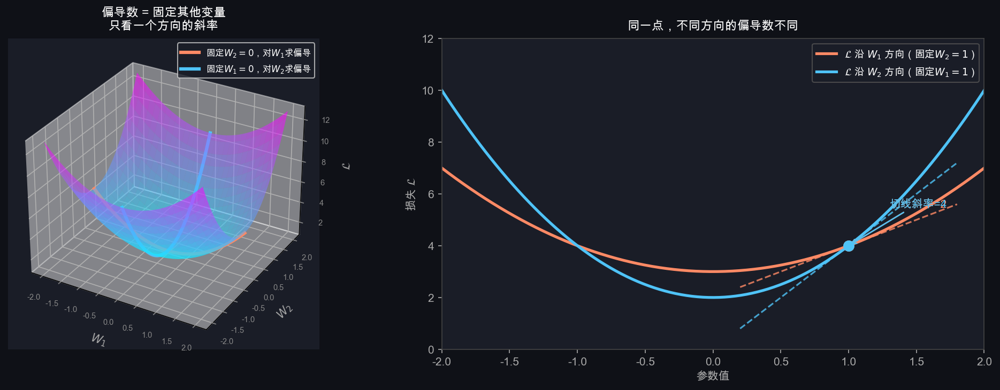
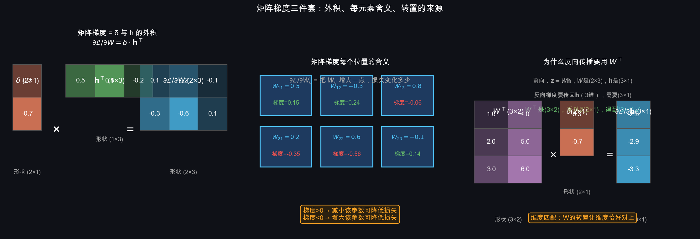
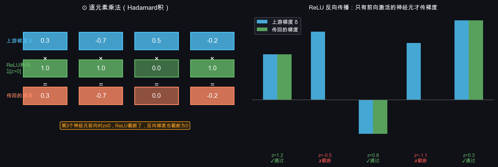
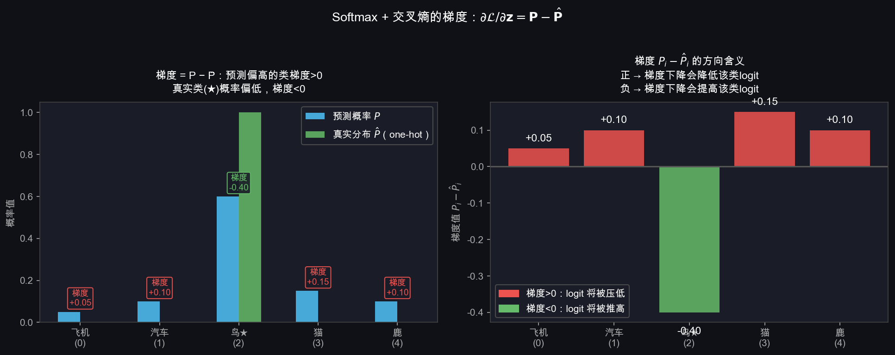
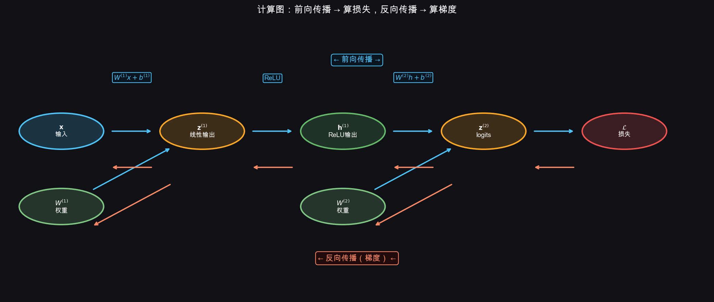
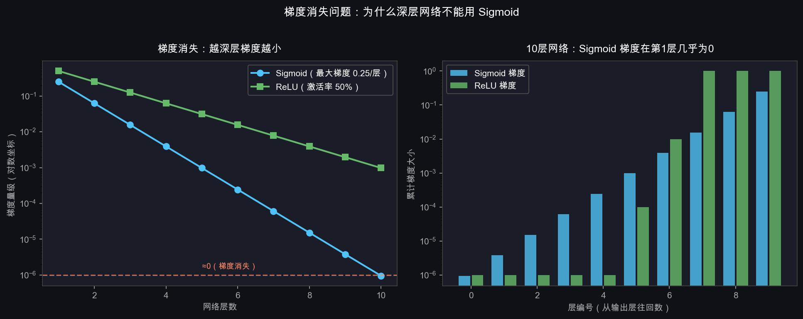

# T7：反向传播——梯度怎么从后往前传

## 1. 问题的核心

T4 里我们知道了更新公式：

$$W \leftarrow W - \eta \cdot \frac{\partial \mathcal{L}}{\partial W}$$

但网络有多层参数 $W^{(1)}, W^{(2)}, \mathbf{b}^{(1)}, \mathbf{b}^{(2)}$，损失 $\mathcal{L}$ 是最末端的输出。

问题是：**$\mathcal{L}$ 离 $W^{(1)}$ 隔了好几层操作，怎么算 $\frac{\partial \mathcal{L}}{\partial W^{(1)}}$？**

答案是链式法则。在进入推导之前，先把几个基础概念讲清楚。

---

## 2. 链式法则（已掌握，略）

---

## 3. 补课①：偏导数 $\partial$ 是什么

### 3.1 一个变量 vs 多个变量

你学过单变量导数：$\mathcal{L}(W)$ 只有一个变量，导数写 $\frac{d\mathcal{L}}{dW}$。

但损失函数有成千上万个参数，比如 $\mathcal{L}(W_1, W_2, \ldots, W_{3072})$。这时候：

$$\frac{\partial \mathcal{L}}{\partial W_1} = \text{"固定其他所有参数不动，只改变 } W_1 \text{ 时，损失的变化率"}$$

$\partial$ 读作"偏"，表示这是**偏导数**——只对某一个变量求导，其余当常数。

### 3.2 图像理解



左图：损失面是一个三维曲面，有两个参数 $W_1, W_2$。
- **橙色曲线**：固定 $W_2 = 0$，沿 $W_1$ 方向切一刀，得到一条曲线，这条曲线的斜率就是 $\frac{\partial \mathcal{L}}{\partial W_1}$
- **蓝色曲线**：固定 $W_1 = 0$，沿 $W_2$ 方向切一刀，斜率就是 $\frac{\partial \mathcal{L}}{\partial W_2}$

右图：同一个点 $(W_1=1, W_2=1)$，两个方向的斜率不同（分别是 2 和 4）。

### 3.3 对矩阵 W 求偏导

$W$ 是矩阵，有 $m \times n$ 个元素，每个元素都有自己的偏导数：

$$\frac{\partial \mathcal{L}}{\partial W_{ij}} = \text{"固定 W 中其他所有元素，只改变 } W_{ij} \text{ 时，损失的变化率"}$$

所有偏导数合在一起，构成一个和 $W$ **形状完全相同**的矩阵：

$$\frac{\partial \mathcal{L}}{\partial W} = \begin{bmatrix}
\frac{\partial \mathcal{L}}{\partial W_{11}} & \frac{\partial \mathcal{L}}{\partial W_{12}} & \cdots \\
\frac{\partial \mathcal{L}}{\partial W_{21}} & \frac{\partial \mathcal{L}}{\partial W_{22}} & \cdots \\
\vdots & & \ddots
\end{bmatrix}$$

**$\frac{\partial \mathcal{L}}{\partial W}$ 和 $W$ 形状完全一样，每个位置告诉你：增大这个参数，损失会怎么变。**

---

## 4. 补课②：矩阵梯度和转置从哪来

### 4.1 线性层的前向传播

对于线性层 $\mathbf{z} = W\mathbf{h} + \mathbf{b}$：

- $W$ 形状 $(m \times n)$
- $\mathbf{h}$ 形状 $(n \times 1)$（上一层的输出）
- $\mathbf{z}$ 形状 $(m \times 1)$（这一层的输出）

展开写，$z_i$ 的计算是：

$$z_i = \sum_{k=1}^{n} W_{ik} \cdot h_k + b_i$$

### 4.2 对 W 求偏导（为什么是外积）

$W_{ij}$ 只出现在 $z_i = \sum_k W_{ik} h_k + b_i$ 这一个等式里：

$$\frac{\partial z_i}{\partial W_{ij}} = h_j, \quad \frac{\partial z_{i'}}{\partial W_{ij}} = 0 \quad (i' \neq i)$$

根据链式法则，设上游传来的梯度为 $\delta_i = \frac{\partial \mathcal{L}}{\partial z_i}$：

$$\frac{\partial \mathcal{L}}{\partial W_{ij}} = \sum_{i'} \frac{\partial \mathcal{L}}{\partial z_{i'}} \cdot \frac{\partial z_{i'}}{\partial W_{ij}} = \delta_i \cdot h_j$$

写成矩阵形式，这就是向量 $\boldsymbol{\delta}$（列向量）和 $\mathbf{h}$（列向量）的**外积**：

$$\boxed{\frac{\partial \mathcal{L}}{\partial W} = \boldsymbol{\delta} \cdot \mathbf{h}^\top}$$

$\mathbf{h}^\top$ 是把列向量转成行向量，外积的结果形状是 $(m \times n)$，和 $W$ 完全一致。

### 4.3 对 h 求偏导（为什么是 $W^\top$）

$h_j$ 出现在**每一个** $z_i$ 的计算里：

$$\frac{\partial z_i}{\partial h_j} = W_{ij}$$

根据链式法则：

$$\frac{\partial \mathcal{L}}{\partial h_j} = \sum_{i} \frac{\partial \mathcal{L}}{\partial z_i} \cdot \frac{\partial z_i}{\partial h_j} = \sum_{i} \delta_i \cdot W_{ij}$$

这正好是 $W^\top \boldsymbol{\delta}$ 的第 $j$ 个元素：

$$\boxed{\frac{\partial \mathcal{L}}{\partial \mathbf{h}} = W^\top \boldsymbol{\delta}}$$

### 4.4 为什么要转置——维度的直觉



左图：$\boldsymbol{\delta}$（$m \times 1$）和 $\mathbf{h}^\top$（$1 \times n$）相乘，结果是 $m \times n$，和 $W$ 形状一致 ✓

右图：$W^\top$（$n \times m$）乘以 $\boldsymbol{\delta}$（$m \times 1$），结果是 $n \times 1$，和 $\mathbf{h}$ 形状一致 ✓

**记忆口诀：梯度要传回哪里，那里的形状就是目标。转置保证维度匹配。**

---

## 5. 补课③：$\odot$ 逐元素乘法

$\odot$ 叫 **Hadamard 积**，就是两个形状相同的矩阵/向量，**对应位置相乘**：

$$\begin{bmatrix}a_1 \\ a_2 \\ a_3\end{bmatrix} \odot \begin{bmatrix}b_1 \\ b_2 \\ b_3\end{bmatrix} = \begin{bmatrix}a_1 b_1 \\ a_2 b_2 \\ a_3 b_3\end{bmatrix}$$

和矩阵乘法 $AB$（行乘列求和）完全不同，$\odot$ 是位置对位置直接相乘，没有求和。

### 5.1 ReLU 反向传播用到 $\odot$



ReLU 的前向传播：$h_i = \max(0, z_i)$

ReLU 的导数：

$$\frac{\partial h_i}{\partial z_i} = \begin{cases}1 & z_i > 0 \\ 0 & z_i \leq 0\end{cases} = \mathbb{1}[z_i > 0]$$

反向传播，把上游梯度 $\delta_i^h$ 传回 $z_i$：

$$\delta_i^z = \delta_i^h \cdot \frac{\partial h_i}{\partial z_i} = \delta_i^h \cdot \mathbb{1}[z_i > 0]$$

写成向量形式就是：

$$\boldsymbol{\delta}^z = \boldsymbol{\delta}^h \odot \mathbb{1}[\mathbf{z} > 0]$$

**直觉**：上图右图显示——前向传播时 $z > 0$ 的神经元，梯度原样通过（绿色）；前向传播时 $z \leq 0$ 的神经元，梯度被截断为 0（红色）。这些神经元前向贡献了 0，反向自然也传不回梯度。

---

## 6. 补课④：$\mathbf{P} - \hat{\mathbf{P}}$ 怎么推出来的

这是 Softmax + 交叉熵联合求导，结果出奇简洁。一步步推：

### 6.1 设定

- logits：$\mathbf{z} = [z_0, z_1, \ldots, z_9]$
- Softmax：$P_i = \frac{e^{z_i}}{\sum_j e^{z_j}}$，记分母 $S = \sum_j e^{z_j}$
- 损失：$\mathcal{L} = -\log P_y$，其中 $y$ 是真实类别

### 6.2 对正确类 $z_y$ 求偏导

$$\mathcal{L} = -\log P_y = -\log \frac{e^{z_y}}{S} = -z_y + \log S$$

$$\frac{\partial \mathcal{L}}{\partial z_y} = -1 + \frac{\partial \log S}{\partial z_y} = -1 + \frac{1}{S} \cdot \frac{\partial S}{\partial z_y}$$

因为 $\frac{\partial S}{\partial z_y} = e^{z_y}$：

$$\frac{\partial \mathcal{L}}{\partial z_y} = -1 + \frac{e^{z_y}}{S} = -1 + P_y = P_y - 1$$

### 6.3 对错误类 $z_i$（$i \neq y$）求偏导

$$\frac{\partial \mathcal{L}}{\partial z_i} = 0 + \frac{1}{S} \cdot \frac{\partial S}{\partial z_i} = \frac{e^{z_i}}{S} = P_i$$

（$z_i$ 不出现在 $-z_y$ 那一项，所以第一项是 0）

### 6.4 合并写

$$\frac{\partial \mathcal{L}}{\partial z_i} = P_i - \underbrace{\mathbb{1}[i=y]}_{\hat{P}_i} = P_i - \hat{P}_i$$

$$\boxed{\frac{\partial \mathcal{L}}{\partial \mathbf{z}} = \mathbf{P} - \hat{\mathbf{P}}}$$



左图：预测概率 $P$（蓝）vs 真实分布 $\hat{P}$（绿，one-hot）。每个类的梯度就是两者之差。

右图：梯度方向的含义——
- 梯度 $> 0$（预测偏高的错误类）：梯度下降会**压低**这个类的 logit
- 梯度 $< 0$（正确类★，预测概率偏低）：梯度下降会**推高**正确类的 logit

**这个结论太漂亮了**：Softmax + 交叉熵的梯度就是"预测错了多少，就往反方向纠正多少"，和我们直觉完全吻合。

---

## 7. 计算图：把网络画成一张图



- **蓝色箭头**：前向传播，数据从左到右，最终算出 $\mathcal{L}$
- **橙色箭头**：反向传播，梯度从右到左，每个节点只需知道自己的局部梯度

每个节点只做一件事：接收上游梯度，乘以自己的局部导数，传给下游。

---

## 8. 完整反向传播推导（两层 MLP）

**网络**：

$$\mathbf{z}^{(1)} = W^{(1)}\mathbf{x} + \mathbf{b}^{(1)} \xrightarrow{\text{ReLU}} \mathbf{h}^{(1)} \xrightarrow{W^{(2)}\cdot+\mathbf{b}^{(2)}} \mathbf{z}^{(2)} \xrightarrow{\text{Softmax+CE}} \mathcal{L}$$

**反向（从右到左）**：

| 步骤 | 公式 | 来源 |
|------|------|------|
| ① | $\boldsymbol{\delta}^{(2)} = \mathbf{P} - \hat{\mathbf{P}}$ | 第 6 节推导 |
| ② | $\frac{\partial \mathcal{L}}{\partial W^{(2)}} = \boldsymbol{\delta}^{(2)} \cdot (\mathbf{h}^{(1)})^\top$ | 外积，第 4.2 节 |
| ③ | $\frac{\partial \mathcal{L}}{\partial \mathbf{b}^{(2)}} = \boldsymbol{\delta}^{(2)}$ | $z_i = \sum W_{ik}h_k + b_i$，$\partial z_i/\partial b_i = 1$ |
| ④ | $\boldsymbol{\delta}^{(1)}_h = (W^{(2)})^\top \boldsymbol{\delta}^{(2)}$ | 矩阵转置，第 4.3 节 |
| ⑤ | $\boldsymbol{\delta}^{(1)}_z = \boldsymbol{\delta}^{(1)}_h \odot \mathbb{1}[\mathbf{z}^{(1)}>0]$ | ReLU 截断，第 5.1 节 |
| ⑥ | $\frac{\partial \mathcal{L}}{\partial W^{(1)}} = \boldsymbol{\delta}^{(1)}_z \cdot \mathbf{x}^\top$ | 外积，第 4.2 节 |
| ⑦ | $\frac{\partial \mathcal{L}}{\partial \mathbf{b}^{(1)}} = \boldsymbol{\delta}^{(1)}_z$ | 同③ |

每一步都只用到前面讲过的三个工具：外积、转置、$\odot$。

---

## 9. 梯度消失：为什么深层网络难训练

每经过一层，梯度都要乘以该层的局部导数。

**Sigmoid 的导数最大只有 0.25**（在 $z=0$ 时），对于 10 层网络：

$$\text{第1层梯度} \approx 0.25^{10} = 9.5 \times 10^{-7} \approx 0$$

**ReLU 正数区导数恒为 1**，梯度不衰减。



这是 2010 年之前深层网络难以训练的根本原因。AlexNet（2012）大规模使用 ReLU，深度学习才真正爆发。

---

## 10. PyTorch 怎么处理这一切

PyTorch 的自动微分帮你完成整个反向传播：

```python
logits = model(x)           # 前向传播
loss   = criterion(logits, y)

optimizer.zero_grad()        # 清空上次梯度
loss.backward()              # 自动计算所有 ∂L/∂W，结果存在 param.grad
optimizer.step()             # W = W - lr * W.grad
```

`loss.backward()` 内部就是沿计算图反向，对每个节点执行第 8 节的规则。

---

## 11. 本节小结

| 概念 | 含义 |
|------|------|
| 偏导数 $\partial$ | 固定其他变量，只对某一个变量求导 |
| $\frac{\partial\mathcal{L}}{\partial W}$ | 和 $W$ 形状相同的矩阵，每位置 = 该参数对损失的影响 |
| $\boldsymbol{\delta}\mathbf{h}^\top$ | 外积，对权重矩阵求梯度 |
| $W^\top\boldsymbol{\delta}$ | 转置，把梯度传回上一层，保证维度匹配 |
| $\odot$ | 逐元素乘法，ReLU 反向用到 |
| $\mathbf{P} - \hat{\mathbf{P}}$ | Softmax+CE 的梯度，预测和真实之差 |
| 梯度消失 | Sigmoid 导数太小，深层后梯度趋近 0，ReLU 解决 |

**Week 1 理论完结 → 下一步 T8：用 numpy 手写 MLP，把所有推导变成代码。**
