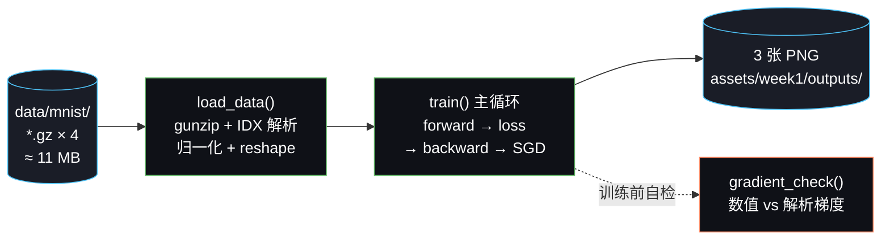
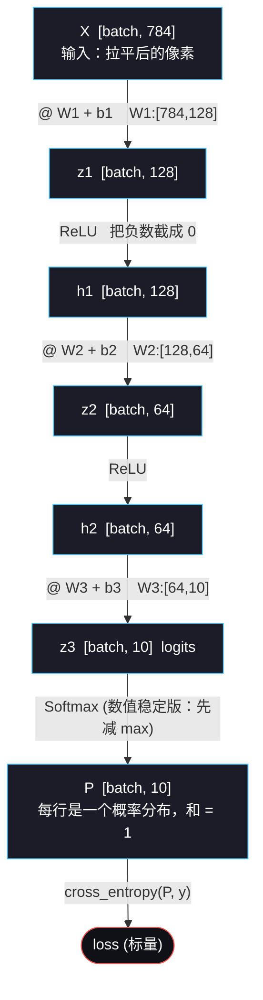
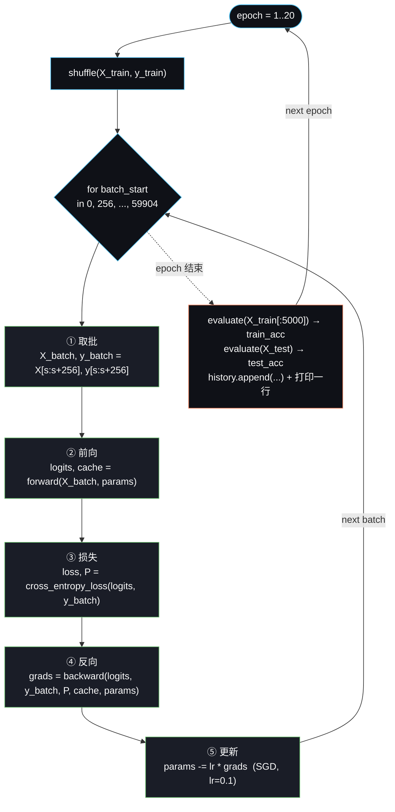
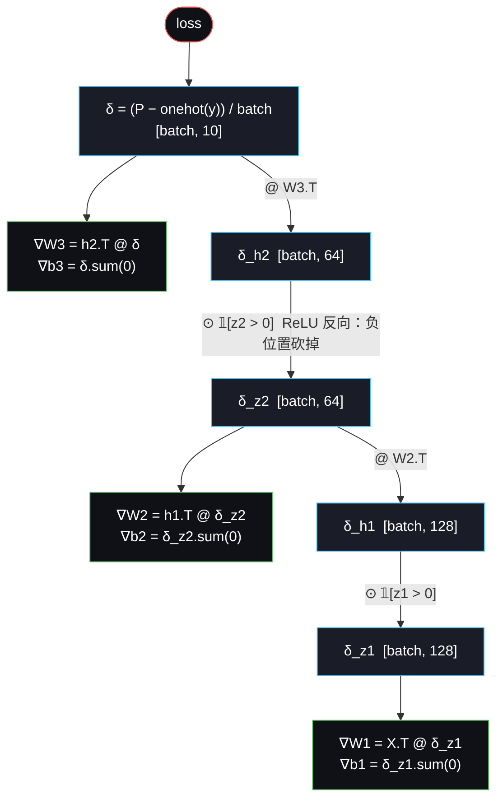

# Week 1 T8：代码实现走读

> 前面 01~07 是"为什么这么算"的推导，这份文档讲"代码本身在干什么"。
> 对应文件：`code/week1/mlp_numpy.py`。

---

## 0. 全局俯视图

整套代码可以看成一条单向的数据流水线，从磁盘上的二进制 IDX 文件出发，最后输出 3 张 PNG：



10 个章节标号（`# 1.` ~ `# 10.`）在源码里就是按这条流水线从上到下排的，对照着读最省力。

---

## 1. 数据集是怎么来的

### 1.1 MNIST 是什么

MNIST 是 Yann LeCun 在 1998 年整理的手写数字数据集，结构非常简单：

| 项 | 值 |
|---|---|
| 类别 | 0–9 共 10 类 |
| 训练集 | 60,000 张 |
| 测试集 | 10,000 张 |
| 图像大小 | 28 × 28 灰度 |
| 像素范围 | 0–255（uint8） |
| 文件格式 | IDX（自定义二进制，不是 PNG） |

它在课堂里被用了二十多年的原因：体量小（压缩后约 11 MB），任务定义清楚，一台笔记本也能在几分钟内训练完，非常适合用来验证"我手写的网络到底对不对"。

### 1.2 文件从哪里下载

代码里硬编码了 4 个 URL，指向 Google 托管的 CVDF 镜像：

```python
URLS = {
    'train_images': '.../train-images-idx3-ubyte.gz',
    'train_labels': '.../train-labels-idx1-ubyte.gz',
    'test_images':  '.../t10k-images-idx3-ubyte.gz',
    'test_labels':  '.../t10k-labels-idx1-ubyte.gz',
}
```

之所以不用 `yann.lecun.com` 原始链接，是因为那个域名近年经常 503，而 `storage.googleapis.com/cvdf-datasets/mnist/` 是社区维护的稳定镜像。

下载逻辑在 `download_mnist()`：

- 目标目录是 `data/mnist/`（相对项目根，不是相对脚本所在目录）。
- 用 `os.path.exists` 做幂等：文件存在就跳过，不重复下载。
- 用标准库 `urllib.request.urlretrieve`，没有引入额外依赖。

仓库里这 4 个 `.gz` 已经提交进了 `data/mnist/`，所以默认情况下根本不会触发网络请求；删掉这些文件后再跑，才会走下载分支。

### 1.3 IDX 格式怎么解析

IDX 文件头很短：

| 字节偏移 | 长度 | 含义 |
|---|---|---|
| 0–3 | 4 | magic number（区分图像/标签、数据类型） |
| 4–7 | 4 | 样本数 N |
| 8–11 | 4 | 高 H（仅图像文件） |
| 12–15 | 4 | 宽 W（仅图像文件） |
| 16– | … | N×H×W 个 uint8 像素 |

标签文件没有 H/W，只有 magic + N，header 共 8 字节。代码里相应地：

```python
# 图像
_, n, h, w = struct.unpack('>4I', f.read(16))   # '>4I' = 大端 4 个 unsigned int
data = np.frombuffer(f.read(), dtype=np.uint8)
return data.reshape(n, h * w).astype(np.float32) / 255.0

# 标签
f.read(8)                                       # 跳过头
data = np.frombuffer(f.read(), dtype=np.uint8)
```

两个细节：

1. **归一化到 `[0, 1]`**：除以 255 把 uint8 变成 float32。这一步对训练稳定性影响很大——如果直接喂 0–255，第一层的 `z = X @ W + b` 会非常大，ReLU 的输入分布偏移、梯度爆。
2. **拉平成 784 维向量**：`reshape(n, h * w)` 把 28×28 二维像素压成一维。MLP 看不到空间结构，这正是 Week 2 引入卷积要解决的问题。

### 1.4 IDX 文件解压后为什么打不开

把 `train-images-idx3-ubyte.gz` 用 `gunzip` 解压，得到一个**没有后缀的二进制文件** `train-images-idx3-ubyte`，约 47 MB。双击打不开、文本编辑器看是乱码，是因为它**不是 PNG/JPG**，而是 LeCun 1998 年自己定的 IDX 格式：60000 张图按字节流首尾拼在一起，前面只有 16 字节 header。

结构（训练图，每张 28×28 = 784 字节）：

```
偏移      内容
0x0000    00 00 08 03         ← magic number（标记"图像 / uint8"）
0x0004    00 00 EA 60         ← 样本数 = 60000
0x0008    00 00 00 1C         ← 高 = 28
0x000C    00 00 00 1C         ← 宽 = 28
0x0010    XX XX XX ...        ← 第 1 张图的 784 字节像素（行优先）
0x0320    XX XX XX ...        ← 第 2 张图的 784 字节像素
...
```

为什么 1998 年要这么存：60000 个 PNG 单文件读起来非常慢（每张都要 open/close/解码），而 IDX 整个文件可以被 `np.frombuffer` 一次性读进内存、零拷贝直接 reshape，是当时最省空间也最快的方案。

如果想把它"看成图片"自己确认数据没坏，临时跑一段脚本就行，不需要改项目代码：

```python
import numpy as np, gzip, struct
from PIL import Image

with gzip.open('data/mnist/train-images-idx3-ubyte.gz', 'rb') as f:
    _, n, h, w = struct.unpack('>4I', f.read(16))
    imgs = np.frombuffer(f.read(), dtype=np.uint8).reshape(n, h, w)

Image.fromarray(imgs[0]).save('/tmp/mnist_0.png')           # 第 0 张
Image.fromarray(np.hstack(imgs[:10])).save('/tmp/mnist_row.png')  # 横向拼前 10 张
```

或者完全不写代码，直接看训练脚本生成的 `assets/week1/outputs/predictions.png`——那张图就是从这份 IDX 里抠出 20 张用 matplotlib 渲染的标准 PNG，能直接双击查看。

---

## 2. 训练流程

### 2.1 网络结构

前向通路（节点旁的方括号是张量 shape，箭头上是这一步做的运算）：



参数总量：

```
W1: 784·128 = 100352      b1: 128
W2: 128·64  =   8192      b2: 64
W3:  64·10  =    640      b3: 10
合计 ≈ 109,386 个浮点数
```

接近 11 万参数训练 6 万张图，参数比样本还多——典型的过参数化场景，但 MNIST 简单到不会过拟合到无法泛化。

### 2.2 初始化：He init

```python
W ~ N(0, sqrt(2 / n_in))
b = 0
```

为什么是 `sqrt(2/n_in)` 而不是 Xavier 的 `sqrt(1/n_in)`？因为 ReLU 会把一半神经元的输出截成 0，方差等效砍掉一半，所以需要把权重方差再乘 2 才能让前向激活的方差在每层之间近似守恒。这一段的推导对应 `docs/week1/05_mlp.md`。

### 2.3 一次训练迭代做了什么

`train()` 循环里，每个 mini-batch 走完整的 5 步：

1. **取批**：`X_batch = X_train[start:start+256]`，每批 256 张。
2. **前向**：`forward()` 返回 logits 和 `cache`。`cache` 缓存了 `X, z1, h1, z2, h2, z3`，反向时直接复用，避免再算一次 forward。
3. **算损失**：`cross_entropy_loss()` 内部再做一次 softmax 拿到概率 `P`，loss 取每个样本真实类概率的负对数均值。`+ 1e-12` 是防止 `log(0)`。
4. **反向**：`backward()` 严格按 `06_backpropagation.md` §8 的公式手推：
   - `δ = P − one_hot(y)`，再除以 batch
   - `grad_W3 = h2.T @ δ`，`grad_b3 = δ.sum(axis=0)`
   - 往前传：`δ_h2 = δ @ W3.T`，过 ReLU 用 `* 𝟙[z2 > 0]` 屏蔽掉负位置
   - 同样逻辑算 `grad_W2, grad_b2, grad_W1, grad_b1`
5. **更新**：`W ← W − lr · ∇W`，纯 SGD，没有 momentum / Adam。

整个循环结构看一眼就懂：



反向传播这条"梯度反向流"画成图就是：每往前一层都做两件事，**算这一层参数的梯度** + **把误差传给前一层**，遇到 ReLU 用 `𝟙[z>0]` 这个 0/1 掩码屏蔽掉负位置：



这张图和 2.1 的前向图是镜像关系：前向沿着箭头算激活，反向沿着箭头算梯度，每一层产生两个分支——一支算自己的参数梯度，一支继续往前传。

### 2.4 超参数

```python
layer_sizes = (784, 128, 64, 10)
lr          = 0.1
batch_size  = 256
epochs      = 20
```

- `lr=0.1` 在 He init + 归一化输入下是稳定的；调到 1.0 会立刻发散。
- `batch_size=256` 是性能/精度的折中：更大的批 numpy 矩阵乘法更快，更小的批梯度更"嘈杂"。
- `epochs=20` 对 MNIST 已经收敛，再训练边际收益很小。

### 2.5 梯度检验：训练前的自检

`gradient_check()` 是这份代码的"测试套件"。它的逻辑：

```
对 W3 的某个元素 W3[i,j]：
    f+ = loss(W3[i,j] + eps)
    f- = loss(W3[i,j] - eps)
    数值梯度 ≈ (f+ - f-) / (2·eps)
对比解析梯度 grads['W3'][i,j]
要求相对误差 < 1e-4
```

只检查 W3 的前 5 个元素，不是因为别的位置不重要，而是有限差分要做 2 次 forward 才能估一个数，全检会非常慢；W3 通过梯度链路最短，最容易暴露 backward 推导错误，作为采样点足够。

**项目没有 pytest、没有 CI，这一段就是 ground truth**：改动 `forward / backward / cross_entropy_loss` 后，跑一遍主程序看到 5 行 `✓` 才算没破坏数学。

### 2.6 可视化

训练结束后画 3 张图（统一 `#0f1117 / #1a1d27` 暗色调）：

| 图 | 含义 |
|---|---|
| `training_curve.png` | 左：loss 下降曲线；右：训练/测试准确率曲线，看是否过拟合 |
| `predictions.png` | 拿测试集前 20 张做预测，绿色=对、红色=错，肉眼看模型在哪种数字上失败 |
| `weights_layer1.png` | `W1` 的前 64 列各 reshape 成 28×28——这就是第一层每个神经元学到的"模板"，看上去像一堆模糊的笔画检测器 |

输出目录是 `assets/week1/outputs/`（与文档插图 `assets/week1/figures/` 分开）。

---

## 3. 这套代码能做到什么

- **MNIST 测试准确率约 97%**：默认参数 20 epoch，单线程 CPU 大约几十秒到 1–2 分钟跑完，结果稳定。
- **完全不依赖深度学习框架**：除了 numpy 做矩阵乘、matplotlib 画图，没有 torch、没有 sklearn、没有 autograd。每一步梯度都是手写的。
- **数学和代码一一对应**：`backward()` 里 8 个 step 的注释直接对应 `06_backpropagation.md` 的 8 行公式，可以左右对读。
- **改动安全**：动了任何一处反向传播相关的代码，跑一次 `gradient_check` 就能立即知道有没有推错。
- **可视化能直接看见学到了什么**：`weights_layer1.png` 让"神经元学到模板"这个抽象说法变成可以肉眼验证的事实。

---

## 4. 一次完整运行的输出怎么读

下面用一次真实运行（macOS / conda env `cnn`）的输出做样本，把控制台里出现的每一段都解释清楚。

### 4.1 一上来的一大坨 RuntimeWarning

```
RuntimeWarning: divide by zero encountered in matmul
RuntimeWarning: overflow encountered in matmul
RuntimeWarning: invalid value encountered in matmul
  z1 = X @ params['W1'] + params['b1']
  ...
```

**这是 macOS 上 NumPy + Accelerate (vecLib) BLAS 的已知误报，不是 bug**。判定证据三条：

1. 只在第一次调 matmul 时刷一遍，训练循环里再没出现过——真有 NaN/Inf 的话每个 batch 都会刷。
2. 紧接着的梯度检验五行全是 ✓，相对误差 1e-10 量级——若结果真损坏，数值梯度对不上解析梯度。
3. 训练 loss 从 0.55 平滑下降到 0.0466，准确率单调上升——发散的网络做不到这种曲线。

原理：Apple Accelerate 的 BLAS 在做矩阵乘的 SIMD 边角处理时会读到一些未初始化的浮点位，触发硬件 FPE 标志位；NumPy 看到标志就报警，但实际写进结果数组的数值是对的。Conda 装的 numpy 在 Apple Silicon 上经常碰到这一类。

想消掉它，二选一：

```python
# A. 脚本顶部一行屏蔽（最简单）
np.seterr(divide='ignore', over='ignore', invalid='ignore')

# B. 换 BLAS 后端（根治，顺便让 matmul 性能更稳）
conda install -c conda-forge "libblas=*=*openblas"
```

### 4.2 梯度检验：体检通过

```
        元素 |     解析梯度 |     数值梯度 |   相对误差
W3(0, 0)   |   0.03000606 |   0.03000606 |   1.39e-10 ✓
W3(1, 0)   |   0.00365303 |   0.00365303 |   1.69e-09 ✓
W3(2, 0)   |  -0.01546679 |  -0.01546679 |   2.26e-10 ✓
W3(3, 0)   |  -0.02444412 |  -0.02444412 |   3.89e-10 ✓
W3(4, 0)   |   0.00683283 |   0.00683283 |   2.54e-10 ✓
```

- **左列**：`backward()` 手推出来的解析梯度。
- **中列**：有限差分 `(loss(W+ε) − loss(W−ε)) / (2ε)` 算出来的数值梯度。
- **右列**：相对误差，阈值是 `1e-4`，这里是 `1e-9 ~ 1e-10`，**比阈值好五个数量级**。

含义：`forward / backward / cross_entropy_loss` 这套数学跟教科书公式一字不差。后面所有训练结果都建立在这条体检通过的基础上。

### 4.3 训练曲线读法

```
Epoch  1/20 | Loss: 0.5502 | Train: 90.8% | Test: 91.5%
Epoch  5/20 | Loss: 0.1535 | Train: 94.3% | Test: 94.0%
Epoch 10/20 | Loss: 0.0917 | Train: 97.2% | Test: 96.6%
Epoch 15/20 | Loss: 0.0636 | Train: 98.3% | Test: 96.9%
Epoch 20/20 | Loss: 0.0466 | Train: 98.7% | Test: 97.5%
```

| 阶段 | 看什么 | 这次跑的现象 |
|---|---|---|
| Epoch 1 | 起手 loss 是否合理 | 0.55，第一轮就 90%+ — He init + 输入归一化共同发力 |
| Epoch 1–5 | 是否平滑下降 | 从 0.55 → 0.15，无锯齿 — `lr=0.1` 选得合适 |
| Epoch 5–15 | train/test 是否拉开 gap | gap 从 0.3% 涨到 1.4% — 进入"轻微过拟合"的健康区 |
| Epoch 15–20 | 测试集是否还在涨 | 96.9% → 97.5% 缓涨 — 接近收敛，再训边际收益很小 |
| 最终 | 收敛到哪 | **97.53% 测试准确率**，与 README 的"约 97%"对得上 |

几个会让人困惑的点：

- **Epoch 1 测试集（91.5%）反而比训练集（90.8%）高**：不是数据泄漏。`evaluate()` 里 train_acc 只用了打乱后的前 5000 个样本估算（`evaluate(X_train[:5000], …)`），是个有方差的估计，前期波动大；测试集用的是完整 1 万张，估计更稳。
- **Train-Test gap 只有 1.2%**：对 11 万参数训 6 万样本的网络来说很小，说明 MNIST 简单到不需要正则化。换 CIFAR-10 这个 gap 会立刻拉到 10%+。
- **Loss 一直在降，准确率在 epoch 13 之后却横盘**：因为准确率只看 argmax 是否正确，loss 还能继续把"对的那个类"的概率往 1 推、把别的类往 0 推，所以 loss 还能降但准确率不再提升——这是分类任务的常态。

### 4.4 三条 `FigureCanvasAgg is non-interactive`

```
UserWarning: FigureCanvasAgg is non-interactive, and thus cannot be shown
  plt.show()
```

也不是 bug。原因：

- README 让你设了 `MPLBACKEND=Agg`（headless 后端，能存文件不能弹窗）
- 但代码里每个 `plot_*()` 末尾都调了 `plt.show()`
- Agg 后端遇到 `plt.show()` 不会报错也不会做事，只是温柔提醒一句"我没法显示给你看"

三张图实际上都已经成功存到 `assets/week1/outputs/`，文件名分别是 `training_curve.png / predictions.png / weights_layer1.png`。想消掉警告，把 `plt.show()` 换成 `plt.close()` 即可（保存完关掉 figure，顺便释放内存）。

### 4.5 一句话结论

体检过了 → 训练平滑收敛 → 测试 97.53% → 三张图也存好了。两类 warning 都是环境噪音，不影响正确性。

---

## 5. 局限和已知问题

刻意保留的局限（Week 1 不打算解决，留给后面几周）：

1. **没有卷积，看不到空间结构**。MLP 把图像拉平，平移一下数字位置准确率就崩——这正是 Week 2 引入 `conv2d` 要解决的问题。
2. **优化器只有 SGD**。没有 momentum、没有 Adam、没有 lr schedule。换更难的数据集（CIFAR-10）这套就训不动了。
3. **没有正则化**。没有 weight decay、没有 dropout、没有 early stopping。MNIST 简单到不需要，但写法不能直接套到更大的网络上。
4. **数据增强为零**。没有翻转、平移、旋转，模型对未见过的位移基本没鲁棒性。
5. **评估很粗**：只看准确率，没有混淆矩阵、precision/recall、按类别拆分的错误分析。
6. **没有 train / val 划分**：直接拿测试集当验证集监控，超参数选择会有数据泄漏。教学场景下能接受，工业场景里是错的。

工程层面的小问题：

7. **`load_images` 在 reshape 前没校验文件长度**。如果下载中途被截断，会得到一个 shape 对不上的数组并抛 `ValueError`，但错误信息不会指明是数据损坏。
8. **`gradient_check` 只检查 W3**。理论上 W1 一旦推错，前向也会跟着错从而让数值梯度也算错——但漏检 b1/b2/b3 这些偏置项是真的盲区。
9. **`train()` 里 `X_train, y_train = X_train[idx], y_train[idx]` 会原地覆盖外层变量**。如果之后想在训练后再用原始顺序的训练集做别的事，顺序已经被打乱了。当前主程序没有这种用法所以没踩坑。
10. **`plot_*()` 都调了 `plt.show()`**。在 `MPLBACKEND=Agg` 下是 no-op，但如果有人把后端换成交互式后端（比如 `MacOSX`），脚本会在每张图上停下来等关窗，必须按文档里那两个环境变量跑。
11. **随机种子只控制了 `init_params`**。`np.random.permutation` 在 `train()` 里没设种子，所以"完全相同的运行"严格说做不到——loss 曲线每次会有微小差别。
12. **没有保存模型权重**。训完一次就扔，下次想复用只能重训。

这些都不是"必须现在修"的 bug，是 Week 2/3 引入更现实的训练流程时自然会一一解决的点。
