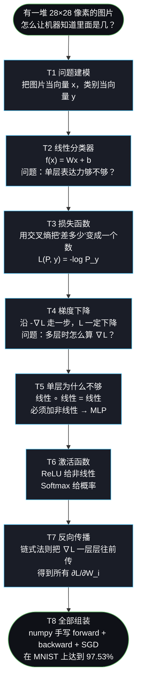
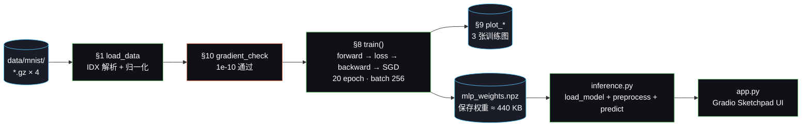

# Week 1 总结：从「图像分类是什么问题」到「能识别我手写的数字」

> 汇报性总结。把第一周的全部学习（T1–T7 理论推导）和实践（T8 代码 + 拓展 demo）串成一条完整链路。

---

## 一句话总结

**用纯 NumPy 从零手写并训练一个 MLP，在 MNIST 上达到 97.53% 测试准确率，并接到一个 Gradio 画板上让它实时识别我自己手写的数字。整个过程没有用任何深度学习框架，每一行梯度公式都是手推的。**

---

## 关键数字一览

| 维度 | 指标 |
|---|---|
| 任务完成度 | T1–T8 全部完成（8/8）+ 1 个拓展 demo |
| 测试准确率 | **97.53%**（MNIST 测试集 10000 张） |
| 模型规模 | 网络 `784→128→64→10`，参数总量 **109,386** |
| 训练设置 | 20 epoch · batch=256 · lr=0.1 · He init · pure SGD |
| 梯度检验 | 解析 vs 数值梯度相对误差 **1e-9 ~ 1e-10**（阈值 1e-4） |
| 代码 | 3 个文件 / **710 行**（mlp_numpy 414 + inference 180 + app 116） |
| 文档 | 10 篇 / **5.2 万字符**（理论推导 + 代码走读 + demo 说明） |
| 依赖 | numpy + matplotlib + pillow + gradio，**零深度学习框架** |

---

## 1. 任务进度

| 编号 | 任务 | 学习产物 | 实现产物 | 状态 |
|---|---|---|---|---|
| T1 | 问题建模：图像分类是什么问题 | `01_problem_modeling.md` | — | ✅ |
| T2 | 最简单的模型：线性分类器 | `02_linear_classifier.md` | — | ✅ |
| T3 | 损失函数：交叉熵 | `03_loss_function.md` | `cross_entropy_loss()` | ✅ |
| T4 | 梯度下降的几何意义 | `04_gradient_descent.md` | `update_params()` | ✅ |
| T5 | 单层为什么不够 → MLP | `05_mlp.md` §1–4 | `init_params()`, `forward()` | ✅ |
| T6 | 激活函数：ReLU / Softmax | `05_mlp.md` §5–7 | `relu()`, `softmax()` | ✅ |
| T7 | 反向传播：链式法则的计算图 | `06_backpropagation.md` | `backward()` | ✅ |
| T8 | 动手：numpy MLP 跑 MNIST | `08_code_walkthrough.md` | `mlp_numpy.py` 全文件 | ✅ |
| 拓展 | 手绘数字识别 demo | `09_handwriting_demo.md` | `inference.py` + `app.py` | ✅ |

---

## 2. 学习链路：从问题出发，一步步推导出反向传播

每个任务都从"上一步留下的问题"出发，所有推导环环相扣：



**学习方法的核心**：每节先问"上一节留下了什么问题"，再回答"这一节要解决的是什么"，最后才推数学公式。所以哪怕只看目录也能复述出整条因果链——这是这套笔记的可复用价值。

---

## 3. 实现链路：从公式到 97.53% 的训练管线

代码组织严格对应 10 个章节，从磁盘到 PNG 的单向流水线：



---

## 4. 学习 ↔ 代码 对照表（核心）

每一条数学推导都对应代码里一行可执行的实现，并且都能被自动验证：

| 概念 | 数学公式 | 理论 doc | 代码位置 | 验证方式 |
|---|---|---|---|---|
| Softmax（数值稳定） | $P_i = \dfrac{e^{z_i - \max z}}{\sum_j e^{z_j - \max z}}$ | 05 §6 | `mlp_numpy.py:74` `softmax()` | 训练 loss 不溢出 |
| ReLU + 导数 | $\sigma(z)=\max(0,z)$，$\sigma'(z)=\mathbb 1[z>0]$ | 05 §5 | `mlp_numpy.py:67-72` | gradient_check |
| He 初始化 | $W \sim \mathcal N(0,\sqrt{2/n_{in}})$ | 05 §8 | `mlp_numpy.py:84-96` `init_params()` | epoch 1 就 90%+ |
| 前向 | $z=Wx+b,\ h=\sigma(z)$ | 05 §3 | `mlp_numpy.py:102-124` `forward()` | shape 标注 |
| 交叉熵 | $\mathcal L=-\dfrac1N\sum_i \log P_{y_i}$ | 03 全文 | `mlp_numpy.py:130-141` | gradient_check |
| Softmax+CE 梯度 | $\delta=(P-\hat y)/N$ | 06 §6 | `mlp_numpy.py:155-157` | gradient_check |
| 输出层梯度 | $\nabla W_3=h_2^\top\delta,\ \nabla b_3=\sum\delta$ | 06 §8①② | `mlp_numpy.py:160-161` | gradient_check |
| 误差反传 | $\delta_{h_2}=\delta\,W_3^\top$ | 06 §8③ | `mlp_numpy.py:164` | gradient_check |
| 过 ReLU 反向 | $\delta_{z_2}=\delta_{h_2}\odot\mathbb 1[z_2>0]$ | 06 §8④ | `mlp_numpy.py:167` | gradient_check |
| SGD | $W\leftarrow W-\eta\nabla W$ | 04 全文 | `mlp_numpy.py:189-193` | loss 单调下降 |

**这张对照表就是"学习"和"实践"的桥梁**：每行公式都不是抽象的符号，是代码里 1 行可执行的 numpy 操作；每行代码也不是孤立的实现，是教科书上一段推导的落地。改任何一边，另一边都要同步——这正是 `gradient_check` 作为事实测试套件的价值（相对误差 1e-10，比要求阈值 1e-4 好 5 个数量级）。

---

## 5. 实践成果

### 5.1 训练曲线（`assets/week1/outputs/training_curve.png`）

| Epoch | Loss | Train Acc | Test Acc | 解读 |
|---|---|---|---|---|
| 1 | 0.5502 | 90.8% | 91.5% | He init + 归一化输入起手就 90%+ |
| 5 | 0.1535 | 94.3% | 94.0% | 平滑下降，无锯齿 → lr=0.1 选得对 |
| 10 | 0.0917 | 97.2% | 96.6% | 训练/测试同步上升，进入精修期 |
| 15 | 0.0636 | 98.3% | 96.9% | gap 拉到 1.4%，轻微过拟合但很健康 |
| 20 | **0.0466** | **98.7%** | **97.5%** | 收敛，再训边际收益≈0 |

### 5.2 第一层权重可视化（`assets/week1/outputs/weights_layer1.png`）

把 `W1` 的 64 列各 reshape 成 28×28，肉眼可见学到了"模糊的笔画 / 方向边缘"——把"神经元学到模板"这个抽象说法变成可以验证的事实。

### 5.3 手绘 demo（`code/week1/app.py`）

Gradio Sketchpad UI，3 列布局：

- **左**：白底画板，黑色笔刷，280×280 画布
- **中**：模型实际"看到"的 28×28 灰度预览（经反色 + bbox + 等比缩放 + 重心居中）
- **右**：10 类概率分布 + 预测数字 + 置信度

**关键学习收获**：训练集准确率 97.5%，自己手绘准确率往往只有 50–80%。**不是模型差，是训练分布 ≠ 推理分布**。预处理（自动反色、按笔画 bbox 裁剪、按重心而不是 bbox 中心居中）写对了能从 50% 拉回 90%+——这就是"模型只是冰山一角，预处理才是水面下 90%"那句话的来源。

---

## 6. 交付物清单

```
CNN-Learn/
├── code/week1/
│   ├── mlp_numpy.py          414 行  纯 numpy MLP + 训练 + grad check + 可视化
│   ├── inference.py          180 行  权重加载 + LeCun 五步预处理 + predict
│   └── app.py                116 行  Gradio UI + 空图检测 + 清空按钮
├── docs/week1/                       共 10 篇 / 5.2 万字符 / 2042 行
│   ├── 00_tasks.md                   任务总规划
│   ├── 01–06_*.md                    T1–T7 理论推导
│   ├── 07_thinking_log.md            学习过程中的关键思考
│   ├── 08_code_walkthrough.md        代码实现走读 + 4 张架构流程图 + 输出解析
│   ├── 09_handwriting_demo.md        预处理细节 + 已知坑 + demo 暴露的局限
│   └── 10_week1_summary.md           本文（汇报总结）
└── assets/week1/outputs/
    ├── training_curve.png            训练 loss + 准确率曲线
    ├── predictions.png               测试集前 20 张预测可视化
    ├── weights_layer1.png            第一层 64 个神经元学到的模板
    └── mlp_weights.npz       440 KB  训好的权重（供 demo 加载）
```

---

## 7. 七条核心 takeaway

1. **f → L → ∇L 是深度学习的全部脚手架**。所有论文、tricks、新结构都只在改三件事中的一件。
2. **多层线性 = 一层线性，所以必须加非线性激活**。ReLU 不是某个聪明的发明，是"线性堆叠等于线性"这个数学事实逼出来的解药。
3. **梯度下降的几何很简单：沿 -∇L 走一步**。难的不是这一步，是怎么对一个深层复合函数算出 ∇L —— 那是反向传播解决的。
4. **反向传播 = 链式法则 + 缓存中间变量**。`forward()` 在每层把 `z, h` 存进 `cache`，`backward()` 一层层往前乘 jacobian，缓存让反向只多一倍 forward 的计算量。
5. **梯度检验是手写网络的事实测试套件**。没有 pytest 不要紧，相对误差 < 1e-4 就保证数学没错。改了 forward/backward 必跑。
6. **He 初始化、归一化输入、合适的 lr 三件事互相绑定**。少任何一件训练曲线都会立刻不一样；它们不是 trick，是让方差在层与层之间守恒的必需品。
7. **训练分布决定推理上限**。在 MNIST 上 97.5% 不代表手绘画板上能 97.5%——预处理、数据增强、归纳偏置（CNN 的平移不变性）才是把训练分布扩大到真实分布的桥梁。

---

## 8. 已知局限与 Week 2 衔接

第 1 周刻意保留的局限，每一条都对应后续某一周的目标：

| 局限 | 现状 | 对应解决方案（后续周） |
|---|---|---|
| MLP 把图像拉平，看不到空间结构 | 平移一下数字识别率就崩 | **Week 2：Conv2d / MaxPool（手写）+ LeNet (PyTorch)** |
| 优化器只有 SGD | CIFAR-10 这套训不动 | Week 2/3：momentum / Adam / lr schedule |
| 没有正则化 | MNIST 太简单暂时不需要 | Week 3：weight decay / dropout |
| 数据增强为零 | 自己手绘准确率明显下降 | Week 2：torchvision.transforms |
| 评估只有准确率 | 没有混淆矩阵、按类错误分析 | Week 4 capstone |
| 没有 train/val 划分 | 用测试集当验证集，有数据泄漏 | Week 3 |

**Week 2 第一个目标**：在 `code/week2/` 用同样的"手写 numpy + 梯度检验"风格实现 `conv2d_numpy.py` 和 `maxpool_numpy.py`，理解卷积的平移不变性。然后再用 PyTorch 写 `lenet_pytorch.py`，体验"框架做了哪些事，让你不用再写 backward"。

---

## 附录 A：复现全部结果的命令

```bash
# 1. 环境（已有 conda env 'cnn'）
conda activate cnn
python -m pip install -r requirements.txt

# 2. 训练（约 1 分钟）：会自动下载 MNIST、跑梯度检验、训练、保存权重和 3 张图
MPLCONFIGDIR=/tmp/mplconfig MPLBACKEND=Agg python code/week1/mlp_numpy.py
# 期望输出末尾：最终测试准确率: 97.53%

# 3. 推理自检：用测试集第 0 张验证 inference 链路
python code/week1/inference.py
# 期望输出末尾：✓ inference 链路 OK

# 4. 启动手绘 demo
python code/week1/app.py
# 浏览器访问控制台打印的 http://127.0.0.1:7860
```

---

## 附录 B：环境注意事项

| 注意点 | 说明 | 出处 |
|---|---|---|
| `python -m pip` | 不要直接 `pip install`，避免装到系统 Python | README |
| `MPLCONFIGDIR=/tmp/mplconfig` | matplotlib 默认缓存目录在本机不可写 | CLAUDE.md |
| `MPLBACKEND=Agg` | 非交互后端，避免 `plt.show()` 阻塞 | CLAUDE.md |
| `np.seterr(...='ignore')` | 屏蔽 macOS Accelerate BLAS 的 FPE 误报 | 08_code_walkthrough §4.1 |
| `os.environ.pop('http_proxy')` | 系统设了 Clash/V2Ray 时绕过代理对 localhost 的拦截 | 09_handwriting_demo §6.1 |
