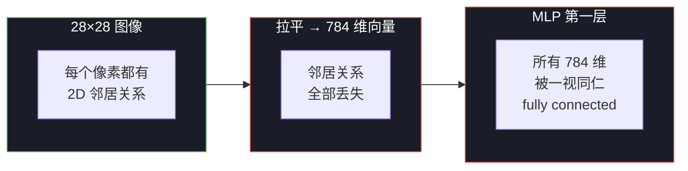
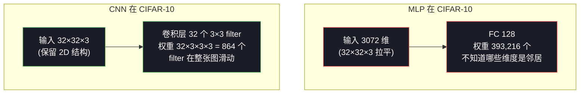

# T1：为什么需要卷积

## 0. 上一节留下的问题

Week 1 的 MLP 在 MNIST 上达到了 97.53%，看起来挺好。但有两件事我们刻意没碰：

1. **换数据集会怎样？** MNIST 是 28×28 灰度、数字按重心居中的"实验室数据"。真实图像是 RGB、分辨率几百几千、目标位置不固定。MLP 撑得住吗？
2. **手绘 demo 暴露了什么？** 在 `09_handwriting_demo.md §7` 已经看到：稍微动一下数字位置、笔画粗细、风格，准确率就掉。说明 MLP 对**位置变化**几乎没有鲁棒性。

这两件事都指向同一个根因：**MLP 把图像当一维向量处理，丢掉了"图像"这个数据本身的两个核心结构**。这一节就要把这个根因讲透，然后说清卷积是怎么对症下药的。

---

## 1. 算笔账：MLP 在自然图像上为什么不可行

我们换到 Week 2 要用的数据集 **CIFAR-10**：

| 项 | MNIST（Week 1） | CIFAR-10（Week 2） | 真实场景（Week 4） |
|---|---|---|---|
| 图像大小 | 28 × 28 | 32 × 32 | 224 × 224（ImageNet） |
| 通道 | 1（灰度） | 3（RGB） | 3 |
| 拉平后维度 | **784** | **3072** | **150,528** |
| 类别数 | 10 | 10（其中 6 类是动物） | 1000 |

如果还坚持用 MLP，第一隐藏层 128 个神经元，参数量怎么算？

```
MNIST:    784 × 128 = 100,352      (Week 1 实测可行)
CIFAR-10: 3072 × 128 = 393,216     (4 倍于 MNIST)
ImageNet: 150,528 × 128 ≈ 1928 万  (单层 1928 万，太离谱)
```

如果第一层换成 512 个神经元（这其实是入门 CNN 都常用的宽度），ImageNet 一层就要 **7700 万参数**——比整个 ResNet-50 还大。这显然不可持续。

**第一个根因：MLP 的参数量和输入维度成正比，自然图像维度太大，参数会爆炸。**

---

## 2. 更深的问题：MLP 看不到"邻居"

参数量还不是最致命的。最致命的是：**MLP 对图像的 2D 结构一无所知**。

考虑一张 28×28 的数字图。`reshape(784)` 之后变成一个一维向量 $[x_1, x_2, \ldots, x_{784}]$。问题是：

- 像素 $x_5$ 和 $x_6$ 是同一行的邻居（第 1 行第 5/6 列）
- 像素 $x_5$ 和 $x_{33}$ 是同一列的邻居（第 1/2 行第 5 列）
- 像素 $x_5$ 和 $x_{500}$ 离得很远

**MLP 不知道这件事**。在它眼里 $x_5, x_6, x_{33}, x_{500}$ 全是 784 个等价的输入维度，谁是谁的邻居完全要靠数据反复"教"它。



后果是：

- MLP 必须用大量数据**反复学习**"相邻像素相关"这件事
- 学到的也只是数据集上的近似规律，没有泛化保证
- 你**有现成的强先验**（图像的 2D 结构是确定的事实），白白扔掉

**第二个根因：MLP 没有空间结构的归纳偏置（inductive bias），学一件本来不需要学的事。**

---

## 3. 致命的问题：MLP 没有平移不变性

考虑同一只猫出现在图像不同位置：

```
   左上角的猫              右下角的猫
   ┌──────────┐          ┌──────────┐
   │ 🐱       │          │          │
   │          │          │          │
   │          │          │       🐱 │
   └──────────┘          └──────────┘
   像素 x_1..x_50         像素 x_700..x_750
   被强烈激活             被强烈激活
```

对人来说这都是猫。对 MLP 来说，**这是两个完全不同的输入向量**——猫的特征激活了完全不同的输入维度。

MLP 想识别两个位置都是猫，必须**两份独立学习**：

- 在 $x_1..x_{50}$ 这一带训练一套"识别猫"的权重
- 在 $x_{700}..x_{750}$ 这一带再训练一套同样的权重

**同一个概念被迫学两次（或几十次，每个可能位置一次）**。这既浪费参数，也浪费数据——你必须在数据集中提供"猫出现在所有位置"的样本，否则模型在没见过的位置上就识别不出。

这就是 Week 1 手绘 demo 中"画在画布不同位置准确率剧烈波动"的根本原因。

**第三个根因：MLP 没有平移不变性（translation invariance），同一个特征在不同位置要重复学习。**

---

## 4. CNN 是怎么对症下药的

把上面三个根因翻过来，就是卷积层的三个设计原则：

| MLP 的病根 | CNN 的解药 | 直觉 |
|---|---|---|
| 参数量随输入维度爆炸 | **局部连接**（local connectivity） | 一个神经元只看一个 k×k 的小窗口（叫感受野），不是整张图 |
| 不知道"邻居" | **2D 结构保留** | 输入和输出都保持 2D 形状，直接在二维平面上做运算 |
| 同一特征在不同位置要重学 | **权重共享**（weight sharing） | 同一个 filter（小卷积核）在整张图上**滑动**，到处都是同一组权重 |

举例感受三者结合的威力：

> 用一个 3×3 filter 处理 32×32 的 CIFAR-10 图。  
> **MLP** 第一层连一个像素到 128 个神经元：3072×128 = 39 万参数。  
> **CNN** 一个 3×3 filter 复用整张图：3×3 = 9 个参数。  
> 即使用 32 个不同 filter 提取 32 种特征：3×3×32 = 288 个参数。  
> **同样的"提特征"工作，CNN 用了千分之一的参数，并且天然有平移不变性。**



差距大到**不是优化，是范式切换**。

---

## 5. 这一节的结论

CNN 不是"比 MLP 多几层的高级网络"。它是**针对图像这种数据类型量身定做的归纳偏置**：

> **图像的局部性 + 平移不变性是事实，不是要让网络学的东西。把这两条事实直接编码进网络结构，就是卷积层。**

T2 开始，我们把这套直觉变成精确的数学：

- 卷积运算到底怎么算（互相关 vs 真正的卷积）
- 一个 3×3 filter 滑过 5×5 输入会得到什么
- 输出尺寸怎么算（padding / stride 怎么影响）
- 多通道、多滤波器怎么组织

下一节 → `02_convolution.md`
