# T2：卷积运算本身

## 0. 上一节留下的问题

T1 用三句话说清了 CNN 的设计原则——**局部连接 + 2D 结构 + 权重共享**。但"用一个小 filter 在图上滑动"是直觉，不是数学。这一节要回答四件具体的事：

1. "**滑动**"在每一步到底算了什么数？
2. **filter** 是什么形状的张量？里面的数字怎么解释？
3. 为什么深度学习里叫"卷积"，但实际算的不是数学意义上的卷积？这个区别要不要紧？
4. 一个 3×3 的 filter 到底能检测什么"特征"？这种说法有没有夸大？

为了把核心算法剥离出来，本节**只讨论单通道、单滤波器**的情况。多通道、多滤波器留给 T4。

---

## 1. 先在一维上建直觉

我们先把问题降到一维。给一个长度 7 的信号 $x$ 和一个长度 3 的 filter $w$：

$$x = [3, 1, 4, 1, 5, 9, 2],\qquad w = [1, 0, -1]$$

**1D 互相关**（cross-correlation）的算法是：把 $w$ 从左到右滑过 $x$，每一步对位相乘再加和。先看位置 0 的代数式：

$$y[0] = x[0]\cdot w[0] + x[1]\cdot w[1] + x[2]\cdot w[2] = 3\cdot 1 + 1\cdot 0 + 4\cdot(-1) = -1$$

把这一步推广，filter 在 $x$ 上一共能站到 5 个位置，每步算一个数。完整 5 步如下：

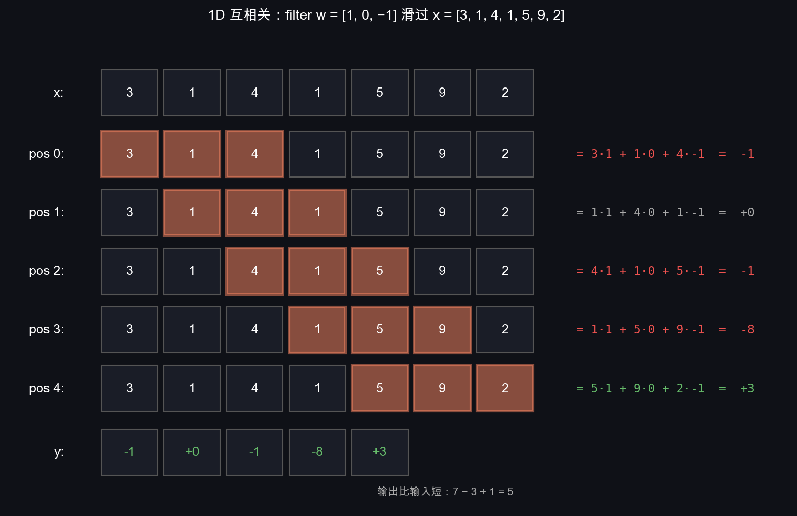

最终输出向量：

$$y = [\,-1,\ 0,\ -1,\ -8,\ +3\,]$$

观察两件事：

1. **输出比输入短**。输入长 7、filter 长 3，输出长 7 − 3 + 1 = 5。这就是 T3 要解决的"输出尺寸怎么算"。
2. **filter `[1, 0, -1]` 在做什么**？答案是**算"右−左"的差分**——它是一维的"边缘检测器"。当原信号有跳变时输出大；信号平稳时输出接近 0。

把这个直觉记牢——**filter 就是一组对位权重，整个卷积层做的就是"把这组权重拖着滑过整张图，每个位置算一个加权和"**。

---

## 2. 互相关 vs 真正的卷积

§1 那个"对位乘加"的算法严格说叫**互相关**（cross-correlation）。"卷积"（convolution）这个词在数学/信号处理里的定义其实多了一步：**把 filter 先翻转再滑动**。

### 2.1 用 §1 的同一个例子直接对比

继续用 $x = [3, 1, 4, 1, 5, 9, 2]$ 和 $w = [1, 0, -1]$。两种算法的位置 0 对比：

$$\begin{aligned}
\text{互相关}\quad y_{\text{corr}}[0] &= 3\cdot 1 + 1\cdot 0 + 4\cdot(-1) &&= -1 \\
\text{真正卷积}\quad y_{\text{conv}}[0] &= 3\cdot(-1) + 1\cdot 0 + 4\cdot 1 &&= +1
\end{aligned}$$

唯一区别：真正卷积**先把 filter 左右翻转**（$[1,0,-1]\to[-1,0,1]$）再做对位乘加。把 5 个位置都算一遍：

$$\begin{aligned}
y_{\text{corr}} &= [\,-1,\ \phantom{+}0,\ -1,\ -8,\ +3\,] \\
y_{\text{conv}} &= [\,+1,\ \phantom{+}0,\ +1,\ +8,\ -3\,]
\end{aligned}$$

每一位互为相反数。可视化对比：

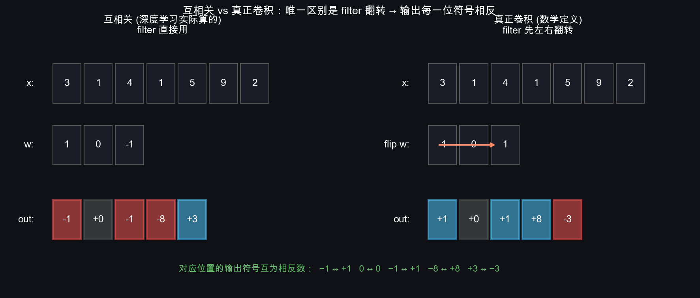

**两个输出符号正好相反**——左侧每一位是负数，对面那一位就是正数；左侧是正，对面就是负——因为唯一区别就是 filter 被翻转了一次。

### 2.2 为什么深度学习不在乎这个区别

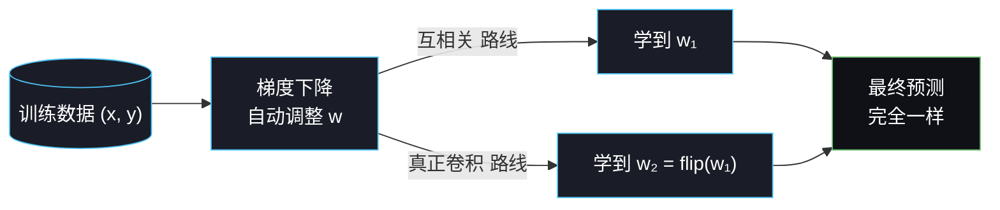

关键在于 $w$ **不是人手设计的，是网络学出来的**。如果你强行用真正卷积，网络只会自动把 $w$ 学成翻转版本，最终预测一模一样。**翻转那一步是多余的**，于是深度学习库直接省掉，把互相关称作"卷积"。

| 维度 | 卷积（数学）| 互相关（深度学习"卷积"） |
|---|---|---|
| filter 翻转 | **是** | **否** |
| 公式 | $\sum x[k] w[n-k]$ | $\sum x[n+k] w[k]$ |
| PyTorch / TF API | — | `nn.Conv2d`、`tf.nn.conv2d` |

> **本系列文档延续业界口径**：除非特别说明，"卷积"一词都指互相关。
>
> 但**反向传播推导时**（T6）翻转还是会冒出来——届时你会看到"前向用互相关，反向恰好对应真正的卷积"。这是个数学上的小巧合，到时候我们再细说。

---

## 3. 2D 互相关：完整算例

把一维推广到二维。**先看全局图，再走具体算例**。

### 3.0 总览：filter 的运动轨迹

一个 $3\times 3$ filter 在 $5\times 5$ 输入上滑动，**filter 的左上角**沿着 raster scan 路径走，一共 9 个位置，每个位置算一个数填到输出里：

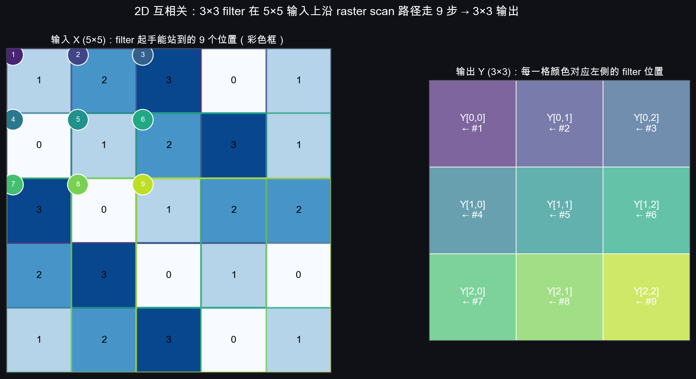

左侧 9 个彩色框是 filter 起手能站到的位置（编号 1–9），右侧 3×3 输出 $Y$ 用同色对应——颜色相同 = 同一次乘加产生的结果。

为什么起手位置是 0~2 行（不是 0~4）？因为 filter 高度是 3，**最下面一行索引 $i+2 \le 4$**（输入最大行索引）才不会伸出去——即 $i \in \{0, 1, 2\}$。

记住这条："filter 起手能站到的位置数 = 输出大小"——这就是 §6 那个尺寸公式的几何来源。

### 3.1 给定输入和 filter

$$X = \begin{bmatrix}
1 & 2 & 3 & 0 & 1 \\
0 & 1 & 2 & 3 & 1 \\
3 & 0 & 1 & 2 & 2 \\
2 & 3 & 0 & 1 & 0 \\
1 & 2 & 3 & 0 & 1
\end{bmatrix} \qquad
W = \begin{bmatrix}
1 & 0 & -1 \\
1 & 0 & -1 \\
1 & 0 & -1
\end{bmatrix}$$

这个 $W$ 叫 **Sobel 算子**的简化版，它检测**垂直边缘**（左亮右暗或反之）。

### 3.2 走前 3 步看清楚怎么算

算法：把 $W$ 从左上角开始，**逐行逐列**滑动，每一步把 $W$ 覆盖的 $3\times 3$ 子块和 $W$ 对位相乘再求和，结果填到输出 $Y$ 的对应位置。下面是前 3 步 + 完整 Y 的可视化：

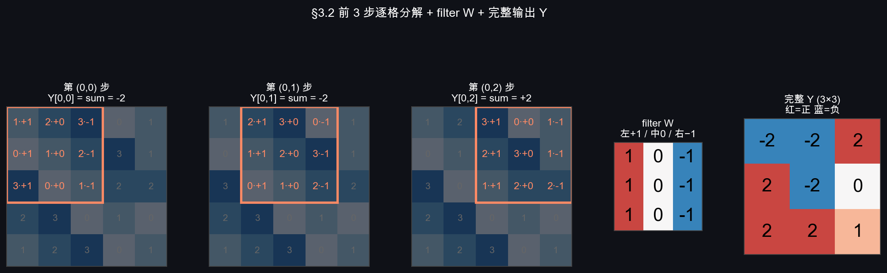

**第 (0, 0) 步**：$W$ 盖在 $X$ 的左上 3×3 子块上。代数式：

$$\underbrace{\begin{bmatrix}
\mathbf 1 & \mathbf 2 & \mathbf 3 \\
\mathbf 0 & \mathbf 1 & \mathbf 2 \\
\mathbf 3 & \mathbf 0 & \mathbf 1
\end{bmatrix}}_{X[0:3, 0:3]} \odot
\begin{bmatrix}
1 & 0 & -1 \\
1 & 0 & -1 \\
1 & 0 & -1
\end{bmatrix}
= \begin{bmatrix}
1 & 0 & -3 \\
0 & 0 & -2 \\
3 & 0 & -1
\end{bmatrix},\quad \text{sum} = 1+0-3+0+0-2+3+0-1 = -2$$

得到 $Y[0,0] = -2$。

**第 (0, 1) 步**：$W$ **整体右移一格**——注意 filter 覆盖的 3×3 区域和上一步**有 6 个像素是重叠的**（中间两列），只有最左一列退出、最右一列进入：

$$X[0:3, 1:4] \odot W = \begin{bmatrix}
2 & 0 & 0 \\
1 & 0 & -3 \\
0 & 0 & -2
\end{bmatrix},\quad \text{sum}=-2$$

**第 (0, 2) 步**：$W$ 再右移一格：

$$X[0:3, 2:5] \odot W = \begin{bmatrix}
3 & 0 & -1 \\
2 & 0 & -1 \\
1 & 0 & -2
\end{bmatrix},\quad \text{sum}=2$$

第 0 行右边没空间了（再右移一格 filter 就伸出输入了），回到最左、向下移一行，得到 $Y[1, 0]$。重复直到走完 9 个位置，得到完整输出 $Y$（$3\times 3$，对应上图右侧的红蓝矩阵）：

$$Y = \begin{bmatrix}
-2 & -2 & 2 \\
\phantom{-}2 & -2 & 0 \\
\phantom{-}2 & \phantom{-}2 & 1
\end{bmatrix}$$

> **手算验证示例（$Y[1,0]$）**：patch $X[1{:}4, 0{:}3] = \begin{smallmatrix}0&1&2\\3&0&1\\2&3&0\end{smallmatrix}$，与 $W$ 对位相乘 $=\begin{smallmatrix}0&0&-2\\3&0&-1\\2&0&\phantom{-}0\end{smallmatrix}$，sum $= -2 + 3 - 1 + 2 = +2$。其他 8 格读者可以同样验证一遍——这是 §4 朴素实现唯一要做的事。

**关键观察**：

1. 输出 $Y$ 的形状是 $(5-3+1) \times (5-3+1) = 3 \times 3$，比输入小一圈。
2. $Y[i, j]$ 只依赖 $X[i:i+3, j:j+3]$ 这个 $3\times 3$ 子块——这就是 T1 说的**局部连接**。
3. $Y$ 里所有 9 个值都是用**同一个 $W$** 算出来的——这就是 T1 说的**权重共享**。

### 3.3 输入像素被覆盖了几次（边界凋零）

把"每个输入像素总共被多少个 (i, j) 起手位置覆盖到"画成热力图：

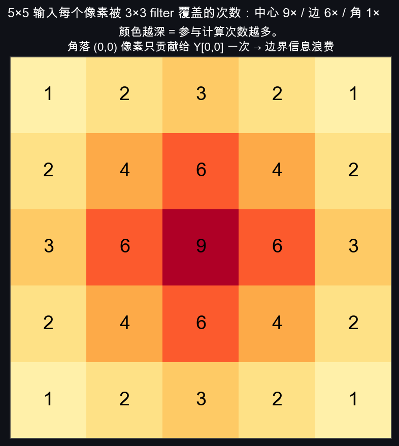

**两个值得记的事实**：

- **patch 之间大量重叠**：相邻输出格子用的 3×3 子块只差一列/一行。这是 §4 朴素实现重复读数据的根源，也是 im2col 优化的下手点。
- **角落像素被歧视**：5×5 输入里 (0,0) 这种角点只参与 1 次乘加，而 (2,2) 这种中心点参与 9 次。**输入越靠边，对输出的贡献越少**——这是 T3 要用 padding 解决的"边界凋零"问题。

形式化地，2D 互相关的定义是：

$$Y[i, j] = \sum_{m=0}^{k-1} \sum_{n=0}^{k-1} X[i+m,\ j+n] \cdot W[m, n]$$

其中 $k$ 是 filter 边长。

---

## 4. NumPy 朴素实现

把 §3 的算法直译成代码：

```python
import numpy as np

def conv2d_naive(X, W):
    """单通道单 filter 的 2D 互相关。最朴素的双重 for 实现。
    X: shape (H, W_in)        输入
    W: shape (k, k)           filter
    返回 Y: shape (H-k+1, W_in-k+1)
    """
    H, Win = X.shape
    k, _   = W.shape
    Hout, Wout = H - k + 1, Win - k + 1

    Y = np.zeros((Hout, Wout), dtype=np.float32)
    for i in range(Hout):
        for j in range(Wout):
            patch = X[i:i+k, j:j+k]          # 抠出 k×k 子块
            Y[i, j] = (patch * W).sum()       # 对位乘 + 求和
    return Y
```

10 行就够。但这个实现有两个性能问题，**正是现代框架做加速的下手点**：

1. **Python 双重 for 慢**：每一步只算一个标量。
2. **抠子块时数据被反复读**：相邻位置的子块大量重叠（§3.3 已经看到了：中心像素被读 9 次）。

### 4.1 im2col：把卷积转成一次矩阵乘法

工程实现里的标准技巧叫 **im2col**——把所有 $k\times k$ patch 拉平排成大矩阵，卷积就变成一次矩阵乘法，立刻能用 BLAS（Apple Accelerate / OpenBLAS / cuBLAS）的高度优化版本。

形式化：设输入 $X$ 形状 $H\times W_\text{in}$，filter $W$ 形状 $k\times k$，输出 $Y$ 形状 $H_\text{out}\times W_\text{out}$（其中 $H_\text{out}\!=\!H\!-\!k\!+\!1$、$W_\text{out}\!=\!W_\text{in}\!-\!k\!+\!1$）。im2col 把每个 patch 拉平成长度为 $k^2$ 的行向量，全部叠成矩阵：

$$\underbrace{P}_{(H_\text{out}\cdot W_\text{out})\,\times\, k^2}\ \cdot\ \underbrace{\text{vec}(W)}_{k^2\times 1}\ =\ \underbrace{\text{vec}(Y)}_{(H_\text{out}\cdot W_\text{out})\times 1}$$

最后把结果向量 reshape 回 $H_\text{out}\times W_\text{out}$ 就是输出。

用一个 $4\times 4$ 输入 + $3\times 3$ filter（输出 $2\times 2$，共 4 个 patch）的小例子直观感受：

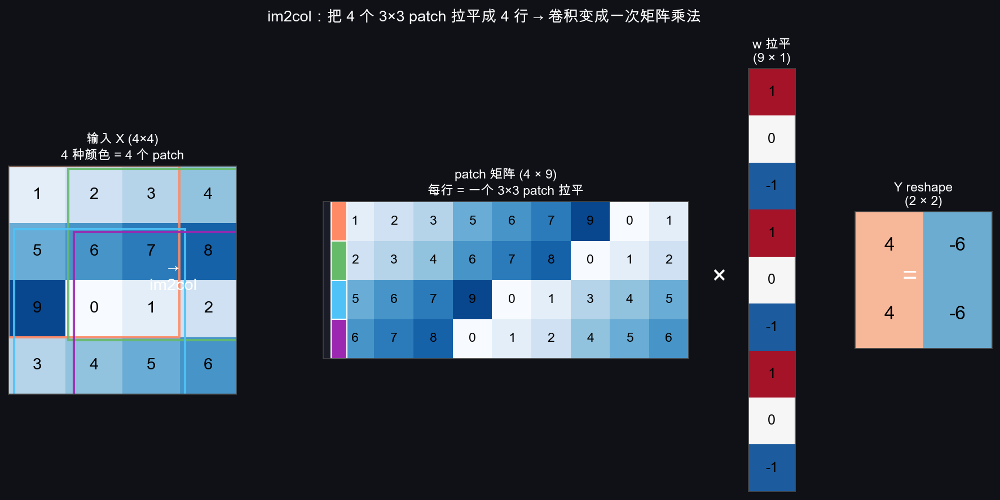

**两个细节值得注意**：
- $P$ 矩阵的**每一行是一个 patch 拉平**——矩阵大小是 $H_\text{out}W_\text{out} \times k^2$，比原图 $H\times W_\text{in}$ 大 $k^2/(H_\text{out}W_\text{out}/(HW_\text{in}))$ 倍，**用空间换速度**
- 一旦变成矩阵乘法，**多通道、多滤波器**只是把 $W$ 从向量扩成矩阵——你会在 T4 看到这个推广天然就是 batched GEMM，不用单独再设计算法

我们 T7 手写实现时会用这个技巧；现在先理解 §4 的朴素版，确保算的"是什么"清楚。

---

## 5. 一个 3×3 的 filter 到底能检测什么

§3 的 $W$ 检测垂直边缘不是巧合。**filter 的数值组合本身就是它的"功能"**。这一节先用一个具体算例让你**亲眼看到**边缘检测发生，再列经典 filter 表。

### 5.1 算例：Sobel-x 在一个"垂直亮条"上做了什么

构造一张极简的 $5\times 7$ "图像"——左半部分黑、第 3 列亮（=9）、右半部分又黑：

$$X = \begin{bmatrix}
0 & 0 & 0 & 9 & 0 & 0 & 0 \\
0 & 0 & 0 & 9 & 0 & 0 & 0 \\
0 & 0 & 0 & 9 & 0 & 0 & 0 \\
0 & 0 & 0 & 9 & 0 & 0 & 0 \\
0 & 0 & 0 & 9 & 0 & 0 & 0
\end{bmatrix}$$

应用经典 Sobel-x（检测左右亮度差）：

$$W = \begin{bmatrix} -1 & 0 & 1 \\ -2 & 0 & 2 \\ -1 & 0 & 1 \end{bmatrix}$$

这个 filter 的几何意义：**右列权重为正、左列权重为负、中列丢弃**——所以它对"右亮左暗"的过渡输出大正数，对"右暗左亮"输出大负数，对均匀区域输出 0。

按 §3 的算法把 filter 滑过去（输出尺寸 $3\times 5$，因为 $5-3+1=3$，$7-3+1=5$）。先**逐格列出每个输出从哪儿来**，再看完整结果。

**逐格分析**（只看第 0 行，row 1 和 row 2 完全一样）：

| 输出位置 | filter 起点 | filter 看到的 $X$ 子块 | 算式 | 结果 |
|---|---|---|---|---|
| $Y[0, 0]$ | $X[0:3, 0:3]$ | 全 0 | 0 | **0** |
| $Y[0, 1]$ | $X[0:3, 1:4]$ | 左两列 0、**右一列 9** | $9\cdot 1 + 9\cdot 2 + 9\cdot 1$ | **+36** |
| $Y[0, 2]$ | $X[0:3, 2:5]$ | 中列 9、左右 0（对称抵消） | $9\cdot 0 \times 3$ | **0** |
| $Y[0, 3]$ | $X[0:3, 3:6]$ | **左一列 9**、右两列 0 | $9\cdot(-1) + 9\cdot(-2) + 9\cdot(-1)$ | **−36** |
| $Y[0, 4]$ | $X[0:3, 4:7]$ | 全 0 | 0 | **0** |

**完整输出**（三行完全相同）：

$$Y = \begin{bmatrix}
0 & +36 & 0 & -36 & 0 \\
0 & +36 & 0 & -36 & 0 \\
0 & +36 & 0 & -36 & 0
\end{bmatrix}$$

可视化对照——一根"实心亮条"被 Sobel-x 拆成两条"轮廓线"：

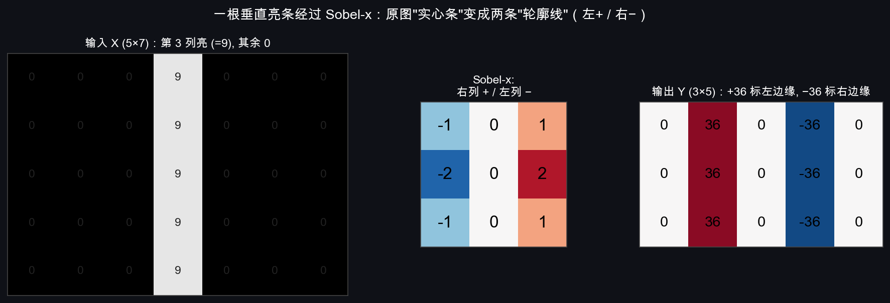

左 $\;+36\;$ 的列代表"亮条的左边缘"（右侧亮 → 输出正），右 $\;-36\;$ 的列代表"亮条的右边缘"（左侧亮 → 输出负）。中间列因为左右两侧都暗、对称抵消，输出 0。**filter 把"在哪里发生了亮度跳变"这个信息高亮出来了**——这就是"边缘检测"的字面意思。

### 5.1.5 在真实图片上验证

合成的"亮条"看不出威力，把同样的 Sobel-x 喂给 CIFAR-10 第一张 horse（32×32 RGB）：

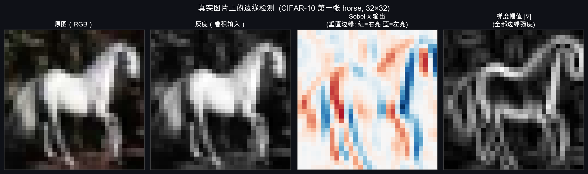

**逐图解读**：

- **原图**：32×32 像素的白马，背景偏暗
- **灰度**：用 0.299R + 0.587G + 0.114B 公式压成单通道，这是卷积的实际输入
- **Sobel-x 输出**（红蓝双色）：红色 = "右亮左暗"（filter 输出 +）；蓝色 = "左亮右暗"（filter 输出 −）。马身的左轮廓基本是蓝色（左暗→右亮），右轮廓基本是红色（左亮→右暗）。马腿的垂直边也看得很清楚。
- **梯度幅值** $|\nabla|$（最右）：把 Sobel-x 和 Sobel-y 的输出平方求和再开根号，得到"全方向边缘强度"——**马的轮廓被还原成了一张线条画**。

这就是 §5.1 那段抽象算式的肉眼版——同一个 Sobel-x，在合成的"亮条"上做的事和在真实马图上做的事**算法完全一样**，只是输入复杂了一些。所以"特征检测器"的具体含义是：**filter 内部的数值组合决定了它对哪种局部模式响应大**。Sobel-x 响应垂直边缘；Sobel-y 响应水平边缘；高斯响应平滑区域；自学习的 filter 响应"网络觉得对完成任务有用"的任意模式。

### 5.2 几个经典手工 filter

下表列几个图像处理里 1990 年代前就在用的经典 filter，有助于建立"filter 数值 ↔ 功能"的直觉：

| filter | 功能 | 数值 | 直觉 |
|---|---|---|---|
| Sobel-x | 垂直边缘 | $\begin{smallmatrix}-1&0&1\\-2&0&2\\-1&0&1\end{smallmatrix}$ | 右列 + 减左列 - |
| Sobel-y | 水平边缘 | $\begin{smallmatrix}-1&-2&-1\\0&0&0\\1&2&1\end{smallmatrix}$ | 下行 + 减上行 - |
| 拉普拉斯锐化 | 突出边缘和细节 | $\begin{smallmatrix}0&-1&0\\-1&5&-1\\0&-1&0\end{smallmatrix}$ | 中心放大、四邻减弱 |
| 高斯平滑 | 模糊去噪 | $\frac{1}{16}\begin{smallmatrix}1&2&1\\2&4&2\\1&2&1\end{smallmatrix}$ | 加权平均近邻 |

这些 filter 在 1990 年前要靠图像处理专家**手设计**。CNN 的革命性在于：

> **不再手设计 filter，而是让网络通过梯度下降把 $W$ 学出来。**

把 §5.2 表格里的 4 个 filter 都喂给 horse 那张图，结果并排对比：

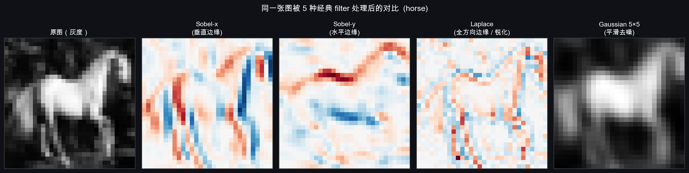

**对照看**：

- **Sobel-x**（垂直边缘）：马腿、马身两侧的**竖向边界**被高亮
- **Sobel-y**（水平边缘）：马背、马肚的**横向边界**被高亮
- **Laplace**（全方向）：所有边缘都有响应、噪点也被放大——这是它"锐化"的代价
- **Gaussian 5×5**（平滑）：原图被模糊，看上去像降了分辨率——这恰恰是它"去噪"的本质

**同一组 9 个数字（3×3 filter 内的权重）的不同组合，决定了它检测什么**。这就是后面我们手写自学习 CNN 时，每个 filter 的内部数值在被梯度下降"塑造"时实际发生的事。

所以你在 Week 1 训完 MLP 看到的 `weights_layer1.png` 里那些"模糊的笔画形状"，本质上和 Sobel 是同类东西——**学到的低级特征检测器**。区别只是 MLP 是 fully connected 学出来的，CNN 是局部连接 + 权重共享学出来的。

**深度网络（多层卷积）的威力来自 filter 的层级组合**：


每一层 filter 在前一层的输出上滑动，所以**深层 filter 看到的是"组合特征"**——这是为什么 CNN 越深表现越强的根本原因。Week 4 做完 LeNet/VGG 后我们会用 hook 把每一层的特征图打印出来，肉眼验证这个层级。

---

## 6. CNN 革命性的两条轴：先验 + 学习

§5 末尾那句话——"不再手设计 filter，而是让网络通过梯度下降把 $W$ 学出来"——是个**正确但只讲了一半**的概括。这一节把另一半补齐，并解释这个区分为什么对理解后续所有架构（包括 Vision Transformer）都很重要。

### 6.1 两条独立的轴

CNN 之所以能成立，是因为它**同时**做对了两件本质不同的事：

| 轴 | 名字 | 内容 | 体现在 |
|---|---|---|---|
| **轴 1** | **设计初衷**（结构先验）| 把"图像的局部性 + 平移不变性"这种**已知事实**直接编码进网络架构 | T1 的三原则：局部连接、2D 结构保留、权重共享 |
| **轴 2** | **关键突破**（端到端学习）| 让这些结构化约束下的 filter **自动学**，告别人工设计特征 | 反向传播 + 大数据 + GPU |

**轴 1 决定了"网络能学什么"**——它把搜索空间从"任意函数"收窄到"卷积式函数"，相当于事先给网络画了一个圈，告诉它"答案在这个圈里"。
**轴 2 决定了"网络怎么学"**——梯度下降在那个被收窄的圈里搜索最优 filter 数值。

> 轴 1 给方向，轴 2 给细节。两条都要有，CNN 才成立。

### 6.2 历史验证：单条轴都失败过

这两条不是 CNN 新发明的——历史上**单独**做过其中一条的工作都失败了，把这条历史看清楚是理解 CNN 革命性的关键：

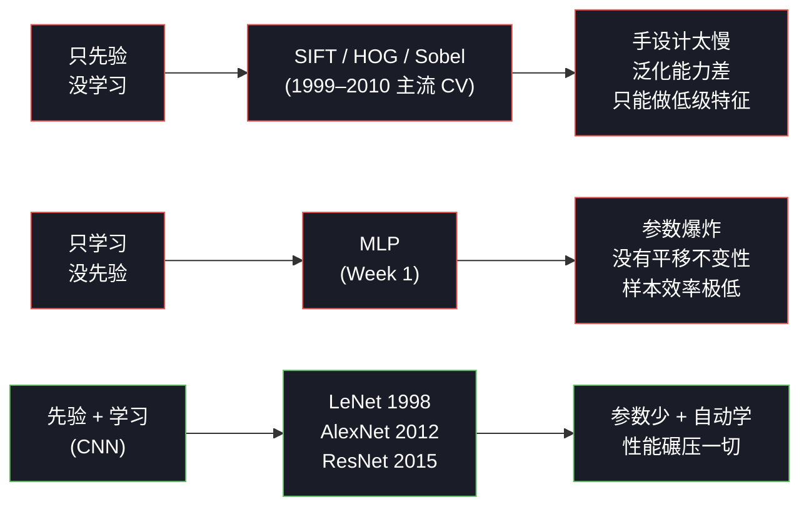

- **只先验，没学习**（传统 CV）：filter 由人手算法设计——Sobel 检测边缘、HOG 检测梯度直方图、SIFT 检测关键点。这些 filter 都是低级特征。**人永远手设计不出"猫脸检测器"**——猫脸的"先验"复杂到没法用 9 个数字写死。所以 2010 年前 CV 的天花板就在"边缘 + 角点 + 局部纹理"这一档。
- **只学习，没先验**（MLP）：理论上 MLP 是万能逼近器（universal approximator），任何函数它都能拟合。但 T1 已经算过——在 ImageNet 尺寸上 MLP 第一层就要 7700 万参数，外加没有平移不变性、样本效率极低，**理论可行 + 实际训不出来**。
- **先验 + 学习**（CNN）：先验把搜索空间收窄好几个数量级，学习在窄了的空间里自动找最优。1989 年 LeCun 的 LeNet 在 MNIST 上就跑通这条路，1998 年的最终版能识别美国邮政系统所有手写邮编。

### 6.3 完整图景：CNN 是什么

把上面这条想清楚后，CNN 的一句话定义就明确了：

> **CNN = 把图像的结构先验写进网络架构 + 让具体特征通过反向传播自动学出来**

这两半缺一不可：

- **去掉先验**：CNN 退化成 MLP，回到样本效率灾难
- **去掉学习**：CNN 退化成传统 CV，回到 Sobel/HOG 时代的能力天花板

所以 §5 那句"不再手设计 filter"只描述了**轴 2** 的革命性。但**只有轴 2 没有轴 1，反向传播就会失效**——你回到 Week 1 的 MLP，参数太多、训练数据不够、几乎学不出有用的 filter。轴 1 是让轴 2 在图像上**变得可行**的前提。

### 6.4 这个区分为什么重要——理解后续架构

如果你只记住"CNN 的革命是端到端学习"，你会困惑于一件事：**Vision Transformer (2020) 把 CNN 的所有结构先验都拆掉了，怎么反而比 CNN 强**？

答案就藏在两条轴的关系里：

| 架构 | 先验强度 | 学习能力 | 适用场景 |
|---|---|---|---|
| MLP | **0**（无先验） | 强 | 玩具问题 |
| CNN | **强**（局部 + 平移不变） | 强 | 中小数据集（< 100 万张） |
| **Vision Transformer** | **弱**（去掉局部先验，只剩 patch 划分） | **极强**（自注意力 + 海量参数） | 巨大数据集（> 3 亿张） |

**ViT 的故事**是：**当数据足够多，可以用"学习"的强度补"先验"的不足**。

- CNN 的局部先验在**小数据**上是巨大优势——把搜索空间收窄，少量数据就能学出有用 filter
- 但同样的先验在**巨大数据**上反而是**束缚**——它**约束了模型只能学卷积式的特征**，学不到全局长距离的关系
- ViT 拆掉局部先验、上自注意力（每个位置都能看全图）+ 几亿张图训练，反而超越了 CNN

理解了"先验 + 学习"是两条独立的轴，你就能把 **MLP → CNN → ViT** 的演进读成一个**清晰的故事**：

> 随着算力和数据规模上升，模型逐渐**少依赖人手编码的先验**，**更依赖学习能力本身**。

而不是一堆零碎的"今天又出了个新模型"。

### 6.5 回到 Week 2 的语境

你现在正在学的是 CNN——所以 Week 2 后续所有内容（多通道、池化、反向传播、LeNet）都建立在**两条轴都启用**的前提上：

- 写代码时，**轴 1** 体现在 `conv2d_numpy.py` 的局部窗口 + 共享权重的实现里
- **轴 2** 体现在反向传播 + 训练循环里

明确这个区分之后，T6 的卷积反向传播会变得直观——它本质上就是"在轴 1 给定的结构约束下，把轴 2 的梯度传回去更新 filter"。

---

## 7. 数学符号收口

本节最重要的一个公式（之后会反复用到）：

$$\boxed{Y[i, j] = \sum_{m=0}^{k-1} \sum_{n=0}^{k-1} X[i+m,\ j+n] \cdot W[m, n]}$$

参数说明：

| 符号 | 含义 | 形状 |
|---|---|---|
| $X$ | 输入 | $H \times W_{in}$ |
| $W$ | filter（卷积核） | $k \times k$ |
| $Y$ | 输出 | $(H - k + 1) \times (W_{in} - k + 1)$ |
| $i, j$ | 输出位置索引 | — |
| $m, n$ | filter 内位置索引 | — |

这是**单通道单滤波器、stride=1、no padding** 的最简形式。T3 加 padding/stride，T4 加多通道/多滤波器。

---

## 8. 这一节留下的问题

如果把 $5\times 5$ 输入做完一次 $3\times 3$ 卷积，输出变成 $3\times 3$。再做一次又变 $1\times 1$。**做几次就没了**。这两个问题需要解决：

1. **输出会一直缩小** → 想堆深需要补救。
2. **边界像素被"看"的次数远少于中心像素**（角落只参与了一次乘法，中心参与了 9 次），信息利用不均匀。

这两件事的解药都在下一节——**padding** 在边缘补一圈 0 控制输出尺寸，**stride** 跳着滑减小输出。还有"输出尺寸到底怎么算"的精确公式。

下一节 → `03_padding_stride.md`
