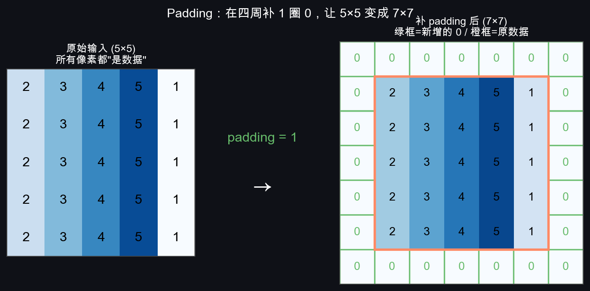
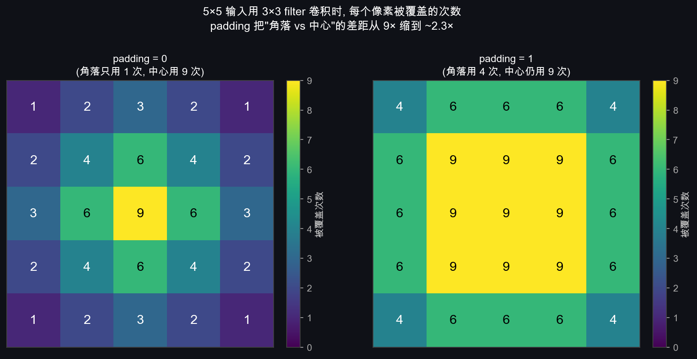
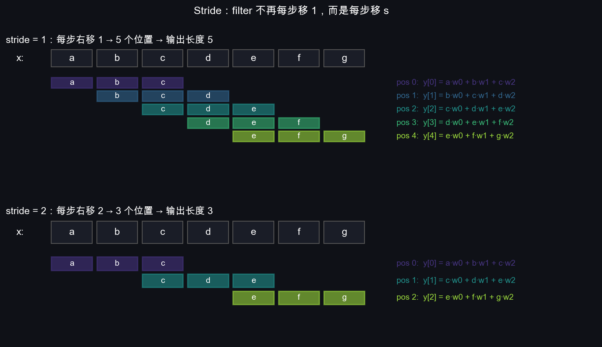
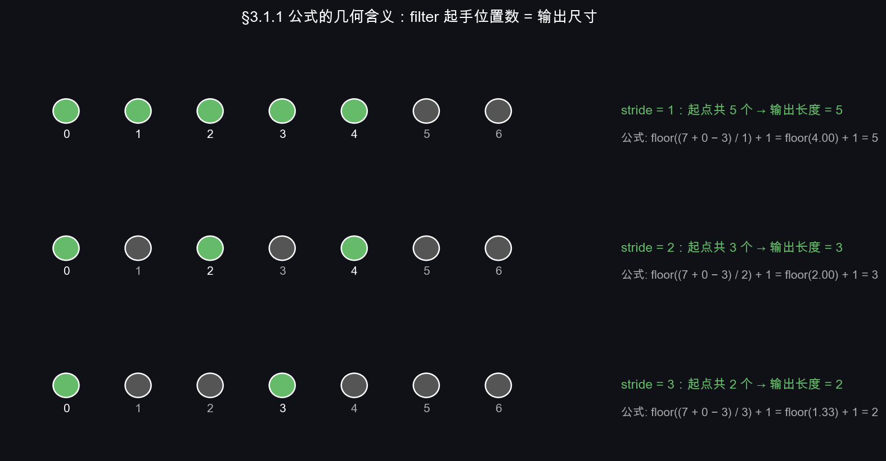
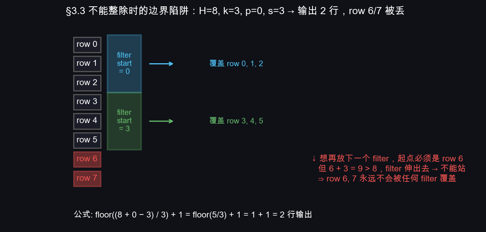

# T3：Padding & Stride——输出尺寸到底怎么算

## 0. 上一节留下的两个问题

T2 末尾留了两件事没解决：

1. **输出会一直缩小**。$5\times 5$ 经过 $3\times 3$ 卷积变 $3\times 3$，再来一次变 $1\times 1$，**深层网络堆几下就没了**。
2. **边界信息被歧视**。角落像素只参与 1 次乘法（filter 只在第 (0,0) 位置覆盖到它），中心像素参与 $k^2$ 次。

这两个问题分别用 **padding** 和 **stride** 解决，配合得到一个万用的输出尺寸公式。这一节把它讲透，并把 T2 的 `conv2d_naive` 升级成支持 padding/stride 的标准实现。

---

## 1. Padding：在边缘补一圈

**做法**：在输入四周补 $p$ 圈 0，再做卷积。形式化地，padding 把输入从 $H\times W$ 扩成 $(H+2p)\times(W+2p)$：



补一圈以后，原本在角落里的像素现在被 filter 覆盖的次数变多了——边界凋零问题缓解。

### 1.0 用"触及次数"图证明 padding 真的有用

刚才说"角落像素被歧视"很抽象。直接把每个像素**被 filter 覆盖了几次**画出来，对比有/无 padding 的差距：



**左图**（padding=0）：5×5 输入 + 3×3 filter 共 9 个起手位置——中心 (2,2) 被 9 个窗口覆盖（亮黄），角落 (0,0) 只被 1 个窗口覆盖（深紫）。**9 倍差距**，肉眼直观感受"角落被歧视"。

**右图**（padding=1）：补一圈 0 后共 25 个起手位置——中心仍是 9 次，角落涨到 4 次，比例从 9:1 缩到 9:4 ≈ **2.3:1**。整张图颜色更接近——边缘和中心的信息利用更平衡。

**这就是 padding 的本质好处**——不是"让输出尺寸不变"那么简单，而是**让边界信息和中心信息的利用更平衡**，模型对边角的物体不会系统性地不敏感。

不止于此，padding=1 还有第二个收益：**输出尺寸从 3×3 变回 5×5**——同尺寸输出意味着卷积层可以无限堆叠而不会缩没。这对深层网络（比如 VGG 16 层卷积）是必需的。

### 1.1 三种命名习惯

业界对 padding 有三种说法，本质就是 padding 选了多少圈 0：

| 名字 | $p$ 值 | 输出尺寸 vs 输入 | 含义 |
|---|---|---|---|
| **valid** | $p = 0$ | 缩小 $k-1$ | 不补，只在"有效"区域算（filter 不能伸出输入） |
| **same** | $p = (k-1)/2$（要求 $k$ 奇数） | **不变** | 输出和输入同尺寸——堆深时最常用 |
| **full** | $p = k-1$ | 放大 $k-1$ | filter 只要碰到一个像素就算——很少用 |

PyTorch / TensorFlow 默认 `padding='valid'`，但实际工程几乎都显式指定 `padding=1`（对 $3\times 3$）来达到 same 效果。**$3\times 3$ filter 配 padding=1 是 CNN 设计中的"经典最优配置"**，从 VGG 到 ResNet 全在用。

### 1.2 为什么要求 $k$ 是奇数

same padding 要求 $p = (k-1)/2$ 是整数，所以 $k$ 必须奇数。$k=3, 5, 7$ 是常见选择。$k=2, 4$ 几乎没人用——既无法 same，又破坏对称性（filter 没有"中心像素"）。

### 1.3 补什么内容（不只是 0）

| 模式 | 边界补什么 | 适用场景 |
|---|---|---|
| **zero**（默认） | 全 0 | 通用，所有 CNN 默认 |
| **reflect** | 镜像反射边界像素 | 图像处理，避免引入"假边缘" |
| **replicate** | 重复最边一个像素 | 图像处理 |
| **circular** | 把对边像素绕过来 | 周期性数据（球面、纹理） |

深度学习里**几乎只用 zero**——它最简单、可微、不引入额外信息。其它模式在传统图像处理里更常见。

---

## 2. Stride：跳着滑

**做法**：filter 不再每次移动 1 格，而是移动 $s$ 格。形式化地，filter 第 $i$ 步的起手位置是 $i \cdot s$（而不是 stride=1 时的 $i$）。

把同一个长度 7 的 1D 输入 $[a, b, c, d, e, f, g]$ + 长度 3 的 filter $[w_0, w_1, w_2]$，用 stride=1 和 stride=2 各扫一遍：



两条立刻能看出来的事实：

1. **stride=2 时输出尺寸大致减半**——这是"跳着滑"的直观后果，相当于内置了 2× 的下采样。
2. **stride=2 跳过了一些起点位置**（b、d 没当过 filter 起点）。但**那些像素本身没被丢**——它们仍然出现在某个 filter 窗口的中间或末尾位置（比如 b 出现在 stride=2 位置 0 的中间）。

> 注意区分：stride 跳过的是 **filter 的起点**，不是输入像素本身。这一点容易混淆，但 §3.3 的"不能整除"边界情况会真的丢像素，那时再说。

stride 的两个作用：

1. **降采样**：stride=2 让输出尺寸大致减半，相当于内置了一个 pooling。
2. **算力省**：步数变少，乘加运算量按 $s^2$ 比例下降。

### 2.1 stride 和 pooling 的关系

`stride=2 卷积` 和 `stride=1 卷积 + 2×2 池化` 在尺寸上等价，行为不一样：

- **stride=2 卷积**：降采样过程中**有可学权重**，能学到"什么样的下采样最优"
- **2×2 池化**：固定取 max 或 mean，**没有可学权重**

ResNet 之后的现代网络更多用 stride 卷积取代 max pooling（信息保留得更好）。LeNet/VGG 还是经典的"卷积 + 池化"组合，所以 T5 我们仍要专门讲 pooling。

---

## 3. 输出尺寸通用公式

把 padding $p$ 和 stride $s$ 都加进来，输出尺寸的通用公式是：

$$\boxed{H_{out} = \left\lfloor \frac{H + 2p - k}{s} \right\rfloor + 1}$$

宽度公式同理。**这是 CNN 设计里被使用最频繁的公式**，必须背下来。

### 3.1 公式怎么来的（一步一步推）

考虑高度方向。padding 后输入"有效高度"变成 $H + 2p$。filter 的最上行可以站在第 $0, s, 2s, 3s, \ldots$ 行上。最下面那一行 $i$ 必须满足：

$$i + k \le H + 2p$$

即 $i \le H + 2p - k$。filter 一共能站的位置数（也就是输出行数）是：

$$\text{number of valid positions} = \left\lfloor \frac{H + 2p - k}{s} \right\rfloor + 1$$

加 1 是因为位置从 0 开始数。$\lfloor\cdot\rfloor$ 是向下取整——如果 $(H + 2p - k)$ 不能被 $s$ 整除，**最后那部分剩余的像素会被丢弃**（filter 站不到那里）。

### 3.1.1 把公式变成图：filter 起手位置

抽象的公式不好记，画出来就一眼看懂。用 1D 简化：输入长 $H = 7$、filter $k = 3$、padding $p = 0$。三种 stride 下，filter 能站到的位置（绿色实心圆）和站不到的位置（灰色空心圆）：



逐 stride 对账：

- **stride = 1**：起点 $\{0, 1, 2, 3, 4\}$ 共 5 个 → $\left\lfloor\frac{7+0-3}{1}\right\rfloor + 1 = 4 + 1 = 5$ ✓
- **stride = 2**：起点 $\{0, 2, 4\}$ 共 3 个 → $\left\lfloor\frac{7+0-3}{2}\right\rfloor + 1 = 2 + 1 = 3$ ✓
- **stride = 3**：起点 $\{0, 3\}$ 共 2 个（位置 6 想做起点但 $6+3 > 7$ 出界）→ $\left\lfloor\frac{7+0-3}{3}\right\rfloor + 1 = \lfloor 4/3 \rfloor + 1 = 1 + 1 = 2$ ✓

> **公式的几何含义就一句话**：分子 $H + 2p - k$ 是 filter **左上角能去到的最大坐标**，除以 $s$ 是"跳几步能到那里"，加 1 把"步数"换算成"位置数"。$\lfloor\cdot\rfloor$ 处理"再跳一步就出界"的情形。

### 3.2 几个常见配置的输出尺寸

记几个常考组合，工程上闭着眼写都不会错：

| 配置 | 输入 | 输出 | 备注 |
|---|---|---|---|
| $k=3, p=1, s=1$ | $H \times H$ | $H \times H$ | **同尺寸**，最常见 |
| $k=3, p=0, s=1$ | $H \times H$ | $(H-2)\times(H-2)$ | LeNet 风格 |
| $k=3, p=1, s=2$ | $H \times H$ | $\lceil H/2 \rceil \times \lceil H/2 \rceil$ | **降采样** |
| $k=5, p=2, s=1$ | $H \times H$ | $H \times H$ | 同尺寸大感受野 |
| $k=7, p=3, s=2$ | $224 \times 224$ | $112 \times 112$ | ResNet 第一层 |
| $k=11, p=2, s=4$ | $224 \times 224$ | $55 \times 55$ | AlexNet 第一层 |

### 3.3 边界情况：不能整除时丢哪部分

输入 $H=8$，filter $k=3$，padding $p=0$，stride $s=3$。代入公式：

$$H_{out} = \lfloor (8 + 0 - 3) / 3 \rfloor + 1 = \lfloor 5/3 \rfloor + 1 = 1 + 1 = 2$$

filter 能站在 row 0 和 row 3，**第 6、7 行像素永远没被任何 filter 覆盖到**——它们等于被丢了：



**这种情况框架不会报错**，但对你的特征损失没法挽回。**写代码时要么选好 $H, k, p, s$ 让结果整除，要么加 padding 凑齐**。

具体地，如果想避免丢像素，把 padding 调到能让 $(H + 2p - k)$ 被 $s$ 整除即可。比如上例改成 $p = 1$：$(8 + 2 - 3)/3 = 7/3 \approx 2.33$，仍然不整除，丢 1 行；$p = 2$：$(8 + 4 - 3)/3 = 3$，整除，输出 4 行，**所有输入行都被覆盖**。

---

## 4. NumPy 实现（升级版）

把 §1 §2 的功能加到 T2 的朴素实现上：

```python
import numpy as np

def conv2d_v2(X, W, padding=0, stride=1):
    """单通道单 filter，加 padding 和 stride。
    X: (H, Win)
    W: (k, k)
    padding: 四周各补 p 圈 0
    stride:  filter 每步移动多少格
    返回 Y: (Hout, Wout)，公式 Hout = (H + 2p - k) // s + 1
    """
    # ① 补 padding
    if padding > 0:
        X = np.pad(X, ((padding, padding), (padding, padding)),
                   mode='constant', constant_values=0)

    H, Win = X.shape
    k, _   = W.shape
    Hout   = (H - k) // stride + 1
    Wout   = (Win - k) // stride + 1

    # ② 双重 for（朴素版，T7 用 im2col 优化）
    Y = np.zeros((Hout, Wout), dtype=np.float32)
    for i in range(Hout):
        for j in range(Wout):
            # 在原图（已 pad）的 (i*s, j*s) 起手抠 k×k 子块
            patch = X[i*stride : i*stride + k,
                      j*stride : j*stride + k]
            Y[i, j] = (patch * W).sum()
    return Y
```

**两处改动**：

1. 起手 `np.pad` 给输入补 0
2. for 循环步长改为 `i*stride / j*stride`

12 行就能支持任意 $k, p, s$。这就是工业级 conv2d 算法主体——剩下的全是**工程优化**（im2col、im2col + GEMM、Winograd 算法、cuDNN auto-tune），数学没有更复杂。

### 4.1 用它复现 §3 的几个尺寸

```python
import numpy as np
X = np.random.rand(32, 32)
W = np.random.rand(3, 3)

print(conv2d_v2(X, W, padding=0, stride=1).shape)  # (30, 30)
print(conv2d_v2(X, W, padding=1, stride=1).shape)  # (32, 32)  ← same
print(conv2d_v2(X, W, padding=1, stride=2).shape)  # (16, 16)  ← 降采样
```

完美对得上 §3.2 表格——这是最简单的"公式 ↔ 代码 ↔ 实测"三方对账。

---

## 5. 设计决策的常识

CNN 设计里 padding/stride 的选择不是随便定的，业界有几条准则：

| 准则 | 说明 |
|---|---|
| **filter 用奇数边长**（3, 5, 7） | 才能 same padding；才有"中心像素" |
| **优先 $3\times 3$ + padding=1** | VGG 之后的事实标准。两个 $3\times 3$ 堆叠等效 $5\times 5$ 但参数更少 |
| **下采样靠 stride=2 卷积或池化**，不靠大 stride | stride 越大信息丢得越多；现代网络一般 $s\in\{1, 2\}$ |
| **每次下采样后翻倍通道数** | 经验法则：空间分辨率减半，特征通道数加倍，保持总信息量稳定。从 LeNet 到 ResNet 都遵守 |

这些规则你在 T9 实现 LeNet 时会立刻看到。LeNet 比这些规则早，所以并不严格遵守，但思想已经在了。

---

## 6. 这一节留下的问题

到目前为止我们处理的都是**单通道**（灰度）输入和**单个 filter** 的输出。但：

1. **CIFAR-10 是 RGB**，输入有 3 个通道，怎么把三个通道合起来？
2. **CNN 一层通常有几十、几百个 filter**，怎么组织它们让"一层"产生多个输出 feature map？
3. 多通道情况下"卷积"还是 §3 的样子吗？参数量怎么变？

这三件事一起放进 T4 解决。下一节我们就会看到——**多通道卷积是单通道卷积在通道维上的求和**——一个简短但容易让人困惑的扩展。

下一节 → `04_multi_channel.md`
