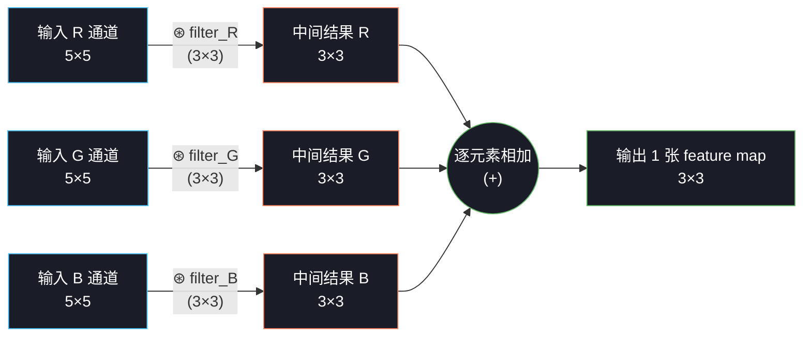

# T4：多通道 + 多滤波器

## 0. 上一节留下的问题

T2 T3 的所有讨论都假设了**单通道输入 + 单个 filter**。但现实里：

1. **CIFAR-10 是 RGB**——输入有 3 个通道。三个通道是分开卷再合并？还是一起卷？怎么"一起"？
2. **CNN 一层通常有几十、几百个 filter**——每个 filter 各做各的吗？输出怎么组织？
3. **参数量怎么算**？多通道、多 filter 一起上以后，一层卷积到底有多少可学参数？

这一节把这三件事讲清楚。最容易让人迷糊的是**通道维和滤波器维这两个"多"是不同的"多"**——通道是输入侧的、滤波器是输出侧的，它们的角色完全不对称。讲清楚之后你会发现多通道卷积的运算很简洁。

---

## 1. 输入侧的"多"：通道（channel）

### 1.1 RGB 是怎么存的

一张 32×32 RGB 图像在内存里是一个**三维张量**，形状 $(H, W, C)$ 或 $(C, H, W)$（PyTorch 用后者）：

```
一张 32×32 的 CIFAR-10 图像 (PyTorch 约定 C×H×W):

      ┌─────────────────────┐  ← B 通道 (32×32)
      │                     │
   ┌──┤   蓝色平面          │
   │  │   每个像素 0~255    │
┌──┤  └─────────────────────┘
│  │                          ← G 通道 (32×32)
│  │   ┌─────────────────────┐
│  └───┤   绿色平面          │
│      │                     │
└──┐   └─────────────────────┘
   │                          ← R 通道 (32×32)
   │   ┌─────────────────────┐
   └───┤   红色平面          │
       │                     │
       └─────────────────────┘

shape = (3, 32, 32)  →  C=3 个通道, 每个 32×32
```

每个通道都是一张独立的灰度图——R 通道记录红色亮度、G 记录绿色亮度、B 记录蓝色亮度。三张叠起来才合成你看到的彩色图。

把 CIFAR-10 第一张 horse（白马）实际拆开来看一下：


**第一行**（灰度显示，不带颜色）：

- 三个通道单独看都像同一张灰度照片，但**亮度分布不同**——白马在 R 通道最亮（白色物体反射所有波长，但环境光偏暖让红色稍占优）、B 通道相对暗一些

**第二行**（单色显示，把单通道放回 RGB 对应位置、其它通道清零）：

- **R only**：整张图变成红色，亮度差异保留；说明"R 通道贡献了所有红色信息"
- **G only / B only** 同理
- **三张单色图按数学对位相加 = 原图**——这就是 RGB 加色法的本质

**记忆要点**：一张 RGB 图像 = 3 张独立的灰度图叠在通道维上。**通道维是个独立的轴**，不是 H/W 那样的空间维。

### 1.2 通用形式：C 通道输入

不止 RGB。后面的中间层输出也是多通道的（一个 filter 就产生一个通道，K 个 filter 就 K 通道）。所以**通道数 $C$ 是个变量**，不固定是 3。

| 阶段 | 输入通道数 $C$ | 例子 |
|---|---|---|
| 网络第一层 | 1 / 3 | 灰度 / RGB |
| 中间层 | 16 / 32 / 64 / ... | 上一层 filter 的数量 |
| 现代深网 | 256 / 512 / 1024 / 2048 | ResNet-50 后段 |

通道数随着深度通常**翻倍增长**（T3 §5 提到的"下采样翻倍通道"），到深层有上千通道很常见。

---

## 2. 单 filter + 多通道：filter 也长出第三维

T2 里的 filter 是 2D 的 $k \times k$。**输入有 $C$ 个通道时，filter 必须也长成 $C \times k \times k$**——每个输入通道配一个独立的 $k \times k$ 子 filter。

```
单通道 (T2 的情况):                  多通道 (C=3):

filter shape: (3, 3)                 filter shape: (3, 3, 3)
                                      ↑   ↑  ↑
[ w₁₁ w₁₂ w₁₃ ]                       C    k  k
[ w₂₁ w₂₂ w₂₃ ]
[ w₃₁ w₃₂ w₃₃ ]                      展开看就是 3 张 3×3 的 2D filter:

                                     ┌─────────────┐
                                     │ filter for B │ ← 专门处理 B 通道
                                  ┌──┤ (3×3)        │
                                  │  └─────────────┘
                               ┌──┤
                               │  │  ┌─────────────┐
                               │  └──┤ filter for G │ ← 专门处理 G 通道
                               │     │ (3×3)        │
                            ┌──┤     └─────────────┘
                            │  │
                            │  │     ┌─────────────┐
                            │  └─────┤ filter for R │ ← 专门处理 R 通道
                            │        │ (3×3)        │
                            └────────┴─────────────┘
```

### 2.1 多通道卷积的运算：分通道卷积，**对应通道求和**

**核心规则**（最重要的一条，记住它）：

> **每个通道用自己的 2D filter 卷积，得到 $C$ 张中间结果，然后把 $C$ 张中间结果对位相加，得到 1 张输出 feature map。**

把 T2 §3 的 5×5 输入扩成 5×5×3 后，处理流程是：



**关键观察**：

1. **3 个通道进，1 个通道出**——不是 3 个通道分别输出 3 张图！通道维在卷积过程中**被求和"折叠"掉了**。
2. **3 个子 filter 各自不同**——网络可以学到"专门看红色"或"专门看蓝绿差异"的 filter 组合。
3. **输出空间形状还是 (5−3+1, 5−3+1) = 3×3**，和 T2 单通道时一样。通道数变了，空间尺寸没变。

### 2.2 完整公式（多通道单 filter）

把 T2 §6 的公式加一个对通道的求和：

$$\boxed{Y[i, j] = \sum_{c=0}^{C-1} \sum_{m=0}^{k-1} \sum_{n=0}^{k-1} X[c, i+m, j+n] \cdot W[c, m, n]}$$

变化只在最外面多了一个 $\sum_{c}$——把 $C$ 个通道的卷积结果加起来。其它部分和单通道的 T2 §6 公式完全一样。

**如果再加 bias**（每个 filter 一个标量偏置 $b$）：

$$Y[i, j] = b + \sum_{c=0}^{C-1} \sum_{m=0}^{k-1} \sum_{n=0}^{k-1} X[c, i+m, j+n] \cdot W[c, m, n]$$

bias 给整个输出 feature map 一个统一的偏移量（类似 MLP 里 $z = Wx + b$ 的 $b$）。

---

## 3. 输出侧的"多"：K 个 filter → K 个输出通道

### 3.1 一层 filter 是一组 filter

T2 §5 说过 filter 是"特征检测器"。但**一种 filter 只能检测一种特征**（比如 Sobel-x 只能检测垂直边缘）。一层只有 1 个 filter 就只能提 1 种特征——太弱了。

实践中**一个卷积层会同时用 $K$ 个不同的 filter**，每个 filter 各自检测一种特征，产生一张输出 feature map：

```
一个卷积层有 K=4 个 filter:

        filter 0  filter 1  filter 2  filter 3
        (C×k×k)  (C×k×k)  (C×k×k)  (C×k×k)
            │         │         │         │
            │         │         │         │
            ▼         ▼         ▼         ▼
        各自跟整个输入 X 做"多通道卷积"(§2.2)
            │         │         │         │
            ▼         ▼         ▼         ▼
        feature   feature   feature   feature
        map 0     map 1     map 2     map 3
        (H'×W')  (H'×W')  (H'×W')  (H'×W')
            │         │         │         │
            └─────────┴────┬────┴─────────┘
                           │
                           ▼ 沿通道维堆叠
                    输出 (4, H', W')
                          ↑ 这就是下一层的输入,
                            通道数 = 上一层 filter 数 = 4
```

### 3.2 完整 shape 推导

把一切拼起来。令：

| 符号 | 含义 |
|---|---|
| $N$ | batch size（一次处理几张图） |
| $C_{in}$ | 输入通道数 |
| $C_{out} = K$ | 输出通道数 = filter 数 |
| $H, W$ | 输入空间尺寸 |
| $k$ | filter 边长 |
| $H', W'$ | 输出空间尺寸（按 T3 §3 公式算） |

那么张量形状是：

```
输入 X:        (N,  C_in,  H,  W)
filter 组 W:        (C_out, C_in, k, k)        ← 注意 W 不带 N (filter 是共享的, 跟 batch 无关)
bias b:             (C_out,)                   ← 每个输出通道一个 bias
输出 Y:        (N,  C_out, H', W')
```

每个张量维度的角色：

```
                  N          C_out         H'           W'
                  │          │             │            │
输出 Y[n, k, i, j]  = b[k] + Σ_c Σ_m Σ_n  X[n, c, i+m, j+n] · W[k, c, m, n]
                  ↑          ↑   ↑   ↑    ↑               ↑
                  哪一张图    哪个 filter   filter 内位置      filter 哪个 in-channel
                                               (求和折叠掉)    × filter 哪个 out-channel
```

这条公式就是 PyTorch `nn.Conv2d` 在底层执行的运算。理解到这里你已经能完整解释 PyTorch 任何 `Conv2d` 调用的输出形状了。

---

## 4. 参数量怎么算

一个卷积层的全部可学参数：

$$\text{params} = \underbrace{C_{out} \times C_{in} \times k \times k}_{\text{filter 组 } W} \;+\; \underbrace{C_{out}}_{\text{bias } b}$$

举几个具体例子，养成"看一眼配置就报参数量"的肌肉记忆：

| 配置 | 参数量 | 备注 |
|---|---|---|
| `Conv2d(3, 32, k=3)` | $32 \times 3 \times 3 \times 3 + 32 = 896$ | CIFAR-10 第一层典型 |
| `Conv2d(32, 64, k=3)` | $64 \times 32 \times 3 \times 3 + 64 = 18\,496$ | 中间层 |
| `Conv2d(64, 128, k=3)` | $128 \times 64 \times 3 \times 3 + 128 = 73\,856$ | 更深 |
| `Conv2d(3, 64, k=7)` | $64 \times 3 \times 7 \times 7 + 64 = 9\,472$ | ResNet 第一层 |
| 对比：MLP `Linear(3072, 128)` | $3072 \times 128 + 128 = 393\,344$ | T1 算过的"参数爆炸" |

**对比 MLP 那条**：CIFAR-10 上同样"提取 32 个特征"，CNN 只需要 896 参数，MLP 需要 393,344——**约 440 倍的差距**。这就是 T1 反复强调的"权重共享"在数字上的体现。

### 4.1 参数量为什么不依赖输入尺寸

注意上表里**所有参数量都跟 $H, W$ 无关**。这不是巧合——它正是卷积"权重共享"的结果：

> 一个 $k \times k$ 的 filter 不管输入多大都用同一组权重。**所以 CNN 可以处理任意尺寸的输入**——同一个训好的 CNN 能直接喂 224×224、512×512、1024×1024 的图（只要后面接得住）。MLP 做不到这件事。

---

## 5. NumPy 朴素实现（多通道版）

把 T3 §4 的 `conv2d_v2` 升级到多通道、多 filter：

```python
import numpy as np

def conv2d_multichannel(X, W, b=None, padding=0, stride=1):
    """完整的多通道多 filter 2D 卷积。
    X: (N, C_in, H, W_in)         一批输入
    W: (C_out, C_in, k, k)        filter 组
    b: (C_out,) 或 None           每个 filter 一个 bias
    返回 Y: (N, C_out, H', W')
    """
    N, C_in, H, W_in = X.shape
    C_out, _, k, _   = W.shape

    # ① padding
    if padding > 0:
        X = np.pad(X, ((0, 0), (0, 0),                    # batch, channel 不补
                       (padding, padding), (padding, padding)),  # H, W 各补 p
                   mode='constant', constant_values=0)

    H_padded, W_padded = X.shape[2], X.shape[3]
    H_out = (H_padded - k) // stride + 1
    W_out = (W_padded - k) // stride + 1

    # ② 4 重 for: batch / 输出通道 / 输出高度 / 输出宽度
    Y = np.zeros((N, C_out, H_out, W_out), dtype=np.float32)
    for n in range(N):
        for ko in range(C_out):
            for i in range(H_out):
                for j in range(W_out):
                    # 抠出 (C_in, k, k) 的 patch
                    patch = X[n, :,
                              i*stride : i*stride + k,
                              j*stride : j*stride + k]
                    # 与第 ko 个 filter (C_in, k, k) 对位乘 + 求和 (在 C_in, k, k 三个维度上)
                    Y[n, ko, i, j] = (patch * W[ko]).sum()

    # ③ bias
    if b is not None:
        Y += b.reshape(1, -1, 1, 1)   # 广播到 (N, C_out, H', W')

    return Y
```

**比 T3 §4 多了什么**：

1. 多了一个最外层 `for n in range(N)` 处理 batch
2. 多了一个 `for ko in range(C_out)` 处理输出通道（每个 filter 各算一遍）
3. 抠 patch 时多了 `[:, ...]` 把所有输入通道都抠出来
4. `(patch * W[ko]).sum()` 一次性在 $(C_{in}, k, k)$ 三个维度上做对位乘求和——numpy 的 broadcast 自动处理

**性能问题**：4 重 for 在 Python 里非常慢。T7 手写实现时会用 **im2col + 矩阵乘**把这一切压成一次 BLAS 调用，速度提升几十倍。

### 5.1 验证一下 shape

```python
X = np.random.rand(8, 3, 32, 32).astype(np.float32)   # batch=8, RGB, 32×32
W = np.random.rand(16, 3, 3, 3).astype(np.float32)    # 16 个 filter, 每个 3×3×3
b = np.zeros(16, dtype=np.float32)

Y = conv2d_multichannel(X, W, b, padding=1, stride=1)
print(Y.shape)   # (8, 16, 32, 32)
```

输出 shape 是 `(8, 16, 32, 32)`——8 张图 × 16 个特征通道 × 32×32 空间。第二维 16 来自 filter 数，跟输入的 3 通道无关。

---

## 6. 这一节留下的问题

到现在为止 CNN 的核心运算（卷积层）已经定义完整了。但还有两件事没处理：

1. **空间分辨率怎么降下来？** CIFAR-10 输入 32×32，最后要变成 10 维 logits。中间必须有降采样，否则全连接层参数会爆炸。T3 §5 提过两个方法——**stride 卷积** 和 **池化**。stride 已经讲过，池化还没。
2. **每一层 filter 实际"看到"的输入区域有多大？** 我们说"局部连接"，但深层的 filter 通过堆叠浅层 filter，能"间接看到"很大的输入区域——这叫**感受野**（receptive field）。这个概念决定了"网络要堆多深才能看到全局"。

T5 一次性把池化和感受野讲清楚。

下一节 → `05_pooling.md`
