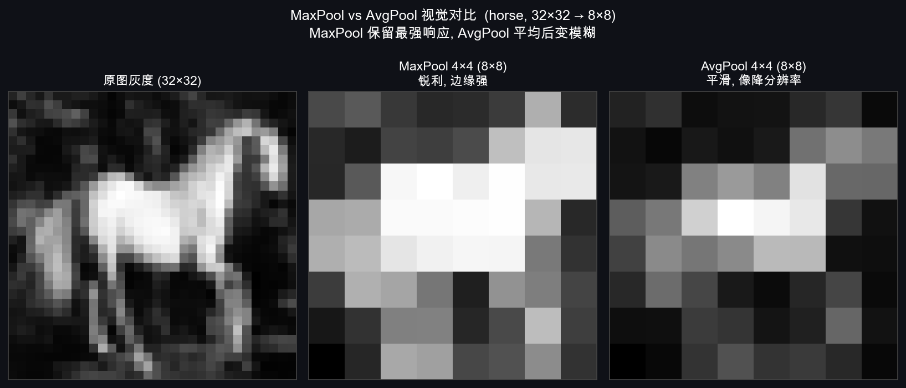
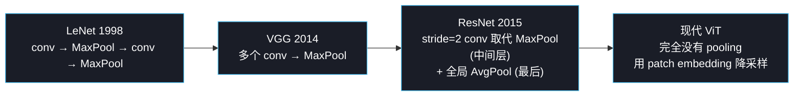

# T5：池化 + 感受野

## 0. 上一节留下的问题

T4 把卷积层的运算讲完了。但有两件事 CNN 必须处理才能真正可用：

1. **空间分辨率怎么降下来**？CIFAR-10 输入 32×32，最后要变 10 维 logits。中间必须有降采样，否则最后一层全连接的参数会爆炸。
2. **网络深了之后，每一层 filter 实际"看见"的输入区域多大**？我们一直说"局部连接 3×3"，但堆 5 层卷积之后，最深层的一个像素能间接关联到原图的多大区域？

第一件事的答案是 **池化**（pooling）；第二件事的答案是 **感受野**（receptive field）。这一节把两件事一起讲清。

---

## 1. 池化：没有可学参数的"压缩器"

### 1.1 一句话定义

> **池化层在每个小窗口内取一个数（最大值或平均值），把空间尺寸缩小，没有任何可学参数。**

跟卷积层的根本区别：

| 维度 | 卷积层 | 池化层 |
|---|---|---|
| 有可学参数吗 | 有（filter + bias） | **没有** |
| 跨通道操作 | 跨通道求和折叠 | **每个通道独立**（不跨通道） |
| 改变通道数 | 能（filter 数 = 输出通道数） | **不能**（输入几通道、输出几通道） |
| 改变空间尺寸 | 看 stride/padding | 主要用来缩小空间尺寸 |
| 可微分 | 全局可微 | MaxPool 只在最大值位置可微 |

### 1.2 为什么需要它

三个理由：

1. **降低空间分辨率**——把 $32\times 32$ 降到 $16\times 16$、再到 $8\times 8$、$4\times 4$，最后接全连接层时维度可控。
2. **扩大感受野**——下采样后每一格代表更大区域，深层 filter 间接"看"到原图更大的范围（§5 详细讲）。
3. **轻微的平移不变性**——MaxPool 对小幅位移不敏感（最大值的位置稍微动一下，最大值本身不变）。

第三点是 LeCun 当年加 pooling 的核心动机。现代网络（ResNet 之后）更多用 **stride 卷积** 取代 pooling（信息保留更好），但 LeNet/VGG 时代 pooling 是标配，理解它仍然必要。

---

## 2. MaxPool：取窗口内的最大值

### 2.1 算法 + 可视化

最常见的配置是 **2×2 窗口、stride=2**——把每 2×2 的小块压成 1 个数，空间尺寸正好减半。

举例：4×4 输入做 2×2 MaxPool（stride=2）：

```
输入 X (4×4):                     输出 Y (2×2):

  ┌──┬──┬──┬──┐                  ┌────┬────┐
  │ 1│ 3│ 2│ 4│                  │ 6  │ 8  │   ← Y[0,0] = max(1,3,5,6) = 6
  ├──┼──┼──┤──┤        →          ├────┼────┤      Y[0,1] = max(2,4,7,8) = 8
  │ 5│ 6│ 7│ 8│                  │ 9  │ 9  │      Y[1,0] = max(9,2,3,4) = 9
  ├──┼──┼──┤──┤                  └────┴────┘      Y[1,1] = max(1,5,8,9) = 9
  │ 9│ 2│ 1│ 5│
  ├──┼──┼──┤──┤
  │ 3│ 4│ 8│ 9│
  └──┴──┴──┴──┘

把 X 分成 4 个 2×2 子块, 每块取 max:

  ┌────┬────┐    ┌────┬────┐
  │ 1 3│ 2 4│    │ ▓▓ │ ▓▓ │   ▓▓ 表示该块的 max
  │ 5 6│ 7 8│    │ 6  │ 8  │   被保留下来
  ├────┼────┤    ├────┼────┤
  │ 9 2│ 1 5│    │ ▓▓ │ ▓▓ │
  │ 3 4│ 8 9│    │ 9  │ 9  │
  └────┴────┘    └────┴────┘
```

**关键观察**：

1. **每个 2×2 输入块只保留 1 个最大值**——丢失 75% 的信息（4 个数变 1 个数）。
2. **没有重叠**（stride=2 等于窗口大小 2）——每个输入像素**最多被一个输出格用到一次**。
3. **没有可学参数**——`max` 是固定操作，没东西要学。
4. **每个通道独立做**——RGB 的 R 通道做 R 通道的 max、G 做 G 的、B 做 B 的，互不干扰。

### 2.2 输出尺寸公式

跟卷积一样，但不要 padding：

$$H_{out} = \left\lfloor \frac{H - k}{s} \right\rfloor + 1$$

$k$ 是池化窗口边长，$s$ 是 stride。最常见的 `MaxPool(k=2, s=2)` 把任意输入尺寸压成一半。

### 2.3 为什么 MaxPool 有"轻微平移不变性"

考虑 4×4 输入里有一个亮点（值 9），如果它从 (0, 0) 平移到 (0, 1)：

```
位移前:                  位移后:
  9 0 0 0                 0 9 0 0
  0 0 0 0     →           0 0 0 0
  0 0 0 0                 0 0 0 0
  0 0 0 0                 0 0 0 0

  2×2 MaxPool 输出:        2×2 MaxPool 输出:
  9 0                      9 0
  0 0                      0 0
                          ↑ 完全一样!
```

亮点在 2×2 窗口内移动，最大值不变——**MaxPool 让网络对窗口内的小位移免疫**。这是它在 LeNet 时代被推崇的核心理由。

但这也是它的缺点——**信息粗暴丢弃**。9 在 (0,0) 还是 (0,1) 这个细节信息丢失了。后来的网络（特别是检测、分割任务）逐渐倾向用 stride 卷积代替它。

---

## 3. AvgPool：取窗口内的平均值

把 MaxPool 的 `max` 换成 `mean`，其它一样：

```
输入 X (4×4):                     输出 Y (2×2):

  ┌──┬──┬──┬──┐                  ┌─────┬─────┐
  │ 1│ 3│ 2│ 4│                  │ 3.75│ 5.25│   ← (1+3+5+6)/4 = 3.75
  ├──┼──┼──┼──┤       →          ├─────┼─────┤      (2+4+7+8)/4 = 5.25
  │ 5│ 6│ 7│ 8│                  │ 4.5 │ 5.75│      (9+2+3+4)/4 = 4.5
  ├──┼──┼──┼──┤                  └─────┴─────┘      (1+5+8+9)/4 = 5.75
  │ 9│ 2│ 1│ 5│
  ├──┼──┼──┼──┤
  │ 3│ 4│ 8│ 9│
  └──┴──┴──┴──┘
```

**MaxPool vs AvgPool 怎么选？**

| 场景 | 倾向 | 理由 |
|---|---|---|
| **特征提取阶段**（中间层） | **MaxPool** | 保留最强的局部响应，对纹理 / 边缘检测更敏感 |
| **分类前的全局压缩** | **AvgPool** | 把整张 feature map 平均成一个数，更稳定，常用于全局池化（GAP）|
| 现代 CNN（ResNet 之后） | 倾向 stride 卷积 + 全局 AvgPool | 中间不再用 MaxPool，最后用 GAP 取代全连接层 |

直接拿 horse 那张图各做一次 4×4 池化，肉眼对比 MaxPool 和 AvgPool 的差别：



- **MaxPool 输出**（中间）：马身保持很白、背景保持很黑——**局部极值被保留**，整体看着锐利、边缘强
- **AvgPool 输出**（右侧）：马身偏灰、背景偏灰——**取平均把强响应稀释**，整体看着平滑、像降了分辨率

这两种行为对应了它们各自的应用场景：要"是否存在某个强特征"用 MaxPool；要"区域整体平均强度"用 AvgPool。

---

## 4. 池化 vs Stride 卷积：现代网络的选择

T3 §2.1 说过 stride=2 卷积和 stride=2 池化在尺寸上等价，但行为不同。详细对比：

| 维度 | MaxPool 2×2 / s=2 | Conv 3×3 / s=2 |
|---|---|---|
| 输出尺寸 | $H/2$ | $\lceil H/2 \rceil$ |
| 可学参数 | **0** | $C_{out} \times C_{in} \times 9 + C_{out}$ |
| 信息保留 | 只保留 max（**75% 信息丢失**） | 学到一个加权组合（**信息保留多**） |
| 算力消耗 | 小 | 较大 |
| 平移不变性 | 强（在窗口内） | 弱（依赖学到的权重） |
| 反向传播 | 只在 max 位置传梯度（稀疏） | 全位置传梯度（密集） |

**演进路线**：



Week 2 的目标是 LeNet，所以我们仍然要写 MaxPool。但**理解 pooling 在现代网络中已经不再核心**对你以后读论文很重要。

---

## 5. 感受野：深层 filter 看到的真实区域

### 5.1 直觉

我们一直说"3×3 filter 局部连接"。但 CNN 不止一层——**第二层的一个 filter 看到的是第一层的 3×3 输出**，而第一层每个输出格子又是从原图的 3×3 区域算出来的——所以第二层的一个 filter 实际"间接看到"了原图的 **5×5** 区域。这个"间接看到的原图区域"就叫 **感受野**（receptive field, RF）。

### 5.2 一图看懂感受野怎么叠加

考虑两层连续的 3×3 卷积（stride=1, no padding）：

```
原图 (7×7):
  ┌─┬─┬─┬─┬─┬─┬─┐
  │a│b│c│d│e│f│g│
  ├─┼─┼─┼─┼─┼─┼─┤
  │h│i│j│k│l│m│n│
  ├─┼─┼─┼─┼─┼─┼─┤
  │o│p│q│r│s│t│u│
  ├─┼─┼─┼─┼─┼─┼─┤
  │v│w│x│y│z│0│1│
  ├─┼─┼─┼─┼─┼─┼─┤
  │2│3│4│5│6│7│8│
  ├─┼─┼─┼─┼─┼─┼─┤
  │9│A│B│C│D│E│F│
  ├─┼─┼─┼─┼─┼─┼─┤
  │G│H│I│J│K│L│M│
  └─┴─┴─┴─┴─┴─┴─┘

第一层 3×3 conv 后 (5×5 输出, 每个输出格的"感受野" = 3×3):
  ┌─┬─┬─┬─┬─┐
  │ │ │ │ │ │       Layer1[0,0] 看到的原图区域:
  ├─┼─┼─┼─┼─┤        a b c
  │ │ │ │ │ │        h i j        ← 3×3 范围
  ├─┼─┼─┼─┼─┤        o p q
  │ │ │❶│ │ │
  ├─┼─┼─┼─┼─┤       Layer1[2,2] (中心) 看到的:
  │ │ │ │ │ │        j k l
  ├─┼─┼─┼─┼─┤        q r s        ← 还是 3×3
  │ │ │ │ │ │        x y z
  └─┴─┴─┴─┴─┘

第二层 3×3 conv 后 (3×3 输出):
  ┌─┬─┬─┐           Layer2[1,1] (中心) 直接看到的是 Layer1 的 3×3 范围
  │ │ │ │           那 3×3 范围合起来对应原图的多大区域?
  ├─┼─┼─┤
  │ │❷│ │           Layer1 的 3×3 输出 = 原图的 (3+3-1) × (3+3-1) = 5×5
  ├─┼─┼─┤                              ↑              ↑
  │ │ │ │                          原图行宽            原图列宽
  └─┴─┴─┘
                    所以 Layer2[1,1] 的感受野 = 5×5
```

**直觉规律**：每加一层 3×3 卷积（stride=1），感受野**每边各扩大 2**（因为 3-1=2）。两层后 5×5、三层后 7×7、五层后 11×11。

把 1/2/3 层后的感受野画在同一张 11×11 输入上看（蓝色高亮区域 = 中心输出像素能"看到"的输入；橙色 ★ = 中心输出像素的位置）：


蓝色块从 **3×3 → 5×5 → 7×7** 一步步张开——这就是为什么深层 filter 哪怕只有 3×3，**间接覆盖的输入区域可以非常大**。VGG-16 的最深层感受野约 196×196，已经接近整张 224×224 输入图。

### 5.3 感受野计算公式

精确公式：第 $L$ 层的感受野边长

$$\text{RF}_L = \text{RF}_{L-1} + (k_L - 1) \cdot \prod_{i=1}^{L-1} s_i$$

其中 $k_L$ 是第 $L$ 层的 filter 边长，$s_i$ 是前面各层的 stride 累乘。基线 $\text{RF}_0 = 1$（输入像素本身）。

通俗版：

> **每加一层，感受野增长 $(k - 1) \times$ 之前所有层 stride 的乘积**

### 5.4 几个实际配置的感受野

| 网络配置 | 第几层 | 感受野 |
|---|---|---|
| 一层 3×3 conv (s=1) | L1 | 3×3 |
| 两层 3×3 conv (s=1) | L2 | **5×5** |
| 三层 3×3 conv (s=1) | L3 | **7×7** |
| 三层 3×3 conv，每层后 MaxPool 2×2 (s=2) | L3 | $3 + 2 + 2\cdot 2 + 4\cdot 2 = 13$  → **13×13** |
| VGG-16 整体 | 最后 conv | 约 196×196（接近原图 224×224 整张）|

**为什么 VGG 用 16 层 3×3 而不用大 filter**？  
两个 3×3 堆叠的感受野 = 5×5；参数量 = $2 \times 9 = 18$。  
一个 5×5 filter 的感受野也是 5×5；参数量 = 25。  
**两个 3×3 比一个 5×5 参数更少 + 中间多了一次非线性激活**——所以 VGG 之后 "$3\times 3$ 永远是默认 filter 大小" 成了铁律。

### 5.5 感受野这个概念为什么重要

它给你一个**判断网络深度够不够的尺子**：

- 如果你要识别"猫脸"——猫脸在 224×224 输入里大约占 100×100，那你的网络最深层的感受野必须 **≥ 100×100**，否则永远看不到完整的猫脸。
- 如果你要识别"图像中两个相距很远物体的关系"——感受野必须能覆盖两者之间的距离。

这条直接决定了你设计网络要堆多深、要不要用 dilated conv（空洞卷积，专门快速扩大感受野）等设计选择。

---

## 6. 这一节留下的问题

到此为止，CNN 的**前向传播**已经全部讲完——卷积层、padding、stride、多通道、多 filter、池化、感受野。但训练 CNN 需要**反向传播**：

1. 给定输出端的梯度 $\partial \mathcal{L}/\partial Y$，怎么往前算 $\partial \mathcal{L}/\partial W$（更新 filter 用）？
2. 怎么算 $\partial \mathcal{L}/\partial X$（继续往前传给上一层）？
3. **MaxPool 怎么反向传播**（取 max 不是平滑函数）？

T6 一次性把这三件事讲清楚——并且会出现一个"前向是互相关、反向恰好对应真正的卷积"的漂亮巧合。这是 Week 2 数学密度最高的一节，但只要 T2-T5 看懂了，会比 Week 1 的反向传播多一层抽象、不会更难。

下一节 → `06_conv_backprop.md`
