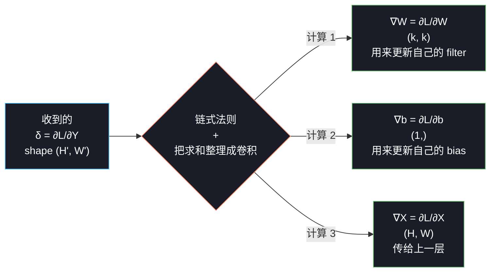
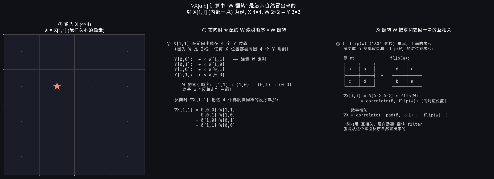
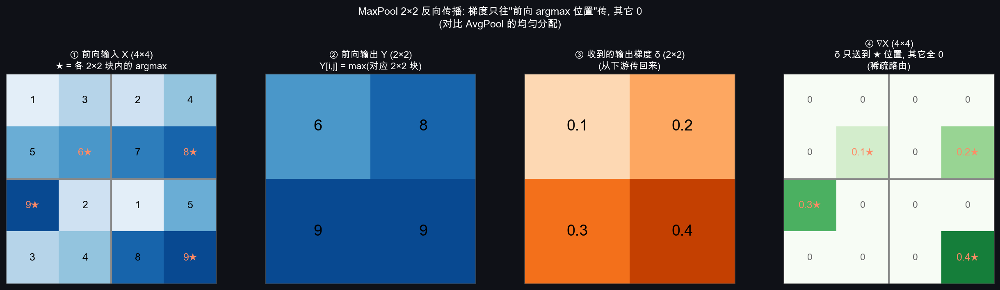
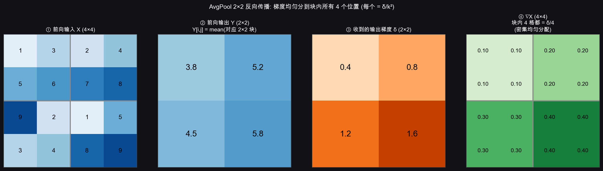
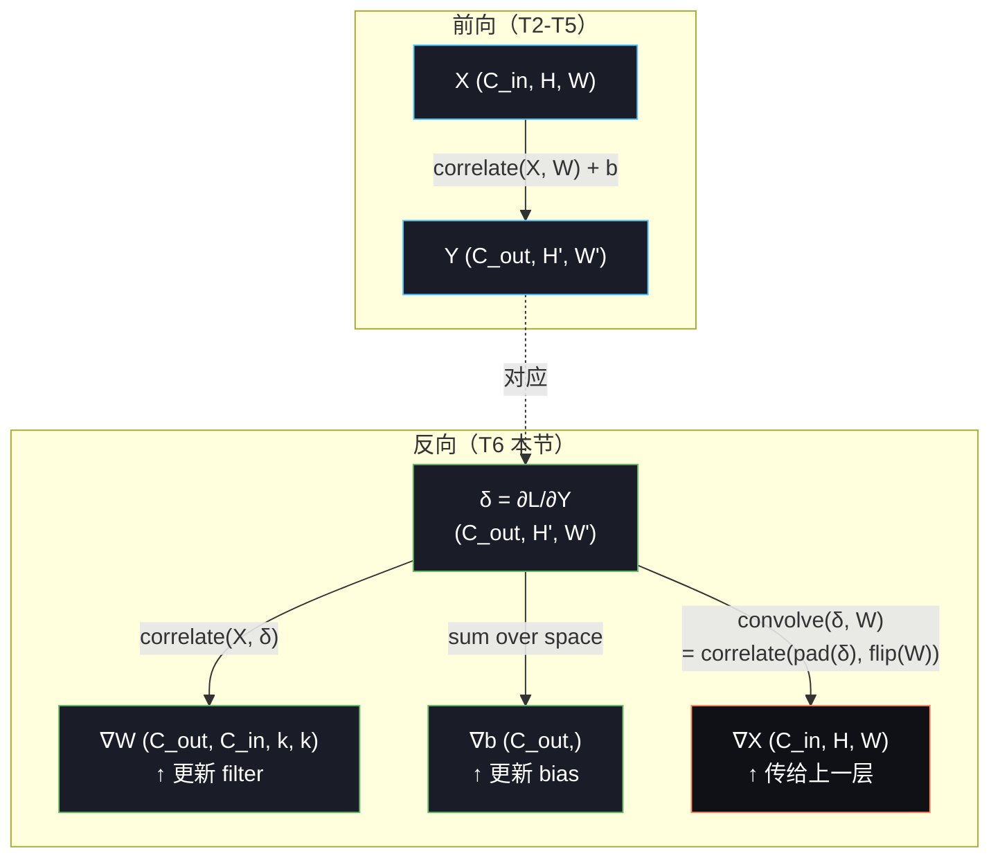

# T6：卷积层的反向传播

## 0. 上一节留下的问题

T5 把 CNN 的**前向**讲完了——卷积、padding、stride、多通道、池化、感受野。但训练 CNN 必须有**反向**：

1. 拿到输出端的梯度 $\partial \mathcal{L} / \partial Y$，怎么算 $\partial \mathcal{L} / \partial W$（用来更新 filter）？
2. 怎么算 $\partial \mathcal{L} / \partial X$（继续往前传给上一层）？
3. **MaxPool 怎么反向**（取 max 不是平滑函数，导数怎么处理）？

这一节把这三件事讲清楚。**好消息是：跟 Week 1 §6 的反向传播本质完全一样**——都是链式法则 + 缓存中间变量。**坏消息是：因为输入和输出都是 4D 张量、又有"权重共享"，索引会变得稍微烧脑**。

但只要把这一节读通，T7 手写实现 + gradient_check 通过 → CNN 训练循环就跑起来了。

---

## 1. 起点：跟 Week 1 反向传播相比，难在哪？

回忆一下 Week 1 §6 的 MLP 反向传播。一层是 $z = Wx + b$，反向就是：

$$\frac{\partial \mathcal L}{\partial W} = \delta \cdot x^\top, \qquad \frac{\partial \mathcal L}{\partial x} = W^\top \cdot \delta$$

非常干净——一层一个矩阵乘 + 一次转置。

CNN 的情况复杂在哪？

| 维度 | MLP | CNN |
|---|---|---|
| 一层的权重 | 1 个矩阵 $W$（二维） | 1 组 filter（**四维** $C_{out} \times C_{in} \times k \times k$） |
| "一个权重影响哪些输出" | 一行 $W$ 影响一个输出 $z_i$ | **一个 filter 元素影响所有空间位置的输出**（权重共享） |
| 反向时一个梯度从哪累积 | 一个输出 $z_i$ 贡献给一个 $W$ 行 | **一个 filter 元素的梯度要从所有空间位置加起来** |

T1 §3 我们说过"权重共享"——同一个 filter 在整张图上滑动。这条带来的代价就在反向：**一个 filter 元素的梯度要从所有它参与过的输出位置加起来**。这是 CNN 反向比 MLP 反向多的核心复杂度。

**好在数学上还是链式法则**：每个输出位置的梯度，乘以"该位置使用了这个 filter 元素多少次"（其实就是 1 次），然后求和。把这些求和的结构整理出来，会发现它**正好是另一个卷积**。

下面分三个量来推：$\partial \mathcal L / \partial W$（filter 梯度）、$\partial \mathcal L / \partial X$（输入梯度）、$\partial \mathcal L / \partial b$（bias 梯度）。

---

## 2. 三个梯度的全景

考虑最简单的情况：**单通道输入、单 filter、no padding、stride=1**。等核心思想出来了，§6 再扩到多通道多 filter。

设：

| 符号 | shape | 含义 |
|---|---|---|
| $X$ | $H \times W$ | 输入 |
| $W$ | $k \times k$ | filter（注意：从这节开始 $W$ 表示 filter 张量，不是输入宽度。输入宽度用别的字母表示） |
| $b$ | scalar | bias |
| $Y$ | $H' \times W'$ | 输出（$H' = H - k + 1$） |
| $\delta$ | $H' \times W'$ | 输出端的梯度 $\partial \mathcal L / \partial Y$（从下游网络传回来的） |

前向：

$$Y[i, j] = b + \sum_{m=0}^{k-1} \sum_{n=0}^{k-1} X[i+m,\ j+n] \cdot W[m, n]$$

下游某处算出 loss $\mathcal L$，再回传给我们一个 $\delta$。**我们这一层的工作**：



跟 MLP 反向的角色完全对应：算 $\nabla W$ 用来更新自己 / 算 $\nabla X$ 传给上游 / 算 $\nabla b$ 顺手。

---

## 3. $\nabla W$：filter 的梯度（最容易，结果是一次互相关）

### 3.1 单元素链式法则

先看 $W$ 里某一个元素 $W[m, n]$ 的梯度：

$$\frac{\partial \mathcal L}{\partial W[m, n]}
= \sum_{i, j} \frac{\partial \mathcal L}{\partial Y[i, j]} \cdot \frac{\partial Y[i, j]}{\partial W[m, n]}$$

第一个因子就是 $\delta[i, j]$。第二个因子从前向公式直接读出：

$$\frac{\partial Y[i, j]}{\partial W[m, n]} = X[i + m,\ j + n]$$

（前向公式里 $W[m, n]$ 跟 $X[i+m, j+n]$ 是配对相乘的——求导后只剩对方）

代回去：

$$\boxed{\frac{\partial \mathcal L}{\partial W[m, n]} = \sum_{i, j} \delta[i, j] \cdot X[i + m,\ j + n]}$$

### 3.2 这是什么？是**另一个互相关**

把上面这条公式的形状和 T2 §6 的前向公式对比：

| | 公式 | 解读 |
|---|---|---|
| 前向 $Y$ | $Y[i, j] = \sum_{m, n} X[i+m, j+n] \cdot W[m, n]$ | $X \star W = Y$（filter 是 $W$，扫描得到 $Y$）|
| 反向 $\nabla W$ | $\nabla W[m, n] = \sum_{i, j} \delta[i, j] \cdot X[i+m, j+n]$ | $X \star \delta = \nabla W$（**filter 是 $\delta$**，扫描得到 $\nabla W$）|

**漂亮的对称**：把 $\delta$ **当作 filter** 在 $X$ 上做互相关，结果就是 $\nabla W$。

形状也对得上：$X$ 是 $H \times H$、$\delta$ 是 $H' \times H'$，互相关输出是 $(H - H' + 1) \times (H - H' + 1) = k \times k$，正好是 $W$ 的形状。

### 3.3 一行代码就能算

如果你已经写了 `correlate2d(X, W)`，那 $\nabla W$ 直接复用：

```python
grad_W = correlate2d(X, delta)   # X 是输入, delta 是输出端梯度, 输出是 (k, k)
```

**反向用了和正向同一个互相关运算，只是换了输入参数**——这是 CNN 反向的第一个优雅之处。

### 3.4 把"δ 当 filter 滑过 X"画出来

用一个 4×4 的 X、3×3 的 δ（就是 W=2×2 时的输出梯度形状），看 ∇W 的 4 个元素是怎么"滑出来"的：


- **上半**：左边是 X（蓝），中间是 δ（橙）——把 δ 整个**当成一个 3×3 filter**
- **下半 4 个面板**：让 δ 在 X 上"滑动"，每一格起手位置 (m, n) 对应一个 ∇W[m, n]
  - (0,0)：δ 盖在 X[0:3, 0:3] → 对位乘求和 = ∇W[0, 0] = 5.30
  - (0,1)：δ 盖在 X[0:3, 1:4] → 5.70
  - (1,0)：5.30 → ∇W[1, 0] = 4.90
  - (1,1)：6.30
- **右上**：4 个滑动结果填进 2×2 的 ∇W 矩阵

这跟 T2 §3 前向算 Y 的过程**一模一样**，只是把"W 当 filter 滑过 X 得到 Y"换成了"δ 当 filter 滑过 X 得到 ∇W"。

---

## 4. $\nabla X$：传给上一层的梯度（最难，结果是真正的卷积）

这一段是 Week 2 数学的核心，也是 T2 §2 末尾埋的"翻转"伏笔的兑现。

### 4.1 单元素链式法则

考虑 $X$ 里某一个元素 $X[a, b]$ 的梯度：

$$\frac{\partial \mathcal L}{\partial X[a, b]}
= \sum_{i, j} \frac{\partial \mathcal L}{\partial Y[i, j]} \cdot \frac{\partial Y[i, j]}{\partial X[a, b]}$$

第一个因子还是 $\delta[i, j]$。难点在第二个：**哪些 $Y[i, j]$ 用到了 $X[a, b]$？**

回忆前向公式：$Y[i, j] = \sum_{m, n} X[i+m, j+n] \cdot W[m, n]$。$X[a, b]$ 出现在 $Y[i, j]$ 的求和里，当且仅当存在 $m, n \in [0, k-1]$ 使得：

$$i + m = a, \quad j + n = b \quad \Longleftrightarrow \quad m = a - i, \quad n = b - j$$

要求 $0 \le a - i < k$ 和 $0 \le b - j < k$。也就是说**只有起点位置 $(i, j)$ 在某个范围内的 $Y[i, j]$ 才用到了 $X[a, b]$**。

对这些 $(i, j)$，求导是：

$$\frac{\partial Y[i, j]}{\partial X[a, b]} = W[a - i,\ b - j]$$

（因为 $X[a, b]$ 在前向里跟 $W[m, n] = W[a-i, b-j]$ 配对相乘）

代回去：

$$\frac{\partial \mathcal L}{\partial X[a, b]} = \sum_{i, j} \delta[i, j] \cdot W[a - i,\ b - j]$$

求和范围是所有"用到了 $X[a, b]$"的 $(i, j)$。

### 4.2 用换元变成漂亮的形式

令 $m = a - i$、$n = b - j$，则 $i = a - m$、$j = b - n$。换元后：

$$\boxed{\frac{\partial \mathcal L}{\partial X[a, b]} = \sum_{m=0}^{k-1} \sum_{n=0}^{k-1} \delta[a - m,\ b - n] \cdot W[m, n]}$$

**这正好是 $\delta$ 和 $W$ 的真正卷积**！对照 T2 §2 数学卷积的定义 $(A * B)[a, b] = \sum_{m, n} A[a-m, b-n] \cdot B[m, n]$，一字不差。

### 4.3 等价形式：互相关 + filter 翻转

互相关和卷积差一个 filter 翻转（T2 §2.2）。所以等价地：

$$\nabla X = \delta \star \text{flip}(W)$$

用人话说：

> **把 $\delta$ 当输入、把 filter $W$ 翻转 180°（左右 + 上下都对调）当 filter，做一次互相关——结果就是 $\nabla X$**。

这就是 T2 §2 末尾说的"反向恰好是真正的卷积"——前向我们偷懒用了互相关，反向"还债"自动出现了真正的卷积（或者说翻转后的互相关）。

### 4.4 一个细节：边界要补 0

$\delta$ 的形状是 $(H', H') = (H - k + 1, H - k + 1)$，比 $X$ 小一圈。如果直接做 $\delta \star \text{flip}(W)$，输出会更小，不是 $X$ 的形状。

所以**实际计算 $\nabla X$ 时需要对 $\delta$ 补 padding $= k - 1$ 圈 0**：

```
δ 原始 shape  (H', H')
        ↓ pad k-1 zeros 四周
δ_padded shape (H' + 2(k-1), H' + 2(k-1)) = (H + k - 1, H + k - 1)
        ↓ correlate with flip(W) (k×k filter)
∇X shape       (H + k - 1 - k + 1, ...) = (H, H)  ✓
```

形状正好对得上。这就是 §4.3 那条公式真正能跑的版本：

```python
grad_X = correlate2d(np.pad(delta, k-1), np.flip(W, axis=(0, 1)))   # 翻转 W
```

### 4.4.5 把"W 翻转怎么自然冒出来"画出来

§4.1-§4.3 推了半天，最关键的"为什么 W 在反向里被翻转"用一张图就能秒懂。盯紧 X[1, 1]（4×4 输入里偏左上的内部一点），看它在前向时跟哪些 W 元素配对相乘，反向时这些元素以**反序**回来累加：



- **左**：X[1,1] 用 ★ 标出
- **中**：X[1,1] 在前向时被 4 个 Y 位置用到，配的 W 索引顺序是 **(1,1) → (1,0) → (0,1) → (0,0)**——**正好是 W 的反序**！这不是巧合，是从 §4.1 公式 $\partial Y[i,j]/\partial X[a,b] = W[a-i, b-j]$ 的 $a-i, b-j$ 这种"反向索引"自然冒出来的。
- **右**：把上面那些 $W[1,1], W[1,0], W[0,1], W[0,0]$ 重新排成一个 2×2 矩阵 → 就是把原 W **180° 旋转**后的形状（即 flip(W)）。这样 ∇X[1,1] 的求和就变成 $\delta[0:2, 0:2] \odot \text{flip}(W)$ 一次干净的对位乘求和。

**记忆要点**：W 翻转不是数学家拍脑袋加上去的步骤，而是反向时索引天然反走的副产物。

### 4.5 直觉：反向梯度是怎么"汇聚"的

```
前向: 每个输入 X[a,b] 同时影响多个 Y[i,j]
                 (在它的 k×k 邻域内的输出都用了它)

      X[a,b] ──┬──→ Y[i₀, j₀]
               │
               ├──→ Y[i₁, j₁]
               │       ...
               └──→ Y[iₖ-₁, jₖ-₁]


反向: ∇X[a,b] 必须把所有用过 X[a,b] 的 Y 处梯度加起来
                 (而且每个梯度还要乘对应位置的 W 值)

      Y[i₀, j₀] · W[?, ?] ──┐
      Y[i₁, j₁] · W[?, ?] ──┼──→ ∇X[a,b]
              ...           │       (累加)
      Y[iₖ-₁,jₖ-₁]· W[?,?] ─┘
```

把这些"累加"按公式整理后，恰好就是 §4.2 那个真正卷积的形式。

---

## 5. $\nabla b$：bias 梯度（最简单，一句话）

bias $b$ 是个标量，前向时被加到所有 $Y[i, j]$。所以：

$$\frac{\partial \mathcal L}{\partial b} = \sum_{i, j} \delta[i, j]$$

**就是 $\delta$ 在空间维上求和**。一行 numpy：

```python
grad_b = delta.sum()
```

---

## 6. 多通道、多 filter 的扩展

§3-5 推的是单通道单 filter。多通道（$C_{in}$ 个输入通道）、多 filter（$C_{out}$ 个 filter）的情况下，公式只**多两个求和**，结构完全不变。

设 $X$ 形状 $(C_{in}, H, H)$、$W$ 形状 $(C_{out}, C_{in}, k, k)$、$Y$ 形状 $(C_{out}, H', H')$、$\delta$ 形状 $(C_{out}, H', H')$。

| 量 | 公式 | 直觉 |
|---|---|---|
| $\nabla W[k_o, c, m, n]$ | $\sum_{i, j} \delta[k_o, i, j] \cdot X[c, i+m, j+n]$ | 第 $k_o$ 个 filter 的第 $c$ 个通道梯度 = 输入第 $c$ 通道 与 $\delta$ 第 $k_o$ 通道做互相关 |
| $\nabla X[c, a, b]$ | $\sum_{k_o} \sum_{m, n} \delta[k_o, a-m, b-n] \cdot W[k_o, c, m, n]$ | 输入第 $c$ 通道的梯度 = 所有输出通道梯度 与 对应 filter（翻转后）做卷积、再在 $k_o$ 上求和 |
| $\nabla b[k_o]$ | $\sum_{i, j} \delta[k_o, i, j]$ | 第 $k_o$ 个 bias 的梯度 = $\delta$ 第 $k_o$ 通道空间维求和 |

记忆要点：**通道维多出来的 $\sum$ 都是"对位求和"**，和 §3-5 的"空间求和"是同样的链式法则结构。

---

## 7. MaxPool 反向：稀疏路由

MaxPool 没有可学参数，所以**没有 $\nabla W$ 要算**——只需要算 $\nabla X$（传给上一层）。

但 MaxPool 的前向是 `max` 操作——**不是平滑函数**，严格说不可导。怎么办？业界采用**次梯度（subgradient）**做法：

> **梯度只传给"当时取到 max 的那个位置"，其它位置梯度为 0。**

举例（用 T5 §2.1 的 4×4 → 2×2 那个例子）：

```
前向:
输入 X (4×4)              输出 Y (2×2)             记录 max 位置
  1 3 2 4                   6 8                     左上块: max 在 (1,1)
  5 6 7 8        →                       +          右上块: max 在 (1,1)
  9 2 1 5                   9 9                     左下块: max 在 (0,0)
  3 4 8 9                                           右下块: max 在 (1,1)

(假设输出端梯度 δ = [[0.1, 0.2], [0.3, 0.4]])

反向: 
∇X = 把 δ 的每个数, 分别送到对应块里"当时取到 max 的位置", 其他位置填 0:

  ┌───┬───┬───┬───┐
  │ 0 │ 0 │ 0 │ 0 │       δ[0,0]=0.1 → 左上块的 (1,1) → ∇X[1,1] = 0.1
  ├───┼───┼───┼───┤       δ[0,1]=0.2 → 右上块的 (1,1) → ∇X[1,3] = 0.2
  │ 0 │0.1│ 0 │0.2│       δ[1,0]=0.3 → 左下块的 (0,0) → ∇X[2,0] = 0.3
  ├───┼───┼───┼───┤       δ[1,1]=0.4 → 右下块的 (1,1) → ∇X[3,3] = 0.4
  │0.3│ 0 │ 0 │ 0 │
  ├───┼───┼───┼───┤       其它位置全是 0 → MaxPool 反向是稀疏路由
  │ 0 │ 0 │ 0 │0.4│
  └───┴───┴───┴───┘
```

直觉：**前向时谁是赢家，反向时奖励就发给谁**。其它位置在前向被 max 排除掉了，反向也得不到任何梯度——这正是 MaxPool 让网络"专注于强响应位置"的代价/优点。

实现要点：**前向时必须缓存 max 的位置索引**（argmax），反向时直接用。

```python
# 前向
Y[i, j] = X[i*s:i*s+k, j*s:j*s+k].max()
mask = (X[i*s:i*s+k, j*s:j*s+k] == Y[i, j])  # 记录 max 位置, shape (k, k)

# 反向
grad_X[i*s:i*s+k, j*s:j*s+k] += mask * delta[i, j]
```

把这一切画成一张图：



- **①** 前向 X 里 4 个 2×2 块各自 argmax 用橙色 ★ 标出（6, 8, 9, 9）
- **②** 前向输出 Y 就是这 4 个 max 值
- **③** 假设下游传回 δ = [[0.1, 0.2], [0.3, 0.4]]
- **④** ∇X 里**只有 ★ 位置拿到对应的梯度**（绿色），其它 12 个位置全是 0

这就是"稀疏路由"——MaxPool 的反向是**信息丢失最多的反向**之一（4×4 输入 16 个数，反向只有 4 个数有梯度）。这也解释了 ResNet 之后为什么倾向用 stride 卷积代替它。

---

## 8. AvgPool 反向：均匀分配

AvgPool 是平滑函数（取平均），可以直接求导。每个输入像素对输出的贡献都是 $1/k^2$，所以反向时输出端的梯度被**均匀分配**给窗口内所有 $k^2$ 个输入位置：

```python
# 反向
grad_X[i*s:i*s+k, j*s:j*s+k] += delta[i, j] / (k * k)
```

跟 MaxPool 对比：**MaxPool 的梯度是稀疏的（一个位置一个梯度），AvgPool 的梯度是密集的（均匀铺开）**。这也是为什么现代网络更倾向用 stride 卷积——它给输入的所有位置都传梯度，比 MaxPool 信息保留更好、比 AvgPool 还能学加权。



跟 MaxPool 那张并排对比能看出最直观的差别：**MaxPool 反向 ∇X 一片白只有 4 个亮点；AvgPool 反向 ∇X 是均匀的色块**。前者梯度集中在赢家、后者所有位置雨露均沾——同一个 δ 值，传回去的"信息密度"完全不同。

---

## 9. 一图总结：前向 ↔ 反向对照

把 Week 2 整章的前向、反向都画在一起：



橙色突出的 $\nabla X$ 那条是**整章的核心结果**——前向用互相关、反向"传给上一层的梯度"恰好是真正的卷积（或等价地，互相关于翻转后的 filter）。这就是 T2 §2 末尾埋的伏笔。

---

## 10. 这一节给 T7 实现留下的要点

把 §3-§8 的全部结论汇总成一张速查表，T7 写代码时直接对照：

| 量 | 公式 | numpy 实现关键步骤 |
|---|---|---|
| $\nabla W$ | $X \star \delta$ | 对每对 $(c, k_o)$，把 $X[c]$ 与 $\delta[k_o]$ 做互相关 |
| $\nabla b$ | $\sum_\text{spatial} \delta$ | `delta.sum(axis=(2, 3))` |
| $\nabla X$ | $\delta * W$（真正卷积，需 pad 和 flip） | pad $\delta$ 四周 $k-1$ 圈 0；翻转 $W$；做互相关 |
| MaxPool $\nabla X$ | 稀疏路由到 max 位置 | 前向缓存 argmax，反向只在那个位置加 $\delta$ |
| AvgPool $\nabla X$ | $\delta / k^2$ 均匀铺开 | 直接用广播 |

实现时一定要做的事：

1. **gradient_check 必须过**——跟 Week 1 一样，相对误差 < 1e-4 才算对。卷积反向的索引错误一抓一大把，必须靠数值梯度兜底。
2. **前向时缓存中间变量**——`X`、`max 位置 (MaxPool)`，反向时直接复用。
3. **多通道/多 filter 用 numpy broadcast** 代替 for 循环，否则 Python 速度会让你怀疑人生。最终性能的杀手锏是 **im2col**——把卷积变成一次大矩阵乘，T7 详细讲。

---

## 11. 这一节留下的问题

T6 把卷积反向传播的所有数学讲完了。T7 要做的事很明确：

1. 实现 `conv2d_numpy.py`：forward + backward，含 `gradient_check`
2. 实现 `maxpool_numpy.py`：forward + backward
3. 跑梯度检验，确认所有公式实现正确
4. 性能加速（im2col + 矩阵乘）

理论密度从这一节开始下降，回到 Week 1 那种"代码 + 验证"的实操节奏。**T7 是 Week 1 §10 gradient_check 套路的直接复用**——只是被验证的对象从 MLP 的 `W3` 换成了 conv 的 `W` 和 pool 的反向。

下一节 → `08_code_walkthrough.md`（T7：代码实现走读）

> 注：`07_thinking_log.md` 留给 Week 2 学习过程中的关键思考记录，会在写代码时穿插补充。
