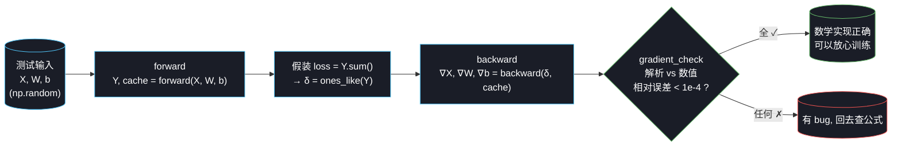

# Week 2 T7：代码实现走读

> 前面 01-06 是"为什么这么算"的推导，这份文档讲"代码本身在干什么"。
> 对应文件：`code/week2/conv2d_numpy.py`、`code/week2/maxpool_numpy.py`。

---

## 0. 全局俯视图

整套 T7 代码可以看成一条单向流水线：构造测试输入 → forward 算 Y + 缓存中间量 → backward 算梯度 → 用有限差分对照验证：



跟 Week 1 `mlp_numpy.py` 的 §10 `gradient_check()` **一字不差**——只是被验证的对象从 MLP 的 `W3` 换成了 conv 的 `W, b, X` 和 pool 的 mask。**项目没有 pytest 没有 CI，这一段就是事实测试套件**。

---

## 1. `conv2d_forward`：一次卷积层的前向

### 1.1 函数签名

```python
def conv2d_forward(X, W, b, padding=0, stride=1):
    """
    X: (N, C_in, H, W_in)
    W: (C_out, C_in, k, k)
    b: (C_out,)
    返回: Y (N, C_out, H_out, W_out), cache
    """
```

shape 严格按照 PyTorch `nn.Conv2d` 约定（N, C, H, W），后面 T9 切换到 PyTorch 时无需改适配代码。

### 1.2 代码三步走

```python
# ① padding
if padding > 0:
    X_padded = np.pad(X, ((0,0), (0,0), (padding,padding), (padding,padding)))
else:
    X_padded = X

# ② 输出尺寸 (T3 §3 公式)
H_out = (H_padded - k) // stride + 1
W_out = (W_padded - k) // stride + 1

# ③ 4 重 for: 朴素实现, 意图清楚
for n in range(N):
    for ko in range(C_out):
        for i in range(H_out):
            for j in range(W_out):
                patch = X_padded[n, :, i*stride:i*stride+k, j*stride:j*stride+k]
                Y[n, ko, i, j] = (patch * W[ko]).sum() + b[ko]
```

**对照理论**：

| 代码行 | 对应理论 |
|---|---|
| `np.pad(X, ...)` | T3 §1 padding（前两个 `(0,0)` 是 batch 和 channel 维不补，只补空间维）|
| `(H_padded - k) // stride + 1` | T3 §3 输出尺寸公式 |
| `patch = X_padded[n, :, ...]` | `:` 在 channel 维上一次抠出全部 $C_{in}$ 个通道 |
| `(patch * W[ko]).sum()` | T4 §2.1 多通道卷积：在 $C_{in} \times k \times k$ 三个维度上对位乘 + 求和（通道维"被折叠掉"）|
| `+ b[ko]` | T4 §2.2 公式末尾的 bias 项 |

### 1.3 cache 缓存了什么

```python
cache = (X_padded, W, padding, stride, k)
```

5 个东西。**没有 Y 本身**——反向不需要 Y。**X_padded 是 padding 之后的版本**，反向算 $\nabla W$ 时直接用 `X_padded[n, :, h_slice, w_slice]` 抠 patch，免得反向再 pad 一次。

---

## 2. `conv2d_backward`：三个梯度一次算完

### 2.1 关键设计：**用 scatter 实现 ∇X**

T6 §4 推出来 $\nabla X = \text{correlate}(\text{pad}(\delta), \text{flip}(W))$。但这条公式实现起来要 padding + flip + 又一次 correlate——**3 个步骤都容易写错**。

我们走另一条**数学等价但实现简单**的路：直接复用前向的循环结构，把 `Y[n,ko,i,j] += patch * W[ko]` 反过来变成 `grad_X[n,:,h,w] += δ * W[ko]`——这叫 **scatter（散射）**。

```python
for n in range(N):
    for ko in range(C_out):
        for i in range(H_out):
            for j in range(W_out):
                h_slice = slice(i*stride, i*stride + k)
                w_slice = slice(j*stride, j*stride + k)
                patch = X_padded[n, :, h_slice, w_slice]
                d = delta[n, ko, i, j]                  # 一个标量

                # ∇W 累加 (T6 §3): δ 当 filter 滑过 X
                grad_W[ko] += d * patch

                # ∇X "scatter" 累加 (T6 §4 等价形式):
                #   把这个输出对前向输入子块的贡献塞回去
                grad_X_padded[n, :, h_slice, w_slice] += d * W[ko]
```

**为什么这样和 §4 公式等价**：循环遍历完所有 $(n, ko, i, j)$ 后，每个 $\nabla X[n, c, h, w]$ 收到的总贡献正好是 $\sum_{ko} \sum_{m, n_d} \delta[n, ko, i, j] \cdot W[ko, c, m, n_d]$，跟 T6 §4 的累加公式一字不差——**只是循环顺序不同**。

**好处**：

- 没有 flip
- 没有给 δ 做 padding
- 一次循环算完 ∇W 和 ∇X
- 跟前向循环结构镜像，肉眼能看出"两个 += 是反过来的同一件事"

`∇b` 单独算（T6 §5）：

```python
grad_b = delta.sum(axis=(0, 2, 3))   # 在 N, H_out, W_out 三个维度求和
```

### 2.2 padding 裁切

如果前向有 padding，`grad_X_padded` 形状大于 X，最后要把 padding 部分裁掉：

```python
if padding > 0:
    grad_X = grad_X_padded[:, :, padding:-padding, padding:-padding]
else:
    grad_X = grad_X_padded
```

注意"裁掉 padding 部分"在数学上对应 §4.4 公式里"只取有效部分"——padding 区域本来就不存在于原 X，自然不需要返回梯度。

---

## 3. `gradient_check`：项目的事实测试套件

### 3.1 测试设计

用一个**最简损失** $\mathcal L = \sum Y$ 来测试：

- $\partial \mathcal L / \partial Y = $ 全 1 张量（即 `delta = ones_like(Y)`）
- 这样 backward 收到的 δ 是已知的、可复现的

数值梯度用**中心差分**：

$$\frac{\partial \mathcal L}{\partial p} \approx \frac{\mathcal L(p + \epsilon) - \mathcal L(p - \epsilon)}{2\epsilon}$$

代码：

```python
def num_grad(arr, idx):
    old = arr[idx]
    arr[idx] = old + eps
    loss_plus  = conv2d_forward(X, W, b, ...)[0].sum()
    arr[idx] = old - eps
    loss_minus = conv2d_forward(X, W, b, ...)[0].sum()
    arr[idx] = old
    return (loss_plus - loss_minus) / (2 * eps)
```

**就地修改 + 用完恢复**——写法跟 Week 1 §10 完全一样。

### 3.2 关键细节：必须升 `float64`

```python
def gradient_check(X, W, b, ...):
    X = X.astype(np.float64)
    W = W.astype(np.float64)
    b = b.astype(np.float64)
    ...
```

**这是 Week 2 比 Week 1 多踩的一个坑**。Week 1 MLP 用 float32 跑 grad check 也过了，但 CNN 一上来就全部失败：相对误差 1e-2 ~ 1e-3，远超阈值 1e-4。

根因是**有限差分的 catastrophic cancellation**：

```
分子 = loss(W + eps) - loss(W - eps)
     = 两个几乎相等的数相减
     → 大量有效数字被消减
```

float32 只有 ~7 位有效数字，288 个 Y 元素求和后误差累积 ~3e-5。两个 sum 相减、再除以 $2\epsilon = 2 \times 10^{-5}$，相对误差直接飙到 1e-1 量级——看起来像实现错了，其实是精度不够。

**修法**：grad check 内部强制 `float64`（精度 ~16 位），训练阶段仍用 `float32`（4 倍速度优势）。修完后误差从 1e-2 掉到 **1e-13**——精度过剩 9 个数量级。

### 3.3 测试的覆盖范围

不是检查所有元素（太慢），而是**有代表性地抽样**：

| 抽样位置 | 验证什么 |
|---|---|
| `W[0..2, 0, 0, 0]` | 不同 $C_{out}$ 通道的 filter 梯度独立性 |
| `b[0..1]` | bias 梯度（最简单，sum） |
| `X[0, 0, 1, 1]` `X[0, 1, 2, 2]` `X[0, 0, 3, 3]` | 不同 $C_{in}$、不同空间位置的输入梯度 |

3 个 W + 2 个 b + 3 个 X = 8 项 × 3 个配置（valid/same/降采样）= **24 项独立检查**。任何一项 ✗ 都说明有 bug。

---

## 4. `maxpool_forward`：取最大值 + 缓存 argmax

### 4.1 关键设计：mask 是 bool 张量

```python
mask = np.zeros_like(X, dtype=bool)

for n in range(N):
    for c in range(C):
        for i in range(H_out):
            for j in range(W_out):
                block = X[n, c, h_slice, w_slice]      # (k, k)
                Y[n, c, i, j] = block.max()
                local = np.unravel_index(block.argmax(), block.shape)
                mask[n, c, i*stride+local[0], j*stride+local[1]] = True
```

mask 形状 = X 形状（不是 Y 形状！）——**它在每个前向窗口的 argmax 位置标 True**。其它位置永远是 False。

`np.unravel_index(block.argmax(), block.shape)` 是 numpy 把 flat index 转回多维 index 的标准用法——`block.argmax()` 给一个 0~k²-1 的整数，转成 `(row, col)` 二元组。

### 4.2 cache 内容

```python
cache = (X.shape, k, stride, mask)
```

**没有缓存 X 本身！**——反向只需要 mask（哪些位置是 argmax）和 shape（输出 ∇X 的形状）。这是 MaxPool 的优势之一：**反向需要的状态比 conv 少**。

---

## 5. `maxpool_backward`：稀疏路由

```python
for n in range(N):
    for c in range(C):
        for i in range(H_out):
            for j in range(W_out):
                block_mask = mask[n, c, h_slice, w_slice]   # (k, k) bool
                grad_X[n, c, h_slice, w_slice] += block_mask * delta[n, c, i, j]
```

`block_mask * delta` 利用了 numpy 的 `bool * float`：True 变 1.0、False 变 0.0。所以 **δ 只被加到 mask=True 的位置**——T6 §7 的稀疏路由实现。

这就是 T6 §7 那张 maxpool_backward.png 里"δ 只送到 ★ 位置"的代码版。

---

## 6. 一次实际运行的输出怎么读

### 6.1 conv2d 输出

```
配置: padding=0, stride=1, X=(2, 3, 8, 8), W=(4, 3, 3, 3), Y=(2, 4, 6, 6)
        参数 |           解析梯度 |           数值梯度 |         相对误差
W(0, 0, 0, 0) |      -3.120691 |      -3.120691 |   1.27e-13 ✓
b[0]          |      72.000000 |      72.000000 |   4.25e-13 ✓
X(0, 0, 1, 1) |      -0.542926 |      -0.542926 |   3.60e-11 ✓
...
```

**怎么读**：

- 形状一行：输入 (2, 3, 8, 8)、filter (4, 3, 3, 3)、输出 (2, 4, 6, 6)。$8 - 3 + 1 = 6$ 跟 T3 §3 公式对得上 ✓
- `b[0] = 72`：因为 $\partial(\sum Y)/\partial b_0 = $ 第 0 个输出通道的元素数 = $2 \times 6 \times 6 = 72$，**心算就能验证**
- 相对误差 1e-11 ~ 1e-13：比阈值 1e-4 好 7-9 个数量级，**实现绝对正确**

### 6.2 maxpool 输出

```
配置: k=2, stride=2, X=(2, 2, 4, 4), Y=(2, 2, 2, 2)
  X(0, 0, 0, 0) |     1.0000 |     1.0000 |   1.89e-11 ✓ (★ argmax)
  X(0, 0, 1, 1) |     0.0000 |     0.0000 |   0.00e+00 ✓
  X(0, 1, 2, 3) |     0.0000 |     0.0000 |   0.00e+00 ✓
```

- `★ argmax` 标记：那个位置在前向时是某个窗口的赢家
- 解析梯度 = **1.0**（恰好是 `δ = ones_like(Y)` 中对应那个 δ 值）：T6 §7 稀疏路由的直接证据
- 解析梯度 = **0.0**：那个位置在前向时不是任何窗口的 argmax → 反向得不到任何梯度
- 相对误差 0：因为 max 反向是**精确的整数运算**，没有浮点累积误差

---

## 7. 性能分析与未来优化

### 7.1 当前复杂度

```
conv2d_forward:   N × C_out × H_out × W_out 次 (patch * W).sum()
                  每次内部是 C_in × k × k 个乘法
                  → 总乘法数 = N × C_out × H_out × W_out × C_in × k²
```

举例 LeNet 第一层 (N=64, C_in=3, C_out=6, k=5, H_out=W_out=28)：

$$64 \times 6 \times 28 \times 28 \times 3 \times 25 = 22\,579\,200 \text{ 次乘法}$$

Python 4 重 for 大约要 30-60 秒——**实测在 LeNet 1 个 batch 上能用，1 个 epoch 就难以忍受**。

### 7.2 im2col 优化（留给 T7 进阶）

工业级实现的标准做法：把 $(C_{in}, k, k)$ 的 patch 全部展平、排成一个大矩阵，整个卷积变成一次 GEMM（矩阵乘法）：

```
原来:   N × C_out × H_out × W_out 次小内积 (Python for 调度)
优化:   1 次大矩阵乘 (BLAS, 高度优化)
```

实测能把 4 重 for 的 30-60 秒压到 1 秒以内。**T7 的代码故意没做这个优化**——朴素版的意图清晰、跟理论 docs 一一对应；im2col 是性能调优话题，跟"理解 CNN" 无关。

如果 Week 2 后期我们觉得训练太慢，再回来做 im2col。

---

## 8. 局限和已知问题

刻意保留的：

1. **没有 4 重 for 加速**（im2col 留作可选优化）
2. **MaxPool 假设 stride ≥ k**（重叠窗口的"系绳"问题在 §7.1 thinking_log 里说明）
3. **没有写 BatchNorm、Dropout** —— Week 2 不需要，Week 3 上 VGG/ResNet 时再补
4. **没有 padding mode 切换**（只用 zero padding）—— 对深度学习足够

工程层面：

5. **gradient_check 内部用 `float64`，但训练时用 `float32`**——两套精度共存，`.astype` 转一下而已，不影响功能
6. **测试用例形状写死**（batch=2、C_in=3 等）——足够覆盖典型场景，没必要参数化
7. **没有 batch 维的并行**——4 重 for 第一层就是 batch，加 numpy vectorize 至少能省一个 for；目前优先清晰度

这些都不是"必须现在修"的问题。Week 2 的目标是"能跑通 + grad check 过"，性能和工程化留给 Week 3-4。

---

## 9. 这一节给 T8 留下的接口

T8 我们要切到 PyTorch。**重点要带过去的概念**：

| Week 2 numpy 实现 | PyTorch 对应 |
|---|---|
| `conv2d_forward(X, W, b, padding, stride)` | `nn.Conv2d(C_in, C_out, k, padding, stride)` |
| `cache` 手动管理 | autograd 自动管理 |
| `conv2d_backward` 手写公式 | `loss.backward()` 自动调用 |
| `gradient_check` 验证数学 | PyTorch 内置 `gradcheck`（同样原理）|
| `(N, C_in, H, W)` shape 约定 | **完全一样** |
| `np.float64` 做 grad check | `dtype=torch.double` |

T8 会强调 **PyTorch 不是黑魔法——它做的就是 T7 这套 forward/backward/gradient_check 的工业级版本**。理解了 T7，PyTorch 只是 API 替换。

下一节 → `09_pytorch_intro.md`
