# T8：PyTorch 入门——把我们手写的反向传播自动化

## 0. 上一节留下的问题

T7 我们手写了 `conv2d_numpy.py`、`maxpool_numpy.py`，跑通了 grad check。但有几件事让人不舒服：

1. **每个新 layer 都要手推、手写 backward**——VGG 16 层、ResNet 50 层，手写不现实
2. **forward 时要手动维护 cache**——稍微复杂点的网络，cache 字典会爆炸
3. **训练循环全是样板代码**——shuffle、minibatch、参数更新，每个项目重写一遍
4. **CPU 上 4 重 for 训完 LeNet 一个 epoch 要分钟级**——CIFAR-10 跑完 20 epoch 要几个小时

PyTorch 把这四件事**全部自动化**。但很多人学 PyTorch 时把它当成一个全新的工具去记 API，丢掉了"这只是把 T7 的 numpy 代码工业级化"的本质。

**这一节的目标**：用 Week 2 numpy 实现做对照，把 PyTorch 的核心概念（Tensor、autograd、nn.Module、DataLoader、Optimizer）一次讲清。理解到位之后，T9 写 LeNet 你会发现 PyTorch 不是黑魔法——**它做的就是 T7 这套 forward/backward/gradient_check 的工业级版本**。

---

## 1. PyTorch 是什么、不是什么

**是什么**：一个加了三件事的 numpy

| 加了什么 | 解决的痛点 |
|---|---|
| **autograd（自动求导）** | 不用手写 backward |
| **GPU 后端**（CUDA / MPS） | 不用受限于 CPU 速度 |
| **`nn` / `optim` / `data` 模块** | 把训练循环里的样板代码打包 |

**不是什么**：

- 不是 "深度学习专用语言"——它就是 Python，import 就能用
- 不是 "黑盒"——所有运算都明确定义，包括 autograd（也是确定性的）
- 不是 "比 numpy 更难学"——核心 API 比 numpy 还少

写 `import torch` 之后，你可以**当 numpy 用**：

```python
import torch
x = torch.randn(3, 4)        # 类似 np.random.randn
y = x @ x.T                  # 矩阵乘, 跟 numpy 一模一样
print(y.shape)               # torch.Size([3, 3])
```

---

## 2. Tensor：加了三个能力的 ndarray

`torch.Tensor` 跟 `numpy.ndarray` 在 95% 情况下行为一致。区别只在三点：

| 维度 | numpy.ndarray | torch.Tensor |
|---|---|---|
| 设备 | 只能 CPU | **CPU / GPU 都行**（`.to('mps')` / `.to('cuda')`）|
| 自动求导 | 没有 | **每个 Tensor 自带 `.requires_grad` 标记** |
| 创建函数 | `np.zeros, np.random.randn` | `torch.zeros, torch.randn`（API 几乎一样）|

互相转换零成本：

```python
import numpy as np, torch

a_np = np.array([[1, 2], [3, 4]])
a_pt = torch.from_numpy(a_np)         # numpy → tensor (共享内存)
a_back = a_pt.numpy()                  # tensor → numpy (共享内存, 仅 CPU 上)
```

写 PyTorch 时可以**继续用 numpy 的直觉**——索引、切片、broadcast、矩阵乘都一样。

### 2.1 GPU 一行切换

```python
device = 'mps' if torch.backends.mps.is_available() else 'cpu'   # Mac M 系列
# device = 'cuda' if torch.cuda.is_available() else 'cpu'        # NVIDIA GPU
x = torch.randn(1024, 1024, device=device)
y = x @ x                              # 在 GPU 上算, 自动并行
```

CIFAR-10 + LeNet 在 Apple Silicon MPS 上**比 CPU 快 5-10 倍**——这是把训练时间从小时压到分钟的关键。

---

## 3. autograd：把我们手写的 cache 自动化

这是 PyTorch 的灵魂。理解它的最快方式：**autograd 替你做了 T7 里"手动维护 cache + 手写 backward"那两件事**。

### 3.1 我们 T7 是怎么做的

```python
# Week 2 numpy 版本
Y, cache = conv2d_forward(X, W, b)            # 手动接 cache
loss = Y.sum()
delta = np.ones_like(Y)                        # 手动初始化梯度
grad_X, grad_W, grad_b = conv2d_backward(delta, cache)   # 手动调 backward
```

每个新 layer 都要这样手工一遍。

### 3.2 PyTorch 是怎么做的

```python
# PyTorch 版本
W = torch.randn(C_out, C_in, k, k, requires_grad=True)   # 标记"要算梯度"
b = torch.zeros(C_out, requires_grad=True)
X = torch.randn(N, C_in, H, W_in)                        # 不要梯度

Y = torch.nn.functional.conv2d(X, W, bias=b)             # 前向
loss = Y.sum()                                           # 标量损失
loss.backward()                                          # 一行触发反向

print(W.grad.shape)    # 自动算好的 ∇W, 跟 T7 conv2d_backward 返回的一样
print(b.grad.shape)    # 自动算好的 ∇b
```

**`loss.backward()` 这一行就完成了 Week 2 全部 backward 推导**。

### 3.3 autograd 内部做了什么

每次做 Tensor 运算（`@`, `+`, `*`, `conv2d` 等等），PyTorch **自动记录一张"计算图"**——节点是 Tensor，边是运算。这就是我们 T7 手动维护的 `cache`，只不过 PyTorch 替你建好。

调 `.backward()` 时，autograd **沿计算图反向遍历**，对每个节点应用预定义好的 backward 规则（`conv2d` 的 backward 就是 T6 §3-§5 的公式），把梯度累加到 `requires_grad=True` 的叶子节点的 `.grad` 属性上。

```mermaid
flowchart LR
    subgraph T7_NP["Week 2 numpy 版"]
      A1["forward 时<br/>手动塞 cache"] --> B1["backward 时<br/>手写公式 + 用 cache"]
    end
    subgraph PT["PyTorch autograd"]
      A2["forward 时<br/>autograd 自动记<br/>computation graph"] --> B2["loss.backward()<br/>沿图反向遍历<br/>累加到 .grad"]
    end
    T7_NP -.原理一致, 实现自动化.-> PT

    classDef np fill:#1a1d27,stroke:#4fc3f7,color:#fff
    classDef pt fill:#1a1d27,stroke:#66bb6a,color:#fff
    class A1,B1 np
    class A2,B2 pt
```



每个 Tensor 都有：

- `.requires_grad`：True 才参与建图、才算梯度
- `.grad`：算出来的梯度存这里
- `.grad_fn`：指向产生它的运算节点（debug 用）

### 3.4 验证 autograd 跟我们手写一致

可以用 PyTorch 自己的 `torch.autograd.gradcheck`——**它做的就是 Week 2 我们的 `gradient_check`**：

```python
import torch.autograd

def my_conv(X, W, b):
    return torch.nn.functional.conv2d(X, W, b)

X = torch.randn(2, 3, 8, 8, dtype=torch.double, requires_grad=True)
W = torch.randn(4, 3, 3, 3, dtype=torch.double, requires_grad=True)
b = torch.randn(4, dtype=torch.double, requires_grad=True)

torch.autograd.gradcheck(my_conv, (X, W, b))   # 内部对 PyTorch 的 backward
                                                # 跟有限差分对照, 跟我们做的事一样
```

注意 `dtype=torch.double`——**PyTorch 的 gradcheck 内部也用 float64**，原因跟我们 T7 §3.2 一样（float32 finite differencing 噪声太大）。**Week 2 我们独立踩到的坑，正好是 PyTorch 文档里专门提醒的事**——好的工程实践是相通的。

---

## 4. `nn.Module`：把"参数 + forward"打包成类

T7 我们的 `conv2d_forward(X, W, b, padding, stride)` 是个**纯函数**，参数 `W, b` 要外部传入。这种写法在小例子可以，**网络一深就乱**——10 层 conv 就要传 20 个 `(W, b)` 参数。

PyTorch 用面向对象的 `nn.Module` 包起来：

```python
import torch.nn as nn

class MyConv(nn.Module):
    def __init__(self, C_in, C_out, k):
        super().__init__()
        self.weight = nn.Parameter(torch.randn(C_out, C_in, k, k) * 0.1)
        self.bias   = nn.Parameter(torch.zeros(C_out))

    def forward(self, X):
        return torch.nn.functional.conv2d(X, self.weight, self.bias)

layer = MyConv(C_in=3, C_out=16, k=3)
Y = layer(X)                            # 调 forward, X 是 batch
```

### 4.1 nn.Parameter 是什么

`nn.Parameter` 是一个**自动 `requires_grad=True` 的 Tensor**，并且**自动注册到所属 Module 的参数列表**——你写 `nn.Parameter(...)` 它就成了"这层的可学权重"。

`layer.parameters()` 会返回所有 nn.Parameter 的迭代器（用于 optimizer）。

### 4.2 PyTorch 内置 nn.Conv2d

实践中你不需要自己写上面的 `MyConv`，PyTorch 提供了 `nn.Conv2d`：

```python
layer = nn.Conv2d(in_channels=3, out_channels=16, kernel_size=3, padding=1)
Y = layer(X)
```

**这就是 Week 2 T2-T6 全部理论的工业封装**——`nn.Conv2d.forward` 内部跟 `conv2d_numpy.py` 做的事一字不差，只是 C++/CUDA 实现 + im2col 优化 + 多种 padding mode。

### 4.3 Module 嵌套：网络就是 Module 套 Module

```python
class LeNet(nn.Module):
    def __init__(self):
        super().__init__()
        self.conv1 = nn.Conv2d(3, 6, kernel_size=5)
        self.pool  = nn.MaxPool2d(kernel_size=2, stride=2)
        self.conv2 = nn.Conv2d(6, 16, kernel_size=5)
        self.fc1   = nn.Linear(16 * 5 * 5, 120)
        self.fc2   = nn.Linear(120, 84)
        self.fc3   = nn.Linear(84, 10)

    def forward(self, x):
        x = self.pool(torch.relu(self.conv1(x)))    # 28×28 → 14×14
        x = self.pool(torch.relu(self.conv2(x)))    # 10×10 → 5×5
        x = x.flatten(start_dim=1)                  # (N, 16, 5, 5) → (N, 400)
        x = torch.relu(self.fc1(x))
        x = torch.relu(self.fc2(x))
        return self.fc3(x)                          # logits, shape (N, 10)
```

**这就是 T9 我们要写的 LeNet**。整个网络不到 20 行——因为每个 sub-module 自己管参数、autograd 自动建图、forward 逻辑一气呵成。

---

## 5. `DataLoader`：把 minibatch 抽样自动化

T7 / Week 1 我们手写的 mini-batch：

```python
# 手写版本 (Week 1 mlp_numpy.py)
idx = np.random.permutation(n)
X_train, y_train = X_train[idx], y_train[idx]
for start in range(0, n, batch_size):
    X_batch = X_train[start:start + batch_size]
    y_batch = y_train[start:start + batch_size]
```

PyTorch 版本：

```python
from torch.utils.data import DataLoader, TensorDataset

dataset = TensorDataset(X_tensor, y_tensor)            # 把数据打包
loader  = DataLoader(dataset, batch_size=64, shuffle=True, num_workers=4)

for X_batch, y_batch in loader:                        # 一行循环搞定
    ...
```

**多了什么**：

- `shuffle=True`：自动打乱
- `num_workers=4`：用 4 个子进程并行 prefetch（CPU 准备数据 / GPU 训练 同时进行）
- 自动支持各种 `Dataset` 子类（TensorDataset、ImageFolder、CIFAR10、MNIST……）

`torchvision.datasets.CIFAR10` 直接就是个 Dataset，T9 我们直接用：

```python
from torchvision import datasets, transforms

transform = transforms.Compose([
    transforms.ToTensor(),                              # PIL Image → Tensor
    transforms.Normalize((0.5, 0.5, 0.5), (0.5, 0.5, 0.5)),  # 归一化到 [-1, 1]
])

trainset = datasets.CIFAR10(root='./data', train=True, download=True, transform=transform)
trainloader = DataLoader(trainset, batch_size=64, shuffle=True, num_workers=2)
```

---

## 6. `optim`：把 SGD 自动化

T7 / Week 1 手写的 SGD：

```python
# 手写版本
for key in params:
    params[key] -= lr * grads[key]
```

PyTorch 版本：

```python
import torch.optim as optim

optimizer = optim.SGD(model.parameters(), lr=0.1)

# 在训练循环里
optimizer.zero_grad()      # 清空上一步的 .grad (PyTorch 的梯度默认会累加!)
loss.backward()
optimizer.step()           # 等价于上面那两行: param -= lr * param.grad
```

**多了什么**：

- 一行切换 SGD → Adam → AdamW → RMSprop（只要换 `optim.Adam(...)`）
- 内置 momentum / weight_decay / lr_scheduler，不用手写
- 自动遍历 `model.parameters()`，不用自己 for 循环

> **`zero_grad()` 别忘了**——这是 PyTorch 最常见的 bug 来源。`.grad` 默认累加（设计是为了支持梯度累加 batch），所以每个 step 必须手动清零。

---

## 7. 训练循环对照：从 numpy 到 PyTorch

把 Week 1 `mlp_numpy.py::train()` 跟 PyTorch 对应版本对照看：

```python
# ── numpy 版 (Week 1) ─────────────────────────
for epoch in range(epochs):
    idx = np.random.permutation(n)                         # ① 打乱
    X_train, y_train = X_train[idx], y_train[idx]
    for start in range(0, n, batch_size):
        X_batch = X_train[start:start + batch_size]        # ② 取批
        y_batch = y_train[start:start + batch_size]

        logits, cache = forward(X_batch, params)           # ③ 前向 + 缓存
        loss, P = cross_entropy_loss(logits, y_batch)      # ④ 算 loss
        grads = backward(logits, y_batch, P, cache, params) # ⑤ 反向
        params = update_params(params, grads, lr)          # ⑥ 更新参数


# ── PyTorch 版 (Week 2 起) ────────────────────
for epoch in range(epochs):
    for X_batch, y_batch in loader:                        # ①② DataLoader 自动打乱+取批
        X_batch, y_batch = X_batch.to(device), y_batch.to(device)

        logits = model(X_batch)                            # ③ 前向 (autograd 自动建图)
        loss = criterion(logits, y_batch)                  # ④ loss
        optimizer.zero_grad()                              # ⑤a 清梯度
        loss.backward()                                    # ⑤b 反向 (autograd 自动)
        optimizer.step()                                   # ⑥ 更新
```

**6 步全部对应**——只是每一步从"手动执行"变成"调一个 PyTorch API"。

| 步骤 | numpy 自己写 | PyTorch 帮你 |
|---|---|---|
| ① 打乱 | `np.random.permutation` | `DataLoader(shuffle=True)` |
| ② 取批 | 手动切片 | `for X_batch, y_batch in loader` |
| ③ 前向 + 建图 | 自己维护 `cache` | autograd 自动 |
| ④ loss | 自己写 cross_entropy | `nn.CrossEntropyLoss()` |
| ⑤ 反向 | 手写 `backward` | `loss.backward()` |
| ⑥ 更新 | 手写 SGD | `optimizer.step()` |

---

## 8. Device 切换：CPU / MPS / CUDA

```python
device = (
    'cuda' if torch.cuda.is_available() else
    'mps'  if torch.backends.mps.is_available() else
    'cpu'
)
print(f'using {device}')

model = LeNet().to(device)            # 整个网络搬到 device
X_batch = X_batch.to(device)          # 数据也搬过去
y_batch = y_batch.to(device)
```

**规则**：模型和数据**必须在同一个 device 上**才能算。`forward(X)` 时会检查，不一致直接报错。

Apple Silicon (M1/M2/M3) 用 `mps` 后端跑 LeNet，比 CPU 快 5-10 倍。NVIDIA GPU 用 `cuda` 一般快 50-100 倍。

---

## 9. 一句话类比

| Week 1/2 numpy 实现 | PyTorch | 类比 |
|---|---|---|
| 手写 `forward`、`backward` | `loss.backward()` | 自己造汽车 vs 买现成的车 |
| `params = {'W1': ..., 'b1': ...}` | `nn.Module` | 散装零件 vs 整车系统 |
| 手写 SGD update | `optimizer.step()` | 手挡 vs 自动挡 |
| numpy on CPU | tensor on GPU | 自行车 vs 高铁 |

> **所有 PyTorch 抽象都是"我们 T7 手写过的事"的工业级化**。理解了 numpy 实现，PyTorch 只是 API 替换 + 性能优化。

---

## 10. 这一节给 T9 留下的接口

T9 我们要做：

1. 把 LeNet-5 用 PyTorch 写出来（§4.3 那段代码）
2. 在 CIFAR-10 上训练 ~10 epoch
3. 跟 Week 1 风格的 MLP（同样 PyTorch 实现）对比，看 CNN 涨多少
4. 拓展实验：在"平移过的 CIFAR-10"上对比，看 MLP 多脆、CNN 多稳

**LeNet-5 原始结构**（LeCun 1998）：

```
Input  (3, 32, 32)        ← CIFAR-10 RGB (原版是 1×32×32 灰度)
  ↓ Conv 5×5, 6 filters,  ReLU       → (6, 28, 28)
  ↓ MaxPool 2×2, s=2                 → (6, 14, 14)
  ↓ Conv 5×5, 16 filters, ReLU       → (16, 10, 10)
  ↓ MaxPool 2×2, s=2                 → (16, 5, 5)
  ↓ Flatten                          → (400,)
  ↓ FC 120, ReLU
  ↓ FC 84,  ReLU
  ↓ FC 10                            → logits
```

写出来不到 20 行——PyTorch 把所有抽象打包好了。**T9 真正的难点不是写代码，是用对照实验把 "CNN > MLP" 这件事变成肉眼可见的数据**。

下一节 → `10_lenet_pytorch.md`
