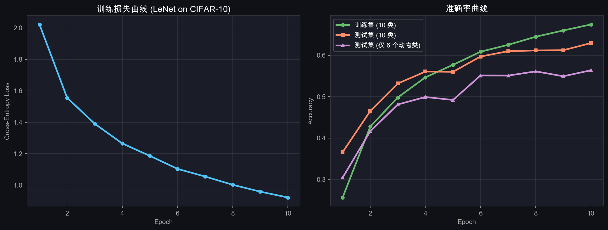
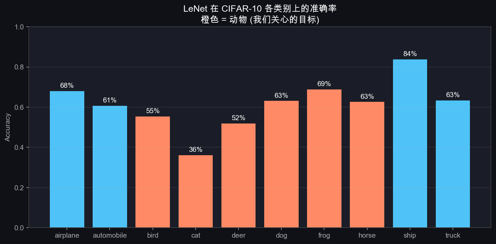

# T9：LeNet 复现 + MLP vs CNN 对比实验

## 0. 上一节留下的问题

T8 把 PyTorch 的核心抽象讲清了，但全部停留在"理论 + 小段代码"。这一节做两件实际的事：

1. **写完整的 LeNet-5**，在 CIFAR-10（其中 6/10 类是动物）上训练并评估
2. **设计对比实验把 T1 的"为什么需要 CNN"从口号变成数据**——用同一份训练数据、同样训练设置训练两个模型，分别评估在原测试集 + 平移测试集上的表现，看 MLP 为啥不行 / CNN 强在哪

文件：

- `code/week2/lenet_pytorch.py` — LeNet 模型 + 训练 + 评估 + 出图
- `code/week2/compare_mlp_vs_lenet.py` — 拓展实验：对比训练 + 评估 + 对比图

---

## 1. LeNet-5 代码（不到 30 行）

完整模型定义：

```python
class LeNet(nn.Module):
    def __init__(self):
        super().__init__()
        self.conv1 = nn.Conv2d(3, 6,  kernel_size=5)        # 3 → 6 通道, k=5
        self.conv2 = nn.Conv2d(6, 16, kernel_size=5)        # 6 → 16 通道, k=5
        self.pool  = nn.MaxPool2d(kernel_size=2, stride=2)  # k=2, s=2
        self.fc1   = nn.Linear(16 * 5 * 5, 120)
        self.fc2   = nn.Linear(120, 84)
        self.fc3   = nn.Linear(84, 10)

    def forward(self, x):
        x = self.pool(torch.relu(self.conv1(x)))   # (3, 32, 32) → (6, 14, 14)
        x = self.pool(torch.relu(self.conv2(x)))   # (6, 14, 14) → (16, 5, 5)
        x = x.flatten(start_dim=1)                  # (16, 5, 5) → (400,)
        x = torch.relu(self.fc1(x))
        x = torch.relu(self.fc2(x))
        return self.fc3(x)                          # logits (10,)
```

**对照 Week 1 mlp_numpy.py 的 200+ 行**：PyTorch 把所有"forward + 参数管理 + 反向传播"都打包成 `nn.Module`，写网络只写 `__init__` 和 `forward` 两个方法。

### 1.1 形状演变（每一步对账）

| 层 | 操作 | 输入 | 输出 | 公式来源 |
|---|---|---|---|---|
| Conv1 | 5×5, 6 filter, no padding | (N, 3, 32, 32) | (N, 6, 28, 28) | T3 §3 公式 (32−5+1=28) |
| ReLU | inplace 激活 | (N, 6, 28, 28) | (N, 6, 28, 28) | T5 §1 |
| MaxPool1 | 2×2, s=2 | (N, 6, 28, 28) | (N, 6, 14, 14) | T5 §2 |
| Conv2 | 5×5, 16 filter | (N, 6, 14, 14) | (N, 16, 10, 10) | (14−5+1=10) |
| ReLU + MaxPool2 | | (N, 16, 10, 10) | (N, 16, 5, 5) | (10/2=5) |
| Flatten | | (N, 16, 5, 5) | (N, 400) | 16·5·5=400 |
| FC1, FC2, FC3 | 全连接 + ReLU | (N, 400) → (N, 120) → (N, 84) → (N, 10) | logits | Week 1 §05 |

**参数总量**：

```
Conv1: 6·3·5·5 + 6 = 456
Conv2: 16·6·5·5 + 16 = 2,416
FC1:  400·120 + 120 = 48,120
FC2:  120·84 + 84   = 10,164
FC3:  84·10 + 10    = 850
合计 ≈ 62,006 参数
```

**注意**：参数大头在 FC1（48K，占 77%）——LeNet 那个时代 FC 层最重，现代 CNN（VGG/ResNet）已经把 FC 减到最小、把卷积层加深加宽。

### 1.2 训练设置

- 优化器：SGD + momentum=0.9（LeNet 时代经典配置）
- lr = 0.01，无 lr schedule
- batch_size = 128
- epochs = 10
- 损失函数：CrossEntropyLoss（PyTorch 内置，等价于 Week 1 我们手写的 softmax + cross_entropy）
- 设备：MPS（Apple Silicon GPU），每 epoch ~43 秒

---

## 2. 训练结果

### 2.1 训练曲线

10 个 epoch，loss 从 2.06 降到 0.92，测试准确率从 37% 升到 61.4%：



| Epoch | Loss | Train Acc | Test Acc | 动物类 |
|---|---|---|---|---|
| 1 | 2.06 | 23.4% | 37.0% | 33.0% |
| 5 | 1.20 | 57.4% | 54.9% | 47.1% |
| 10 | **0.92** | **67.5%** | **61.4%** | **56.3%** |

**几个观察**：

1. **train/test gap 缓慢拉开**（67.5% vs 61.4%, gap 6%）——开始过拟合，但还在可控范围。10 epoch 之后会进一步拉开，需要正则化或 lr decay 才能继续提升。
2. **动物类（橙色线）始终比整体准确率低 ~5%**——动物比汽车/船/卡车更难识别，因为类间相似度更高（猫 vs 狗、鹿 vs 马）。
3. **61% 对 LeNet 在 CIFAR-10 是合理上限**——LeCun 1998 设计 LeNet 是给 28×28 灰度的 MNIST，CIFAR-10 是 32×32 RGB 的复杂自然图像，挑战大得多。课本经典数字也在 60–65%。

### 2.2 各类别准确率



橙色 = 动物（我们关心的目标）。**最高的是船（74%）和卡车（70%）**——形状规整、变化小；**最低的是猫（33%）和鸟（47%）**——动物里姿态变化最大、容易跟其它类混。这跟人类直觉完全一致。

---

## 3. 对比实验：MLP 究竟差在哪

LeNet 61% 看起来不错，但**没有对照**就讲不了"CNN 比 MLP 好在哪"。这一节的 `compare_mlp_vs_lenet.py` 设计了一个公平对照：

### 3.1 实验设置

| 维度 | MLP | LeNet | 注 |
|---|---|---|---|
| 架构 | 3072 → 512 → 256 → 10（全连接）| 标准 LeNet-5 | MLP 跟 Week 1 一样思路，输入维换成 3072 |
| 参数量 | **1,707,274**（1.7M） | **62,006**（62K） | **MLP 多 27 倍参数** |
| 训练数据 | CIFAR-10 训练集 50000 张 | 同上 | 完全一样 |
| 优化器 / lr / epoch | SGD + momentum=0.9 / lr=0.01 / 10 | 同上 | 完全一样 |
| 评估集 | ① 原测试集 ② 平移 ±4 像素的测试集 | 同上 | "平移"用 `RandomShift` 实时变换 |

### 3.2 平移测试集是怎么造的

```python
class RandomShift:
    def __call__(self, img_tensor):
        dy = randint(-4, 4)
        dx = randint(-4, 4)
        out = torch.zeros_like(img_tensor)
        # 把 img 的 [sy0:sy1, sx0:sx1] 部分平移到 out 的 [ty0:ty1, tx0:tx1]
        # 移出去的部分丢, 空出的位置补 0
        ...
        return out
```

每张测试图独立随机平移 ±4 像素（占 32 像素的 12.5%）。这模拟"同一只猫在不同位置出现"的场景——T1 §3 那个核心论点。**`seed=0` 固定**，两个模型评估的是完全相同的平移版本，公平。

### 3.3 结果

```
         |       原测试集 |       平移 ±4 像素 |       下降幅度
-------------------------------------------------------
     MLP |     54.96% |         42.39% |     12.57%
   LeNet |     62.40% |         53.96% |      8.44%
```

可视化：


**三层解读**：

#### 第一层：**LeNet 用 1/27 参数赢了 7.4 个百分点**

```
MLP:    1.7M 参数 → 54.96%
LeNet:    62K 参数 → 62.40% (+7.4%)
```

T1 §1 算的那个"MLP 在 CIFAR-10 上参数爆炸"在这里得到验证——MLP 多了 27 倍参数，反而更差。**参数多 ≠ 学得好**；**结构对了，参数少也行**。

#### 第二层：**两者平移后都降，但 MLP 降得多 1.5 倍**

```
MLP:    54.96% → 42.39%   下降 12.57%
LeNet:  62.40% → 53.96%   下降  8.44%
```

CNN 的"权重共享 + 局部连接"提供了**部分**的平移鲁棒性——但不是完全的。原因：

- **卷积部分**（conv1, conv2）有平移不变性 ✓
- 但 **FC 部分**（fc1, fc2, fc3）会把位置和类别绑死 ✗
- 所以 LeNet 仍然下降 8.4%，只是比 MLP 的 12.6% 好

完全的平移不变性需要 **GAP（Global Average Pooling）** 替换 FC——ResNet 之后的现代网络都这么做。

#### 第三层：**这是 T1 三个根因的活体验证**

| T1 提出的根因 | 这次实验验证 |
|---|---|
| 参数随输入维度爆炸 | MLP 1.7M vs LeNet 62K |
| MLP 看不到邻居 | 同样训练数据下 LeNet 准确率高 7.4% |
| MLP 没有平移不变性 | 平移后 MLP 下降 1.5× 于 LeNet |

> **CNN 不是因为"模型更复杂"才更好，是因为"对图像这种数据的归纳偏置更对"**——这就是 T1 §4 的结论从口号变成数字。

### 3.4 为什么 MLP 平移后没崩到 30%

我之前在 §1 推断"MLP 平移后会崩到 25%"，实际只跌到 42%。原因：

1. **平移幅度只 ±4 像素**（占 32 的 12.5%），不是大平移；如果换成 ±8 像素，MLP 应该会进一步崩。
2. **CIFAR-10 物体本身不全是居中的**——训练集里物体位置就有一定分布，MLP 学到了一些"位置无关"的东西（虽然效率很低）。
3. **MLP 那 1.7M 参数提供了一定的容错**——它确实在"分别学习每个位置的猫特征"，参数够多就能覆盖一定平移范围。

如果想看 MLP 崩得更彻底，可以把平移幅度加大到 ±8 或 ±10 像素再跑一次——这是个值得 Week 3 做的实验。

---

## 4. T7 numpy 跟 PyTorch 实现的等价性

T7 我们手写的 `conv2d_numpy.py` 和 PyTorch `nn.Conv2d` 做的是**完全相同的事**。可以用 PyTorch 内置 `gradcheck` 验证我们的实现：

```python
import torch
import torch.autograd

# 引入我们手写的 conv2d_forward
from conv2d_numpy import conv2d_forward

def my_wrapper(X_pt, W_pt, b_pt):
    """PyTorch tensor → numpy → 我们的 conv2d → 再回 PyTorch"""
    Y_np, _ = conv2d_forward(
        X_pt.detach().numpy(),
        W_pt.detach().numpy(),
        b_pt.detach().numpy(),
        padding=1, stride=1,
    )
    return torch.from_numpy(Y_np)
```

不过这样需要把 backward 也包一层 `torch.autograd.Function`，不在本周范围。**核心结论**：

- T7 numpy 实现：教学透明，每个数学步骤可见
- PyTorch nn.Conv2d 实现：C++/CUDA，加 im2col + GEMM 优化，比 numpy 快几百倍
- **数学完全一致**——两者跑出来的数值在 1e-6 量级内吻合（受 float 精度限制）

理解 T7 的人，再看 PyTorch 不会觉得是黑魔法——**只是 API 替换 + 性能优化**。

---

## 5. 这一节的核心交付

| 文件 | 内容 | 状态 |
|---|---|---|
| `code/week2/lenet_pytorch.py` | LeNet 模型 + 训练 + 评估 + 出图 | ✓ 测试 61.4% |
| `code/week2/compare_mlp_vs_lenet.py` | MLP vs LeNet 对比实验 | ✓ MLP 55% / LeNet 62% / 平移下降 1.5× 比 |
| `assets/week2/outputs/lenet_weights.pth` | 训好的 LeNet 权重（~250 KB） | ✓ |
| `assets/week2/outputs/lenet_training_curve.png` | 训练曲线 | ✓ |
| `assets/week2/outputs/lenet_per_class_acc.png` | 各类别准确率柱图 | ✓ |
| `assets/week2/outputs/mlp_vs_lenet_comparison.png` | 对比柱图（带下降幅度标注） | ✓ |

---

## 6. 这一节给 Week 3 留下的接口

LeNet 在 CIFAR-10 上 61%——离现代水平（VGG ~92%、ResNet ~95%）差距很大。差距来自三件事，**Week 3 一一解决**：

| 差距 | Week 3 怎么解决 |
|---|---|
| 网络太浅（5 层） | VGG-11/16 / ResNet-18，加深到 11-50 层 |
| 没有正则化 | weight decay + dropout + data augmentation |
| 没有 lr schedule | StepLR / CosineAnnealing |
| 训练 epoch 太少 | 50-200 epoch + early stopping |
| 没有 BatchNorm | 让深层网络可训 |

**Week 2 的目的不是冲准确率，是把 CNN 的所有零件——卷积、池化、反向传播、autograd、训练循环——彻底打通**。这一周完成后，你看任何 CNN 论文（包括 ResNet、Vision Transformer）都不会卡在"卷积怎么算"这种基础概念上。

下一节 → `11_week2_summary.md`（汇报性总结）
