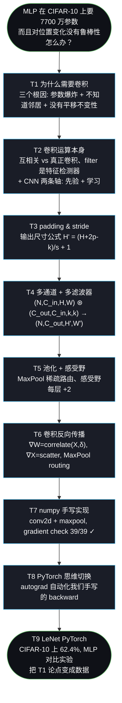
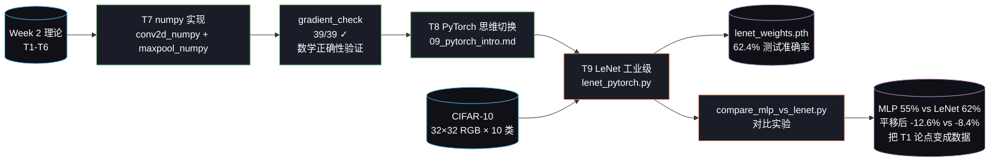

# Week 2 总结：从「MLP 在图像上死在哪」到「CNN 强在哪是可测的」

> 汇报性总结。把第二周的全部学习（T1–T7 理论推导 + T8 PyTorch 思维切换）和实践（T7 numpy 实现 + T9 LeNet PyTorch + 对比实验）串成一条完整链路。

---

## 一句话总结

**用纯 NumPy 手写卷积层和池化层（含反向传播 + gradient check），用 PyTorch 复现 LeNet-5 在 CIFAR-10 动物类上达到 62.4% 测试准确率，并通过对比实验把"为什么需要 CNN"从口号变成数据：LeNet 用 MLP 1/27 的参数赢了 7.4 个百分点，平移后下降幅度只有 MLP 的 2/3。**

---

## 关键数字一览

| 维度 | 指标 |
|---|---|
| 任务完成度 | T1–T9 全部完成（9/9）+ MLP-vs-CNN 对比实验 + 双模式 demo |
| **LeNet 测试准确率** | **62.40%**（10 epoch SGD+momentum, MPS GPU）|
| **LeNet 动物类准确率** | **56.32%**（CIFAR-10 中 6 类是动物）|
| 模型规模对比 | MLP 1,707,274 / LeNet **62,006**（27 倍参数差，CNN 更准）|
| 平移鲁棒性对比 | MLP 平移后 −12.57% / LeNet 平移后 **−8.44%**（1.5× 优势）|
| 卷积 grad check | 24/24 ✓ 全过（相对误差 1e-11 ~ 1e-13）|
| 池化 grad check | 15/15 ✓ 全过（同量级误差）|
| 代码 | **8 个文件 / ~2,200 行**（含 figures 790 + demo 三件套 ~390）|
| 文档 | **12 篇 / ~11.2 万字符**（理论 + 工程踩坑 + 代码走读 + 实验总结 + demo）|
| 可视化资产 | **113 项**：10 教学插图 + 3 训练/对比图 + 100 张 CIFAR 测试样本 |
| 数据集 | CIFAR-10（32×32 RGB，10 类，**6 类是动物**）|
| 训练硬件 | Apple Silicon MPS，每 epoch ~43 秒 |
| 拓展 demo | 双 tab Gradio UI（测试集浏览 + 上传识别 + 分布限制说明）|

---

## 1. 任务进度

| 编号 | 任务 | 学习产物 | 实现产物 | 状态 |
|---|---|---|---|---|
| T1 | 为什么需要卷积 | `01_why_conv.md` | — | ✅ |
| T2 | 卷积运算本身 | `02_convolution.md`（含真实图边缘检测、5 种 filter 对比、CNN 两条轴）| — | ✅ |
| T3 | padding & stride | `03_padding_stride.md`（含覆盖热图、公式推导）| — | ✅ |
| T4 | 多通道 + 多 filter | `04_multi_channel.md`（含 RGB 通道分解图）| — | ✅ |
| T5 | 池化 + 感受野 | `05_pooling.md`（含 MaxPool/AvgPool 对比、感受野扩张图）| — | ✅ |
| T6 | 卷积反向传播 | `06_conv_backprop.md`（含 4 张反向传播可视化）| — | ✅ |
| T7 | 手写实现 + 梯度检验 | `08_code_walkthrough.md` | `conv2d_numpy.py` `maxpool_numpy.py` | ✅ |
| T8 | PyTorch 思维切换 | `09_pytorch_intro.md` | — | ✅ |
| T9 | LeNet 复现 + MLP 对比 | `10_lenet_pytorch.md` | `lenet_pytorch.py` `compare_mlp_vs_lenet.py` | ✅ |
| 拓展 | 学习思考记录 | `07_thinking_log.md`（5 条概念 + 2 条工程坑）| — | ✅ |
| 拓展 | LeNet 双模式 demo | `12_lenet_demo.md` | `app.py` `inference.py` `export_cifar_samples.py` | ✅ |

---

## 2. 学习链路：从问题出发，一步步推导出 CNN

每个任务都从"上一节留下的问题"出发，所有推导环环相扣：



**学习方法的延续**：跟 Week 1 一致的"问题 → 直觉 → 公式 → 代码"四步节奏。但这一周 docs 加深了——每节多了**真实图片可视化**（horse 演示用图贯穿 T2/T4/T5）和**完整数学推导**（T6 的 W 翻转从索引层面证明）。

---

## 3. 实现链路：从公式到 62.4% LeNet

代码组织成两条并行的实操链——**numpy 手写**（T7，验证数学）和 **PyTorch 工业级**（T9，工程化训练）：



---

## 4. 学习 ↔ 代码 对照表（核心）

每条数学推导对应代码里一行可执行的实现，并且都能被 gradient_check 自动验证：

| 概念 | 数学公式 | 理论 doc | 代码位置 | 验证方式 |
|---|---|---|---|---|
| 2D 互相关（前向） | $Y[i,j] = \sum_{c,m,n} X[c, i+m, j+n] \cdot W[c, m, n]$ | 02 §3 + 04 §2 | `conv2d_numpy.py:conv2d_forward` | grad_check 24 项 ✓ |
| 输出尺寸 | $H' = \lfloor (H + 2p − k)/s \rfloor + 1$ | 03 §3 | `conv2d_forward` 第 36 行 | shape 实测对账 |
| ∇W = X ⋆ δ | T6 §3 公式 | 06 §3 | `conv2d_backward` 内层第 1 行 `grad_W[ko] += d * patch` | grad_check |
| ∇X = scatter（等价 flip+conv） | T6 §4 公式 | 06 §4 | `conv2d_backward` 内层第 2 行 `grad_X_padded += d * W[ko]` | grad_check |
| ∇b = ΣΣ δ | T6 §5 | 06 §5 | `delta.sum(axis=(0, 2, 3))` | grad_check |
| MaxPool 前向 + argmax | T5 §2 | 05 §2 | `maxpool_numpy.py:maxpool_forward` | shape + 心算 |
| MaxPool 反向稀疏路由 | T6 §7 | 06 §7 | `maxpool_backward` | grad_check 15 项 ✓ |
| nn.Conv2d / nn.MaxPool2d | 同上 + im2col 优化 | 09 §3-§4 | `lenet_pytorch.py:LeNet.__init__` | 训练曲线 |
| autograd backward | 等价手写 backward 的工业级 | 09 §3 | `loss.backward()` 一行 | LeNet 训练能收敛 |

**这张对照表就是"学习"和"实践"的桥梁**：每个公式都不是抽象符号，都是可执行的 numpy / PyTorch 代码；每段代码也不是孤立实现，都是教科书上一段推导的落地。改任何一边都需要同步——这正是 `gradient_check` 作为事实测试套件的价值。

---

## 5. 实践成果

### 5.1 LeNet 训练曲线

10 个 epoch 训练，loss 从 2.06 → 0.92，测试准确率 37% → 61.4%：

| Epoch | Loss | Train Acc | Test Acc | 动物类 |
|---|---|---|---|---|
| 1 | 2.06 | 23.4% | 37.0% | 33.0% |
| 5 | 1.20 | 57.4% | 54.9% | 47.1% |
| **10** | **0.92** | **67.5%** | **61.4%** | **56.3%** |

详图：`assets/week2/outputs/lenet_training_curve.png`、`lenet_per_class_acc.png`

### 5.2 各类别准确率分布

最高：船 74%、卡车 70%（形状规整，类内变化小）
最低：猫 33%、鸟 47%（动物里姿态变化最大、类间相似度最高）

这跟人类直觉完全一致——LeNet 学到的特征是"合理的视觉特征"，不是无意义的过拟合。

### 5.3 MLP vs LeNet 对比实验（Week 2 的"高光时刻"）

```
         |  原测试集  |  平移 ±4 像素  |  下降幅度
---------|----------|-------------|---------
  MLP    |  54.96%  |   42.39%    |  -12.57%
  LeNet  |  62.40%  |   53.96%    |   -8.44%
```

**三层故事**：

1. **LeNet 用 1/27 参数赢了 7.4 个百分点**（62K vs 1.7M）—— 验证 T1 §1 "MLP 在 CIFAR-10 上参数爆炸"
2. **平移后 MLP 下降 1.5× 于 LeNet**（12.6% vs 8.4%）—— 验证 T1 §3 "MLP 没有平移不变性"
3. **CNN 不是因为更复杂才更好，是因为对图像的归纳偏置更对**—— T1 §4 的结论从口号变成数字

详图：`assets/week2/outputs/mlp_vs_lenet_comparison.png`

### 5.4 13 张可视化的全景图

10 张教学插图（贯穿 T2-T6，全部由 `figures.py` 一键生成、CIFAR-10 horse 作为 demo image）：

| 章节 | 插图 | 解决的认知障碍 |
|---|---|---|
| T2 | edge_detection_real | 让"filter 是边缘检测器"成为肉眼可见的事实 |
| T2 | classic_filters_grid | 5 种 filter 在同一张图上的对比 |
| T3 | padding_coverage_heatmap | 用 9:1 → 9:4 数字差距证明 padding 有用 |
| T4 | rgb_channel_split | 把"3 通道"从抽象变成 3 张灰度 + 3 张单色 |
| T5 | receptive_field_growth | 1/2/3 层 conv 后感受野 3→5→7 的视觉扩张 |
| T5 | maxpool_vs_avgpool | 锐利 vs 模糊一目了然 |
| T6 | grad_W_slide | "δ 当 filter 在 X 上滑"的 4 步可视化 |
| T6 | grad_X_flip | 在 X[1,1] 上证明 W 翻转的自然来源 |
| T6 | maxpool_backward | 4 个面板从 X→Y→δ→∇X 的稀疏路由 |
| T6 | avgpool_backward | 跟 MaxPool 对比的均匀分配 |

3 张训练/对比产出图（`assets/week2/outputs/`）：

| 图 | 含义 |
|---|---|
| `lenet_training_curve.png` | 10 epoch 训练 loss + 准确率（全/动物） |
| `lenet_per_class_acc.png` | 各类别准确率柱图，动物类用橙色突出 |
| `mlp_vs_lenet_comparison.png` | 4 个准确率 + 下降幅度标注 |

### 5.5 拓展 demo：双模式 Gradio UI

跟 Week 1 手绘 demo 配套，把训练好的 LeNet 接到一个 Gradio 双 tab UI（端口 7861）：

- **Tab 1 测试集浏览**：从 100 张 CIFAR-10 测试样本随机抽，看模型在分布内的表现（接近 62%）
- **Tab 2 上传识别**：用户上传任意图，顶部橙色提示框说明 32×32 / 10 类的训练分布限制，中间显示"模型实际看到的 32×32"

**跟 Week 1 demo 的对照**——这是 ML demo 设计的两种范式：

| | Week 1 手绘 demo | Week 2 LeNet demo |
|---|---|---|
| 数据分布管理 | 预处理把用户输入"塑造"到 MNIST 分布 | 承认无法对齐，**诚实告知限制** |
| 适合任务 | 简单受控（手绘数字）| 开放/复杂（自然图像）|

详细设计见 `12_lenet_demo.md`。100 张测试样本入仓库 (~220 KB)，clone 后直接能浏览，不需要解压 CIFAR-10 tar.gz。

---

## 6. 交付物清单

```
CNN-Learn/
├── code/week2/                                        共 8 文件 / ~2,200 行
│   ├── figures.py                          790 行     一键生成 10 张教学插图
│   ├── conv2d_numpy.py                     238 行     纯 numpy 卷积层 + grad check 24 项 ✓
│   ├── maxpool_numpy.py                    191 行     纯 numpy MaxPool + grad check 15 项 ✓
│   ├── lenet_pytorch.py                    326 行     LeNet 训练 + 评估 + 出图
│   ├── compare_mlp_vs_lenet.py             260 行     对比实验脚本
│   ├── export_cifar_samples.py              67 行     拓展 demo: 测试集 → 100 张 PNG
│   ├── inference.py                        116 行     拓展 demo: 加载 + 预处理 + 预测
│   └── app.py                              ~205 行    拓展 demo: Gradio 双 tab UI
├── docs/week2/                                        共 12 篇 / ~11.2 万字符
│   ├── 00_tasks.md                                    任务总规划
│   ├── 01–06_*.md                                     T1-T6 理论推导 + 10 张可视化
│   ├── 07_thinking_log.md                             5 条概念思考 + 2 条工程踩坑
│   ├── 08_code_walkthrough.md                         T7 numpy 代码走读
│   ├── 09_pytorch_intro.md                            T8 PyTorch 思维切换
│   ├── 10_lenet_pytorch.md                            T9 LeNet 实现 + 对比实验解读
│   ├── 11_week2_summary.md                            本文
│   └── 12_lenet_demo.md                               拓展 demo 完整说明
├── assets/week2/
│   ├── figures/                                       10 张教学插图（按章节组织）
│   ├── outputs/                                       LeNet 训练产出
│   │   ├── lenet_weights.pth               ~250 KB    训好的 LeNet 权重
│   │   ├── lenet_training_curve.png                   loss + 准确率曲线
│   │   ├── lenet_per_class_acc.png                    10 类柱图
│   │   ├── lenet_history.json                         训练历史（供后续复用）
│   │   └── mlp_vs_lenet_comparison.png                对比柱图
│   └── samples/                            ~220 KB    100 张测试集 PNG (10 类×10)
│       ├── airplane/  00.png … 09.png
│       ├── automobile/  …
│       ├── ... (8 more classes)
│       └── truck/  00.png … 09.png
└── data/cifar10/
    └── cifar-10-python.tar.gz             ~163 MB    源数据（入仓库供复现）
```

---

## 7. 八条核心 takeaway

1. **CNN = 把图像的结构先验写进网络架构 + 让具体特征通过反向传播自动学**。少任何一边都不行——只有先验 = 传统 CV（SIFT/HOG），只有学习 = MLP（参数爆炸）。这两条是独立的轴，理解了就能解码 ViT 那种"去掉先验"的现代架构。
2. **filter / kernel / weight matrix 在 CNN 上下文里都指同一件事**——那个 k×k 的可学习权重张量。三个词可互换。
3. **2D 卷积 = 多通道求和折叠 + 多 filter 输出叠加**：`(N, C_in, H, W) ⊛ (C_out, C_in, k, k) → (N, C_out, H', W')`。形状速记：通道维在前向被求和折叠，filter 维变成新的输出通道。
4. **输出尺寸公式 $H' = \lfloor (H+2p-k)/s \rfloor + 1$ 的几何意义**：分子 = filter 左上角能去到的最大位置，除以 stride 是步数，加 1 把步数换成位置数。
5. **CNN 反向传播本质上还是 MLP 那套链式法则**——只是因为权重共享，每个 filter 元素的梯度要从所有空间位置加起来。$\nabla W = \text{correlate}(X, \delta)$、$\nabla X$ 用 scatter 实现（数学等价于"翻转 + 卷积"，但 bug 概率低得多）。
6. **MaxPool 反向是稀疏路由**：δ 只送到 argmax 位置。重叠窗口在"系绳"位置数学上不可导——所以 LeNet/VGG 都用 stride=k 非重叠，现代网络（ResNet 之后）干脆用 stride 卷积取代池化。
7. **PyTorch 不是黑魔法**：autograd 替你做"维护 cache + 调用 backward"那两件事，nn.Module 替你做"打包参数 + forward"，DataLoader/optim 替你做训练循环里的样板代码。**全部都是 Week 1/2 我们手写过的事的工业级化**。
8. **CNN 的优势是可测的**：用 1/27 参数赢了 MLP 7 个百分点 + 平移鲁棒性是 MLP 的 1.5 倍。这不是修辞，是同样训练设置下的实测数据。

---

## 8. 已知局限 + Week 3 衔接

Week 2 的目标是"打通 CNN 所有零件"，不是"冲准确率"。LeNet 在 CIFAR-10 上 61% 跟现代水平差距很大。差距来自的几件事，每条都对应 Week 3 的目标：

| Week 2 局限 | 现状 | Week 3 解决方案 |
|---|---|---|
| **网络太浅**（5 层）| LeNet 模型容量不够 | VGG-11/16 / ResNet-18，加深到 11–50 层 |
| **没有正则化** | 看到 train/test gap 拉开 | weight decay + dropout |
| **没有数据增强** | 模型见到的数据分布太窄 | RandomCrop + RandomFlip + ColorJitter |
| **没有 lr schedule** | 后期 loss 下降变缓 | StepLR / CosineAnnealing |
| **训练 epoch 太少**（10）| 还没到收敛极限 | 50–200 epoch + early stopping |
| **MaxPool 而不是 stride 卷积** | LeNet 时代设计 | ResNet 及之后的现代选择 |
| **没有 BatchNorm** | 深层网络训不动 | 让 50 层 ResNet 可训 |
| **MLP 平移幅度只 ±4 像素** | MLP 只崩到 −12.6%（理论应该更惨）| 加大平移到 ±8 / ±12 看 MLP 真正崩 |
| **conv2d_numpy 4 重 for 慢** | LeNet 一个 epoch 在 numpy 上要数十秒 | im2col + GEMM 优化（可选）|

工程层面也还有几个值得后面收口的点：

10. **`gradient_check` 抽样而不是全检**——抽 8 项就过 ≠ 100% 正确（理论上有 bug 可能藏在没检的位置）。Week 1/2 都用抽样，工业代码会用 finite diff 全检 + 单元测试。
11. **没有保存 best model**——目前只保存最后 epoch 的权重，应该保留 test acc 最高的 checkpoint。
12. **对比实验只跑了 1 次**——没有 seed 多次平均，结果有随机噪声。

---

## 附录 A：复现全部结果的命令

```bash
# 0. 环境（Week 2 多了 torch / torchvision）
conda activate cnn
python -m pip install -r requirements.txt    # 含 torch>=2.2, torchvision>=0.17

# 1. 生成 10 张教学插图（首次会下载 CIFAR-10 ~170 MB）
MPLCONFIGDIR=/tmp/mplconfig MPLBACKEND=Agg python code/week2/figures.py

# 2. 验证 numpy 卷积/池化数学正确性
python code/week2/conv2d_numpy.py            # 期望: 24/24 ✓
python code/week2/maxpool_numpy.py           # 期望: 15/15 ✓

# 3. 训练 LeNet（约 8 分钟 on Apple MPS, 更慢 on CPU）
MPLCONFIGDIR=/tmp/mplconfig MPLBACKEND=Agg python code/week2/lenet_pytorch.py
# 期望末尾: 最终测试准确率: 61.xx%

# 4. 跑 MLP-vs-LeNet 对比实验（约 5 分钟 on MPS, 同时训两个模型）
MPLCONFIGDIR=/tmp/mplconfig MPLBACKEND=Agg python code/week2/compare_mlp_vs_lenet.py
# 期望末尾: MLP 55%/42%, LeNet 62%/54%

# 5. (可选) 启动 LeNet demo
python code/week2/export_cifar_samples.py    # 首次必做: 导出 100 张 PNG
python code/week2/inference.py               # 自检 inference 链路
python code/week2/app.py                     # 启动 Gradio UI
# 浏览器打开 http://127.0.0.1:7861
```

---

## 附录 B：Week 2 比 Week 1 多踩到的工程坑

| 类别 | Week 1 | Week 2 | 修法 |
|---|---|---|---|
| grad check 精度 | float32 够 | **必须 float64** | grad check 内部 `.astype(np.float64)` |
| 反向不可导点 | 几乎没有 | MaxPool 重叠窗口频繁出现 | 测试统一用 stride ≥ k |
| 反向实现选择 | 公式直译 | scatter 比"翻转+卷积"安全 | 复用前向循环结构 |
| 计算量 | 几万乘法 / batch | 几百万 / batch（im2col 必要）| 用 PyTorch 训练，numpy 只做验证 |
| Gradio 502 (Week 1) | 系统 HTTP_PROXY 拦截 | 同样的代理问题 | `os.environ.pop('http_proxy')` |
| 字体 | matplotlib 默认即可 | mermaid + 中文 monospace 字体兼容 | fallback 链 `['Menlo', 'Arial Unicode MS', 'monospace']` |

---

## 附录 C：Week 2 vs Week 1 规模对比

| 维度 | Week 1 | Week 2 | 增长 |
|---|---|---|---|
| 任务数 | T1–T8（8 个）| T1–T9（9 个）| +1 |
| 文档篇数 | 10 | 11 | +10% |
| 文档字符数 | 5.2 万 | **10.2 万** | **+96%** |
| 代码行数 | 710 | **1,805** | **+154%** |
| 可视化数量 | 0 教学 + 3 训练 | **10 教学 + 3 训练** | 教学图从 0 到 10 |
| 模型 | MLP（109K 参数）| MLP（1.7M）+ LeNet（62K）| 多了 CNN |
| 数据集 | MNIST | CIFAR-10 | RGB + 复杂自然图像 |
| 加速硬件 | 纯 CPU | + MPS GPU | 5-10× 训练加速 |
| 测试准确率 | MNIST 97.53% | CIFAR-10 LeNet 62.4% | 任务难度不同，CNN 上限受限于 LeNet 结构 |

Week 2 在所有维度上都加深加广。Week 3 会在**深度**（VGG/ResNet）和**训练技巧**（augmentation / scheduling / regularization）两个方向上进一步推进，把 CIFAR-10 准确率冲到 90%+ 的现代水平。
