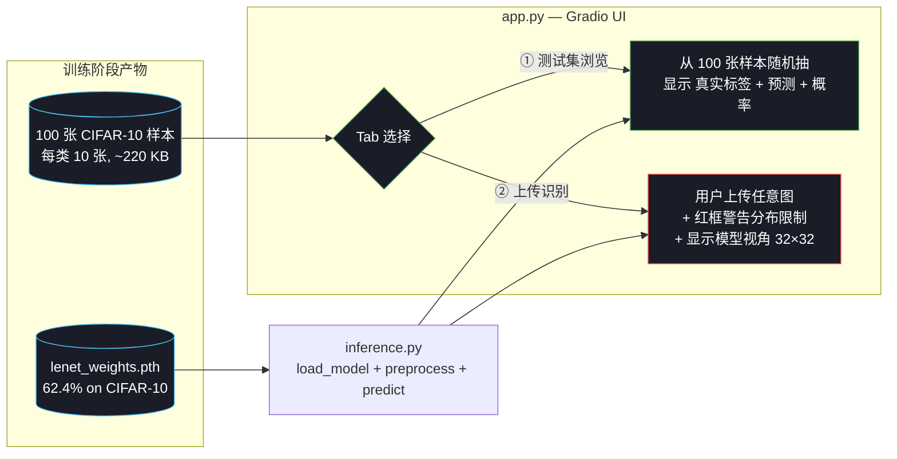

# Week 2 拓展：LeNet on CIFAR-10 双模式 demo

> 把训练好的 LeNet 接到一个 web UI 上，让用户**亲眼看到 CNN 在分布内能做什么、在分布外怎么翻车**。
> 对应文件：`code/week2/inference.py`、`code/week2/app.py`、`code/week2/export_cifar_samples.py`。

---

## 1. 这一节的真正目的

跟 Week 1 的手绘 demo（鼓励用户玩、看模型能做什么）不一样，**Week 2 demo 同样重要的目标是诚实展示训练数据分布的限制**。

|  | Week 1 demo | Week 2 demo |
|---|---|---|
| 训练分布 | MNIST 28×28 灰度，标准化居中 | CIFAR-10 32×32 RGB，10 类自然图 |
| 用户输入 | 鼠标手绘数字（接近训练分布）| 高清照片（**远离训练分布**）|
| 教学重点 | "只要预处理对了，模型工作得很好" | **"分布外问题是 ML 的真实硬约束"** |

如果做成"上传一张高清猫照片，模型识别错了"——用户的结论会是"模型很差"。**真正的教学价值**是让用户看到这件事**为什么必然发生**：CIFAR-10 训练集只是 32×32 的**简笔画式**自然图，跟真实生活照片完全不是同一个分布。

所以这个 demo 设计成**双 tab**：

- **Tab 1 测试集浏览**：从 CIFAR-10 测试集随机抽图 → 模型表现接近论文水平 ~62%
- **Tab 2 上传识别**：用户上传任意图 → 顶部醒目红框警告分布限制 + 中间显示"模型实际看到的 32×32"

让用户**自己点对比 Tab 1 和 Tab 2**，分布外的代价瞬间能感知到。

---

## 2. 核心组件 + 数据流



---

## 3. 三个文件详解

### 3.1 `export_cifar_samples.py` — 把二进制变成可见图

CIFAR-10 在仓库里是 `cifar-10-python.tar.gz`（pickle 二进制），别人 clone 后看不见。这个脚本把测试集每类 10 张导出成 PNG：

```python
testset = CIFAR10(root='data/cifar10', train=False, transform=None)
for cls_idx in range(10):
    indices = [i for i, (_, lbl) in enumerate(testset) if lbl == cls_idx]
    for i, idx in enumerate(indices[:10]):
        img, _ = testset[idx]                    # PIL.Image (32×32 RGB)
        img.save(f'assets/week2/samples/{class_name}/{i:02d}.png')
```

输出：

```
assets/week2/samples/
├── airplane/   00.png ~ 09.png
├── automobile/ ...
├── bird/       ...
├── cat/        ...
├── deer/       ...
├── dog/        ...
├── frog/       ...
├── horse/      ...
├── ship/       ...
└── truck/      ...
共 100 张, 总 ~220 KB
```

**双重作用**：

1. **数据集可读性** — clone 仓库后不解压 tar 也能浏览 CIFAR-10 长什么样
2. **demo 素材** — Tab 1 直接从这些 PNG 抽样，不依赖 torchvision 实时加载

### 3.2 `inference.py` — 加载 + 预处理 + 预测

跟 Week 1 inference.py **结构完全一样**（load_model / preprocess / predict 三件套），但实现细节不同。**关键预处理**：

```python
_TRANSFORM = T.Compose([
    T.Resize((32, 32)),                                # 任意尺寸 → 32×32
    T.ToTensor(),                                      # PIL → (3, 32, 32) in [0, 1]
    T.Normalize((0.5, 0.5, 0.5), (0.5, 0.5, 0.5)),     # → 约 [-1, 1]
])
```

跟 `lenet_pytorch.py::load_cifar10()` 完全一致——**预处理必须跟训练时一字不差**，否则模型看到的输入分布会偏移，准确率严重下降。

返回值有四个：`pred_idx`、`pred_name`、`probs`、`view_32`：

- `pred_idx / pred_name`：预测类别
- `probs`：10 类 softmax 概率
- `view_32`：32×32 uint8 数组，专门给 UI 显示"模型实际看到的图"

`view_32` 是 demo 的灵魂——它让用户看清模型的输入是怎么被压缩的。

### 3.3 `app.py` — 双 tab Gradio UI

**Tab 1 测试集浏览**：

```
┌────────────────────────────────────────────────────────┐
│ 类别 [随机▼]            [🎲 随机抽一张]                │
├────────────────────────────────────────────────────────┤
│  原图 (放大)  │  模型 32×32 视角  │  ✅ 真实: horse    │
│   [256×256]  │    [256×256]      │     预测: horse 🐾  │
│              │                   │     置信度: 97%     │
│              │                   │     [10 类概率柱]   │
└────────────────────────────────────────────────────────┘
```

每次点 "🎲 随机抽一张"：

- 从 100 张样本里随机选 / 或按下拉菜单选某一类
- 显示原图 + 模型视角 + ✓/✗ + 置信度 + 10 类概率
- ✅ 表示预测正确，❌ 表示预测错（但有真实标签可以对照，区别于 Tab 2）

**Tab 2 上传识别**：

```
┌────────────────────────────────────────────────────────┐
│ ⚠️ 重要限制 · 请务必阅读 [醒目红框]                    │
│   - 训练只覆盖 10 类                                   │
│   - 训练图都是 32×32 简单背景                          │
│   - LeNet 在测试集也才 62.4%, 用户照片上更低           │
├────────────────────────────────────────────────────────┤
│  上传图       │  ⚡ 模型 32×32 视角  │  预测: cat 🐾   │
│  [上传按钮]   │   (灵魂)            │     置信度: 45%   │
│              │                     │     [10 类概率柱]│
└────────────────────────────────────────────────────────┘
```

**警告内容**（精确措辞）：

> ⚠️ **关于本模型的限制**
>
> LeNet 训练在 **CIFAR-10 (32×32 RGB)**, 对真实高清照片识别效果有限. 几个要注意的点:
>
> - 只覆盖 **10 个类别**: airplane / automobile / bird / cat / deer / dog / frog / horse / ship / truck. 其它东西会被强行归到这 10 类
> - 训练图都是 **32×32 像素**, 物体居中, 背景简单. 高清照片压到 32×32 会丢大量信息
> - 测试集准确率 **62.4%** (Tab 1 可验证), 用户照片上一般会更低
>
> _这是 Week 2 教学的真实展示 — 模型表现受训练分布严格限制. Week 3 用 ResNet + 数据增强会改善._

视觉风格：

- 背景：项目主题暗灰 `#1a1d27`
- 强调：左侧 4px 橙色色条 `#ff8a65`（不是整圈红框）
- 主文字：`#f5f5f5`（接近白，高对比度易读）
- 关键数字（如 "10 个类别"、"62.4%"）：浅琥珀色 `#ffcc80` 突出
- 全部 `color` 属性都加 `!important` 强制覆盖 Gradio 默认样式

设计原则：**清晰提醒而非恐吓**。不用刺眼的鲜红 + 整圈红框（容易把人吓退或忽略），用项目暗主题 + 橙色色条 + 高对比文字（让用户**愿意读完**才是真正起作用的警告）。

---

## 4. 启动方式

```bash
# 1. 首次必做: 训练 LeNet 生成权重
python code/week2/lenet_pytorch.py
# 期望末尾: 最终测试准确率: 61.xx% / 权重已保存

# 2. 首次必做: 导出测试集样本 PNG
python code/week2/export_cifar_samples.py
# 期望末尾: 共 100 张 PNG, 总大小 220.7 KB

# 3. 自检 inference 链路
python code/week2/inference.py
# 期望: horse 第 0 张 → 预测 horse, 置信度 ~97%

# 4. 启动 Gradio UI
python code/week2/app.py
# 浏览器: http://127.0.0.1:7861
```

> **端口 7861** (Week 1 demo 用 7860, 这里错开避免冲突)

---

## 5. 试玩建议

### 在 Tab 1 验证模型不是吹的

1. 反复点 "随机抽一张" 几十次，看准确率大致是多少（应该 60% 上下）
2. **挑特定类别看 LeNet 的弱项**：
   - **猫** (cat)：经常错认成 dog/deer——CIFAR-10 训练集 33% 准确率
   - **鸟** (bird)：经常错认成 airplane（都是天空背景）
   - **船** (ship) 和 **卡车** (truck)：基本不会错——形状特征明显

### 在 Tab 2 感受分布外的代价

1. 上传一张你自己的照片（猫狗都行）
2. 看中间的 **32×32 视角** —— 你的高清照片在这个尺寸下基本就是一坨色块
3. 看预测结果——**经常会错**，而且置信度可能反而很高（模型对自己的错误很有信心，这是过度自信的典型现象）
4. 上传**类别外**的图（比如人、风景、文字）—— 模型必然把它强行归到 10 类之一

### 教学要点：双 tab 的对比

> Tab 1 准确率 ~62%，Tab 2 准确率可能跌到 20%。**模型没有变差，是数据分布变了**。这是机器学习里"训练分布 = 推理上限"这条铁律的活体演示。

---

## 6. 跟 Week 1 demo 的对照

| 维度 | Week 1 demo (`week1/app.py`) | Week 2 demo (`week2/app.py`) |
|---|---|---|
| 推理目标 | 手绘 0–9 数字 | 任意图 → 10 类（其中 6 类动物） |
| 数据分布管理 | 预处理（反色 / bbox / 重心居中）尽力把用户输入对齐到 MNIST 分布 | **承认无法对齐**——只 resize + normalize，醒目告知限制 |
| 输入交互 | Sketchpad 画板 | Tab 1 测试集抽样 + Tab 2 上传 |
| "模型视角"显示 | 28×28 预览图（核心功能）| 32×32 预览图（核心功能）|
| 端口 | 7860 | 7861 |
| 教学结论 | "对齐预处理 → 模型表现接近训练时" | "分布外是 ML 的硬约束，不能靠预处理消除" |

**两者放一起对比看**，能体会到 ML demo 设计的两种范式：

1. **Week 1 范式**：把用户输入"塑造"到模型分布里——适合简单受控任务
2. **Week 2 范式**：诚实展示分布限制——适合开放/复杂任务

工业部署里两种范式都用，看任务和模型能力匹配度。

---

## 7. 这个 demo 暴露的局限（Week 3 解决）

跑起来玩一会儿就会发现：

1. **猫识别率特别低** —— LeNet 容量太小，区分不开类内变化大的细粒度类别
2. **上传的猫狗经常错** —— 训练分布太窄（CIFAR-10 是 80M tiny images 的子集，背景简单）
3. **置信度跟正确性不对应** —— 错的预测可能 90% 置信，对的可能只有 50%；说明模型校准（calibration）很差

这三个问题分别对应 Week 3 的解决方向：

- **更深的网络**（VGG/ResNet）→ 更高的容量
- **数据增强 + 更大训练集**（CIFAR-100 / Tiny-ImageNet）→ 更宽的训练分布
- **温度缩放 / Label Smoothing** → 校准

这个 demo 就是 Week 3 的最直接 motivation——**用户亲眼看到模型差在哪，下一步该升级什么就一目了然**。
