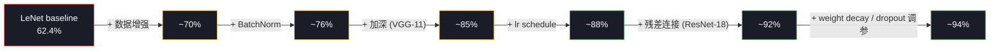
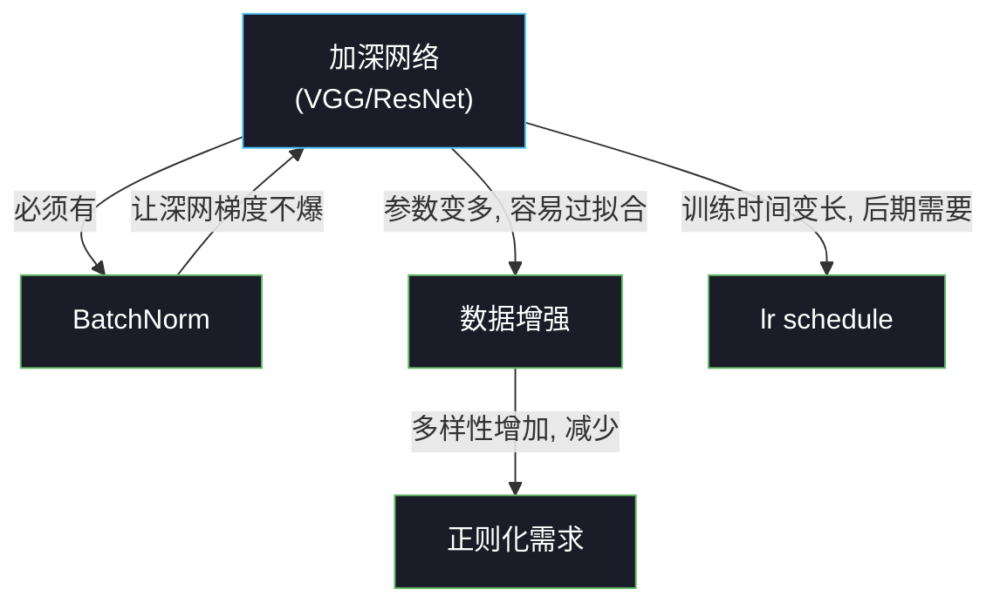

# T1：为什么 LeNet 不够 — 把 90% 拆成"加什么涨多少"

## 0. 上一节留下的问题

Week 2 的 LeNet 在 CIFAR-10 上做到了 **62.4%**，看起来不错——但跟现代水平差距很大：

| 网络 | 年代 | CIFAR-10 准确率 |
|---|---|---|
| LeNet-5（Week 2） | 1998 | **62.4%** |
| AlexNet | 2012 | ~85% |
| VGG-16 | 2014 | **~92%** |
| ResNet-18 | 2015 | **~94%** |
| ResNet-110 | 2015 | ~95% |
| 现代 SOTA（ViT/EfficientNet）| 2020+ | 99%+ |

LeNet 离 VGG/ResNet 差了 **~30 个百分点**。这个差距不是"模型多复杂一点"能解释的，是**架构 + 训练技巧**两个维度同时进化。

`docs/week2/11_week2_summary.md §8 已知局限` 里列了 5 件 Week 2 没做的事：

```
1. 网络太浅 (5 层)         → 模型容量不足
2. 没有 BatchNorm          → 深网训不动
3. 没有数据增强            → 训练分布太窄
4. 没有 lr schedule        → 后期 loss 收敛缓慢
5. 没有正则化              → train/test gap 越拉越大
```

**这一节的任务**：把这 5 件事拆开看，估算每件**单独**贡献几个百分点。然后把 Week 3 的实验路线图画出来——不是"上一个 ResNet 就涨了 30%"那种黑魔法，而是**5 个清晰的工程改造，每个涨 3–10%**。

---

## 1. 五件事各贡献多少：粗略估算

按学术界 ablation study 的经验数字（在 CIFAR-10 上）：



**关键观察**：

1. **没有任何一个技巧能单独涨 30 个百分点**。VGG/ResNet 的革命性不是某个"魔法"，是**结构改进 × 训练技巧的乘积效应**——每个技巧涨 3–10%，五个加在一起才到 90%+。
2. **数据增强通常是最便宜的 +5–8%**。零代码改动、零参数增加、零推理时间增加，单纯多变换几下输入数据就能让模型更鲁棒。
3. **加深（VGG）+ 残差（ResNet）是结构革命**，每个 +5–10%——比所有训练技巧加起来还重要。
4. **训练技巧的边际收益递减**。前几个加的（augment / BN）容易拿，后面的 lr schedule / weight decay 已经比较精细。

> 这条路线图不是给 Week 3 的"承诺"，是给一个**预期框架**——T9 ablation 实验我们会把每条线段的真实数字测出来，跟上面的估算对照看（可能某条偏低、某条偏高，差异本身就是教学点）。

---

## 2. 五件事**之间**不是孤立的，而是有耦合关系

简单地"把 5 个技巧加起来"忽略了它们之间的相互依赖：



**几条非平凡的依赖关系**：

- **加深 → 需要 BatchNorm**：纯 VGG-16 不加 BN 训不出来（梯度不稳），所以"深"和"BN"是一对绑定的技术。
- **加深 → 需要数据增强**：VGG-16 有 1 亿多参数，CIFAR-10 只有 5 万训练样本，**参数远多于样本**。不加 augment 几乎必然过拟合。
- **加深 + augment → 需要 lr schedule**：训练样本变多（augment 等效）+ 模型变深 → 需要更长的训练时间 → 训练后期必须降 lr 才能继续收敛。
- **数据增强部分替代正则化**：如果 augment 已经把训练分布扩到很大，模型不容易过拟合到训练集，所以 weight decay 和 dropout 的需求降低。

这条耦合关系决定了 Week 3 的章节顺序——**先讲数据增强（独立、便宜），再讲 BatchNorm（让加深可行），再讲加深（VGG → ResNet），最后讲 lr schedule + 正则化（精调）**。

---

## 3. 加深为什么不是简单"多堆几层"

直觉上，"深 = 强"——但 LeNet 之后的几年里，工业界在 CIFAR-10 上反复尝试堆 20–30 层 conv，**一开始全部失败**：训练 loss 不降、或者降到一半发散。

**两个根本原因**：

1. **梯度消失 / 梯度爆炸**：深层网络反向传播时，梯度沿层数指数级衰减或放大（链式法则的累乘效应）。20 层的 sigmoid 网络反向传到第 1 层时，梯度已经接近 0——参数根本更新不了。
2. **激活分布漂移**（internal covariate shift）：每层输入的统计量（均值/方差）随训练改变，深层网络要跟随上层不断"重新校准"，训练效率极低。

这两件事是 **2014 之前**深度网络的两大死穴。直到：

- **BatchNorm (2015)** 解决了激活分布漂移——T3 详解
- **残差连接 (ResNet, 2015)** 解决了梯度消失——T7 详解

**两个工程"trick"打开了"加深"的可能性**。在它们之前，再聪明的人想堆 50 层都白搭；之后，1000+ 层的网络也能稳定训练（ResNet-1001）。

> 这是 Week 3 数学层面最重要的两节：
> - T3 BatchNorm = "数值稳定" 工程
> - T7 残差连接 = "梯度通路" 工程

---

## 4. 数据增强是"用计算换数据"

CIFAR-10 训练集只有 50,000 张。深网（VGG-16: 1.3 亿参数；ResNet-18: 1100 万参数）的参数量都远超训练样本数——**理论上必然过拟合**。

工业界的做法：**数据增强 (data augmentation)**。一张原图，每个 epoch 都做随机变换，模型每次看到的都是"略有不同"的版本：

```
原图               每个 epoch 随机做:
                  ┌─────────────────────────────────┐
                  │ RandomCrop (32×32 padding=4)    │  位置随机偏移
                  │ RandomHorizontalFlip            │  50% 概率水平翻转
                  │ ColorJitter (亮度/对比度/饱和度)│  颜色微调
                  │ Normalize                       │  统一均值方差
                  └─────────────────────────────────┘
```

效果：**训练样本数等效扩大几十甚至上百倍**。原本 5 万张图，每张能产生几百种"略不同"的版本，模型必须学到不依赖具体位置/颜色细节的通用特征。

代价：**每个 batch 的预处理开销**（CPU 上做 transform）。但用 `DataLoader(num_workers=4)` 在 CPU 上预处理、GPU 同时训练，几乎零额外延迟。

T2 会详细看这些 transform 各自是什么样子。

---

## 5. 这一节的结论

把 Week 3 的整个故事压成三句话：

> **LeNet 62% → VGG/ResNet 90%+ 不是"用更复杂的模型"那么简单，是"加深 × 训练技巧"的乘积效应。**
>
> **加深需要 BatchNorm + 残差连接两个工程突破才可行；训练技巧需要数据增强、lr schedule、正则化三件套。**
>
> **本周的 ablation 实验会把每个技巧的实际贡献跑出数字——让"为什么需要这个技巧"从口号变成可测的差距。**

---

## 6. 下一节预告

T2 数据增强从最便宜、效果最显著的 trick 开始。三件事：

1. PyTorch 里 `torchvision.transforms` 各种 transform 在做什么（视觉化看一张图被增强 8 次的样子）
2. 为什么 augment 等效"扩大训练集"——从概率论角度看
3. 哪些 augment 适合 CIFAR-10（自然图）、哪些适合 MNIST（手写）、哪些专属医学影像

下一节 → `02_data_augmentation.md`
